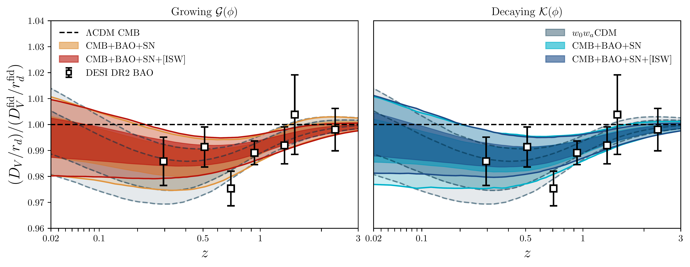
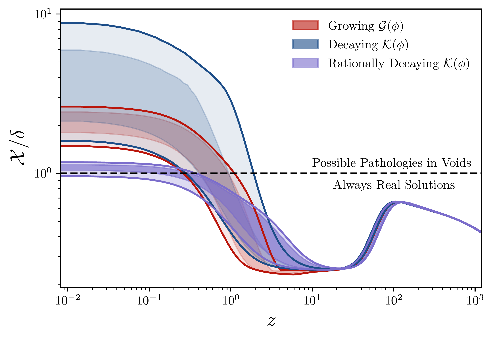
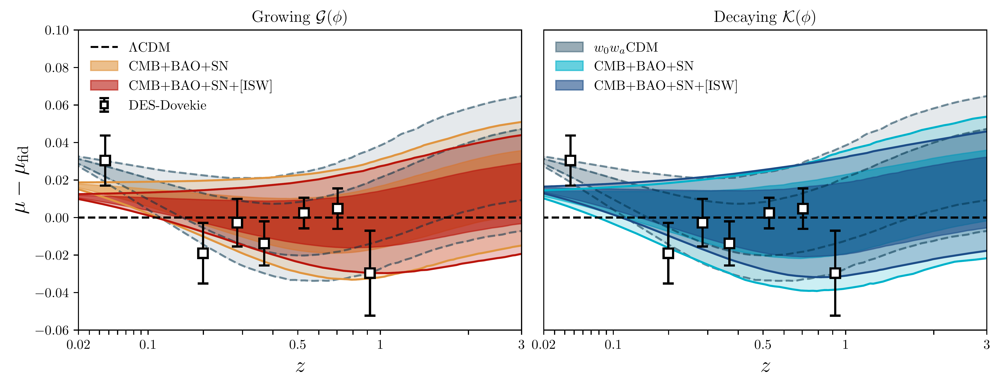

$\newcommand{\ensuremath}{}$
$\newcommand{\xspace}{}$
$\newcommand{\object}[1]{\texttt{#1}}$
$\newcommand{\farcs}{{.}''}$
$\newcommand{\farcm}{{.}'}$
$\newcommand{\arcsec}{''}$
$\newcommand{\arcmin}{'}$
$\newcommand{\ion}[2]{#1#2}$
$\newcommand{\textsc}[1]{\textrm{#1}}$
$\newcommand{\hl}[1]{\textrm{#1}}$
$\newcommand{\footnote}[1]{}$
$\newcommand{\mat}[1]{\mathbfss{#1}}$
$\newcommand\T{\rule{0pt}{2.6ex}}$
$\newcommand\B{\rule[-1.2ex]{0pt}{0pt}}$
$\newcommand{\vec}[1]{\mathbfit{#1}}$

# Constraints on Horndeski Gravity with Phantom Crossing

<mark>Appeared on: 2026-06-23</mark> -  _21 pages, 11 figures. Submitted to MNRAS. Comments welcome_

<mark>K. Naidoo</mark>, J. Hallam, T. Baker, S. Sirera

**Abstract:** Gravity models in which the dark energy equation of state crosses $w=-1$ , also known as the phantom divide, have received extensive interest due to recent analyses favouring this behaviour. We introduce a new subclass of Horndeski scalar-tensor models capable of generating phantom crossing, whilst remaining minimally coupled to matter: the Asymptotic Cubic Galileon (ACG) models. We show that ACG models can jointly fit the expansion history inferred from observations of the Planck cosmic microwave background, baryon acoustic oscillation measurements from the Dark Energy Spectroscopic Instrument, and distance-ladder supernovae measurements from the Dark Energy Survey. We then demonstrate that perturbative observables, including the galaxy–ISW cross-correlation and void force profile, provide powerful constraints that confine viable and testable ACG models to a well-defined region of the broader Horndeski landscape. Model comparison metrics, including $\chi^{2}$ and Bayesian evidence, favour both ACG and $w_{0}w_{a}$ CDM models over $\Lambda$ CDM, with ACG providing a fit of comparable quality to $w_{0}w_{a}$ CDM. Crucially, ACG models ground the observationally preferred $w_{0}w_{a}$ CDM behaviour in a robust Lagrangian formulation. This enables interpretation beyond mere phenomenological fits, and motivates further tests of these models on nonlinear scales.

**Figure 6. -** Volume average BAO measurements $D_{$\mat$hrm{V}}/r_{$\mat$hrm{d}}$ from DESI DR2 against constraints on dynamical DE and the ACG models in comparison to the fiducial Planck $\Lambda$CDM model. Dynamical DE (grey) and the ACG Growing $\mathcal{G}(\phi)$(left; red) and Decaying $\mathcal{K}(\phi)$(right; blue) models are shown from the joint constraints from the Planck CMB, DESI BAO and DES-Dovekie supernovae. The dark shades (red and dark blue) indicate the ACG models constraints with the additional positive ISW prior. Dynamical DE and ACG favour a dip in the volume average BAO over $\Lambda$CDM, with the ACG models (in particular with the positive ISW prior), preferring shallower profiles. (*fig_BAO*)

**Figure 1. -** Vainshstein screening factor from the Growing $\mathcal{G}(\phi)$(red), Decaying $\mathcal{K}(\phi)$(blue) and the rationally Decaying $\mathcal{K}(\phi)$(purple, given by Eq. \ref{eq_rat_decay}) from constraints of the CMB, BAO and SN, with a positive ISW prior. Both Growing $\mathcal{G}(\phi)$ and Decaying $\mathcal{K}(\phi)$ violate the maximum $\mathcal{X}/\delta\le 1$, meaning they might have pathological unreal solutions in voids, see main text for more details. Different growing/decaying functions can help alleviate this, as shown for rationally decaying $\mathcal{K}(\phi)$. (*fig_chi_delta*)

**Figure 7. -** Distance modulus $\mu$ from DES-Dovekie measurements against constraints on dynamical DE and the ACG models in comparison to the fiducial Planck $\Lambda$CDM model. This figure uses the same colour scheme as Fig. \ref{fig_BAO}. ACG models favour smaller values in the distance modules than dynamical DE at low redshift, albeit larger than what is predicted from $\Lambda$CDM. (*fig_distance_modulus*)

