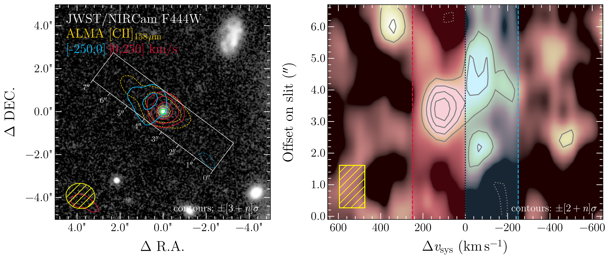
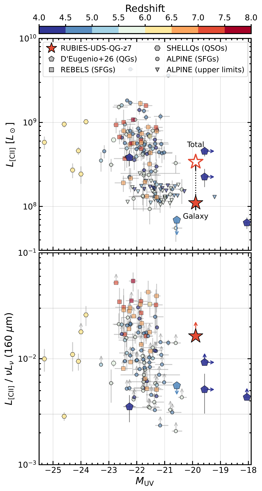
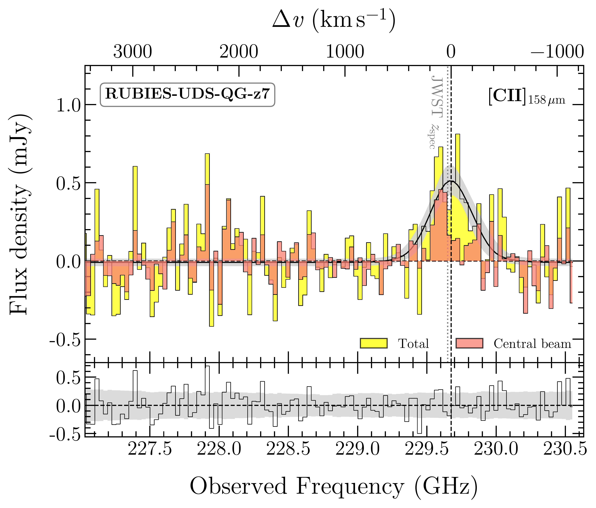

$\newcommand{\ensuremath}{}$
$\newcommand{\xspace}{}$
$\newcommand{\object}[1]{\texttt{#1}}$
$\newcommand{\farcs}{{.}''}$
$\newcommand{\farcm}{{.}'}$
$\newcommand{\arcsec}{''}$
$\newcommand{\arcmin}{'}$
$\newcommand{\ion}[2]{#1#2}$
$\newcommand{\textsc}[1]{\textrm{#1}}$
$\newcommand{\hl}[1]{\textrm{#1}}$
$\newcommand{\footnote}[1]{}$
$\newcommand{\hb}{H\beta}$
$\newcommand{\ha}{H\alpha}$
$\newcommand{\hg}{H\gamma}$
$\newcommand{\hd}{H\delta}$
$\newcommand{\lya}{Ly\alpha}$
$\newcommand{\neiii}{[Ne {\footnotesize III}]}$
$\newcommand{\oiii}{[O {\footnotesize III}]}$
$\newcommand{\oii}{[O {\footnotesize II}]}$
$\newcommand{\nii}{[N {\footnotesize II}]}$
$\newcommand{\sii}{[S {\footnotesize II}]}$
$\newcommand{\kms}{km s^{-1}}$
$\newcommand{\es}{erg s^{-1}}$
$\newcommand{\myr}{M_{\odot} yr^{-1}}$
$\newcommand{\msun}{M_{\odot}}$
$\newcommand{\zsun}{Z_{\odot}}$
$\newcommand{\mstar}{M_{\star}}$
$\newcommand{\mgas}{M_{\rm gas}}$
$\newcommand{\mdust}{M_{\rm dust}}$
$\newcommand{\mdyn}{M_{\rm dyn}}$
$\newcommand{\mbh}{M_{\rm BH}}$
$\newcommand{\kkmspc}{K~km~s^{-1}~pc^2}$
$\newcommand{\jykms}{Jy~km~s^{-1}}$
$\newcommand{\lbol}{L_{\rm bol}}$
$\newcommand{\ci}{[C {\footnotesize I}]}$
$\newcommand{\hi}{H {\footnotesize I}}$
$\newcommand{\hii}{H {\footnotesize II}}$
$\newcommand{\co}{CO}$
$\newcommand{\citwo}{[C {\footnotesize I}](^3P_2 -  ^{3}P_1)}$
$\newcommand{\coseven}{CO (7-6)}$
$\newcommand{\lcitwo}{L_{\mathrm{[C \scriptscriptstyle{I}\scriptstyle{]}}^3P_2 -  ^3P_1}}$
$\newcommand{\lciplus}{L_{\rm[CII]}}$
$\newcommand{\lcii}{L_{\rm[CII]}}$
$\newcommand{\lprimecitwo}{L'_{\mathrm{[C \scriptscriptstyle{I}\scriptstyle{]}}^3P_2 -  ^3P_1}}$
$\newcommand{\lprimecoseven}{L'_{\rm CO(7-6)}}$
$\newcommand{\lir}{L_{\rm IR}}$
$\newcommand{\lfir}{L_{\rm FIR}}$
$\newcommand{\lsun}{L_{\odot}}$
$\newcommand{\tdust}{T_{\rm dust}}$
$\newcommand{\subl}{sub-L^{\star}}$
$\newcommand{\jwst}{JWST}$
$\newcommand{\hst}{HST}$
$\newcommand{\um}{\mum}$
$\newcommand{\cgs}{\rm erg cm^{-2} s^{-1} Å^{-1}}$
$\newcommand{\sigmastar}{\sigma_\star}$
$\newcommand{\mgii}{Mg {\sc ii}}$
$\newcommand{\mgi}{Mg {\sc i}}$
$\newcommand{\feii}{Fe {\sc ii}}$
$\newcommand{\mout}{M_{\rm out}}$
$\newcommand{\mdotout}{\dot{M}_{\rm out}}$
$\newcommand{\dn}{D_n4000}$
$\newcommand{\eddratio}{\lambda_{\rm Edd}}$
$\newcommand{\darc}{\rlap{.}{\arcsec}}$
$\newcommand{\cii}{[C {\footnotesize II}]}$
$\newcommand{\red}[1]{\textcolor{red}{#1}}$
$\newcommand{\rubies}{RUBIES-UDS-QG-z7}$
$\newcommand{\zcii}{z_{\rm[CII]}}$
$\newcommand{\lowZ}{low-Z}$
$\newcommand{\highZ}{high-Z}$
$\newcommand{\sfrir}{\rm SFR_{IR}}$
$\newcommand{\muv}{M_{\rm UV}}$
$\newcommand{\fgas}{f_{\rm gas}}$
$\newcommand\tcr[1]{\textcolor{red}{\textbf{#1}}}$
$\newcommand\tcb[1]{\textcolor{blue}{\textbf{#1}}}$
$\newcommand{\zh}[1]{\begin{CJK}{UTF8}{bsmi}#1\end{CJK}}$
$\newcommand{\jp}[1]{\begin{CJK}{UTF8}{min}#1\end{CJK}}$
$\newcommand{\arraystretch}{1.3}$
$\newcommand{\arraystretch}{1.15}$

# Extended [CII] gas emission in and around a massive quiescent galaxy at $z=7.3$

<mark>Appeared on: 2026-06-23</mark> -  _12 pages, 7 figures. Submitted to Astronomy & Astrophysics_

F. Valentino, et al. -- incl., <mark>A. d. Graaff</mark>

**Abstract:** We report the discovery of $\cii$ 158 $\mu$ m emission in and around the most distant known massive quiescent galaxy $\rubies$ at $z = 7.27$ . Observed with ALMA in band 6, the $\cii$ line independently confirms the spectroscopic redshift from JWST/NIRSpec spectra at low and medium resolution. The emission extends over an effective radius $R_{\rm eff,  [CII]}=8 \pm 3$ kpc, well beyond the compact stellar body traced by JWST/NIRCam ( $R_{\rm eff}=209^{+33}_{-24}$ pc), with a significant fraction of $\approx 70\%$ of the flux arising from a circumgalactic halo. No dust continuum is detected at rest-frame $\sim160 \mu$ m, setting an upper limit on the infrared luminosity of $L_{\rm IR} < 1.4 \times 10^{11} L_\odot$ , overall consistent with expectations from rest-frame UV to near-infrared SED modeling under energy balance. Converting the galaxy-scale $\cii$ emission into cold gas mass, we find $\log(M_{\rm mol}/M_\odot) = 9.53^{+0.32}_{-0.31}$ and $\log(M_{\rm HI}/M_\odot) = 9.46$ -- $10.34$ , depending on the assumed calibration and metallicity. Despite being $\approx 10\times$ more gas-poor than typical star-forming galaxies at  fixed redshift, stellar mass, and $\cii$ to gas mass conversion, $\rubies$ retains a substantial cold gas reservoir with fractions $f_{\rm gas} \gtrsim 20\%$ and long depletion timescales across most assumptions. The extended $\cii$ halo carries approximately twice as much gas as the galaxy alone and shows a blueshifted velocity offset consistent with the tentative gas outflow detected in $\mgii$ absorption in previous work, suggesting a past episode of AGN-driven gas expulsion possibly linked to the suppression of star formation. The presence of a large gas reservoir in and around a massive quiescent galaxy just 700 Myr after the Big Bang implies that whatever mechanism is suppressing star formation must be remarkably effective at maintaining a low star formation efficiency on $\sim100$ Myr timescales, even in the presence of abundant fuel.

**Figure 5. -** Extended $\ci$i emission around $\rubies$. Left panel: the $\ci$i emission is indicated by sets of contours: thick dashed yellow lines indicate the total moment-0 map within $\pm2\sigma\approx\pm390 {\rm km s^{-1}}$ around the total $\ci$i line centroid, while solid red and blue lines indicate the emission redward ($[0, 250] {\rm km s^{-1}}$) and blueward ($[-250, 0] {\rm km s^{-1}}$) of the systemic redshift. The contours are spaced as multiples of the noise level, starting at $\pm3\sigma$. Negative peaks are marked by dotted lines with the same color scheme. The beam size is shown in the bottom left corner of the cutout. The background image is from JWST/NIRCam with the F444W filter and the green square indicates the center of the stellar emission. The white box marks the pseudoslit used in the position-velocity diagram in the right panel. Right panel: position-velocity diagram. The gray contours are at $\pm2\sigma$ significance. The image was smoothed along the velocity axis using a uniform filter of width equal to $120 {\rm km s^{-1}}$(i.e., three channels of the datacube as shown in the bottom left corner). Velocity ranges for the red and blue map shown in the left panel are also highlighted. (*fig:map_pv*)

**Figure 3. -** $\ci$i, dust, and UV emission of high-redshift galaxies. Top panel: $\ci$i luminosity as a function of rest-frame UV magnitude. Bottom panel: ratio of $\ci$i luminosity to the underlying dust continuum at $160 \mu$m rest-frame, as a function of rest-frame UV magnitude. In both panels, the filled and empty stars indicate the $\ci$i emission associated with the $\rubies$ galaxy and the total emission including the extended halo, respectively; pentagons the QGs from $\ci$te{deugenio_2026}, circles and squares the SFGs from ALPINE and REBELS, hexagons the low-luminosity QSOs from SHELLQs, and downward triangles upper limits from ALPINE. Symbols are color-coded by redshift. (*fig:observed_properties*)

**Figure 1. -** ALMA band 6 spectrum of $\rubies$. The yellow and red colors show the total emission, including the spatially extended component, and the central beam extraction that we associate with the galaxy, respectively. The black line and gray shaded area indicate the best-fit Gaussian model to the total emission and its uncertainties. The residuals are shown in the bottom inset, with the gray shaded area indicating the noise RMS. The velocity axis refers to the $\ci$i line centroid of the total emission. The dotted gray vertical line indicates the redshift estimate based on JWST grating spectra $\ci$tep{valentino_2025}. (*fig:line-spec*)

