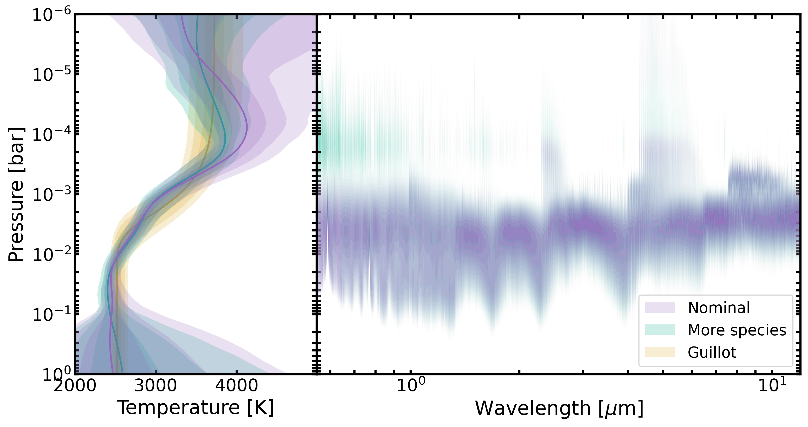
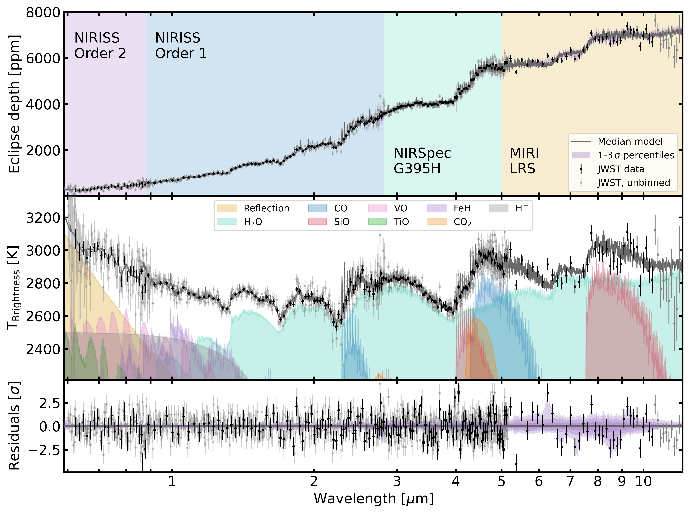
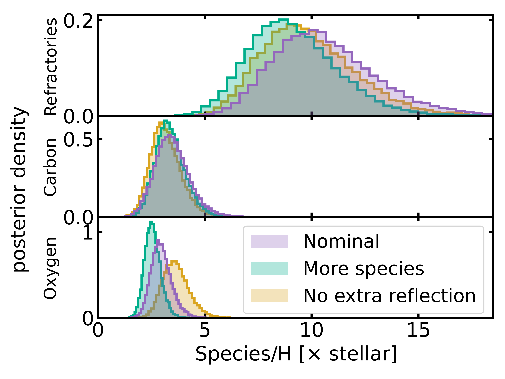
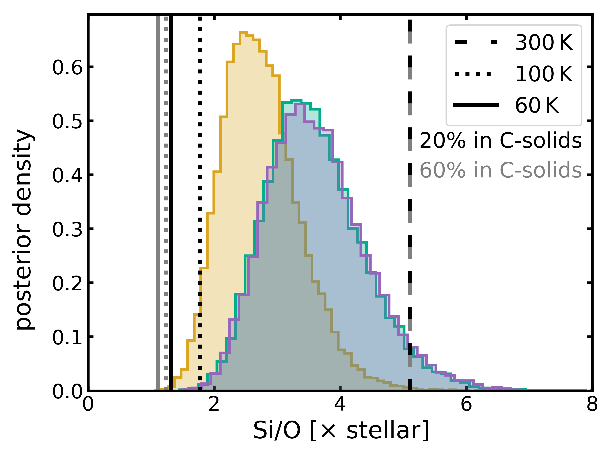
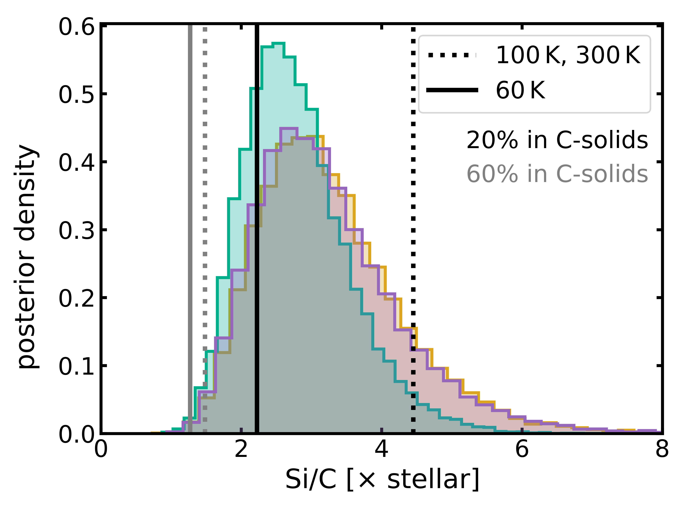

$\newcommand{\ensuremath}{}$
$\newcommand{\xspace}{}$
$\newcommand{\object}[1]{\texttt{#1}}$
$\newcommand{\farcs}{{.}''}$
$\newcommand{\farcm}{{.}'}$
$\newcommand{\arcsec}{''}$
$\newcommand{\arcmin}{'}$
$\newcommand{\ion}[2]{#1#2}$
$\newcommand{\textsc}[1]{\textrm{#1}}$
$\newcommand{\hl}[1]{\textrm{#1}}$
$\newcommand{\footnote}[1]{}$
$\newcommand{\orcit}[1]{\protect\href{https://orcid.org/#1}{\protect\includegraphics[width=8pt]{figs/orcid.png}}}$
$\newcommand\blfootnote[1]{$
$  \begingroup$
$  \newcommand\thefootnote\footnote{#1}$
$  \addtocounter{footnote}{-1}$
$  \endgroup$
$}$
$\newcommand{\HD}{HD 86226 c\xspace}$
$\newcommand{\U}{\mathrm}$
$\newcommand{\tr}{\textcolor{red}}$
$\newcommand{\tg}{\textcolor{green}}$
$\newcommand{\teff}{T_{\rm eff}}$
$\newcommand{\logg}{\log g}$
$\newcommand{\vmic}{\xi_{\rm t}}$
$\newcommand{\vmac}{V_{\rm mac}}$
$\newcommand{\vsini}{V_{\rm sini}}$
$\newcommand{\vbrd}{v_{\rm brd}}$
$\newcommand\thefootnote\footnote$
$\newcommand{\hii}{\hbox{{\rm H {\scriptsize II}}}~}$

# The panchromatic JWST dayside spectrum of WASP-121 b \ revealsa refractory-rich formation

<mark>Appeared on: 2026-06-23</mark> -  _Submitted to Astronomy & Astrophysics, comments welcome_

<mark>K. A. Kahle</mark>, et al. -- incl., <mark>P. Mollière</mark>, <mark>L. Kreidberg</mark>, <mark>N. Storm</mark>, <mark>C. Gapp</mark>, <mark>T. Henning</mark>

**Abstract:** One path to understand how planets form is to link their present-day atmospheric composition to predictions from planet formation models. Traditional approaches based solely on C/O and overall metallicity are prone to degeneracies, but abundances of refractory species can provide a useful additional formation tracer for the hottest planets. Here we investigate the refractory abundance in the atmosphere of the ultra-hot Jupiter WASP-121 b, combining a new JWST MIRI/LRS observation with archival NIRSpec/G395H and NIRISS/SOSS data to obtain a panchromatic dayside emission spectrum from $0.6$ to $\SI{12}{\micro\meter}$ .  Our retrieval analysis detects the refractory tracer SiO gas at high confidence ( $\Delta\ln$ (Z) $>23$ ), in addition to previously detected volatile species. The atmosphere is enriched in volatile and refractory species, with enhanced refractory-to-volatile abundance ratios of $\mathrm{Si}/\mathrm{O}=3.54^{+0.86}_{-0.69}\times$ stellar and $\mathrm{Si}/\mathrm{C}=3.05^{+1.12}_{-0.80}\times$ stellar, relative to new stellar abundance constraints from ESPRESSO data. In addition, we confirm the depletion of TiO and the need for an additional source of reflected light opacity with a geometric albedo of $0.22\pm0.03$ . The retrieved dayside temperature-pressure profile has a strong inversion layer, with a more complex structure than standard parameterizations can accommodate, and an eclipse map analysis indicates a small eastward hotspot offset of $4.8^{+2.7\circ}_{-2.8}$ . Comparing our results with models of planet formation, we find that the measured enrichment pattern was shaped by accretion from multiple reservoirs, either through a mixture of solid and gas accretion interior to the water ice line or through continued solid accretion during inward migration from farther out in the disk. Finally, we model the planet's dynamical history and find that it could reach its current high-obliquity orbit as a consequence of a post-formation dynamical event, such as planet-planet scattering or von Zeipel–Lidov–Kozai cycles.

**Figure 3. -** Retrieved temperature structures (left panel) and logarithmic emission contribution (right panel) for WASP-121 b. Colored solid lines show the median retrieved temperature structure, while 1, 2, and $3 \sigma$ percentiles are shown with shaded regions.
Results are shown in purple for the nominal model and in green for the "More species’’ model, which includes more opacities from atomic and refractory absorbers (see Sect. \ref{subsec:retrieval:variations}). Results from retrievals with a [ and Guillot (2010)](https://ui.adsabs.harvard.edu/abs/2010A&A...520A..27G) temperature structure are only shown in the left panel in yellow. (*fig:TPcontribution*)

**Figure 12. -** Panchromatic spectrum of WASP-121 b and opacity profiles from the most relevant species. NIRISS and NIRSpec data are shown as transparent, grey datapoints, with black datapoints binning these by a factor of five for visualization. The unbinned MIRI/LRS spectrum is shown in black, with grey datapoints beyond $\SI{10.5}{\micro\meter}$ being excluded from the retrievals. The median model from our 1D cloud-free dayside retrievals is shown in a darker grey and purple shaded regions in the top and bottom panel mark 1, 2 and 3$ \sigma$ percentiles of retrieved spectra.
    _Top_: Measured eclipse depths with background colors indicating the wavelength coverage of the instruments. _Middle_: Brightness temperatures and opacity profiles of species as indicated in the panel. _Bottom_: Residuals to the median model. (*fig:jointspectrum*)

**Figure 13. -** Posterior density of elemental abundances and refractory-to-volatile ratios in WASP-121 b. Different colors indicate different retrieval setups (see Sect. \ref{subsec:retrieval:variations}), as indicated in the left panel. Predictions for solid compositions in the protoplanetary disk at regions with different temperatures (compare to Fig. \ref{fig:interpretation}) are shown as vertical lines and will be discussed in Sect. \ref{subsec:accretionlocation}. The compositions were computed assuming 20\%(black) and 60\%(gray) of carbon to be bound in carbonaceous solids. (*fig:formation:moving*)

