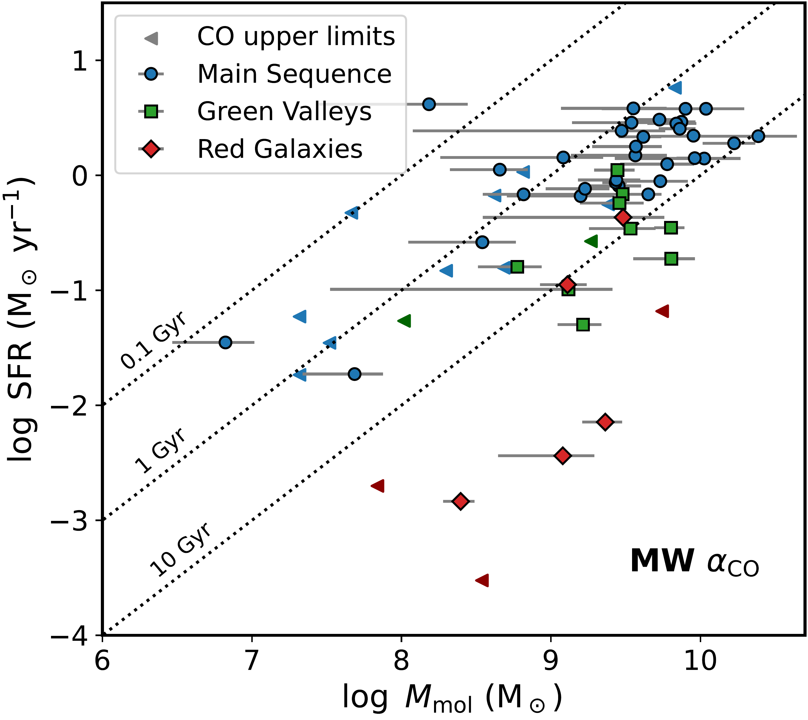
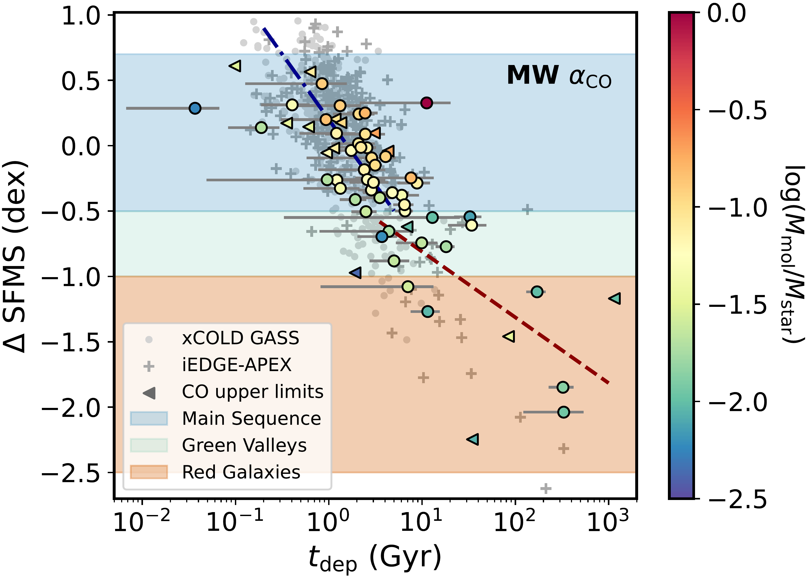
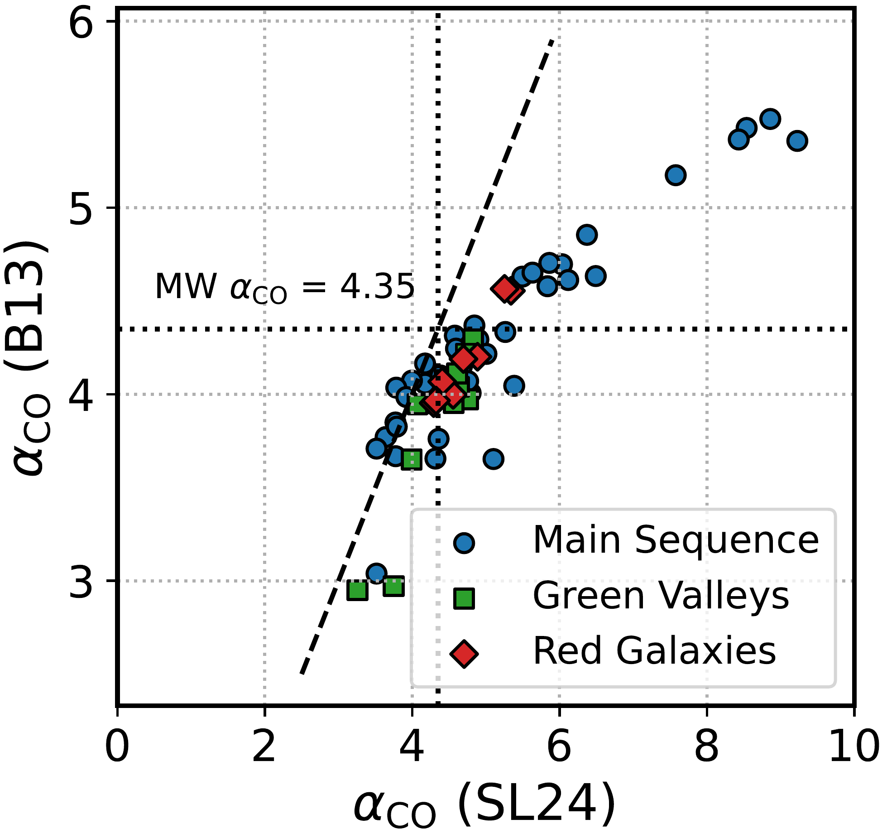
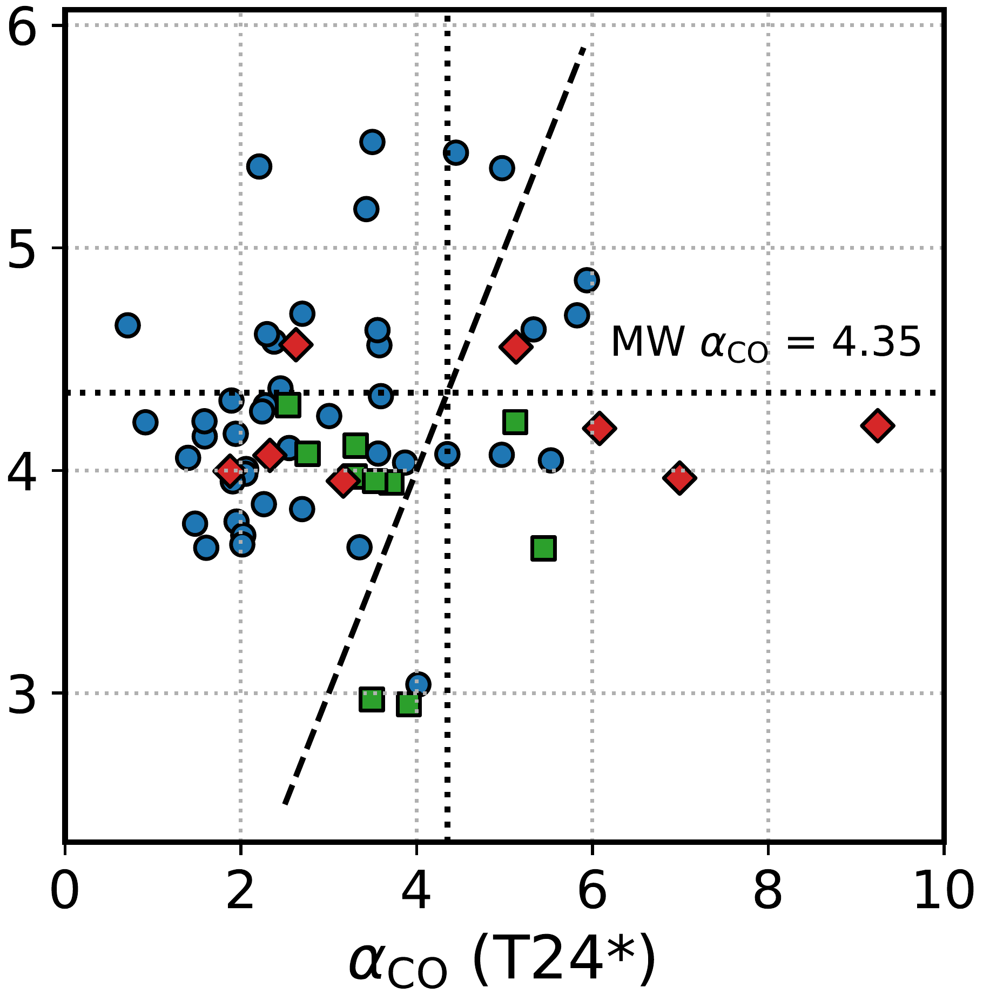
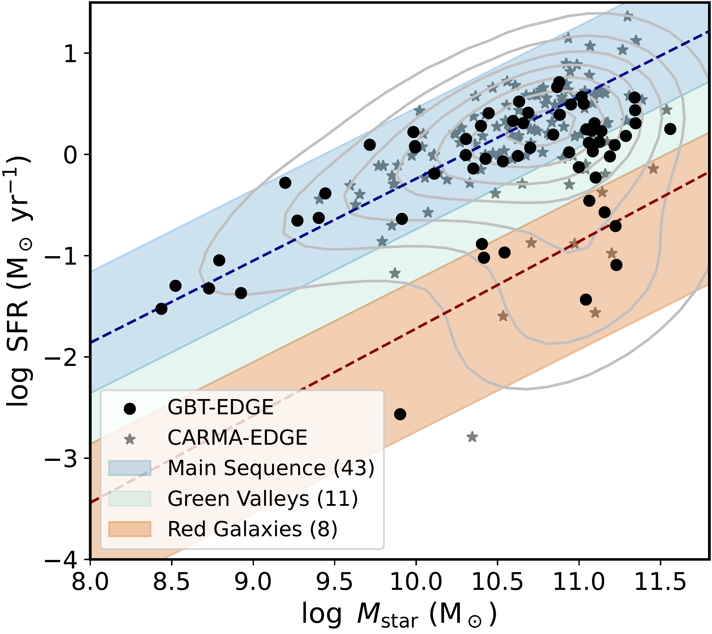

$\newcommand{\ensuremath}{}$
$\newcommand{\xspace}{}$
$\newcommand{\object}[1]{\texttt{#1}}$
$\newcommand{\farcs}{{.}''}$
$\newcommand{\farcm}{{.}'}$
$\newcommand{\arcsec}{''}$
$\newcommand{\arcmin}{'}$
$\newcommand{\ion}[2]{#1#2}$
$\newcommand{\textsc}[1]{\textrm{#1}}$
$\newcommand{\hl}[1]{\textrm{#1}}$
$\newcommand{\footnote}[1]{}$
$\newcommand{\vdag}{(v)^\dagger}$
$\newcommand\aastex{AAS\TeX}$
$\newcommand\latex{La\TeX}$
$\newcommand{\aco}{\alpha_\mathrm{CO}}$
$\newcommand{\Ngal}{62~}$
$\newcommand{\Alberta}{\affiliation{Department of Physics, University of Alberta, Edmonton, AB T6G 2E1, Canada}}$
$\newcommand{\ASIAA}{\affiliation{Institute of Astronomy and Astrophysics, Academia Sinica, No. 1, Sec. 4, Roosevelt Road, Taipei 10617, Taiwan}}$
$\newcommand{\Bonn}{\affiliation{Argelander-Institut für Astronomie, University of Bonn, Auf dem Hügel 71, 53121 Bonn, Germany}}$
$\newcommand{\Heidelberg}{\affiliation{Astronomisches Rechen-Institut, Zentrum für Astronomie der Universität Heidelberg, Mönchhofstra\ss e 12-14, D-69120 Heidelberg, Germany}}$
$\newcommand{\IAC}{\affiliation{Instituto de Astrofí sica de Canarias, La Laguna, Tenerife, E-38200, Spain}}$
$\newcommand{\ITA}{\affiliation{Universität Heidelberg, Zentrum für Astronomie, Institut für Theoretische Astrophysik, \ Albert-Ueberle-Str 2, D-69120 Heidelberg, Germany}}$
$\newcommand{\Leiden}{\affiliation{Leiden Observatory, Leiden University, P.O. Box 9513, 2300 RA Leiden, The Netherlands}}$
$\newcommand{\Maryland}{\affiliation{Department of Astronomy, University of Maryland, 4296 Stadium Drive, College Park, MD 20742, USA}}$
$\newcommand{\MPE}{\affiliation{Max-Planck-Institut für extraterrestrische Physik, Giessenbachstra{\ss}e 1, D-85748 Garching, Germany}}$
$\newcommand{\MPIA}{\affiliation{Max-Planck-Institut für Astronomie, Königstuhl 17, D-69117, Heidelberg, Germany}}$
$\newcommand{\NRAO}{\affiliation{National Radio Astronomy Observatory, 520 Edgemont Road, Charlottesville, VA 22903-2475, USA}}$
$\newcommand{\OSU}{\affiliation{Department of Astronomy, The Ohio State University, 140 West 18th Avenue, Columbus, OH 43210, USA}}$
$\newcommand{\STScI}{\affiliation{Space Telescope Science Institute, 3700 San Martin Drive, Baltimore, MD 21218, USA}}$
$\newcommand{\Toledo}{\affiliation{Department of Physics and Astronomy, University of Toledo, Ritter Obs., MS \#113, Toledo, OH 43606, USA}}$
$\newcommand{\UCSD}{\affiliation{Department of Astronomy \& Astrophysics, University of California San Diego, 9500 Gilman Drive, La Jolla, CA 92093, USA}}$
$\newcommand{\UIUC}{\affiliation{Department of Astronomy, University of Illinois at Urbana-Champaign, 1002 W. Green Street, Urbana, IL 61801, USA}}$
$\newcommand{\UNAMe}{\affiliation{Universidad Nacional Autónoma de México, Instituto de Astronomía, AP 106, Ensenada 22800, BC, México}}$

# The EDGE-CALIFA Survey: Star Formation Efficiency and Galaxy Quenching across $\Ngal$ Main Sequence, Green Valley, and Red Galaxies

<mark>Appeared on: 2026-06-23</mark> -  _22 pages of main text + 3 appendices. Accepted for publication in ApJ. The GBT-EDGE dataset is available on Zenodo at this https URL_

Y.-H. Teng, et al. -- incl., <mark>J. Li</mark>

**Abstract:** We present GBT-EDGE, a new CO (1--0) survey using the Green Bank Telescope to map $\Ngal$ nearby (10--140 Mpc) galaxies spanning the star-forming main sequence (SFMS), green valley, and red sequence. The galaxy sample is selected from the CALIFA survey with integral field spectroscopy (IFS), which provides a representative census of local galactic environments. Combining the CO dataset with CALIFA's optical IFS measurements, we derive molecular gas masses, star formation rates (SFR), metallicities, and stellar mass densities to measure star formation efficiency (SFE) and investigate the physical drivers of galaxy quenching.We obtain a median molecular gas depletion time of $2.10^{+2.35}_{-1.31}$ , $6.90^{+17.00}_{-3.67}$ , and $127.7^{+201.6}_{-113.4}$ Gyr for our sample of main sequence, green valley, and red galaxies, respectively, assuming a Galactic CO-to-$H_2$ conversion factor.By applying various conversion factor prescriptions, we also confirm a systematic decrease of SFE with galaxy's offset below the SFMS, regardless of the adopted prescription.This suggests that the low SFR in some quenched galaxies is primarily driven by suppressed SFE rather than an absence of molecular gas.Our results provide evidence that galaxies below the main sequence can retain substantial molecular gas reservoirs comparable to star-forming galaxies, but they exhibit longer depletion times and form stars inefficiently, possibly due to the combined effects of low gas density and morphological quenching mechanisms.

**Figure 9. -** (a) The SFR--$M_\mathrm{mol}$ relation across all $\Ngal$ galaxies, using H$\alpha$-based SFR estimates and $M_\mathrm{mol}$ derived via a Galactic $\aco$. The dotted lines show constant molecular gas depletion times ($t_\mathrm{dep}$) of 0.1, 1, and 10 Gyr. (b) The derived $t_\mathrm{dep}$ increases systematically as galaxies go from MS to GV and to RG, suggesting that low SFRs in quenched galaxies are mostly caused by suppressed star formation efficiency (SFE) rather than the lack of molecular gas.
The light gray points and pluses are from the xCOLD GASS survey  ([Saintonge, et. al 2017](https://ui.adsabs.harvard.edu/abs/2017ApJS..233...22S))  and the iEDGE APEX data  ([Colombo, et. al 2025](https://ui.adsabs.harvard.edu/abs/2025A&A...699A.366C)) , respectively, which align with an expected slope of -1 (blue, dashed-dotted line).
Our GV and RG sample reveals an increased $t_\mathrm{dep}$ with a best-fit slope of -0.5 (red, dashed line).
The color-coded molecular-to-stellar mass ratio shows higher values in MS but remains similarly low across GV and RGs, implying a dominant SFE-driven quenching from the GV to RG populations.
 (*fig:scalings*)

**Figure 8. -** Comparison of $\aco$ values estimated via different prescriptions (B13, SL24, and T24*, which represent Equations \ref{eqn_alpha_B13}--\ref{eqn_aco_T24}). The dashed lines indicate a one-to-one relation, and the thick dotted lines label the Galactic $\aco$ value of 4.35 $\mathrm{M_\odot (K km s^{-1} pc^2)^{-1}}$.
While the predicted $\aco$ values  do not agree well and show no systematic trend among different populations, the overall $\aco$ variations are limited to a factor of two within and among prescriptions. The fractional $\aco$ uncertainty in these prescriptions is within $\pm$0.2 dex for T24* and $\pm$0.3 dex for B13 and SL24. (*fig:sfr-aco-compare*)

**Figure 1. -** The relation between global star formation rate (SFR) and stellar mass ($M_\mathrm{star}$) for our GBT sample (black points; $\Ngal$ galaxies), the CARMA sample \citep[gray stars;][]{2017ApJ...846..159B}, and the full CALIFA sample \citep[contours;][]{2016A&A...594A..36S}. The blue (upper) and red (lower) dashed lines indicate best linear fits from [Cano-D\'\iaz, et. al (2016)](https://ui.adsabs.harvard.edu/abs/2016ApJ...821L..26C) for the main sequence and red galaxies, respectively. The GBT-EDGE sample is representative of the $z=0$ galaxy population with $M_\mathrm{star} = 10^{8.5-11.5}$ M$_\odot$. (*fig:sfms*)

