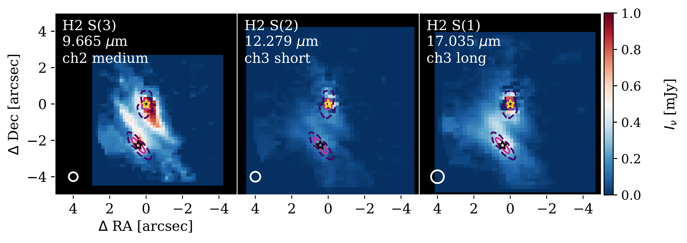
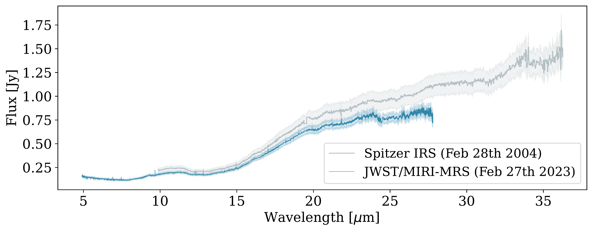

$\newcommand{\ensuremath}{}$
$\newcommand{\xspace}{}$
$\newcommand{\object}[1]{\texttt{#1}}$
$\newcommand{\farcs}{{.}''}$
$\newcommand{\farcm}{{.}'}$
$\newcommand{\arcsec}{''}$
$\newcommand{\arcmin}{'}$
$\newcommand{\ion}[2]{#1#2}$
$\newcommand{\textsc}[1]{\textrm{#1}}$
$\newcommand{\hl}[1]{\textrm{#1}}$
$\newcommand{\footnote}[1]{}$
$\newcommand{\micron}{ \textmu m}$
$\newcommand{\nk}[1]{\textcolor{teal}{\textbf{Nico}: #1}}$

# MINDS: Complementary inclinations in the binary system HK Tau reveal gas- and ice-phase chemistry

<mark>Appeared on: 2026-06-24</mark> -  _12 pages (13 including Appendix), 8 figures. Accepted for publication in A&A_

<mark>A. Somigliana</mark>, et al. -- incl., <mark>G. Perotti</mark>, <mark>T. Henning</mark>, <mark>M. Benisty</mark>, <mark>D. Gasman</mark>, <mark>L. Stapper</mark>

**Abstract:** HK Tau is a roughly equal mass pre-main sequence binary system consisting of a low-inclination primary (57 $^\circ$ ) and an edge-on ( $\ang{83}$ ) secondary. We present JWST Mid-Infrared Instrument (MIRI) observations targeting both sources, taken as part of the JWST GTO program MINDS. The mid-infrared spectra reveal a line-rich, $\ch{CO2}$ -dominated primary and a line-poor secondary; this evidence, albeit in line with the evolutionary-motivated trend uncovered by recent observations of binaries at MIRI wavelengths, is likely due to the different configuration of the two sources. Indeed, thermochemical disc models coupled with radiative transfer show that, at inclinations comparable to that of HK Tau B, only ionised atomic lines are expected to remain visible in the spectra. While blocking molecular emission lines, however, the edge-on configuration allows ice absorption bands to be visible against the continuum; in this framework, the HK Tau system provides an unprecedented opportunity to have a simultaneous view of the solid and gaseous component of a pair of coeval protoplanetary discs, thanks to the complementary inclination of the two sources.    We detect water ice at 6.2 and 13.6 $\micron$ , $\ch{CO2}$ ice at 15.2 $\micron$ , and $\ch{NH4+}$ ice at 6.85 $\micron$ in the spectrum of HK Tau B; an additional absorption band between 8.3 and 9 $\micron$ is compatible with both silicate stretching and C-H bending. Neither the primary nor the secondary show signs of Polycyclic Aromatic Hydrocarbons (PAHs). Extended $\ch{H2}$ emission is present around both sources, although much more elongated in HK Tau B. The distinctive 'X' shape centred at the location of B, combined with the intensity, morphology, and spectral characteristics of the ionised atomic lines [ Ar II ] , [ Ne II ] , and [ Ne III ] suggests a low-velocity wind origin with a wide ( $\sim$ $\ang{70}$ ) semi-opening angle. The lower forbidden line fluxes and smaller spatial extent of the $\ch{H2}$ emission around A imply that, if a wind is launched from the primary as well, it is too cold or dense to be ionised and brightly emitting.

**Figure 7. -** Moment 0 maps of the S(1), S(2), and S(3) \ch{H2} extended lines. The yellow and black stars mark the coordinates of the centre of HK Tau A and B respectively. The white circles in the bottom left corner of each panel show the full width at half maximum of the PSF at the corresponding band. North is up, east is to the left. The pink solid and purple dashed contours respectively represent the extent of the ALMA continuum emission at 0.87 mm (published in  ([Villenave, et. al 2020](https://doi.org/10.1051/0004-6361/202038087)) ) and the peak emission map of CO J=2-1 (published in  ([Rota, et. al 2022](https://doi.org/10.1051/0004-6361/202141035)) ; estimated with the quadratic method of \texttt{bettermoments} ([Teague and Foreman-Mackey 2018](https://ui.adsabs.harvard.edu/abs/2018RNAAS...2c.173T), [ and Teague 2019](https://doi.org/10.3847/2515-5172/ab2125)) ). (*fig:mom0_threechannels*)

**Figure 5. -** Comparison of the continuum-subtracted spectrum of HK Tau A (top panel, dark grey) and B (bottom panel) in the 13.5-16.2$\micron$ range. The primary shows emission lines from several molecular components (\ch{H2O}, \ch{^{12}CO2}, \ch{HCN}, and \ch{OH}), to which we show the total fit (light grey) as well as the single molecular components (colored lines); on the other hand, in HK Tau B the noise level is too high to make any confident claim for molecular emission, and we only see the bright [Ne III] line. (*fig:radexpy_A*)

**Figure 2. -** Comparison of the total spectrum of the HK Tau system obtained with _Spitzer_ IRS (grey) and JWST/MIRI-MRS (blue), taken 19 years apart. The combined spectrum is dominated by the primary component. The shaded regions represent the reported spectrophotometric accuracy for both instruments. (*fig:Spitzer_comparison*)

