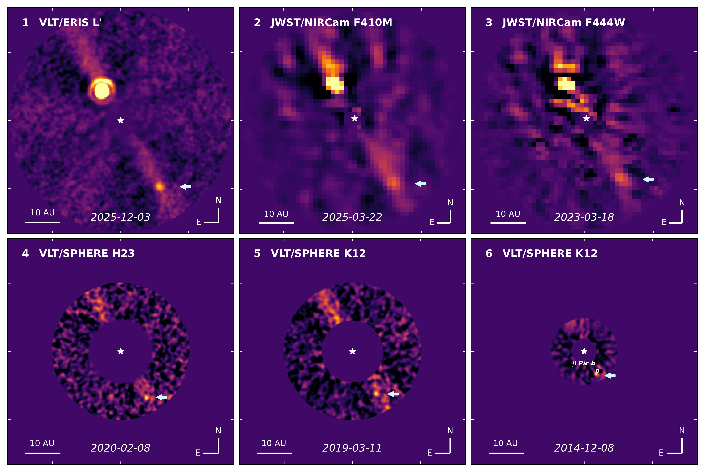
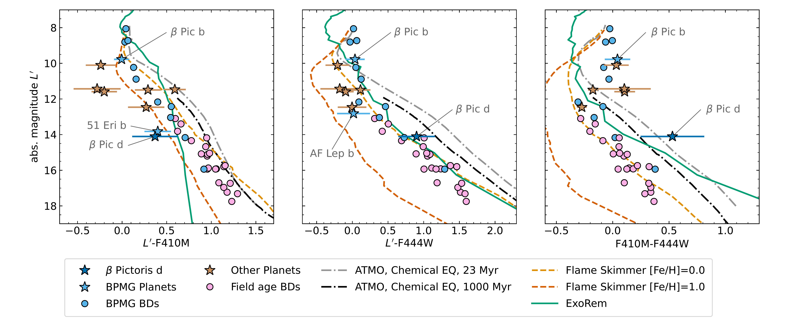
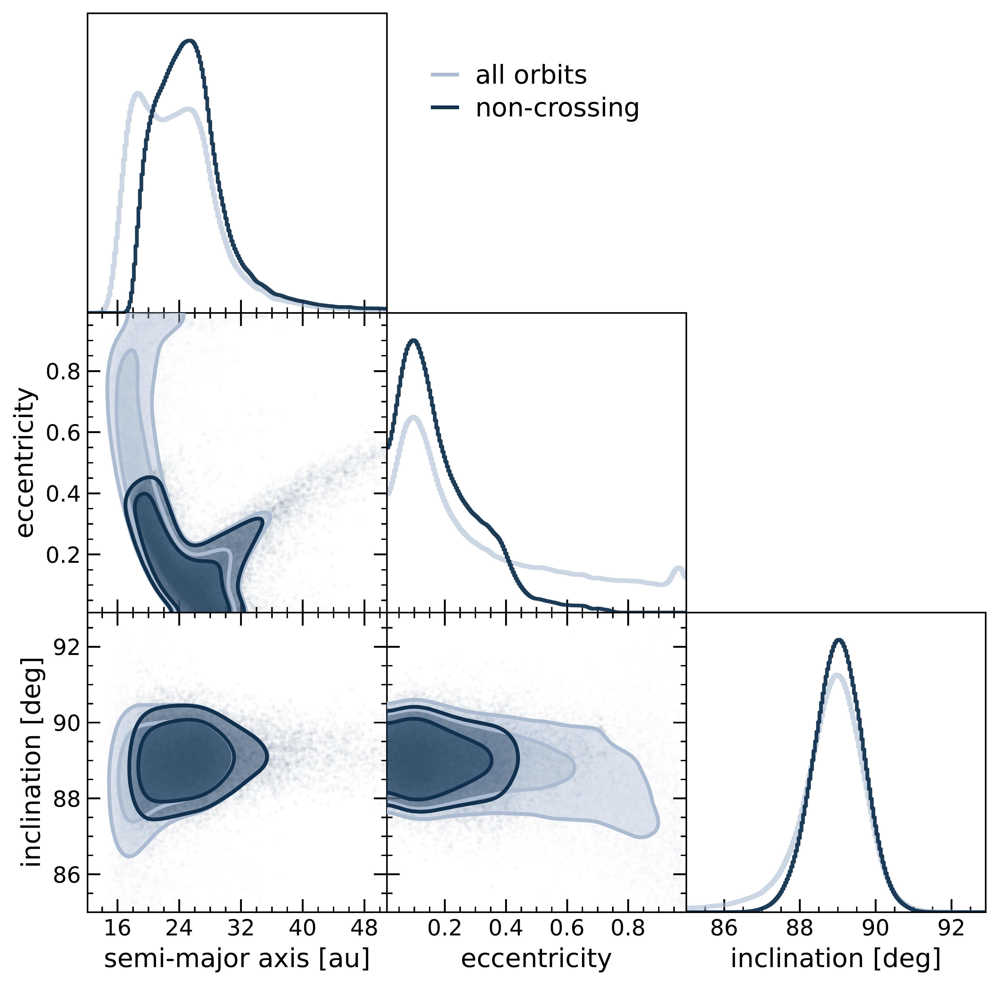

$\newcommand{\ensuremath}{}$
$\newcommand{\xspace}{}$
$\newcommand{\object}[1]{\texttt{#1}}$
$\newcommand{\farcs}{{.}''}$
$\newcommand{\farcm}{{.}'}$
$\newcommand{\arcsec}{''}$
$\newcommand{\arcmin}{'}$
$\newcommand{\ion}[2]{#1#2}$
$\newcommand{\textsc}[1]{\textrm{#1}}$
$\newcommand{\hl}[1]{\textrm{#1}}$
$\newcommand{\footnote}[1]{}$
$\newcommand{\vdag}{(v)^\dagger}$
$\newcommand\aastex{AAS\TeX}$
$\newcommand\latex{La\TeX}$
$\newcommand{\Lbol}{\mbox{L_{\rm bol}}\xspace}$
$\newcommand{\Teff}{\mbox{T_{\rm eff}}\xspace}$
$\newcommand{\logg}{\mbox{\log{g}}\xspace}$
$\newcommand{\Msun}{\mbox{M_{\sun}}\xspace}$
$\newcommand{\Mjup}{\mbox{M_{\rm Jup}}\xspace}$
$\newcommand{\Rsun}{\mbox{R_{\sun}}\xspace}$
$\newcommand{\Rjup}{\mbox{R_{\rm Jup}}\xspace}$
$\newcommand{\Lsun}{\mbox{L_{\sun}}\xspace}$
$\newcommand{\Lp}{\mbox{L^{\prime}}\xspace}$
$\newcommand{\timCom}[1]{\textbf{\color{ForestGreen}[{#1 -- Tim}]}}$
$\newcommand{\bernhard}[1]{{\color{red} Bernhard: #1}}$
$\newcommand{\sphere}{VLT/SPHERE\xspace}$
$\newcommand{\eris}{VLT/ERIS\xspace}$
$\newcommand{\fours}{4S\xspace}$

# Direct Imaging Discovery of Giant Exoplanet $\beta$ Pictoris d: A Decade-Long Game of Hide-and-Seek

<mark>Appeared on: 2026-06-24</mark> -  _27 pages, 8 figures, accepted for publication in ApJ Letters. This article is embargoed for discussion in the press until formal publication in ApJ Letters; press releases are pending_

B. J. Sutlieff, et al. -- incl., <mark>I. Hammond</mark>

**Abstract:** We report the direct imaging discovery of a third exoplanet in the $\beta$ Pictoris system. We detect $\beta$ Pictoris d in non-coronagraphic observations obtained with VLT/ERIS as well as multi-epoch archival datasets from JWST/NIRCam and VLT/SPHERE. Astrometric measurements over an 11-year baseline demonstrate that it is consistent with a gravitationally-bound source with orbital motion. Joint multi-planet orbit fits of all three planets in the system yield a semi-major axis of $\sau$ _d au and inclination $\inc$ _d deg for planet d. $\beta$ Pictoris d has a larger orbital semi-major axis than the other known planets in the system, but is coplanar with the inner two planets, and its orbit is consistent with sculpting the inner edge of the debris disk. $\beta$ Pictoris d has a contrast of $\Delta L^{\prime}=12.11\pm0.15$ mag, with colors and luminosity that closely match those of 51 Eri b, another exoplanet in the $\beta$ Pictoris moving group. Its VLT/ERIS and JWST/NIRCam colors are distinct from those of free-floating planetary-mass objects of a similar age and temperature. Its red $F410M-F444W$ color indicates strong $CO_2$ absorption in its atmosphere and suggests significant enhancement in metals compared to free-floating objects. From the ATMO hot-start evolutionary models, we estimate an effective temperature of $\teff$ _d K and mass of $\mass$ _d $\Mjup$ , which also closely matches similar estimates for 51 Eri b. $\beta$ Pictoris d is among the lowest-mass exoplanets imaged from the ground. This discovery highlights the deep sensitivity achievable with ground-based imaging in the mid-infrared and the discovery potential of future high-contrast observations with the Extremely Large Telescope.

**Figure 5. -** Gallery of images for the epochs at which $\beta$ Pic d is detected (source indicated with a white arrow). The JWST/NIRCam images have been processed with a high-pass filter to reduce disk flux. The known planet $\beta$ Pic b is the bright source in the North-East of the image in epochs 1--3. In epochs 4 and 5, $\beta$ Pic b is within the inner mask used for data reduction. We note that for the 2014-12-08 epoch (epoch 6), $\beta$ Pic b and $\beta$ Pic d are nearly coincident; planet $\beta$ Pic b (open circle) has been subtracted here to allow the much fainter $\beta$ Pic d (arrow) to be seen. All images use the same normalized color scale and field of view, with ticks spaced at 1 arcsec intervals. (*fig:final_images*)

**Figure 7. -** Color-magnitude diagrams of $\beta$ Pic d, shown alongside photometry for directly imaged planets in BPMG (blue stars) and around other stars (brown stars), as well as free-floating brown dwarfs in BPMG (blue circles) and the field (pink circles).
    While young (BPMG) and field-age brown dwarfs have similar colors as a function of magnitude, the planets are markedly fainter at F410M than brown dwarfs with comparable magnitude. We show evolutionary models from ATMO  ([Phillips, et. al 2020](https://ui.adsabs.harvard.edu/abs/2020A&A...637A..38P))  and atmosphere models from Sonora Flame Skimmer (Mang et al. in prep.) and ExoRem  ([Baudino, et. al 2015](https://ui.adsabs.harvard.edu/abs/2015A&A...582A..83B), [Charnay, et. al 2018](https://ui.adsabs.harvard.edu/abs/2018ApJ...854..172C)) . For the atmosphere models, we assume $\log g=4.0$ dex and $R=1.3 $\Rjup$$. Flame Skimmer models adopt solar C/O, $K_{zz}=4$, and two metallicities ([Fe/H] = 0.0 and 1.0), while the ExoRem model has [Fe/H]=0.5, C/O=0.65, and is chosen based on the best-fit model of 51 Eri b in [Balmer, et. al (2025)](https://ui.adsabs.harvard.edu/abs/2025AJ....169..209B); this model also provides the closest match to $\beta$ Pic d of all models shown.
     (*fig:CMD*)

**Figure 2. -** Marginalized posterior distributions for the semi-major axis, eccentricity, and inclination of planet d from our orbital fit, along with their joint posteriors. Lighter and darker shades show the complete posterior samples and the subset with orbit-crossing solutions removed, respectively. Contours over the joint posteriors indicate the 1$\sigma$ and 2$\sigma$ credible regions. (*fig:corner*)

