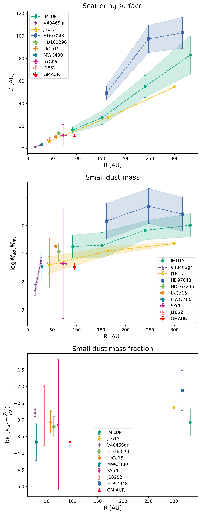
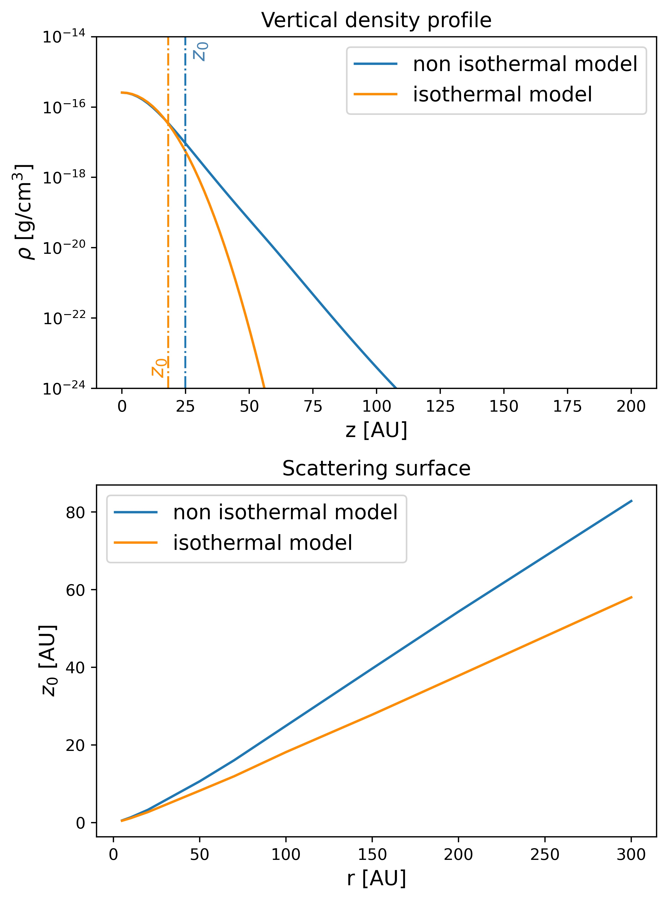
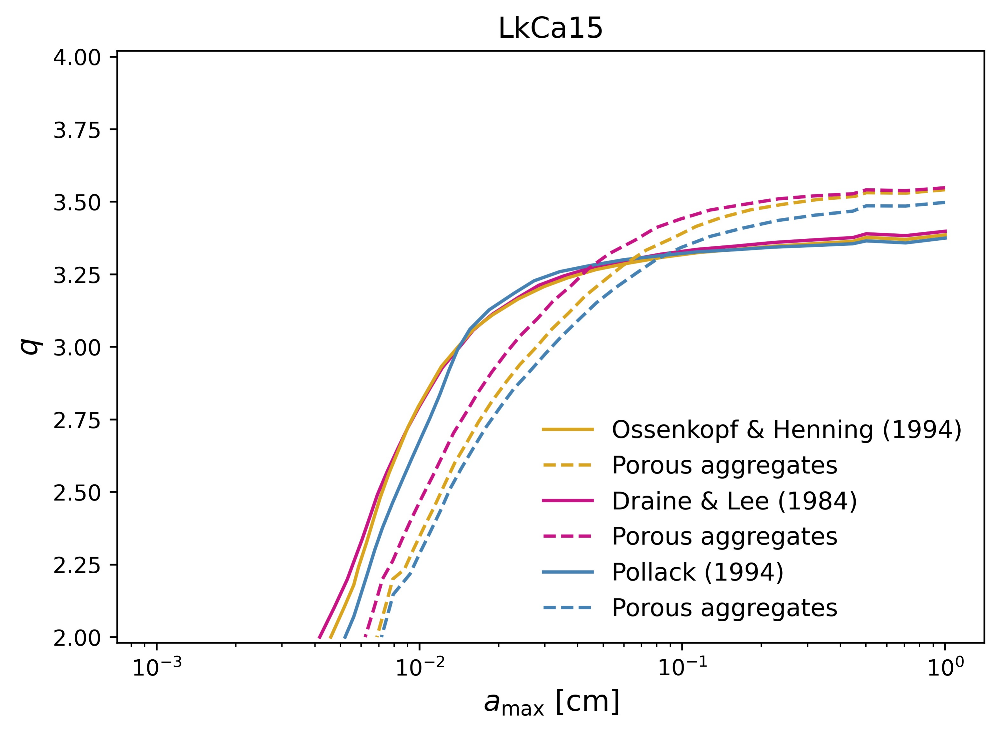

$\newcommand{\ensuremath}{}$
$\newcommand{\xspace}{}$
$\newcommand{\object}[1]{\texttt{#1}}$
$\newcommand{\farcs}{{.}''}$
$\newcommand{\farcm}{{.}'}$
$\newcommand{\arcsec}{''}$
$\newcommand{\arcmin}{'}$
$\newcommand{\ion}[2]{#1#2}$
$\newcommand{\textsc}[1]{\textrm{#1}}$
$\newcommand{\hl}[1]{\textrm{#1}}$
$\newcommand{\footnote}[1]{}$

# Interpreting the scattering surface in protoplanetary disks

<mark>Appeared on: 2026-06-24</mark> -  _16 pages, 22 figures. Accepted for publication in Astronomy & Astrophysics_

M. Bolchini, et al. -- incl., <mark>M. Benisty</mark>

**Abstract:** In recent years, extreme adaptive optics have enabled high-resolution, high-contrast scattered-light observations of protoplanetary disks. Interpreting these observations requires an understanding of the scattering surface, which is shaped by the distribution of small dust grains and determines how the disks appear in scattered light. We aim to exploit measurements of the scattering surface height to directly constrain the masses of small dust grains in disks. Starting from radiative transfer principles, we developed a semi-analytical model of the stellar radiation path and its interaction with the disk, deriving the height of the scattering surface as a function of disk parameters, such as the mass, temperature, and opacity. We validated our predictions against the radiative transfer code \texttt{MCFOST} . Using measured scattering heights, we inferred the mass of the dust in small grains and the particle size distribution for a sample of ten disks. We confirmed prior results indicating that the scattering surface coincides with the surface where the integrated optical depth along the stellar path is on the order of unity. The thermal structure of the disk significantly affects the surface height, while dust settling and anisotropic scattering have minor effects. Applying our model to observations, we measured small dust mass fractions on the order of $10^{-3}$ globally. Using models of the dust opacity, we show this is typical for modest amounts of grain growth ( $a_{\text{max}} \gtrsim 0.1mm$ ) and power-law indices of the grain size distribution $\sim 3-3.5$ , as commonly found in grain growth models. Scattering height measurements, together with the disk’s thermal structure, help set constraints on the small dust content of protoplanetary disks.

**Figure 6. -** _Top_: Measured scattering surfaces from the literature. _Middle_: Small dust masses as a function of radius inferred from the inverse problem in our work. _Bottom_: Small dust mass fraction for all the disks in the sample. (*fig:osservazioni scremate*)

**Figure 11. -** Comparison between the isothermal and nonisothermal case. _Top_: Vertical density profile at $r = 100$ AU. _Bottom_: Scattering surface. (*fig:isotermo_vs_non*)

**Figure 9. -** Constraints on the maximum grain size and power-law exponent for LkCa15 using [Draine and Lee (1984)](https://ui.adsabs.harvard.edu/abs/1984ApJ...285...89D), [Pollack, et. al (1994)](https://ui.adsabs.harvard.edu/abs/1994ApJ...421..615P), and [Ossenkopf and Henning (1994)](https://ui.adsabs.harvard.edu/abs/1994A&A...291..943O) opacities. The dotted lines represent the same composition, but considering a porous aggregates scenario, as big grains have a high porosity ($p\sim0.8$). (*fig:porous_aggregates*)

