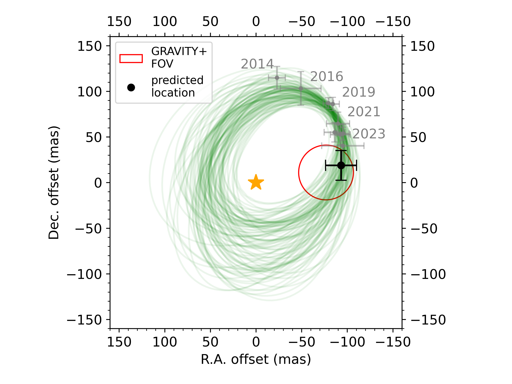
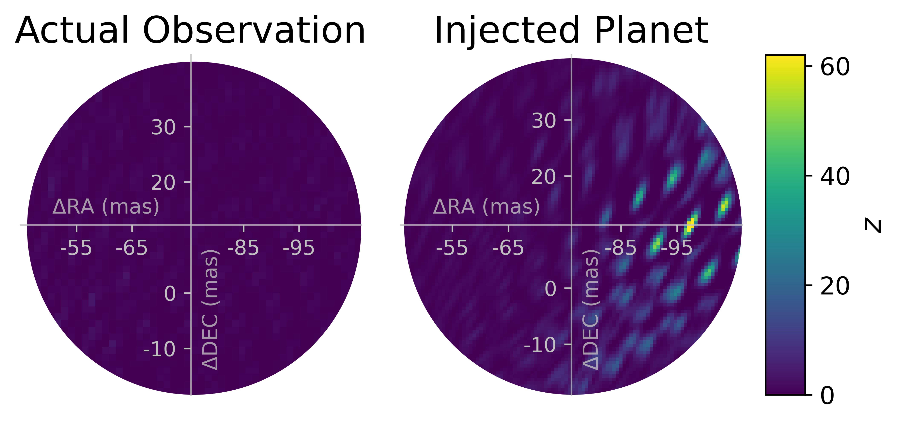

$\newcommand{\ensuremath}{}$
$\newcommand{\xspace}{}$
$\newcommand{\object}[1]{\texttt{#1}}$
$\newcommand{\farcs}{{.}''}$
$\newcommand{\farcm}{{.}'}$
$\newcommand{\arcsec}{''}$
$\newcommand{\arcmin}{'}$
$\newcommand{\ion}[2]{#1#2}$
$\newcommand{\textsc}[1]{\textrm{#1}}$
$\newcommand{\hl}[1]{\textrm{#1}}$
$\newcommand{\footnote}[1]{}$
$\newcommand{\change}[1]{\textcolor{black}{#1}}$
$\newcommand{\changetwo}[1]{\textcolor{black}{#1}}$

# Using VLTI/GRAVITY+ to determine the identity of a third planet candidate in the PDS 70 system

<mark>Appeared on: 2026-06-26</mark> -  _Accepted for publication in A&A. 4 pages, 1 table, 2 figures_

<mark>D. Trevascus</mark>, et al. -- incl., <mark>W. Brandner</mark>, <mark>P. Garcia</mark>, <mark>I. Hammond</mark>, <mark>L. Kreidberg</mark>, <mark>J. Sauter</mark>

**Abstract:** Detections of protoplanets are rare and protoplanetary disk features mischaracterized as planets are common. PDS 70 is $\changetwo{one of only two stars}$ known to host multiple confirmed protoplanets, PDS 70 b and c, and repeat detections of a third point-like source in the system suggest the presence of third inner planet. However, previous observations of this third source are insufficient to distinguish whether it is a planet or a concentrated dust clump in Keplerian motion. Our observations with VLTI/GRAVITY+ did not re-detect this point-like source, suggesting that it is, in fact, a dust clump and not a planet. These observations demonstrate how the angular resolving power of VLTI/GRAVITY+ can be used to distinguish between protoplanets and protoplanetary disk features.

**Figure 1. -** VLTI/GRAVITY+ FOV (red circle) for our attempted observation of the inner planet candidate in the PDS 70 system, plotted alongside the potential orbits of the candidate (in green). The gray points indicate the literature astrometry for the candidate, $\change$two{while the black dot shows the predicted postion of the candidate on the night of observation, with error bars showing the 2$\sigma$ error on this prediction}.
     (*fig:PDS70d_obs*)

**Figure 2. -** Maps of $z$ for our observation with VLTI/GRAVITY+. The left panels show our observation alone, the right panels show our observation with a fake planet signal injected at the predicted position of the third planet candidate. The contrast of the injected signal matches the K-band contrast of the candidate given by [Hammond, et. al (2025)](https://ui.adsabs.harvard.edu/abs/2025MNRAS.539.1613H). (*fig:z_maps*)

