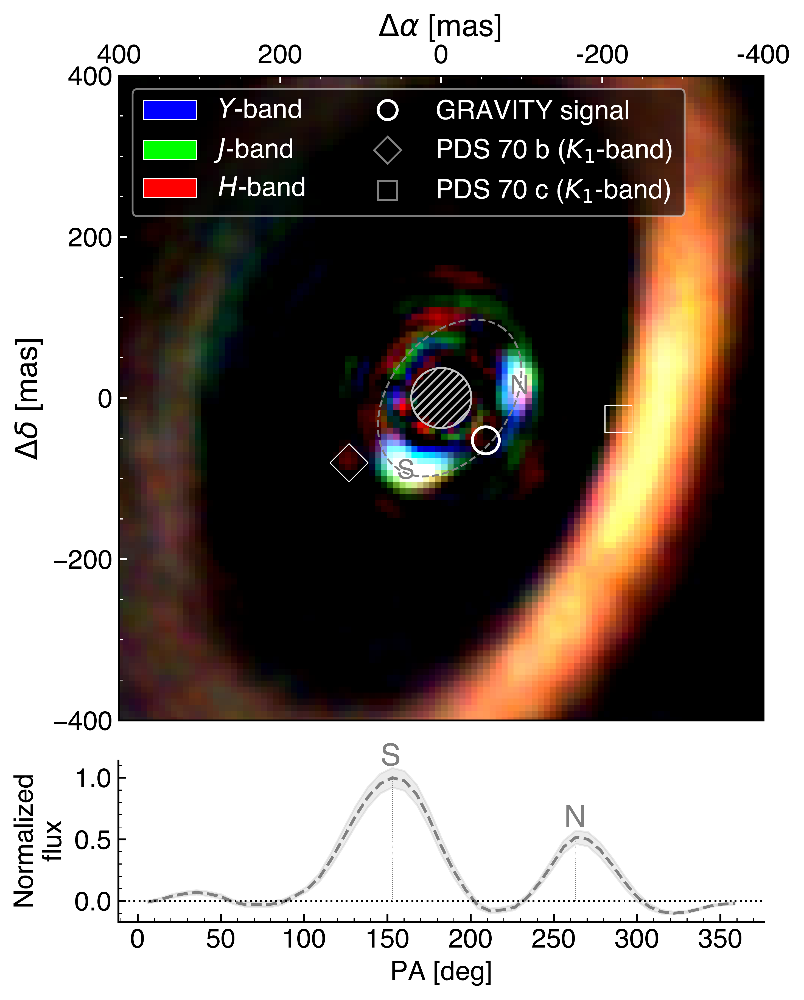
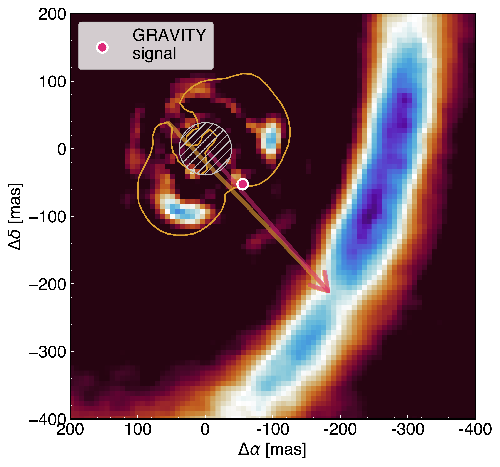

$\newcommand{\ensuremath}{}$
$\newcommand{\xspace}{}$
$\newcommand{\object}[1]{\texttt{#1}}$
$\newcommand{\farcs}{{.}''}$
$\newcommand{\farcm}{{.}'}$
$\newcommand{\arcsec}{''}$
$\newcommand{\arcmin}{'}$
$\newcommand{\ion}[2]{#1#2}$
$\newcommand{\textsc}[1]{\textrm{#1}}$
$\newcommand{\hl}[1]{\textrm{#1}}$
$\newcommand{\footnote}[1]{}$
$\newcommand{\astfootnote}[1]{$
$\let\oldthefootnote=\thefootnote$
$\setcounter{footnote}{0}$
$\newcommand{\thefootnote}{\fnsymbol{footnote}}$
$\footnote{#1}$
$\let\thefootnote=\oldthefootnote$
$}$
$\newcommand{\cxmark}{\ding{51}\hspace{-1.75mm}\ding{55}}$
$\newcommand{\nhu}[1]{\textcolor{magenta}{#1}}$
$\newcommand{\todo}[1]{\textcolor{cyan}{#1}}$
$\newcommand{\new}[1]{\textcolor{orange}{#1}}$
$\newcommand{\Lfour}{L_{\mathrm{4}}}$
$\newcommand{\Lfive}{L_{\mathrm{5}}}$
$\newcommand{\yes}{[{\color{Green}\checkmark}]}$
$\newcommand{\no}{[{\color{red}\times}]}$
$\newcommand{\thefootnote}{\fnsymbol{footnote}}$
$\newcommand{\arraystretch}{0.9}$
$\newcommand{\arraystretch}{0.9}$

# Two inner dust clumps in PDS 70$\thanks{Based on observations collected at the European Southern Observatory under ESO programmes 113.26PM.001, 115.29EH.001 and 115.29EH.002.}$: A third protoplanet traced by trojan material or a substructured inner disk?

<mark>Appeared on: 2026-06-26</mark> -  _20 pages, 14 figures, submitted to A&A_

O. Balsalobre-Ruza, et al. -- incl., <mark>I. Hammond</mark>, <mark>M. Benisty</mark>, <mark>D. Trevascus</mark>

**Abstract:** The wide cavity in the PDS 70 protoplanetary disk harbors two directly imaged confirmed protoplanets.   Several studies have proposed the existence of a third inner planet candidate at $\sim$ 13 au.   While its motion is consistent with a Keplerian orbit, its unusually blue spectrum challenges a planetary interpretation. We further investigate the presence and nature of a third inner planet using new SPHERE and GRAVITY observations. Using the star-hopping strategy, we obtained new coronagraphic SPHERE/IRDIS observations of PDS 70 in dual-polarization imaging mode in the $H$ -band, as well as non-coronagraphic observations with SPHERE/IRDIFS covering the $YJHK$ -bands.   We also searched for a planetary-like signal using GRAVITY+ in astrometric mode with the four-unit-telescope configuration. We consistently detect two inner emission features with SPHERE: one corresponding to the   previously proposed planet candidate at $\sim$ 13 au,   and another that appears to share the same orbit while leading it by $\sim 120^\circ$ (clockwise direction) with a more elongated morphology.   Both features exhibit dust-scattered light spectra while displaying different colors, which may indicate differences in dust grain sizes.   We show that such configuration is consistent with co-orbital dust accumulated at the stable Lagrangian regions of a yet undetected planet, distinct from the previously proposed candidate.   The analysis of GRAVITY data at the predicted position of this newly proposed planet has resulted in a marginal (3 $\sigma$ ) detection located between the two clumps along the same orbit ( $\rho$ = 76.2 $\pm$ 0.29 mas, PA = 226.50 $\pm$ 0.21 $^\circ$ ), and consistent with a $\sim$ 3 M $_{\rm Jup}$ planet.   This planet candidate is aligned with a narrow shadow detected in the outer disk with SPHERE.   Additionally, we detect polarized emission with SPHERE very close to the star probably arising from the inner disk, from which we estimate an approximate inclination of 50 $^\circ$ and a position angle of $\sim$ 135 $^\circ$ . The fact that the two dust clumps appear embedded within this polarized emission motivates an inner disk-related origin as an alternative scenario. We conclude that the emission from the previously reported third planet candidate   could arise either from a dust clump trailing a yet undetected planet along the same orbit, or from a rotating substructure within the inner disk.   Additional observations are required to further test these two proposed scenarios.   In particular, confirming the new GRAVITY planet candidate would support the use of co-orbital substructures as indirect tracers of embedded planets.

**Figure 1. -** _Top:_ RGB composition image of PDS 70 for the July 2025 IFS observation showing the $YJH$-bands.
Mask corresponds to saturated pixels.
_Bottom:_ Azimuthal profile for the elliptical ring represented in dashed grey in the top image, where two prominent emissions are detected corresponding to the N and S blobs. (*fig:ifs_n2_rgb*)

**Figure 8. -** Gallery of $H$-band IRDIS DPI images of PDS 70.
Total-intensity images are shown in the top,
and polarimetric Q$_{\phi}$ images in the bottom row.
The three detected emissions are labeled in the 2024 stacked image, where dashed lines indicate the two outer disk substructures reported in the literature.
In all panels, North is up and East is to the left. (*fig:irdis_dpi*)

**Figure 5. -** SPHERE/IFS image $H$-band (18 July 2025) in the background with yellow contour showing the inner emission from Q$_{\phi}$ in the 2024 combined dataset.
The magenta arrow indicates the direction from the host star to the shadow, and the magenta dot marks the location of the planet candidate.
The yellow arrow connects the shadow and the two inner disk dimmings. (*fig:shadow_pl*)

