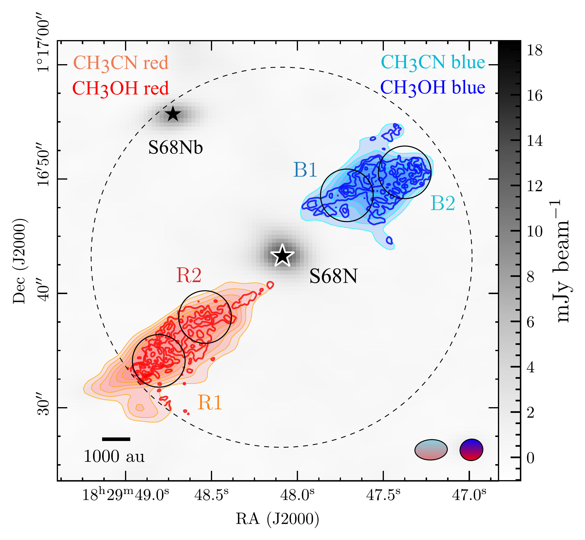
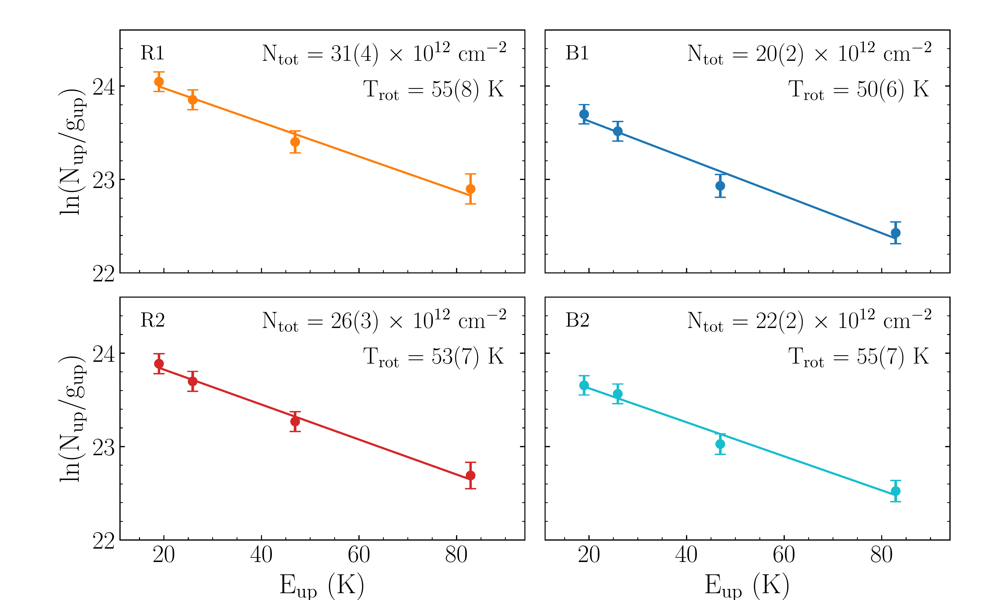
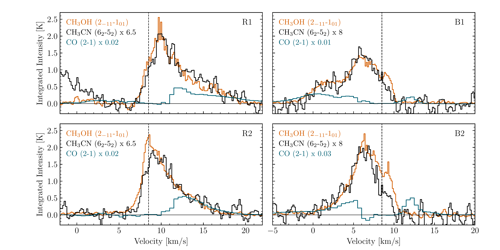
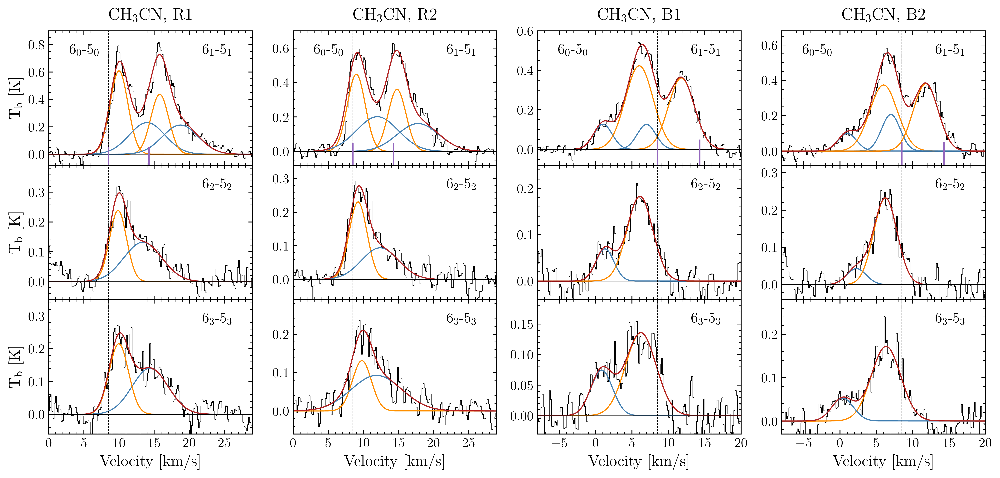

$\newcommand{\ensuremath}{}$
$\newcommand{\xspace}{}$
$\newcommand{\object}[1]{\texttt{#1}}$
$\newcommand{\farcs}{{.}''}$
$\newcommand{\farcm}{{.}'}$
$\newcommand{\arcsec}{''}$
$\newcommand{\arcmin}{'}$
$\newcommand{\ion}[2]{#1#2}$
$\newcommand{\textsc}[1]{\textrm{#1}}$
$\newcommand{\hl}[1]{\textrm{#1}}$
$\newcommand{\footnote}[1]{}$
$\newcommand{\arraystretch}{1.2}$
$\newcommand{\arraystretch}{1.3}$
$\newcommand{\arraystretch}{1.3}$

# Probing outflow physics through $CH_3$CN and $CH_3$OH chemistry

<mark>Appeared on: 2026-06-26</mark> - 

L. Giani, et al. -- incl., <mark>A. Somigliana</mark>

**Abstract:** Chemical correlations between molecules provide powerful diagnostics to probe the physical conditions of protostellar outflows. In particular, the relationship between methanol ($CH_3$ OH) and methyl cyanide ($CH_3$ CN) offers a promising tool to investigate the chemistry and irradiation environment of shocked gas.In this Letter, we use the $CH_3$ OH/$CH_3$ CN abundance ratio to constrain the physical properties of the outflow driven by the Class 0 protostar S68N using ALMA Band 3 and Band 6 observations.Assuming local thermodynamic equilibrium (LTE), we derive excitation temperatures of 50–60 K and column densities of 2–3 $\times$ 10 $^{13}$ cm $^{-2}$ for $CH_3$ CN and 3–5 $\times$ 10 $^{15}$ cm $^{-2}$ for $CH_3$ OH.The resulting $CH_3$ OH/$CH_3$ CN abundance ratio is nearly constant along the outflow, with values of $\sim$ 100–200, similar to those found in other protostellar environments.Using an up-to-date astrochemical model, we test whether gas-phase formation of $CH_3$ CN can account for the observed ratios. We find that they are reproduced only by assuming enhanced cosmic-ray ionization rates $\zeta_{\rm CR}$ up to $\sim$ 10 $^{-14}$ s $^{-1}$ .These results suggest that the $CH_3$ OH–$CH_3$ CN correlation can be used as a probe of the irradiation conditions in protostellar outflows. Further studies are required to explore the possible contribution of grain-surface formation of $CH_3$ CN which could lead to a lower $\zeta_{\rm CR}$ and to extend the analysis to a larger sample of sources.

**Figure 3. -** 
    The S68N outflows and its analysis.
    _Left panel:_ 2.7 mm continuum (gray scale) with overlaid redshifted and blueshifted emission of $CH_3$CN $6_2-5_2$(salmon/cyan shaded contours) and $CH_3$OH $2_{-1,1}-1_{0,1}$(red/blue contours).
    Contours start at 2$\sigma$ in steps of 1$\sigma$($\sigma$ = 60 and 50 mJy beam$^{-1}$ km s$^{-1}$ for $CH_3$CN and  $CH_3$OH, respectively).
    Black circles label the analysed regions (R1, R2, B1, B2); stars mark protostellar positions. The dashed circle indicates the $CH_3$OH primary beam and synthesized beams are shown at the bottom right.
    _Right panel:_ $CH_3$CN rotation diagrams in the four labelled regions. Color coding matches the left panel. Derived column densities and rotational temperatures are reported in each panel.
     (*fig:maps+RD*)

**Figure 4. -** $CH_3$CN $6_2$-$5_2$(black), $CH_3$OH 2$_{11}$-1$_{01}$(orange) and CO 2-1 (teal) spectra (in K) extracted in the four regions of the red-shifted (R1 and R2) and blue-shifted (B1 and B2) outflows of S68N.
    The spectral resolutions are 0.061 MHz (0.16 km s$^{-1}$) for $CH_3$CN, 0.122 MHz (0.14 km s$^{-1}$) for $CH_3$OH, and 0.384 MHz (0.5 km s$^{-1}$) for CO.
    The $CH_3$CN emission is multiplied by a factor 6.5 in R1 and R2, and by a factor 8 in B1 and B2. The CO emission is multiplied by a factor 0.02 in R1 and R2, 0.01 in B1 and 0.03 in B2 for visualization purposes. The black dashed vertical lines mark the v$_{\rm sys}$(+8.5 km s$^{-1}$,  ([Lee, et. al 2014](https://ui.adsabs.harvard.edu/abs/2014ApJ...797...76L)) ).  (*fig:spectra-ch3oh-ch3cn-CO*)

**Figure 5. -** Spectral fits of the $CH_3$CN $6_0$–$5_0$, $6_1$–$5_1$, $6_2$–$5_2$, and $6_3$–$5_3$ transitions extracted in the four regions R1, R2, B1, and B2.
    In the upper panels of each region, the transitions producing the emission lines (see Table \ref{Tab:lines}) are indicated, and their corresponding frequencies are marked by small vertical purple lines. The spectra are centred at the frequency of the $6_0$–$5_0$ transition (110.3835 GHz).
    In regions R1 and R2, each transition shows a main peak at +9–10 km s$^{-1}$(orange curves) and a secondary component redshifted by $\sim$3–4 km s$^{-1}$(blue curves).
    In regions B1 and B2, each transition shows a main peak at +6 km s$^{-1}$(orange curves) and a secondary component blueshifted by $\sim$5 km s$^{-1}$(blue curves).
    In all panels, the red curves show the total multi-component fits. The dashed vertical line marks the systemic velocity, +8.5 km s$^{-1}$( ([Lee, et. al 2014](https://ui.adsabs.harvard.edu/abs/2014ApJ...797...76L)) ).
     (*fig:spectra-ch3cn-deblending*)

