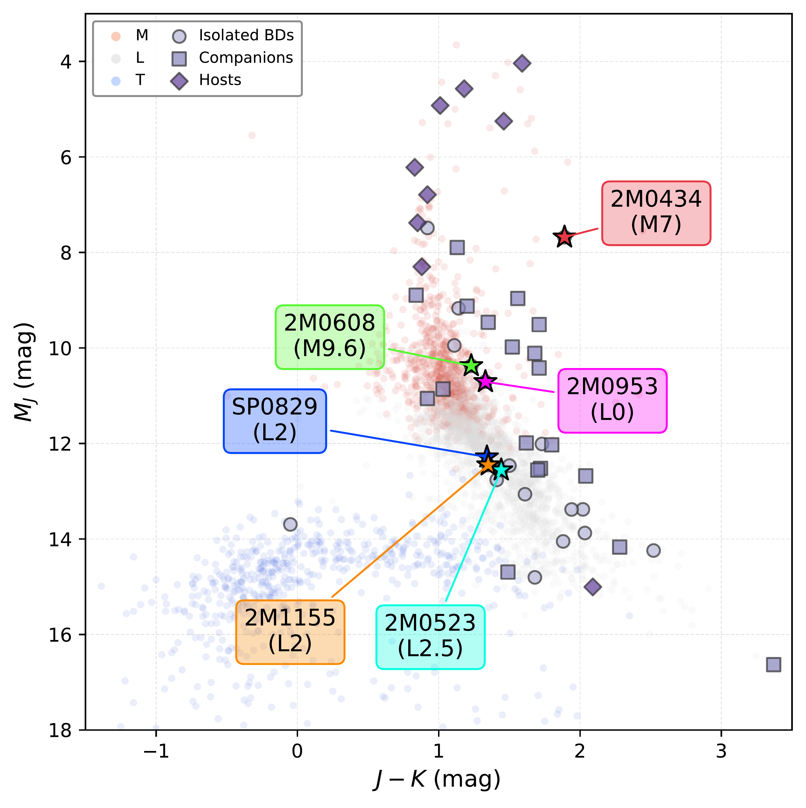
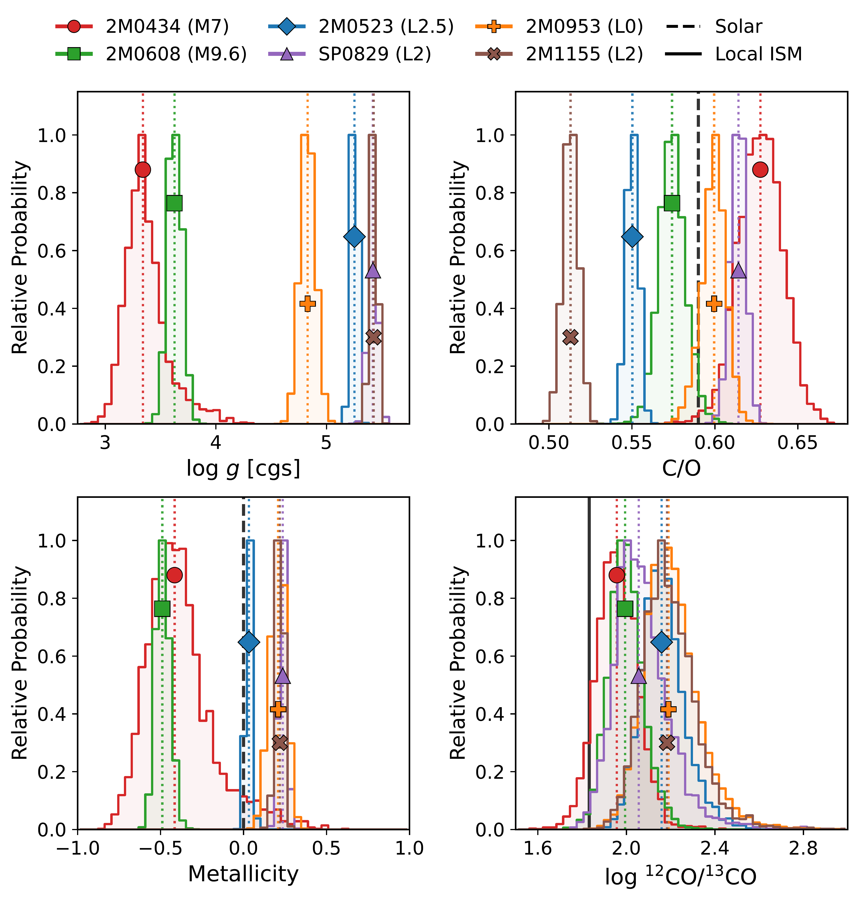

$\newcommand{\ensuremath}{}$
$\newcommand{\xspace}{}$
$\newcommand{\object}[1]{\texttt{#1}}$
$\newcommand{\farcs}{{.}''}$
$\newcommand{\farcm}{{.}'}$
$\newcommand{\arcsec}{''}$
$\newcommand{\arcmin}{'}$
$\newcommand{\ion}[2]{#1#2}$
$\newcommand{\textsc}[1]{\textrm{#1}}$
$\newcommand{\hl}[1]{\textrm{#1}}$
$\newcommand{\footnote}[1]{}$
$\newcommand{\gt}[1]{\textit{\textcolor{gray!70}{#1}}}$
$\newcommand{\arraystretch}{1.3}$
$\newcommand{\arraystretch}{0.86}$

# The ESO SupJup Survey: XI. Atmospheric properties of six isolated M- and L-type dwarfs with CRIRES+

<mark>Appeared on: 2026-06-26</mark> -  _Submitted to A&A, 20 pages, 9 figures_

C. R. Malcolm, et al. -- incl., <mark>P. Mollière</mark>

**Abstract:** The distinct formation pathways of brown dwarfs and giant exoplanets may be encoded in their atmospheric elemental and isotopic composition. The ESO SupJup Survey uses high-resolution CRIRES+ spectroscopy to systematically characterise the $^{12}$ C/ $^{13}$ C isotope ratio, C/O ratio, and metallicity across a sample of 49 isolated brown dwarfs, hosts, and companions. We present atmospheric retrievals for six isolated brown dwarfs of spectral types M7--L2.5, aiming to constrain their thermal structures, chemical compositions, and isotope ratios. We analyse CRIRES+ $K$ -band spectra with retrievals coupling the radiative transfer code \texttt{petitRADTRANS} with the nested sampling algorithm \texttt{PyMultiNest} . Both free and equilibrium chemistry frameworks are employed for each target. The L0 dwarf 2MASS J09532126 $-$ 1014205 emerges as one of the fastest-rotating ultracool dwarfs characterised to date, with $v\sin i = 85.9\pm0.5$ km s $^{-1}$ . $H_2^{(16)}$ O is strongly detected in all six targets and $^{12}$ CO in five, with a marginal $^{12}$ CO detection in the ultra-fast L0 rotator (S/N $=$ 4.2) consistent with severe rotational broadening. $^{13}$ CO is significantly detected in DENIS J060852.8 $-$ 275358 (S/N $=$ 5.0) and tentatively in three further targets (S/N $=$ 3.0--4.2). Retrieved compositions are consistent with isolated brown dwarfs: near-solar C/O ratios ( $0.51$ -- $0.63$ ), predominantly near-solar metallicities, and $^{12}$ C/ $^{13}$ C ratios of $\sim$ 91--155, at or above the local ISM value, with constraints for the two fastest rotators resting on the spectral fit but not corroborated by a $^{13}$ CO cross-correlation peak. The M7 dwarf 2MASS J04341527+2250309 shows discrepant gravity and metallicity values between chemistry frameworks. Apparent $H_2^{18}$ O constraints for two targets are found to be spurious and their $H_2^{(16)}$ O/$H_2^{18}$ O ratios are presented as lower limits. The near-solar C/O ratios and metallicities, with $^{12}$ C/ $^{13}$ C ratios at or above the ISM value, support a molecular cloud fragmentation origin for the sample. The agreement of $^{12}$ C/ $^{13}$ C between chemistry frameworks supports the robustness of these ratios. Spurious $H_2^{18}$ O constraints demonstrate the importance of cross-correlation validation for minor species detections.

**Figure 9. -**  (*tab:ccf_snr*)

**Figure 1. -** Colour-magnitude diagram displaying absolute J-band magnitude versus J-K colour for our six-target sample in the context of the broader ultracool dwarf population. Background points show M, L, and T dwarfs from the UltracoolSheet database (\url{https://doi.org/10.5281/zenodo.13993077}), colour-coded by spectral type. The full SupJup survey sample is shown in purple, distinguished by system architecture: isolated brown dwarfs (circles), companions (squares), and host objects (diamonds). Our six targets are emphasised with star-shaped data markers to illustrate their placement within this population of ultracool dwarfs and substellar companions. (*fig:CMD_SupJup*)

**Figure 2. -** Marginalised posterior distributions for four key atmospheric parameters across the six-target sample: surface gravity (log $g$), carbon-to-oxygen ratio (C/O), metallicity ([Fe/H]), and carbon isotope ratio (log $^{12}$CO/$^{13}$CO). Each target is shown in a distinct colour, with dotted vertical lines indicating the retrieved median, and a target-specific symbol is overplotted at a staggered height to aid identification where medians overlap (see legend). Black dashed lines mark solar reference values for C/O ($= 0.59$; \citealt{Asplund2021}) and metallicity ($= 0.0$). The black solid line indicates the local ISM value of $^{12}$C/$^{13}$C $= 68 \pm 15$\citep{Milam2005}. Results are shown from the equilibrium chemistry models, where metallicity is retrieved as [Fe/H]. (*fig:posterior_4panel*)

