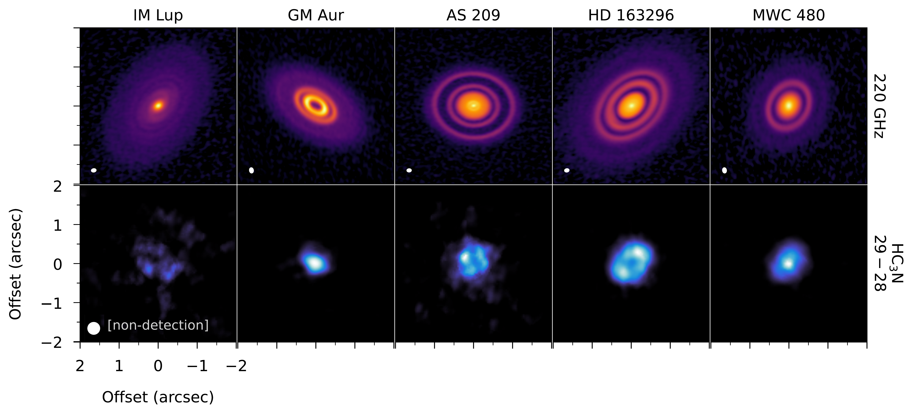
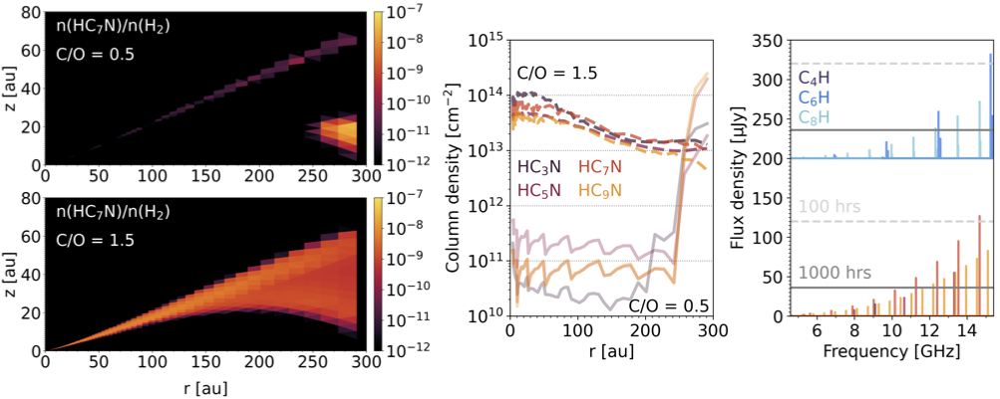
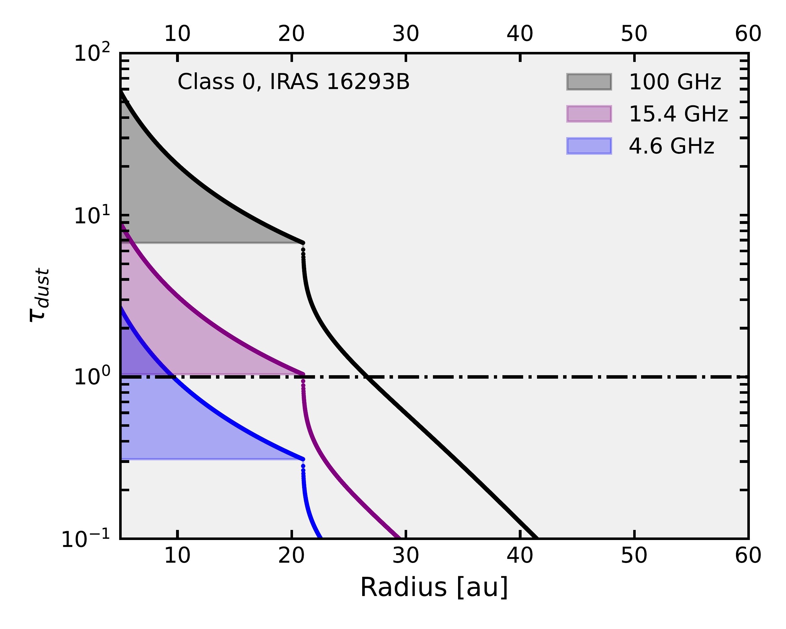

$\newcommand{\ensuremath}{}$
$\newcommand{\xspace}{}$
$\newcommand{\object}[1]{\texttt{#1}}$
$\newcommand{\farcs}{{.}''}$
$\newcommand{\farcm}{{.}'}$
$\newcommand{\arcsec}{''}$
$\newcommand{\arcmin}{'}$
$\newcommand{\ion}[2]{#1#2}$
$\newcommand{\textsc}[1]{\textrm{#1}}$
$\newcommand{\hl}[1]{\textrm{#1}}$
$\newcommand{\footnote}[1]{}$
$\newcommand{\arcsec}{\ensuremath{^{\prime\prime}}\xspace}$
$\newcommand{\arcmin}{\ensuremath{^{\prime}}\xspace}$
$\newcommand{\ssr}{Space Science Reviews}$
$\newcommand{\aj}{AJ}$
$\newcommand{\araa}{ARA\&A}$
$\newcommand{\apj}{ApJ}$
$\newcommand{\apjl}{ApJ}$
$\newcommand{\apjs}{ApJS}$
$\newcommand{\apss}{Ap\&SS}$
$\newcommand{\aap}{A\&A}$
$\newcommand{\aapr}{A\&A~Rev.}$
$\newcommand{\aaps}{A\&AS}$
$\newcommand{\mnras}{MNRAS}$
$\newcommand{\pasp}{PASP}$
$\newcommand{\pasj}{PASJ}$
$\newcommand{\qjras}{QJRAS}$
$\newcommand{\nat}{Nature}$

# Unveiling Complex Chemistry in Planet-forming Disks with the SKAO

<mark>Appeared on: 2026-06-26</mark> -  _Published in Advancing Astrophysics with the SKA II (AASKAII), 2026 (arXiv:2606.20366). Report-no:AASKAII/Podio01. Advancing Astrophysics with the SKA II (AASKAII) outlines the transformative scientific advances that will be enabled by the SKA telescopes_

L. Podio, et al. -- incl., <mark>G. Perotti</mark>, <mark>Y. Wu</mark>

**Abstract:** The chemical composition of planets is inherited from that of the natal protoplanetary disk at the time of planet formation. In recent years, we have made huge progress in characterizing disk chemistry. (Sub-)millimeter interferometers, such as ALMA, allowed us to detect emission lines from simple to complex organic molecules and to probe their radial and vertical distribution in disks. On the other hand, JWST has started to unveil the composition of disk ices, and line emission from the innermost disk regions. The advent of SKA will open new domains in the field, by observing emission lines from heavier molecules including heavy carbon chains and rings, and prebiotic molecules with peak emission in the cm range. Moreover, SKA will probe molecular emission from regions which are obscured by dust opacity at mm wavelengths, hence from the disk midplane, and often from the inner $30$ au region. These observations will constrain the initial conditions for disk evolution and planet formation, allowing us to predict the chemical composition of the forming planets and their atmospheres. Comparison with forthcoming results on exoplanet atmospheres and on the chemistry of pristine bodies in the Solar System will provide new hints on the origin and evolution of planetary systems including our own.

**Figure 5. -** Continuum maps at 220 GHz (top) and integrated intensity (moment 0) maps of $HC_3$N (bottom) in the disks observed by the ALMA Large Program MAPS  (Ilee2021) . The ellipses indicate the beam sizes (identical for all integrated intensity maps). The maps are normalized and the intensity is in logarithmic and linear scales for the continuum and integrated intensity (or moment 0) maps, respectively. (*fig:maps-disks*)

**Figure 7. -** _ Left panels:_ Modelled fractional abundance (with respect to \ce{H2}) of \ce{HC7N} as a function of radius, $r$, and height, $z$, for a model with C/O = 0.5 (top), and one with C/O = 1.5 (bottom).
  _ Middle panel:_ Vertically-integrated column density (cm$^{-2}$) of cyanopolyynes ($\mathrm{HC_{n}N}$) as a function of radius, $r$, for the model with C/O = 0.5 (solid lines), and one with C/O = 1.5 (dashed lines).
  _ Right panel:_ Disk-integrated line spectra at SKA-Mid Band 5 frequencies for cyanopolyynes (colour scheme is the same as for the middle plots) and $\mathrm{C_{n}H}$ species for the model with C/O = 1.5. The horizontal lines indicate the expected sensitivity reached for 100 hours (light-grey dashed line) and 1000 hours (dark-grey solid line) of observation time with SKA-Mid in AA4 configuration (beam of $\sim1.3"$ and spectral resolution of 0.34 km s$^{-1}$).
 (*fig:hydrocarbonsSKA*)

**Figure 1. -** Estimated dust optical depth profiles for the IRAS16293B Class 0 disk at different frequencies. The profile at 100 GHz is estimated using the 1.3-3mm spectral index profile following the methodology in Maureira2026. Profiles at 15.4 GHz and 4.6 GHz, frequencies observable with SKAO, are estimated by extrapolating the 100 GHz profile assuming  that the dust emissivity follows a power law with frequency with index $\beta=1$. The shaded region indicates a range of possible values arising from different assumed optical depth in the inner regions, which remains optically thick at 100 GHz and 223 GHz  (Maureira2026) .
   (*fig:class0_tau_predictions*)

