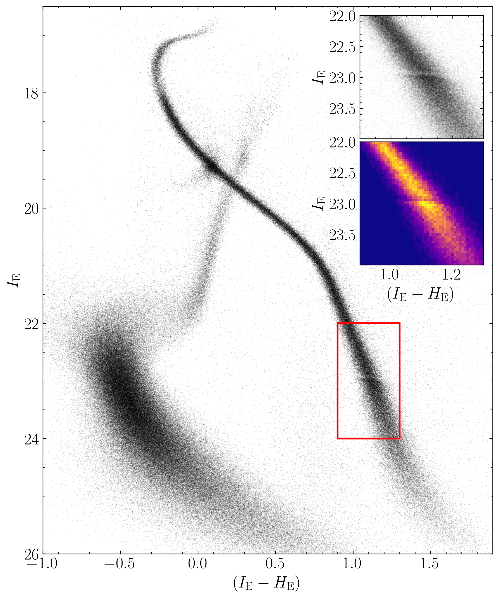
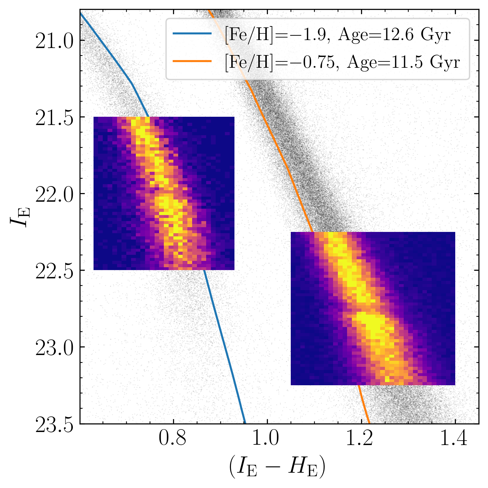
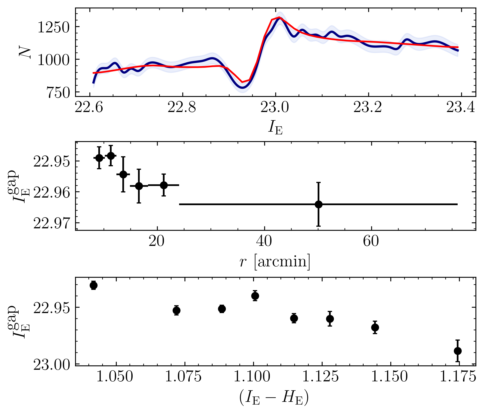

$\newcommand{\ensuremath}{}$
$\newcommand{\xspace}{}$
$\newcommand{\object}[1]{\texttt{#1}}$
$\newcommand{\farcs}{{.}''}$
$\newcommand{\farcm}{{.}'}$
$\newcommand{\arcsec}{''}$
$\newcommand{\arcmin}{'}$
$\newcommand{\ion}[2]{#1#2}$
$\newcommand{\textsc}[1]{\textrm{#1}}$
$\newcommand{\hl}[1]{\textrm{#1}}$
$\newcommand{\footnote}[1]{}$
$\newcommand{\hstfull}{\HST\xspace}$
$\newcommand{\hst}{HST\xspace}$
$\newcommand{\jwstfull}{\textit{James Webb} Space Telescope\xspace}$
$\newcommand{\jwst}{JWST\xspace}$
$\newcommand{\gaia}{\textit{Gaia}\xspace}$
$\newcommand{\euclid}{\textit{Euclid}\xspace}$
$\newcommand{\qfit}{\texttt{QFIT}\xspace}$
$\newcommand{\radxs}{\texttt{RADXS}\xspace}$
$\newcommand{\hpass}{\texttt{hst1pass}\xspace}$
$\newcommand{\jpass}{\texttt{jwst1pass}\xspace}$
$\newcommand{\epass}{\texttt{euclid1pass}\xspace}$
$\newcommand{\kstwo}{\texttt{KS2}\xspace}$
$\newcommand{\masyr}{mas yr^{-1}\xspace}$
$\newcommand{\orcid}[1]{\unskip\protect\href{https://orcid.org/#1}{\protect\includegraphics[width=8pt,clip]{logo_orcid}}}$
$\newcommand{\linenumbers}[0]\usepackage$

# $\Euclid$\/: The convective-transition gap of 47 Tuc$\thanks{This paper is published on behalf of the Euclid Consortium}$

<mark>Appeared on: 2026-06-30</mark> -  _12 pages, 10 figures. Accepted for publication in A&A on 25 June 2026, first submission to A&A on 2 June 2026. Official Euclid data available at the CDS upon publication_

M. Libralato, et al. -- incl., <mark>K. Jahnke</mark>

**Abstract:** We report the first detection of the `convective-transition gap' (also known as `M-dwarf gap') in the globular cluster 47 Tuc (NGC 104) thanks to $\euclid$ data. This feature, linked to a change in the physical properties of late-type dwarfs, has remained elusive, with only two detections so far. Leveraging the large number of stars, high resolution, and photometric precision enabled by $\euclid$ , we detect a statistically significant, sharp discontinuity in the main-sequence luminosity function of 47 Tuc at $\IE$ $\approx$ 22.9, which we identify as the convective-transition gap. We compare the observed properties of the gap in 47 Tuc with theoretical models, showing how the gap can be a powerful diagnostic to probe the internal chemical structure of globular clusters, and their multiple stellar populations. Following its initial discovery in the metal-poor cluster NGC 6397, the identification of a convective gap in the metal-rich 47 Tuc suggests that this feature might be more general than previously thought. These results demonstrate that $\euclid$ can be transformative well beyond cosmology, with impact across multiple areas of astrophysics, including resolved stellar populations. $\looseness$ =-4

**Figure 1. -** The main panel shows the \IE versus \mbox{$\IE-\HE$} CMD of 47 Tuc. The narrow sequence corresponds to 47 Tuc; the broad sequence corresponds to background stars in the SMC. The region highlighted in red is expanded in the top (CMD) and bottom (Hess diagram) insets. The convective gap is clearly visible at \IE$\approx$ 22.9.\looseness=-4 (*fig:cmd*)

**Figure 4. -** CMD of 47 Tuc (redder sequence) and NGC 6397 (bluer sequence) in $\euclid$ filters. The photometry in this plot has been rescaled as described in Sect. \ref{sec:comparison} to ensure a fair comparison between the two systems. For each GC, we plot an Hess diagram to highlight the location and morphology of the convective gap. Two different isochrones (solid lines) are shown for reference.\looseness=-4 (*fig:gcgaps*)

**Figure 7. -** _ Top:_ smoothed present-day LF of 47 Tuc (blue line) fitted with a mono-metallic theoretical gap model, convolved with a Gaussian kernel to account for an $[\mathrm{Fe/H}]$ spread (red line). The model was fitted without binning. _ Middle:_ radial variation of $\IE^{\rm gap}$. Horizontal lines indicate the coverage of each bin. _ Bottom:_ colour-dependent ($\IE-\HE$) variations of $\IE^{\rm gap}$ across the width of the MS.\looseness=-4 (*fig:theory*)

