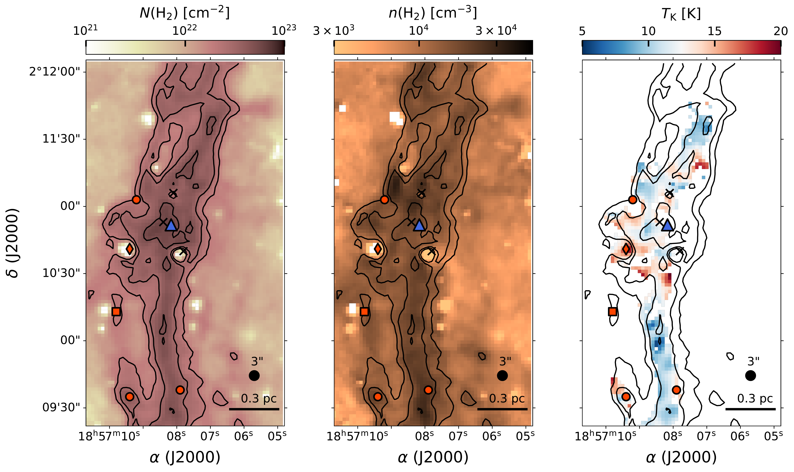
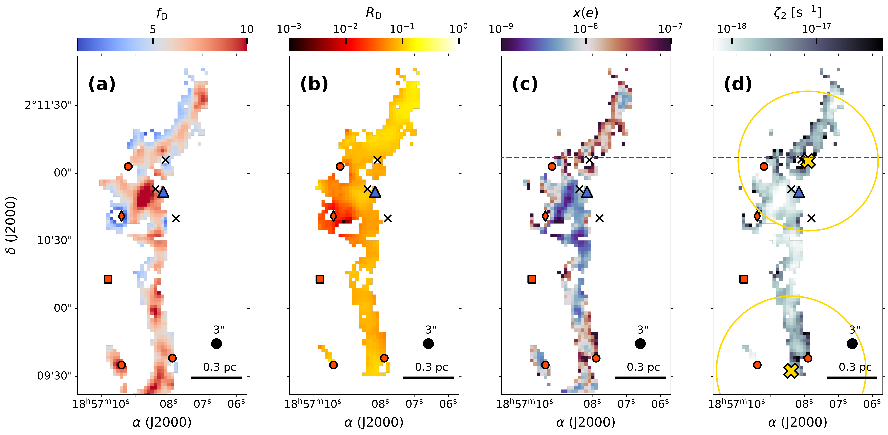
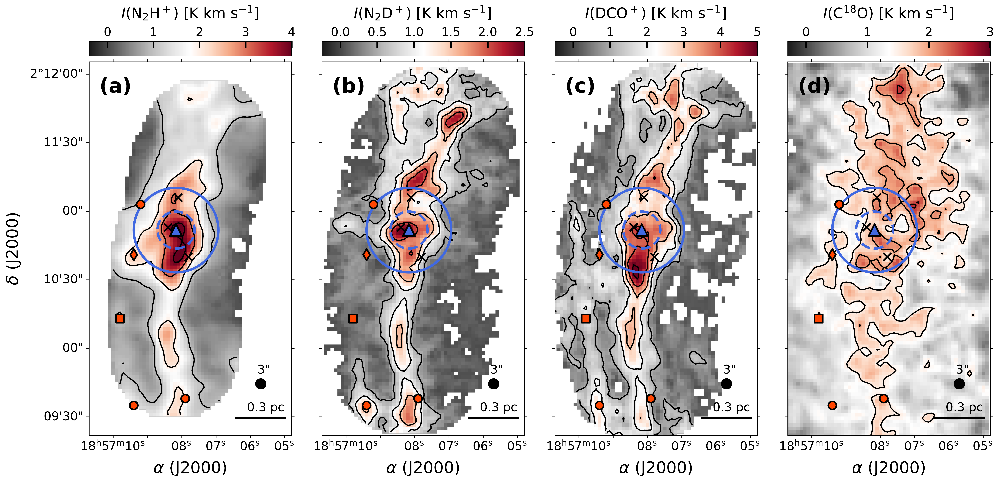

$\newcommand{\ensuremath}{}$
$\newcommand{\xspace}{}$
$\newcommand{\object}[1]{\texttt{#1}}$
$\newcommand{\farcs}{{.}''}$
$\newcommand{\farcm}{{.}'}$
$\newcommand{\arcsec}{''}$
$\newcommand{\arcmin}{'}$
$\newcommand{\ion}[2]{#1#2}$
$\newcommand{\textsc}[1]{\textrm{#1}}$
$\newcommand{\hl}[1]{\textrm{#1}}$
$\newcommand{\footnote}[1]{}$
$\newcommand{\ttnewcommandault}{pcr}$
$\newcommand{\capoverlay}{#1#2#3\par}$

# Low cosmic-ray ionisation at parsec scales in G035.39-00.33

<mark>Appeared on: 2026-06-30</mark> - 

A. Socci, et al. -- incl., <mark>C. Gieser</mark>

**Abstract:** Cosmic rays (CRs) play a key role in the interstellar medium (ISM) by regulating the chemical evolution of the gas and its coupling to the magnetic field in the densest and coldest regions of molecular clouds. However, the CR ionisation rate of $H_2$ ( $\zeta_2$ ) is one of the most debated parameters characterising molecular clouds due to the uncertainties in its estimation. We aim to derive a new and reliable indirect analytical method to probe the electron fraction, $x(e)$ , and $\zeta_2$ of the gas across multiple density regimes. We further apply this novel framework to a parsec-scale filament to homogeneously map a significant sample of fields with different physical conditions and test their impact on $x(e)$ and $\zeta_2$ . Recent estimates of $x(e)$ and $\zeta_2$ suffer from limitations, mostly driven by observational restrictions. We thus developed a new analytical framework based on the chemistry of $N_2$ H $^+$ , $N_2$ D $^+$ and DCO $^+$ . We mapped the emission from their ground transition towards the parsec-scale filament of the infrared dark cloud (IRDC) G035.39-00.33 with new observations from the NOrthern Extended Array (NOEMA) at a resolution of $3"$ (or $\sim9000$ au at the cloud distance). By combining this novel survey with ancillary observations of C $^{18}$ O ( $1-0$ ), we determined the CO depletion factor, the $N_2$ H $^+$ deuterium fraction and, ultimately, $x(e)$ and $\zeta_2$ in G035.39-00.33. The CO depletion is significant and widespread in G035.39-00.33. Its depletion factor, $f_\mathrm{D}$ , shows a positive correlation with column and number densities of $H_2$ in the cloud, with the highest intensities in both $N_2$ H $^+$ and $N_2$ D $^+$ , and with the sites displaying an enhanced deuterium fraction ( $R_\mathrm{D}$ ). The electron fraction varies by two orders of magnitude within $\sim10^{-9}-10^{-7}$ and shows a functional dependence on the number density of $H_2$ in the region. This correlation is consistent with that determined in low-mass cores with similar degrees of CO depletion, but now extended to parsec scales, and with the predictions from chemical models. $\zeta_2$ varies by three orders of magnitude within $\sim10^{-18}-10^{-15}$ s $^{-1}$ , and most fields show values of $\sim2.3\times10^{-18}$ s $^{-1}$ on average. $\zeta_2$ shows a functional dependence on $N(\mathrm{H_2})$ , as predicted by theoretical models, but its scatter and its values, on average lower than the typical $\zeta_2$ for the ISM, suggest the presence of local enhancement and overall attenuation of the CR flux taking place in G035.39-00.33. $f_\mathrm{D}$ and $R_\mathrm{D}$ show values consistent with theoretical predictions and previous independent studies. On the other hand, $x(e)$ and $\zeta_2$ show values at the lower end compared to independent estimates in filaments and cores. The values of $\zeta_2$ are consistent with those reported for other IRDCs and giant filaments, but lower compared to theoretical predictions for the column density regime sampled by G035.39-00.33. CR attenuation can come from the change in magnetic field strength and morphology previously reported in G035.39-00.33, which explains the reduced values of $x(e)$ and $\zeta_2$ . Fields with ionisation rates of $\zeta_2\gtrsim10^{-16}$ s $^{-1}$ may be affected by the local acceleration of CRs or by the magnetic pockets formed from the uneven magnetic field instead.

**Figure 9. -** Ancillary observations of Cloud H. _left panel_: column density map, $N(\mathrm{H_2})$, derived from the NIR+MIR extinction map of [Kainulainen and Tan (2013)](https://ui.adsabs.harvard.edu/abs/2013A&A...549A..53K). _central panel_: number density map, $n(\mathrm{H_2})$, derived from the total column density using the denoising diffusion probabilistic model \citep[DDPM;][]{xu2023}. _right panel_: kinetic temperature map obtained from VLA+GBT observations of the $NH_3$(1,1), (2,2) inversion transitions  ([Sokolov, et. al 2019](https://ui.adsabs.harvard.edu/abs/2019ApJ...872...30S)) . In all panels, the contours correspond to $H_2$ column densities of [$2\times10^{22}$, $3\times10^{22}$, $5\times10^{22}$] cm$^{-2}$ and the symbols are the same as in Fig. \ref{fig:NOEMAmaps}. (*fig:archivaldata*)

**Figure 8. -** Main results obtained from the analysis of Cloud H (see Sect. \ref{sec:analysis}). _Panel a_: depletion factor, $f_\mathrm{D},$ derived from the ratio of the expected C$^{18}$O abundance in Cloud H, $x_0$, and the measured abundance, $N(\mathrm{C^{18}O})/N(\mathrm{H_2})$(see Sect. \ref{subsec:fd}). _Panel b_: deuterium fraction derived as $R_\mathrm{D}=N(\mathrm{N_2D^+})/N(\mathrm{N_2H^+})$(see Sect. \ref{subsec:Rd}). _Panel c_: electron fraction, $x(e)$, determined via Eq. \ref{eq:xe} in our analytical framework. _Panel d_: CR ionisation rate, $\zeta_2$, determined via Eq. \ref{eq:zeta} in our analytical framework. The position of the clumps identified by [Liu, et. al (2018)](https://ui.adsabs.harvard.edu/abs/2018ApJ...859..151L) is marked with crosses along with their effective size (gold line). The red dashed lines in the last two panels represents the approximate declination at which the dominant magnetic field component changes \citep[from poloidal towards the North, to toroidal towards the South;][]{liu2018}. The symbols in all panels are the same as in Fig. \ref{fig:NOEMAmaps}. (*fig:results*)

**Figure 7. -** Velocity-integrated intensity maps of the ground transition of $N_2$H$^+$(panel a), $N_2$D$^+$(panel b), DCO$^+$(panel c), and C$^{18}$O (panel d) towards Cloud H. The contours correspond to [1, 2, 3, 4] K km s$^{-1}$ for $N_2$H$^+$, [0.5, 1, 1.5, 2] K km s$^{-1}$ for $N_2$D$^+$, [1, 2, 3, 4, 5] K km s$^{-1}$ for DCO$^+$, and [1.5, 2, 2.5] K km s$^{-1}$ for C$^{18}$O. The blue triangle represents the central position of the H6 core  ([Butler and Tan 2012](https://ui.adsabs.harvard.edu/abs/2012ApJ...754....5B))  within the MM7 clump  ([Rathborne, Jackson and Simon 2006](https://ui.adsabs.harvard.edu/abs/2006ApJ...641..389R))  with their typical sizes reported in these studies displayed as dashed and solid circles, respectively. The red circles, diamond, and square represent the dense pre-stellar cores, the dense core with MIR counterpart  ([Gutermuth and Heyer 2015](https://ui.adsabs.harvard.edu/abs/2015AJ....149...64G)) , and an unclassified source reported by [Nguyen Luong, et. al (2011)](https://ui.adsabs.harvard.edu/abs/2011A&A...535A..76N). The black crosses represent those sources classified as protostars by these same authors. (*fig:NOEMAmaps*)

