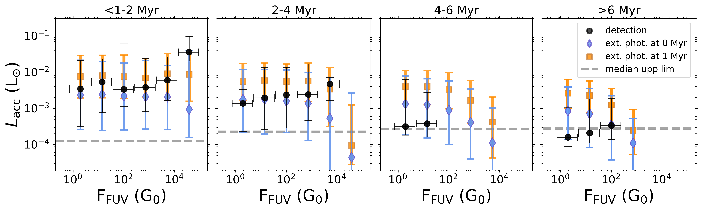
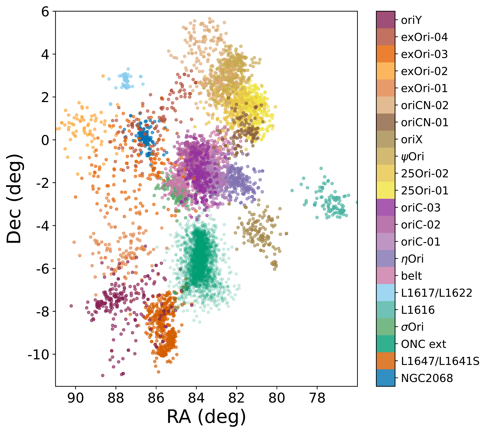
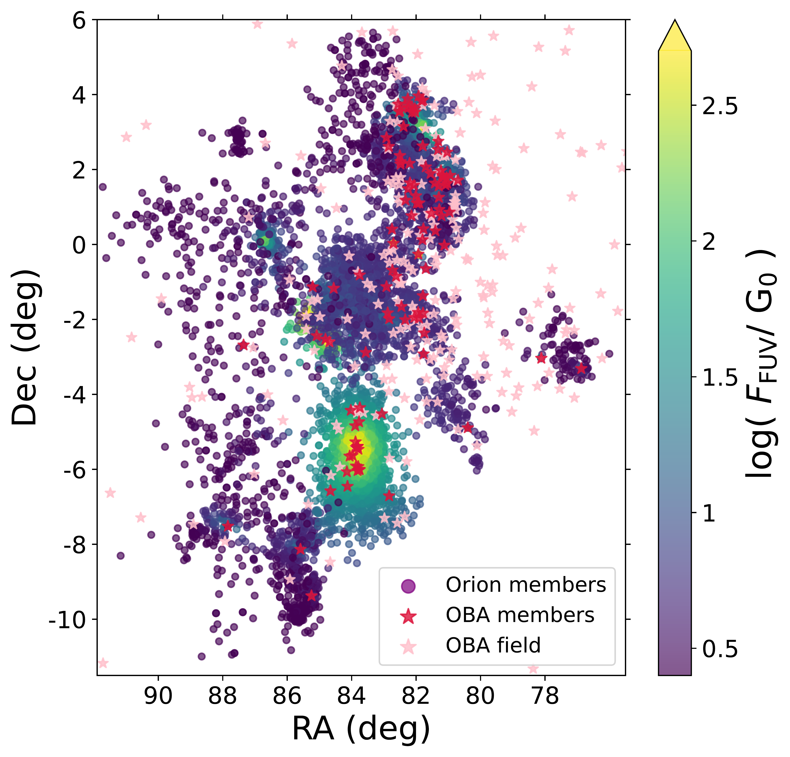
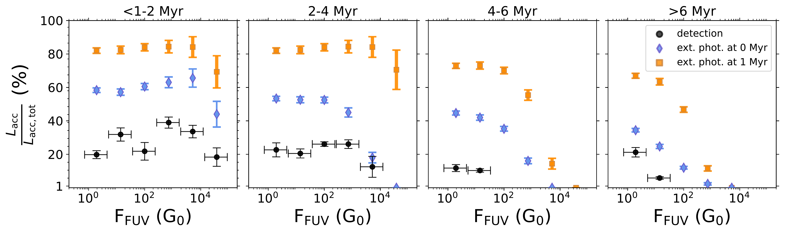

$\newcommand{\ensuremath}{}$
$\newcommand{\xspace}{}$
$\newcommand{\object}[1]{\texttt{#1}}$
$\newcommand{\farcs}{{.}''}$
$\newcommand{\farcm}{{.}'}$
$\newcommand{\arcsec}{''}$
$\newcommand{\arcmin}{'}$
$\newcommand{\ion}[2]{#1#2}$
$\newcommand{\textsc}[1]{\textrm{#1}}$
$\newcommand{\hl}[1]{\textrm{#1}}$
$\newcommand{\footnote}[1]{}$
$\newcommand{\ross}[1]{\textcolor{orange}{ #1}}$

# Far-ultraviolet flux distribution in Orion and its relation to stellar accretion

<mark>Appeared on: 2026-06-30</mark> - 

R. Anania, et al. -- incl., <mark>A. Somigliana</mark>

**Abstract:** _Context._ Orion is the closest region hosting active star formation and young OBA stars. Accurately determining the far-ultraviolet (FUV) flux at its stellar population is essential to connect stellar and protoplanetary disc properties to the environment. \ _Aims._ We (1) accurately estimated the FUV flux and its distribution at a numerous stellar population of Orion by statistically accounting for the uncertainty in parallax measurements, and (2) investigated the relation between stellar accretion and external FUV radiation field by comparing observations and disc evolution models. \ _Methods._ We selected a large stellar population in Orion (within a $6^\circ$ radius of the Orion Nebula Cluster core), assigned sub-cluster memberships, and  used the two-dimensional sub-cluster geometry to infer three-dimensional separations from OBA stars and compute the FUV flux (and its uncertainty) at each stellar position.  We studied the accretion luminosities ( $L_{\mathrm{acc}}$ ) inferred from H $_{\alpha}$ emission in Gaia XP spectra of Orion sources and determined their detection fraction as a function of age and FUV flux. We compared the results with population synthesis models of viscous discs experiencing external photoevaporation. \ _Results._ We provided a publicly available table of FUV fluxes at $\sim 8600$ stars in Orion. Most of this stellar population is weakly FUV-irradiated, $<10^{2}  \mathrm{G}_{0}$ , $\sim35\%$ is intermediately irradiated, $10^{2}-10^{4}  \mathrm{G}_{0}$ , and only $\sim 5\%$ has FUV fluxes $> 10^{4}  \mathrm{G}_{0}$ .  Gaia-based $L_{\mathrm{acc}}$ decreases with age, and H $_{\alpha}$ detection fraction declines more rapidly in regions with strong FUV fluxes ( $\gtrsim 10^{2}  \mathrm{G}_{0}$ ) than in regions exposed to weaker FUV fluxes ( $\lesssim10^{2}  \mathrm{G}_{0}$ ), broadly consistent with the model. This result may suggest that external photoevaporation efficiently depletes strongly FUV-irradiated accretion discs, but it is not sufficient to reliably confirm this conclusion. \ _Conclusions._ The tools we provided for accurately computing FUV fluxes at the Orion stellar population will be essential for targeting sources in future observations aimed at assessing the role of external photoevaporation on protoplanetary disc.  Our study highlights the need for additional measurements of stellar and disc properties across the Orion population, covering the FUV flux range $1-10^{5}  \mathrm{G}_{0}$ .

**Figure 8. -** The markers indicate the median accretion luminosity $L_{\mathrm{acc}}$ in each bin of FUV flux as derived from the Orion objects in [Delfini, et. al (2025)](https://ui.adsabs.harvard.edu/abs/2025arXiv250504699D)(black dots) and predicted by the disc population synthesis model where external photoevaporation acts from the beginning (blue diamonds) and after 1 Myr to mimic the effect of extinction (orange squares). The vertical error bars extend from the 16$^{\mathrm{th}}$ to the 84$^{\mathrm{th}}$ percentile or the distributions, while the horizontal bars indicate the width of the FUV flux bins. The four panels refer to four increasing age bins from left to right: We divided the observed disc sample by average cluster age, the results of the model are taken at 1 Myr, 3 Myr, 5 Myr, and 10 Myr, respectively. Dashed lines indicate the median upper limit $L_{\mathrm{acc}}$ observed in each age bin. (*fig:histo_lacc_fuv*)

**Figure 7. -** _Left panel:_ The main 22 Orion sub-clusters obtained using the OPTICS clustering algorithm (Sec. \ref{sec:sub_clustering}). The sub-clusters are ordered in the colorbar from bottom to top by increasing average age, from $<1$ Myr to $>6$ Myr.  _Right panel:_ Median FUV flux at the position of the Orion members identified in this work. The full table of FUV flux values, including uncertainties on the FUV flux, is available at the CDS (see Appendix \ref{appendix:table_fuv}, Table \ref{appendix:table_table_fuv}). Red and pink points mark the OBA members and field stars, respectively. (*fig:Orion_map_sub_G0*)

**Figure 9. -** Detection fraction of  $L_{\mathrm{acc}}$ per bin FUV flux and increasing age from the left to the right panel. Black dots refer to the observations, while blue diamonds and orange squares are the results of the population synthesis model where external photoevaporation is included from the beginning of the evolution and after 1 Myr (to mimic the effect of extinction), respectively. The vertical error bars are the uncertainties considering a binomial distribution, while the horizontal bars indicate the width of the FUV flux bins. The age of the observed sample refer to the average age of the sub-clusters, while the results from the model are taken at 1 Myr, 3 Myr, 5 Myr, and 10 Myr, respectively from the left to the right panel. (*fig:histo_fraction*)

