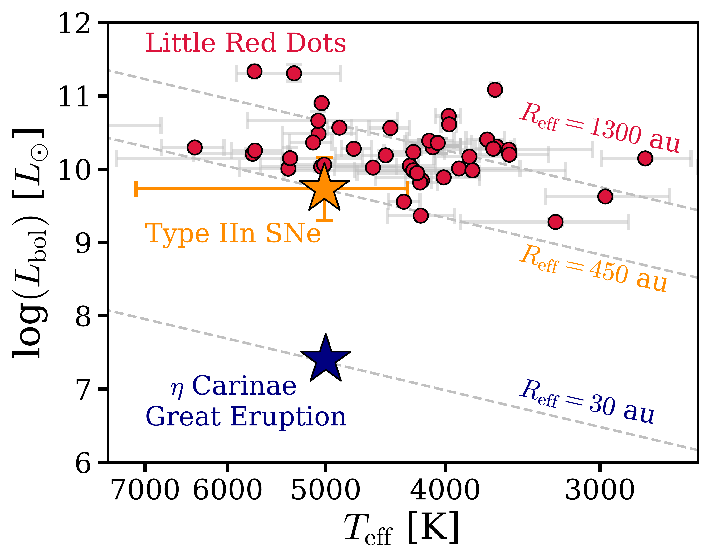
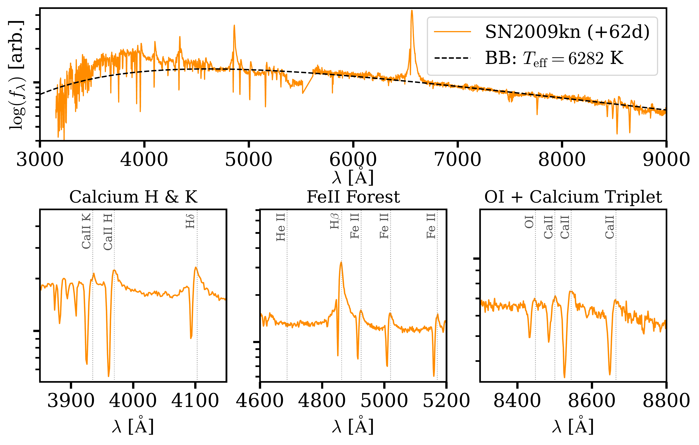
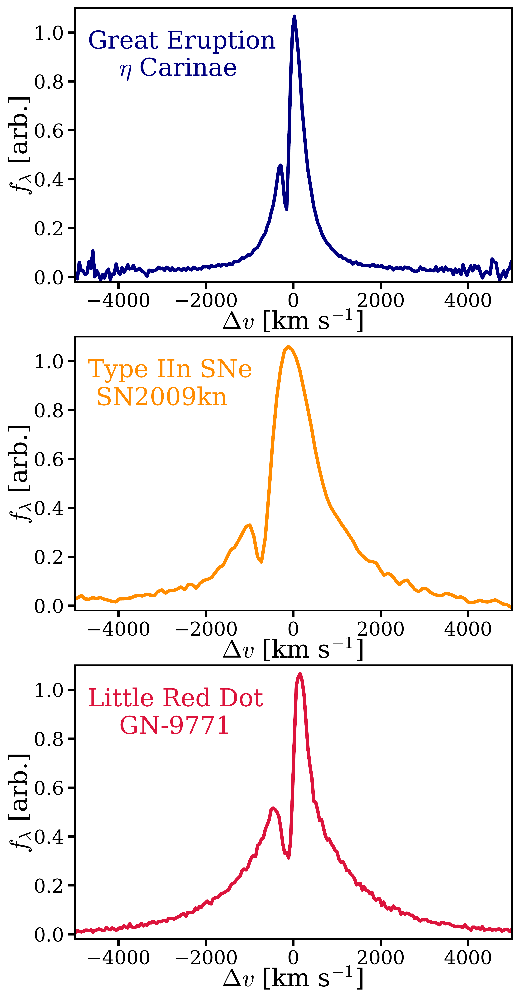

$\newcommand{\ensuremath}{}$
$\newcommand{\xspace}{}$
$\newcommand{\object}[1]{\texttt{#1}}$
$\newcommand{\farcs}{{.}''}$
$\newcommand{\farcm}{{.}'}$
$\newcommand{\arcsec}{''}$
$\newcommand{\arcmin}{'}$
$\newcommand{\ion}[2]{#1#2}$
$\newcommand{\textsc}[1]{\textrm{#1}}$
$\newcommand{\hl}[1]{\textrm{#1}}$
$\newcommand{\footnote}[1]{}$
$\newcommand{\xiion}{\xi_{\rm{ion}}}$
$\newcommand{\halpha}{H\ensuremath{\alpha}}$
$\newcommand{\hbeta}{H\ensuremath{\beta}}$
$\newcommand{\mstar}{\ensuremath{\log(M_{\rm{\star}}/ {\rm M}_{\rm{\odot}})}}$
$\newcommand{\orcidauthor}[3]{\author{\href{http://orcid.org/#1}{#2^{#3}}}}$
$\newcommand{\nion}[2]{#1 \textsc{#2}}$
$\newcommand{\pbF}[1]{\parbox[t]{0.30\linewidth}{\raggedright\rule{0pt}{2.6ex}#1\vspace{1.4mm}}}$
$\newcommand{\pbI}[1]{\parbox[t]{0.65\linewidth}{\raggedright\rule{0pt}{2.6ex}#1\vspace{1.4mm}}}$

# $\vspace{-1cm}$ Little Red Dots as Intermediate Mass, Super-Eddington Engines:\\Insights from Type II$\MakeLowercase{n}$ Supernovae and The 1837-1856 Great Eruption of $\eta$ Carinae $\vspace{-1.75cm}$

<mark>Appeared on: 2026-07-01</mark> -  _Submitted to the Open Journal of Astrophysics. Comments warmly welcomed_

R. P. Naidu, et al. -- incl., <mark>A. d. Graaff</mark>, <mark>R. E. Hviding</mark>

**Abstract:** JWST's Little Red Dots (LRDs) display a unique constellation of features that do not occur simultaneously in any other class of galaxies or AGN. Here we observe that many of these features find parallels in the 19th century Great Eruption (GE) of $\eta$ Carinae and a sub-class of supernovae (Type IIn). Drawing on these stellar phenomena -- outflows trapped by dense circumstellar gas envelopes -- we sketch a possible scenario for LRDs. Outflows from the central engine produce an enshrouding envelope of gas that may be thought of as a slow wind. This dense wind and its enormous extent produce an opacity so high that a pseudo-photosphere forms within the wind, obscuring the central engine and manifesting as a blackbody-like continuum. Radiation from the buried engine powers the system. The engine may also launch fast winds that crash into the existing envelope to generate shocks. Lines form within the wind above the photosphere -- electron scattering and absorption in the clumpy (ionized + neutral) medium account for broad wings and P-Cygni cores. A key implication is that inferences of "overmassive black holes" may be interpreting this wind-like physics as a virial broad-line region. We propose an escape velocity argument to constrain the mass of the engine, which yields $M<10^{5} M_\odot$ for the typical LRD. The lack of variability and low surface gravity of the photosphere provide further support for intermediate mass ( $M\approx10^{3-6} M_\odot$ ), but very luminous super-Eddington ( $L_{\rm{bol}}/L_{\rm{edd}}\gtrsim5$ ) systems, harboring a supermassive star or intermediate mass black hole. Paralleling the evolution of IIn SNe, dust production in the envelope may mark the beginnings of classical AGN. This paper explores a possible self-consistent explanation for the entire life-cycle of LRDs, from their enshrouding in dense gas to their fates as seeds of massive black holes.

**Figure 4. -** **LRDs, Type IIn SNe, and the GE span 4 dex in bolometric luminosity ($L_{\rm{bol**}$) but cluster in effective temperature ($T_{\rm{eff}}$)}. The GE (blue star) displays a blackbody-like continuum of $T_{\rm{eff}}\approx5000-6000$ K \citep[][]{Rest12, Smith18} similar to the $\approx500$ Type IIn SNe (dark orange) compiled in \citet[][]{Hiramatsu24} and LRDs (red dots) from \citet[][]{degraaff25pop}. The \citet[][]{Hiramatsu24} IIn SNe compilation is represented at peak luminosity by adopting a flat bolometric correction of $L_{\rm{bol}}/L_{\rm{opt}}=1.9$. The dashed gray lines depict $L_{\rm{bol}}=4\pi R_{\rm{eff}}^{2} \sigma_{\rm{SB}} T_{\rm{eff}}^{4}$ at fixed $R_{\rm{eff}}$. The clustering in $T_{\rm{eff}}$ occurs at the temperatures where hydrogen recombination produces a steep opacity gradient, self-regulating the pseudo-photospheres (or "recombination photospheres") of these objects \citep[e.g.,][]{Davidson87, Dessart11, Owocki16, Liu25BB, Kido25}.
     (*fig:hrd*)

**Figure 6. -** **LRD-like pseudo-photospheric features highlighted in SN2009kn (orange; $R\approx8800 (5500)$ at $\gtrsim5500$Å ($\lesssim5500$Å);  (Kankare12**).) **Top:** The overall continuum shape at $\gtrsim4500$Å is well-described by a single-temperature blackbody akin to LRDs \citep[e.g.,][]{degraaff25pop, Sun26}. LRDs have sharper Balmer breaks than observed in SNe, but it is interesting to note that a Balmer break and a rollover in the continuum is apparent. **Bottom:** Quintessential "stellar" absorption features observed in LRDs such as Ca H \& K absorption (left; e.g.,  (deugenio25irony) ) and the Calcium triplet (right; e.g.,  (Lin25) ) are highlighted in these panels. The $\ion${Fe}{2} forest (center; e.g.,  (Torralba25IFU) ) and $\ion${O}{1}(right; e.g.,  (Tripodi25) ) are relatively uncommon among galaxies/AGN but are ubiquitous among Type IIn SNe and LRDs. Note that the P-Cygni absorption is more apparent than in typical LRDs -- there is no host galaxy infilling, and the velocity offset of absorption from line-center is larger (see e.g., Fig. \ref{fig:lineprofiles} in H$\alpha$).
     (*fig:fullspec*)

**Figure 1. -** **The remarkable similarity in H$\alpha$ line profiles of the GE, Type IIn SNe, and LRDs**. **Top:** In the CSM interaction phase of the GE, the line is characterized by electron scattered wings and blue-shifted Balmer absorption. Profile reconstructed from parameters reported in Smith18, matched in resolution and noise properties to the JWST/NIRSpec LRD spectrum in the bottom panel. **Center:** Type IIn SNe (example from  (Kankare12) ; X-SHOOTER spectrum with $R\approx8800$) show very similar line profiles for large periods in their evolution -- narrow lines relative to typical Type II SNe (hence the "n" in Type IIn), Balmer absorption, and electron scattering wings. Indeed, the GE has been modeled as a "scaled down" version of such SNe \citep[][]{Smith13}. **Bottom:** LRDs show similar line profiles (represented here by GN-9771;  (Torralba25IFU) ), which in this work we interpret by drawing on the relatively well-understood physics of enshrouded eruptions.
     (*fig:lineprofiles*)

