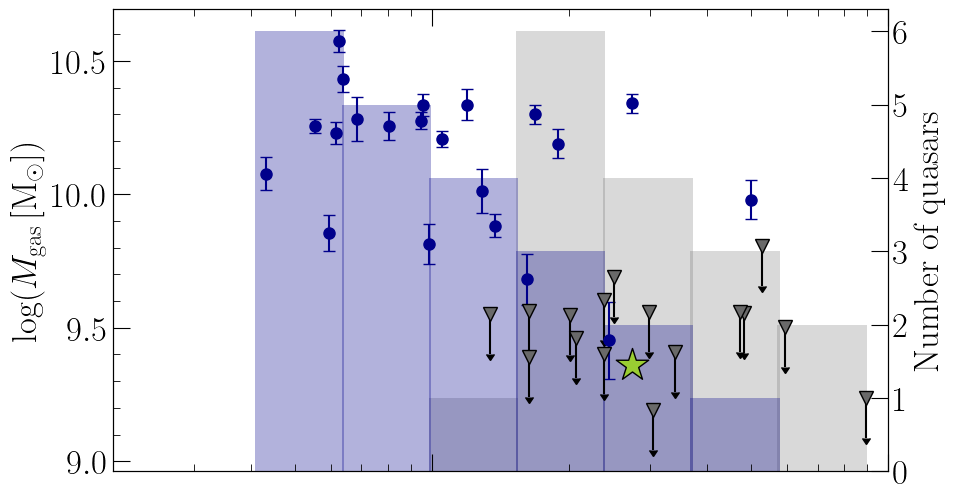
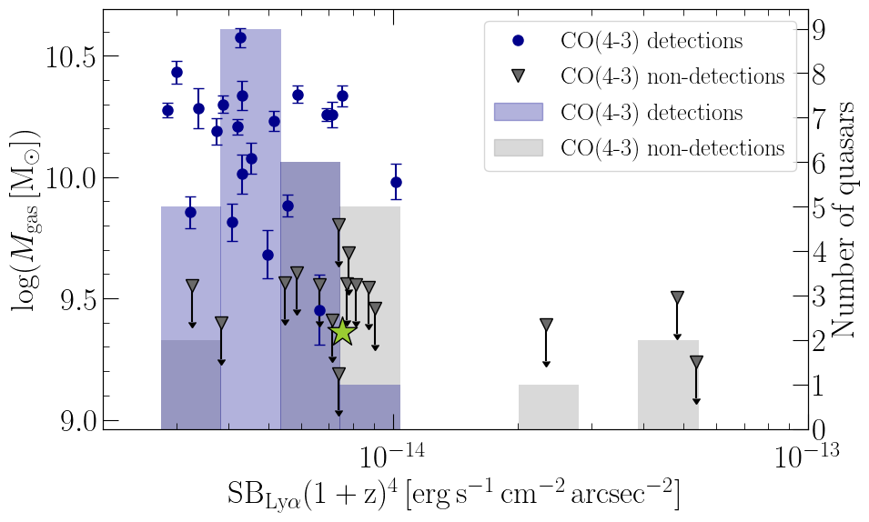
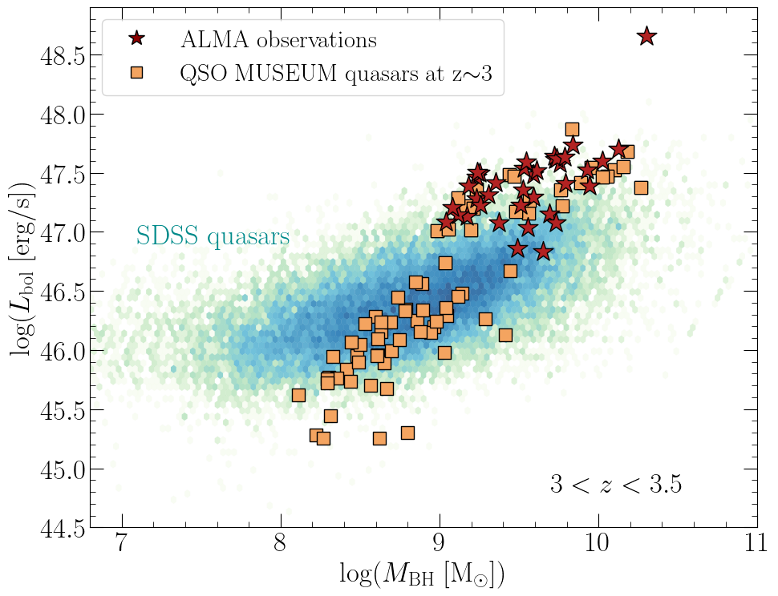
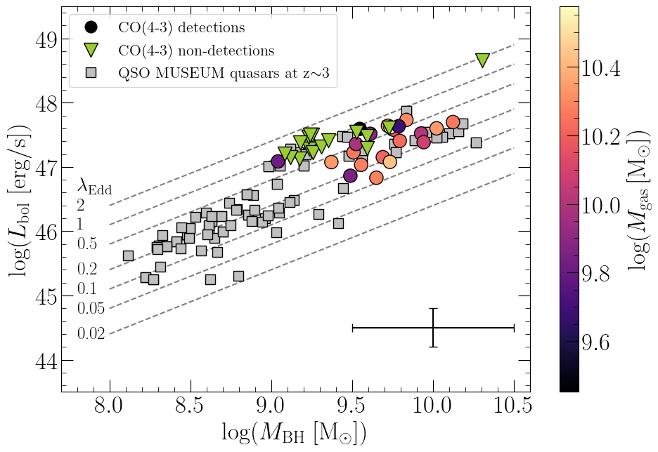

$\newcommand{\ensuremath}{}$
$\newcommand{\xspace}{}$
$\newcommand{\object}[1]{\texttt{#1}}$
$\newcommand{\farcs}{{.}''}$
$\newcommand{\farcm}{{.}'}$
$\newcommand{\arcsec}{''}$
$\newcommand{\arcmin}{'}$
$\newcommand{\ion}[2]{#1#2}$
$\newcommand{\textsc}[1]{\textrm{#1}}$
$\newcommand{\hl}[1]{\textrm{#1}}$
$\newcommand{\footnote}[1]{}$
$\newcommand{\asym}[3]{\ensuremath{#1^{+#2}_{-#3}}}$
$\newcommand{\arraystretch}{1.1}$
$\newcommand{\arraystretch}{1.1}$
$\newcommand{\arraystretch}{1.1}$
$\newcommand{\arraystretch}{1.1}$
$\newcommand{\arraystretch}{1.3}$
$\newcommand{\arraystretch}{1.0}$

# ALMA visits the QSO MUSEUM: connecting molecular gas and the cool circumgalactic medium around 37 $z\sim 3$ quasars

<mark>Appeared on: 2026-07-01</mark> -  _27 pages, 15 figures, submitted to A&A, revised after first referee report_

J. Ritter, et al. -- incl., <mark>J. G. Lobos</mark>

**Abstract:** Extended Ly $\alpha$ emission is ubiquitously observed around quasars. This emission traces the cool gas within the circumgalactic medium and provides key insights into the complex interplay between halo gas dynamics and active galactic nuclei (AGN) feedback. However, the connection to the cold molecular gas of the host galaxies remains largely unexplored. We aim to characterize the molecular gas reservoirs in quasars at cosmic noon and investigate how they are linked to extended Ly $\alpha$ emission. We present ALMA observations of the CO(4-3) transition in 37 quasars at $z\sim3$ from the QSO MUSEUM survey, which have been previously mapped in Ly $\alpha$ with VLT/MUSE. We derive molecular gas masses and gas fractions, explore correlations with Ly $\alpha$ nebula and quasar properties and search for CO-emitting companions in the fields. Of 37 quasars, 21 are detected in CO(4-3), with gas masses $M_\mathrm{gas}\approx(3-40) \times10^9 \mathrm{M_\odot}$ . Quasars with the most massive molecular gas reservoirs are associated with the centrally dimmest Ly $\alpha$ nebulae, while those hosting the centrally brightest Ly $\alpha$ nebulae are generally not detected in CO. This suggests that gas and dust in the hosts regulate Ly $\alpha$ escape and consequently affect the emission from halo gas. We find evidence that quasars with lower Eddington ratios harbor more massive gas reservoirs, whereas strongly accreting quasars ( $\lambda_\mathrm{Edd} \gtrapprox 0.9$ ) likely deplete their gas, e.g. through powerful quasar-driven outflows. Despite their higher molecular gas masses within the sample, the low-Eddington quasars with CO detections exhibit low gas fractions with a median of $M_\mathrm{gas}/M_* \sim 0.10$ , below those typically found for inactive star-forming galaxies. Six quasars are marginally resolved in CO, with effective radii that can be as large as $\sim 8 \mathrm{kpc}$ . In addition, we detect 14 companion galaxies at high fidelity, indicating an overall overdense environment in the quasar fields with a derived quasar-galaxy cross-correlation length of $9.81^{+2.22}_{-2.05} h^{-1}\mathrm{cMpc}$ .

**Figure 7. -** _Upper panel:_ Molecular gas mass as a function of central Ly$\alpha$ surface brightness (within about 12 kpc) for the CO detections in blue circles and CO non-detections in grey triangles. We additionally show histograms of the detections and non-detections, shaded in blue and grey, respectively.
The green star indicates the molecular gas mass inferred from stacking of the non-detections at the median Ly$\alpha$ SB of the non-detections.  _Lower panel_: Same as the upper panel, but plotted as a function of the surface brightness averaged over the full extent of each nebula.  (*fig:MH2vsLya*)

**Figure 1. -** Bolometric luminosity as a function of black hole mass for the QSO MUSEUM quasars. The red stars indicate the ALMA follow-up observations. The SDSS quasars in the same redshift range of $3 < z < 3.5$ are plotted in blue as 2D number density bins  ([Rakshit, Stalin and Kotilainen 2020](https://ui.adsabs.harvard.edu/abs/2020ApJS..249...17R)) .  (*fig:LbolvsMBH*)

**Figure 5. -** Bolometric luminosity as a function of black hole mass of the QSO MUSEUM quasars in grey squares. The CO non-detections are plotted in green triangles and the CO detections in circles, color-coded by their molecular mass. Different values of constant Eddington ratios ($\lambda_{\mathrm{Edd}}$) are shown with dashed lines. The intrinsic uncertainties on $M_{\mathrm{BH}}$ and $L_{\mathrm{bol}}$ are indicated by the black error bars in the lower right corner.  (*fig:LbolvsMBH_MH2*)

