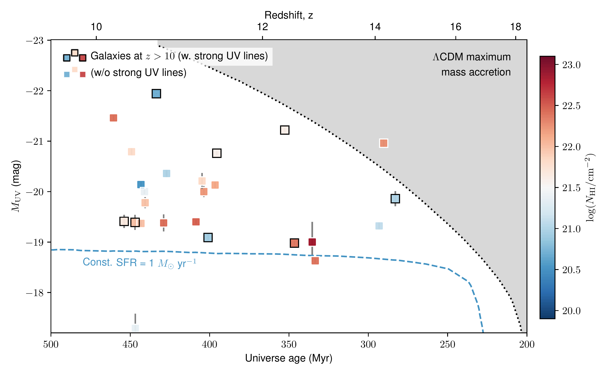
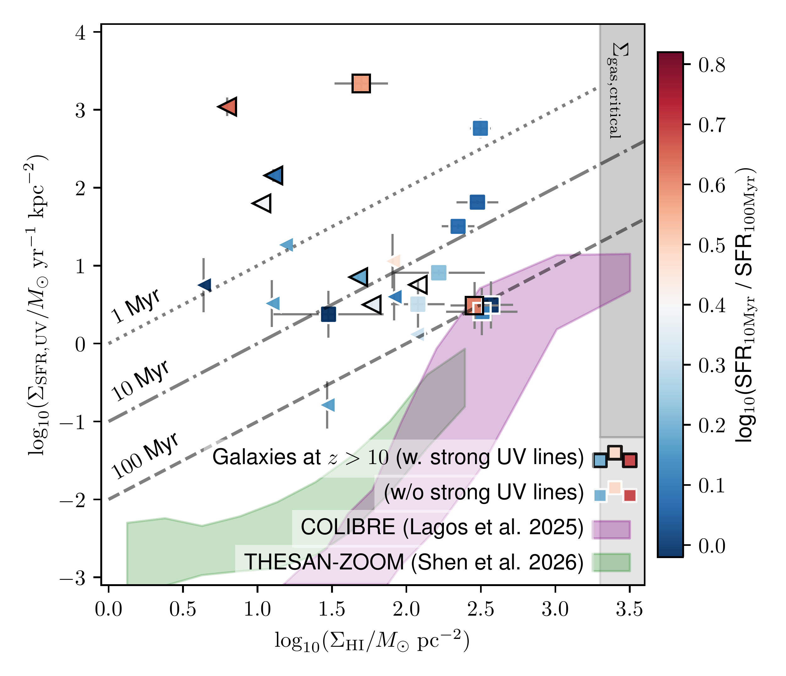
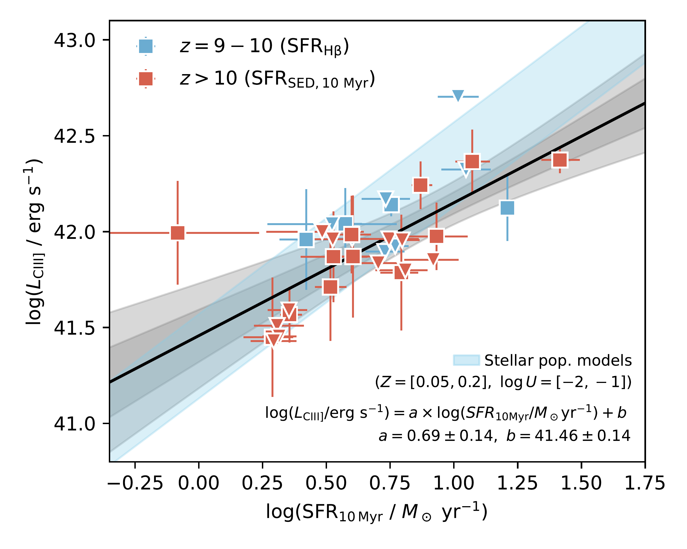

$\newcommand{\ensuremath}{}$
$\newcommand{\xspace}{}$
$\newcommand{\object}[1]{\texttt{#1}}$
$\newcommand{\farcs}{{.}''}$
$\newcommand{\farcm}{{.}'}$
$\newcommand{\arcsec}{''}$
$\newcommand{\arcmin}{'}$
$\newcommand{\ion}[2]{#1#2}$
$\newcommand{\textsc}[1]{\textrm{#1}}$
$\newcommand{\hl}[1]{\textrm{#1}}$
$\newcommand{\footnote}[1]{}$
$\newcommand{\znii}{\ion{Zn}{ii}}$
$\newcommand{\feii}{\ion{Fe}{ii}}$
$\newcommand{\siii}{\ion{Si}{ii}}$
$\newcommand{\sii}{\ion{S}{ii}}$
$\newcommand{\ciii}{\ion{C}{iii}}$
$\newcommand{\hi}{\ion{H}{i}}$
$\newcommand{\hii}{\ion{H}{ii}}$
$\newcommand{\ci}{\ion{C}{i}}$
$\newcommand{\oi}{\ion{O}{i}}$
$\newcommand{\cii}{\ion{C}{ii}}$
$\newcommand{\lya}{Ly\alpha\xspace}$
$\newcommand{\oiii}{O {\sc iii}}$
$\newcommand{\oii}{\ion{O}{ii}}$
$\newcommand{\neiii}{\ion{Ne}{iii}}$
$\newcommand{\hei}{\ion{He}{i}}$
$\newcommand{\nii}{\ion{N}{ii}}$
$\newcommand{\dlya}{D_{\rm Ly\alpha}\xspace}$
$\newcommand{\logoh}{12+\log{\rm (O/H)}\xspace}$
$\newcommand{\jwst}{\emph{JWST}\xspace}$
$\newcommand{\src}{CAPERS-UDS-32520\xspace}$
$\newcommand{\arraystretch}{1.2}$
$\newcommand{\arraystretch}{1.2}$

# JWST spectroscopy of galaxies at $z>10$: Damped Ly$\alpha$ absorbers reveal efficient star formation and hidden redshift biases

<mark>Appeared on: 2026-07-01</mark> -  _Submitted, comments welcome_

K. E. Heintz, et al. -- incl., <mark>F. Walter</mark>

**Abstract:** Recent observations with $\jwst$ have revealed a remarkable population of surprisingly luminous galaxies within the first 500 Myr of cosmic time at redshifts $z>10$ .    Their abundance exceed predictions from simulations and empirical extrapolations from lower redshifts, suggesting a transition in the physical conditions under which the first stars formed. Here we investigate the physical conditions of a select sample of 25 galaxies with robust redshift measurements at $z_{\rm spec}\geq 10$ observed with $\jwst$ /NIRSpec Prism. We characterize their star-formation efficiency, `burstiness', and presence of strong rest-frame UV nebular lines in relation to the density of the local neutral atomic hydrogen ( $\hi$ ) gas reservoirs they are embedded in. We find that the prominence of strong rest-UV lines are correlated with the burstiness of the galaxies, defined as ${\rm SFR_{10 Myr} / SFR_{100 Myr}}$ . In contrast, there are no strong connections between the $\hi$ gas column density derived from the damped $\lya$ absorption (DLA) and the $M_{\rm UV}$ brightness, ${\rm SFR_{10 Myr} / SFR_{100 Myr}}$ , and prominence of rest-UV lines. We find evidence for the most bursty galaxies showing a large variation in star-formation efficiencies and $\hi$ gas surface densities, though typically with very short depletion timescales, $t_{\rm dep} \lesssim 20$ Myr. This necessites rapid gas depletion times and external replenishment from infalling, pristine gas, powering starburst episodes on equally short timescales. We further quantify the impact of strong DLAs in galaxy spectra on photometric and $\lya$ -break redshift-inferences, finding average redshift biases of $\langle z \rangle =0.39$ and $0.14$ , respectively, when not incorporating DLAs on the emergent spectra. We show the effect of this bias on new measurements of the cosmic UV luminosity density, $\rho_{\rm UV}$ , derived here at $z>10$ , finding that this has a marginal impact on the UV luminosity function.    In conclusion, we provide observational evidence for highly efficient star formation occurring in dense gas with rapid depletion timescales for galaxies at $z>10$ , and highlight the perils of not accounting for strong Ly $\alpha$ absorption in photometric or Lyman-break redshift determinations.

**Figure 8. -** Absolute UV magnitude, $M_{\rm UV}$, as a function of cosmic time for the full $z>10$ galaxy sample. Each galaxy is color-coded according to their derived $\hi$ gas column density, $N_{\rm HI}$. The sources with strong rest-frame UV lines detected in their spectra are highlighted with black edge-colors. For non-constrained DLA fits, the total $\hi$ column density assuming an ISM origin is denoted by the color (typically those with $\lesssim 10^{21.5} {\rm cm}^{-2}$). For reference are shown tracks of constant star formation at $1 M_\odot{\rm yr}^{-1}$(blue) and the average maximum possible accretion scenario allowed in standard $\Lambda$CDM cosmology $\ci$tep[gray region; see][]{Dekel13}, both adapted from $\ci$tet{Kokorev24}. (*fig:muvz*)

**Figure 3. -** UV-derived star-formation rate surface density, $\Sigma_{\rm SFR,UV}$, as a function of the $\hi$ gas mass density, $\Sigma_{\rm HI}$. The symbol notation follows Fig. \ref{fig:muvz}, but here the galaxies are color-coded according to their `burstiness' parameter, ${\rm SFR_{10 Myr}} / {\rm SFR_{100 Myr}}$. For each galaxy, $\Sigma_{\rm HI}$ is a direct unit-conversion from $N_{\rm HI}$ where the well-converged cases are shown by the squares and the total $\hi$ gas upper bounds are shown as the leftward facing triangles for the unconstrained sources. The diagonal lines represent a range of equivalent gas depletion timescales. For comparison, model predictions from the {\tt COLIBRE}$\ci$tep{Lagos25} and {\tt THESAN-ZOOM}$\ci$tep{Kannan25,Shen26} simulations are shown as the purple and green shaded regions. The critical gas surface density, $\Sigma_{\rm gas,critical}\sim 2000 M_\odot{\rm pc}^{-2}$, where stellar feedback becomes ineffective at $z\sim 10$ is marked as well $\ci$tep{Somerville25}. (*fig:ksplot*)

**Figure 6. -** The high-redshift $L_{\rm CIII]}-{\rm SFR_{10 Myr}}$ calibration. The data include measurements of ${\rm SFR_{10 Myr}}$ from H$\beta$(blue) from the sample of galaxies at $z=9-10$ in $\ci$tet{Pollock25} and the compiled sample of galaxies presented here with ${\rm SFR_{10 Myr}}$ from the SED model. The best-fit log-linear relation is shown by the black lines and listed in the bottom right, and the associated $1\sigma$ and $2\sigma$ confidence intervals on the relation are shown by the dark- and light-grey shaded regions, respectively. Predictions for $L_{\rm CIII]}$ are shown for synthetic spectra created with {\tt Bagpipes} for stellar populations models with $Z=[0.05,0.2]$, $\log U = [-2,-1]$, $M_\star = 10^{8} M_\odot$, and $A_V = 0.1$ (*fig:ciiisfr*)

