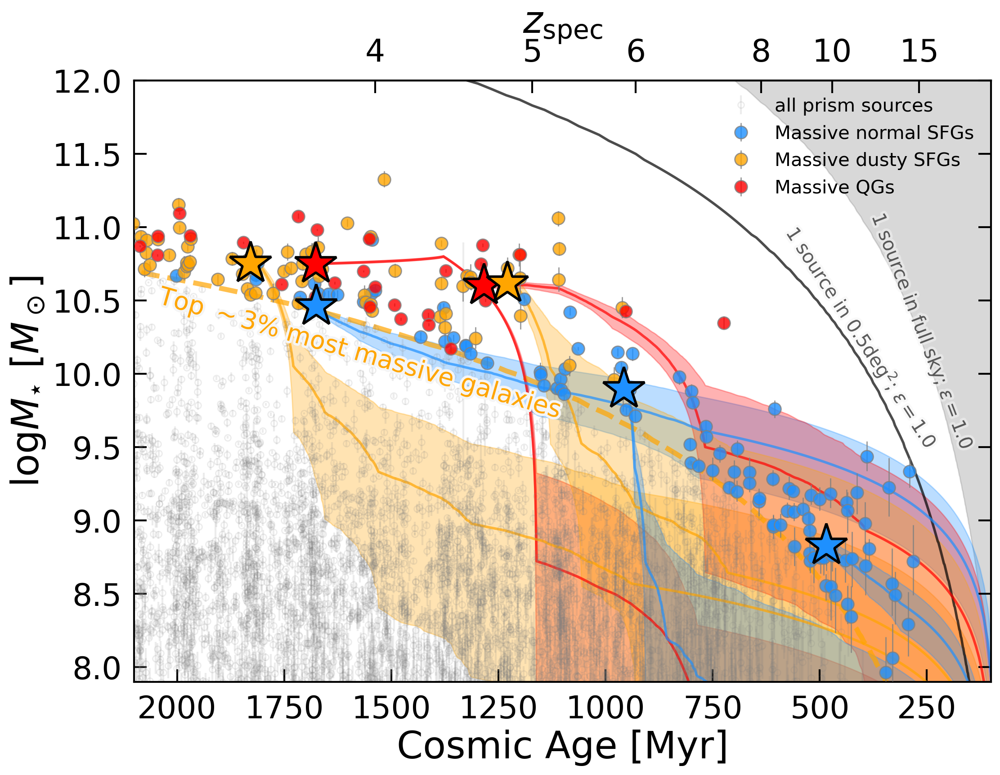
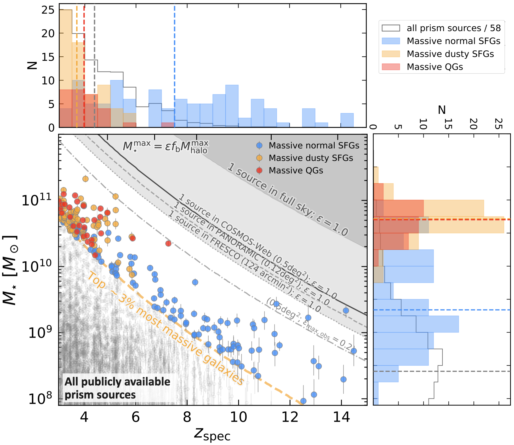
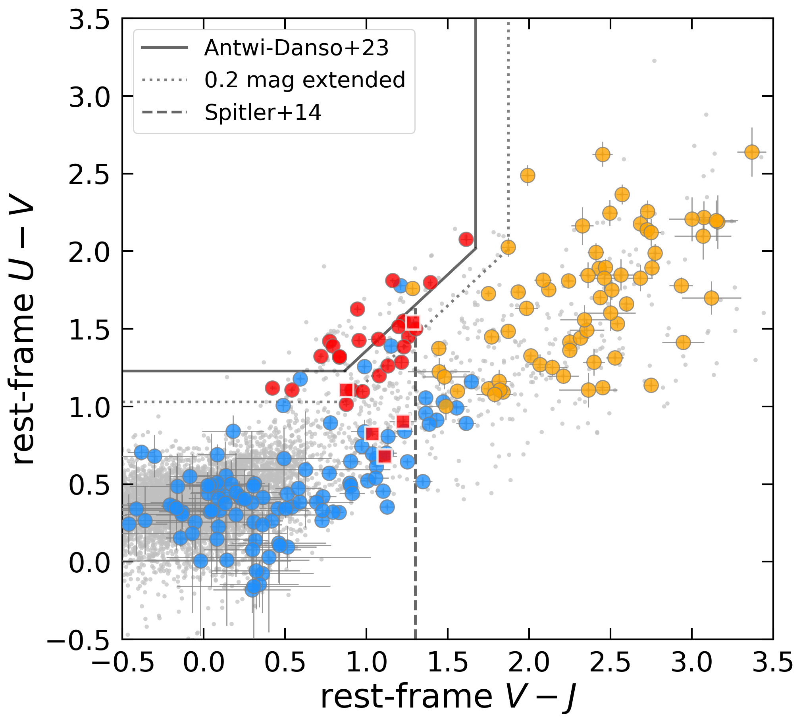
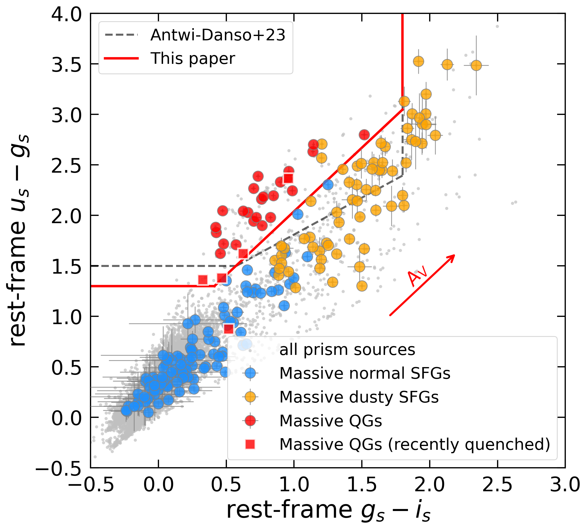

$\newcommand{\ensuremath}{}$
$\newcommand{\xspace}{}$
$\newcommand{\object}[1]{\texttt{#1}}$
$\newcommand{\farcs}{{.}''}$
$\newcommand{\farcm}{{.}'}$
$\newcommand{\arcsec}{''}$
$\newcommand{\arcmin}{'}$
$\newcommand{\ion}[2]{#1#2}$
$\newcommand{\textsc}[1]{\textrm{#1}}$
$\newcommand{\hl}[1]{\textrm{#1}}$
$\newcommand{\footnote}[1]{}$
$\newcommand{\JWST}{JWST}$
$\newcommand{\HST}{\textit{HST}}$
$\newcommand{\red}[1]{{\color{red}#1}}$
$\newcommand{\blue}[1]{{\color{blue}#1}}$
$\newcommand{\purple}[1]{{\color{purple}#1}}$
$\newcommand{\hi}{H \textsc{i}}$
$\newcommand{\hii}{H \textsc{ii}}$
$\newcommand{\nii}{[N \textsc{ii}]}$
$\newcommand{\cii}{[C \textsc{ii}]}$
$\newcommand{\oiii}{[O \textsc{iii}]}$
$\newcommand{\ha}{H\alpha}$
$\newcommand{\hb}{H\beta}$
$\newcommand{\sii}{S \textsc{ii}}$
$\newcommand{\oi}{[O \textsc{iii}]}$
$\newcommand{\Lcii}{L_{[{\rm C} \textsc{ii}]}}$
$\newcommand{\SFRcii}{{\rm SFR}_{[{\rm C} \textsc{ii}]}}$
$\newcommand{\Loiii}{L_{[{\rm O} \textsc{iii}]}}$
$\newcommand{\um}{\textmu m}$
$\newcommand{\Msun}{{\rm M}_\odot}$
$\newcommand{\fluxunit}{erg s^{-1} cm^{-2}}$
$\newcommand{\arraystretch}{1.2}$
$\newcommand{\arraystretch}{1.2}$
$\newcommand{\arraystretch}{1.15}$
$\newcommand{\arraystretch}{1.2}$
$\newcommand{\arraystretch}{1.2}$

# A Census of the 200 Most Massive Galaxies Spectroscopically Observed with JWST at $z_{\rm spec} \sim 3-15$

<mark>Appeared on: 2026-07-01</mark> -  _20 pages (15 main text, 5 appendix), 13 figures, 4 tables, submitted to A&A. Catalog will be released later on. Comments are welcome_

M. Xiao, et al. -- incl., <mark>A. d. Graaff</mark>

**Abstract:** Massive galaxies provide strong tests of galaxy formation models, yet a comprehensive spectroscopic view of their properties and demographics in the early Universe has remained elusive. Here we present a JWST spectroscopic census of the 200 most massive galaxies at $z_{\rm spec}\sim3-15$ , selected using an evolving stellar-mass threshold motivated by the halo mass function and anchored at $\log(M_{\star}/M_\odot)>10$ at $z\sim5$ . These galaxies represent the top 3 \% most massive systems among all publicly available NIRSpec/prism observations in the DAWN JWST Archive. While not volume-complete, the sample provides the first statistical spectroscopic view of massive galaxies across the first two billion years of cosmic history. We derive their physical properties through joint spectral energy distribution (SED) fitting of spectroscopy and photometry, and construct a clean massive galaxy sample after removing little red dots and broad-line AGN contaminants. The inferred stellar masses, and hence the massive-galaxy selection, remain broadly robust under alternative SED-modeling assumptions, including the addition of MIRI photometry. We find that the massive galaxy population evolves strongly with redshift: normal star-forming galaxies (SFGs; dust attenuation of $A_V<1$ mag) dominate at $z\gtrsim6$ , while dusty SFGs ( $A_V>1$ mag) and quiescent galaxies (QGs) become more common toward lower redshift. Dust attenuation decreases systematically toward higher redshift, consistent with lower levels of dust and metal enrichment in the earliest massive galaxies. We identify 29 massive QGs, including a population of recently quenched systems whose star formation declined rapidly within the past $\sim100$ Myr. We further show that both the traditional UVJ and recently proposed $(ugi)_s$ selections suffer substantial inconsistency with the most massive galaxies at $z>3$ , motivating a revised $(ugi)_s$ criterion calibrated using our spectroscopic sample.  Finally, we stack the spectra of different massive galaxy populations and cosmic age bins. The inferred formation histories suggest at least two pathways toward quiescence: a dust-enriched pathway linking normal SFGs, dusty SFGs, and QGs, and a more direct pathway connecting normal SFGs and QGs. Massive normal SFGs themselves appear to grow through both relatively gradual and rapid assembly modes. Together, these results suggest that rapid stellar-mass assembly, dust enrichment, and quenching were already shaping the evolutionary pathways of the most massive galaxies within the first billion years after the Big Bang.

**Figure 8. -** **Stellar mass assembly histories of massive galaxies as a function of cosmic age.**
The symbols and lines are the same as in Figure \ref{fig2}. The stars indicate the median stellar masses of the stacked massive galaxy populations. The stacked populations are divided into three redshift intervals, $z=3-4.3$, $4.3-7.9$, and $7.9-15$, corresponding to approximately 750 Myr cosmic-age bins. The colored solid curves and shaded regions show the stellar mass assembly histories (median and 16th-84th percentile range) derived from \texttt{Bagpipes} SED fitting of the stacked spectra.
 (*fig:massassembly*)

**Figure 2. -** **Stellar mass vs. $z_{\rm spec**$}.
The 200 most massive galaxies are classified as QGs (red), dusty SFGs (orange), and normal SFGs (blue), following the criteria described in Sect. \ref{Sect:clean massive}. They represent the top $\sim$3\% most massive galaxies among all 6,312 galaxies (grey open points) at $z_{\rm spec}>3$ with JWST/NIRSpec prism observations in the legacy fields.
The orange dashed curve shows the evolving stellar-mass threshold used to select massive galaxy candidates (Sect. \ref{Sect:selection}), motivated by the redshift evolution of the halo mass function and normalized to $\log(M_\star/M_\odot)=10$ at $z=5$.
The dotted, dashed, and solid curves, together with the grey shaded region, indicate the maximum stellar masses corresponding to 100\% baryon-to-star conversion efficiency in the FRESCO, PANORAMIC, COSMOS-Web, and full-sky volumes per $\Delta z=1$, respectively. The dash-dotted line shows the corresponding limit for a 20\% baryon-to-star conversion efficiency in the COSMOS-Web field. The top and right panels show the redshift and stellar-mass distributions of the different populations, respectively, with dashed lines indicating their median values.
We caution that, at $z\gtrsim10$, stellar-mass estimates become increasingly uncertain, as most sources lack photometric coverage redward of F444W\protect$\footnote$mark(tests see Appendix \ref{appendix1}, \ref{appendix2}). (*fig2*)

**Figure 5. -** **Comparison between rest-frame _UVJ** (\textit{left_) and (_ugi_)$_{\rm s}$ (_right_) selections and our spectroscopically classified massive galaxies. }
Grey points show all prism galaxies at $z_{\rm spec}>3$, while the 200 most massive galaxies are overplotted and color-coded as massive QGs (red), dusty SFGs (orange), and normal SFGs (blue).
In the _left_ panel, the black lines indicate the classical _UVJ_ quiescent selection \citep{Antwi-Danso2023}, with the dotted extension showing a relaxed boundary allowing an additional 0.2 mag padding. The dashed line is used to separate the normal SFGs and dusty SFGs \citep{Spitler2014}.
In the _right_ panel, the black dashed line shows the (_ugi_)$_{\rm s}$ quiescent criterion proposed by \cite{Antwi-Danso2023}, while the red line indicates the empirical boundary introduced in this work (Eq. \ref{ugi}), optimized to separate better spectroscopically identified massive QGs from dusty SFGs and normal SFGs. The red arrow indicates the reddening vector.
 (*uvj_ugis*)

