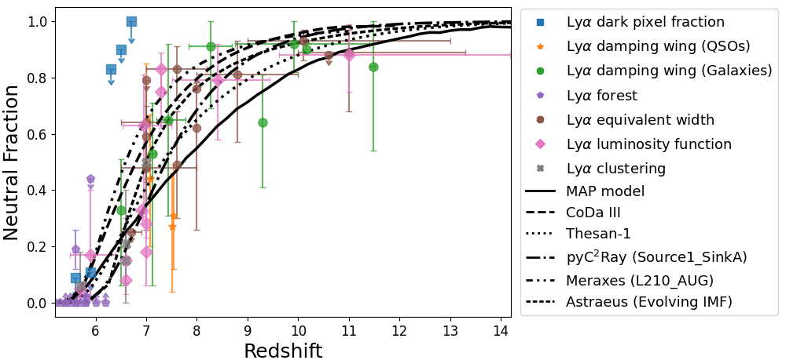
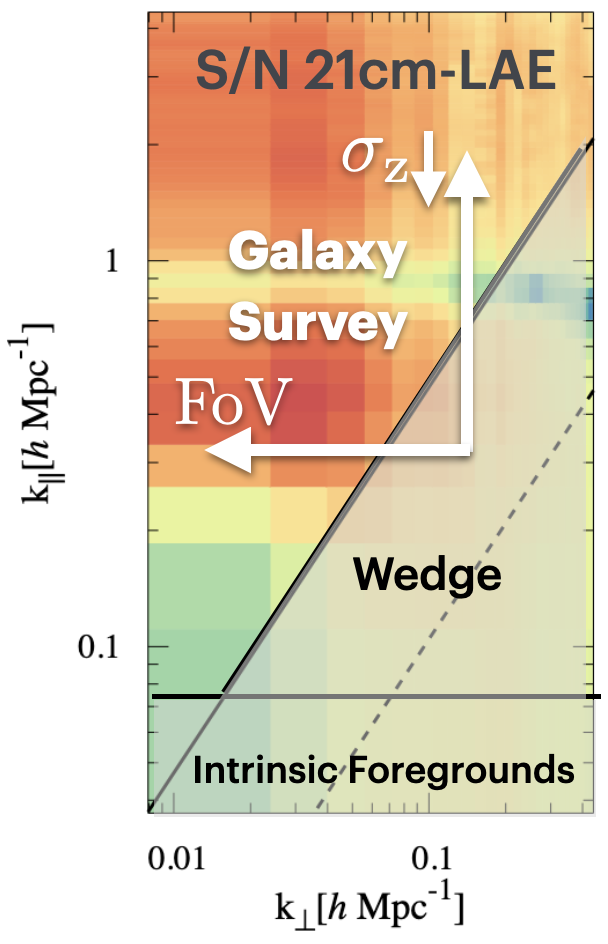
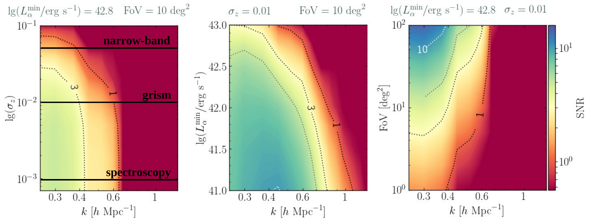
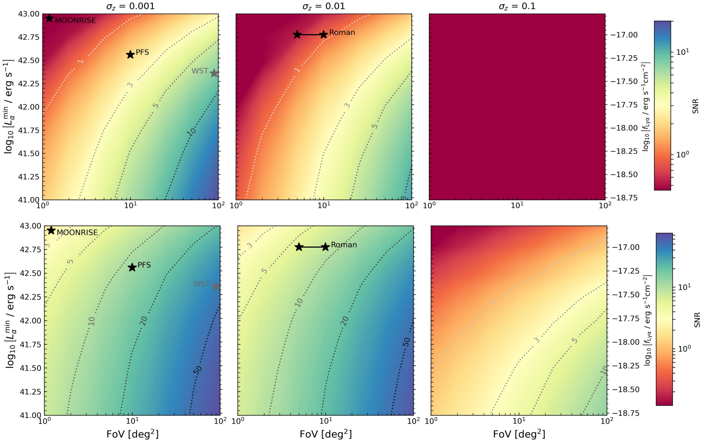

$\newcommand{\ensuremath}{}$
$\newcommand{\xspace}{}$
$\newcommand{\object}[1]{\texttt{#1}}$
$\newcommand{\farcs}{{.}''}$
$\newcommand{\farcm}{{.}'}$
$\newcommand{\arcsec}{''}$
$\newcommand{\arcmin}{'}$
$\newcommand{\ion}[2]{#1#2}$
$\newcommand{\textsc}[1]{\textrm{#1}}$
$\newcommand{\hl}[1]{\textrm{#1}}$
$\newcommand{\footnote}[1]{}$
$\newcommand{\ag}[1]{{\color{violet}[AG: #1]}}$
$\newcommand{\pd}[1]{{\color{blue}[PD: #1]}}$
$\newcommand{\ch}[1]{{\color{cyan}[CH: #1]}}$
$\newcommand{\aap}{Astronomy \& Astrophysics}$
$\newcommand{\aj}{The Astronomical Journal}$
$\newcommand{\apj}{The Astrophysical Journal}$
$\newcommand{\apjl}{The Astrophysical Journal Letters}$
$\newcommand{\apjs}{The Astrophysical Journal Supplement Series}$
$\newcommand{\araa}{Annual Review of Astronomy and Astrophysics}$
$\newcommand{\baas}{Bulletin of The AAS}$
$\newcommand{\jcap}{Journal of Cosmology and Astroparticle Physics}$
$\newcommand{\mnras}{Monthly Notices of the Royal Astronomical Society}$
$\newcommand{\nar}{New Astronomy Reviews}$
$\newcommand{\nat}{Nature}$
$\newcommand{\pasj}{Publications of the Astronomical Society of Japan}$
$\newcommand{\prd}{Physical Review D}$
$\newcommand{\physrep}{Physics Reports}$
$\newcommand{\pasp}{PASP}$

# Synergies for the Epoch of Reionization and Cosmic Dawn

<mark>Appeared on: 2026-07-01</mark> -  _Published in Advancing Astrophysics with the SKA II (AASKAII), 2026 (arXiv:2606.20366) Report-no:AASKAII/Chakraborty01_

A. Chakraborty, et al. -- incl., <mark>B. Maity</mark>

**Abstract:** Synergies with other instruments will be $_ essential_$ in making, verifying, and interpreting a detection of the cosmic 21-cm signal from the Epoch of Reionization (EoR) and Cosmic Dawn (CD) with the SKA-low telescope.Such synergies can (i) provide prior information about galaxies and the intergalactic medium (IGM) during the EoR/CD; (ii) pave the road to a first 21cm detection by mitigating foregrounds and systematics through cross-correlations; and (iii) give complimentary physical insights into the galaxy -- IGM connection.Here we review the current state of synergies and discuss what observations will best compliment SKA-low EoR/CD observations.

**Figure 8. -** 
    Constraints on the reionization history of the intergalactic medium from multiple observational probes. Different Lyman-$\alpha$ observations constrain the ionization fraction as a function of redshift, including: the dark pixel fraction in quasar spectra  ([McGreer, Mesinger and D'Odorico 2015](), [Jin, et. al 2023]()) , Lyman-$\alpha$ damping wing profiles  ([Greig, et. al 2022](), [Curtis-Lake, et. al 2023](), [Hsiao, et. al 2024](), [Umeda, et. al 2024](), [Mason, et. al 2025]()) , the transmitted flux in the Lyman-$\alpha$ forest  ([Yang, et. al 2020](), [Bosman, et. al 2022](), [Spina, et. al 2024](), [Zhu, et. al 2024]()) , Lyman-$\alpha$ equivalent widths  ([Mason, et. al 2018](), [Mason, et. al 2019](), [Jung, et. al 2020](), [Bolan, et. al 2022](), [Bruton, et. al 2023](), [Nakane, et. al 2024](), [Tang, et. al 2024](), [Jones, et. al 2025]()) , the luminosity function evolution of Lyman-$\alpha$ emitters  ([Inoue, et. al 2018](), [Morales, et. al 2021](), [Wold, et. al 2022](), [Umeda, et. al 2025](), [Kageura, et. al 2025]()) , and their spatial clustering properties  ([Sobacchi and Mesinger 2015](), [Ouchi, et. al 2018](), [Umeda, et. al 2025]()) . We show the maximum-a-posteriori (MAP) model from [Qin, et. al (2025)]() that was inferred from Lyman alpha forest data, together with UV LFs and the CMB optical depth. State-of-the-art numerical simulations, including \texttt{CoDa III} ([Lewis, et. al 2022]()) , \texttt{Thesan-1} ([Garaldi, et. al 2022]()) , \texttt{pyC$^2$Ray}\citep[Source1\_SinkA;][]{giri202421}, \texttt{Meraxes}\citep[L210\_AUG;][]{balu2023thermal}, \texttt{Astraeus}\citep[Evolving IMF;][]{hutter2025astraeus}, are consistent with these observational constraints.
     (*fig:reionization_history_constraints*)

**Figure 2. -** Left panel: Example of the 2D 21cm-galaxy cross-correlation S/N. The signal overlap region in k-space depends on galaxy survey redshift uncertainty and survey area, as well as SKA1-Low foreground assumptions  ([Yoshiura, et. al 2018](https://ui.adsabs.harvard.edu/abs/2018MNRAS.479.2767Y)) ;
    Right panels: the S/N as a heatmap for the spherical 1D 21cm-galaxy cross-correlation PS for given survey specifications (y-axis) as a function of k (x-axis), assuming $1000 $h SKA1-low noise in AA4 configuration  ([Heneka and Mesinger 2020](https://ui.adsabs.harvard.edu/abs/2020MNRAS.496..581H), [Hutter, et. al 2023](https://ui.adsabs.harvard.edu/abs/2023MNRAS.524.6124H))  and optimistic foregrounds.
    Shown are from left to right the impact on the S/N for a) redshift uncertainty, b) luminosity threshold, c) FoV.
     (*fig:3-2-1*)

**Figure 3. -** Cumulative SNR of $z\simeq7$ galaxy--21cm cross-power spectrum detection depending on FoV and depth, for slit spectroscopic (left column), grism (middle column), narrow-band (right column) galaxy surveys and two 21cm foreground scenarios, moderate (upper panels) and optimistic (lower panels),
    see also [Gagnon-Hartman, Davies and Mesinger (2025)](https://ui.adsabs.harvard.edu/abs/2025arXiv250220447G).
     (*fig:3-2-2*)

