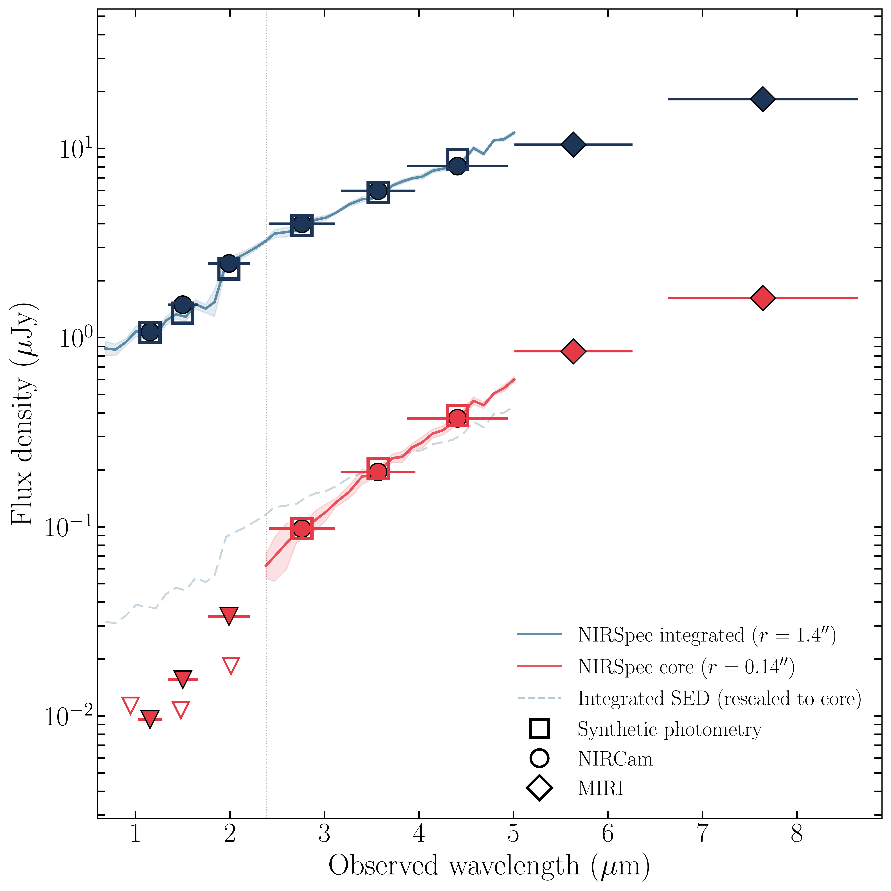
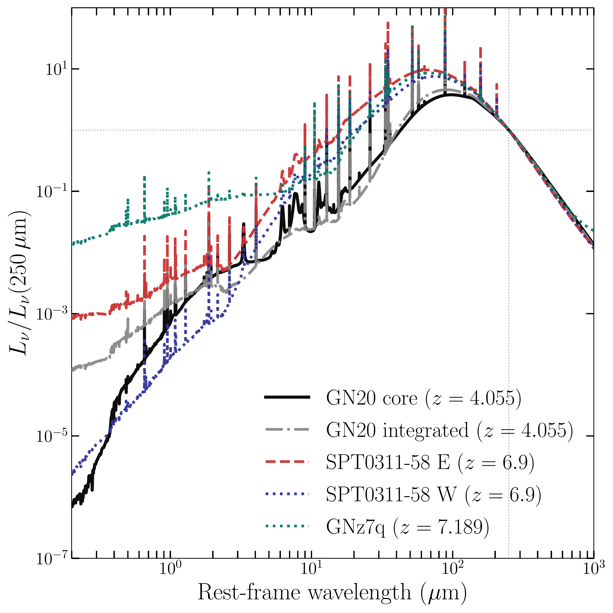

$\newcommand{\ensuremath}{}$
$\newcommand{\xspace}{}$
$\newcommand{\object}[1]{\texttt{#1}}$
$\newcommand{\farcs}{{.}''}$
$\newcommand{\farcm}{{.}'}$
$\newcommand{\arcsec}{''}$
$\newcommand{\arcmin}{'}$
$\newcommand{\ion}[2]{#1#2}$
$\newcommand{\textsc}[1]{\textrm{#1}}$
$\newcommand{\hl}[1]{\textrm{#1}}$
$\newcommand{\footnote}[1]{}$

# Dissecting the Obscured Core of GN20: an Active Galactic Nucleus Outshone by Young Stars

<mark>Appeared on: 2026-07-01</mark> -  _Submitted to A&A (29.05). 12 pages, 4 figures and 2 tables_

M. Hamed, et al. -- incl., <mark>F. Walter</mark>

**Abstract:** We investigate the relative contributions of star formation and AGN activity to the total energy budget of GN20, one of the most luminous dusty star-forming galaxies known at $z>4$ , through spatially resolved spectral energy distribution decomposition. We perform Bayesian SED fitting with CIGALE on two spatially distinct apertures: the nuclear core ( $r=0.14\arcsec$ , $\sim$ 1 kpc physical) and the full galaxy ( $r=1.4\arcsec$ , 9.9 kpc), combining JWST/NIRCam and MIRI broadband imaging, JWST/NIRSpec PRISM IFU pseudo-continuum photometry spanning 42 wavelength bins across rest-frame $0.12$ -- $1.05 \mu$ m, and archival HST and millimeter interferometry data from NOEMA and PdBI. The integrated SED is dominated by stellar-heated dust, with only a marginal AGN contribution at galaxy-wide scales ( $f_\mathrm{AGN}^\mathrm{int}=0.09\pm0.02$ ). The nuclear core, however, requires a significant AGN component ( $f_\mathrm{AGN}=0.34\pm0.05$ ) to account for a mid-infrared excess at rest-frame $\sim$ 2.5--3.6 $\mu$ m characteristic of AGN-heated torus dust. The AGN accounts for $\sim34\%$ of the nuclear infrared luminosity but only $\sim9\%$ of the total integrated $L_\mathrm{IR}$ , explaining its weak signature in integrated diagnostics and its consistency with existing upper limits from _Spitzer_ spectroscopy. The inferred black hole mass places GN20 within the local $M_\mathrm{BH}$ -- $M_\mathrm{bulge}$ relation at the Eddington limit, and in the overmassive regime at sub-Eddington accretion rates, suggesting early and rapid black hole assembly concurrent with the dominant starburst. GN20 exemplifies a class of systems where nuclear-scale SED decomposition, enabled by the angular resolution and infrared sensitivity of JWST, is the only means to uncover a buried AGN overwhelmed by galaxy-wide star formation.

**Figure 4. -** Spectral energy distributions of GN20. _Left:_ Nuclear core ($r = 0.14^{$\arcsec$} \sim 1$ kpc physical at $z = 4.055$). _Right:_ Integrated aperture ($r = 1.4^{$\arcsec$}$, encompassing the entire galaxy). Observed photometry from HST (purple circles), JWST NIRCam (orange squares), JWST MIRI (red diamonds), JWST NIRSpec IFU continuum (blue dots), NOEMA 1.1 mm (brown pentagon), and PdBI 880 $\mu$m (teal hexagon). Upper limits shown as downward-pointing triangles with the colors corresponding the observing instrument. Best-fit SED models (black solid) comprise stellar unattenuated (blue), young and old stars attenuated (blue and yellow respectively), dust emission (red), and AGN emission (orange) components. Bottom panels show normalized residuals $(S_{\rm obs} - S_{\rm mod})/S_{\rm obs}$. Reduced $\chi^2$ values: 0.42 (integrated), 0.43 (core). For the core aperture, the no-AGN best-fit model is also shown (red asterisks, residuals only) to illustrate that the MIR excess at F1280W and F1800W cannot be reproduced without an AGN component. (*Fig.SEDs*)

**Figure 1. -** NIRSpec continuum fluxes with NIRCam (circles) and MIRI (diamonds) broadband photometry for GN20. The red and blue lines show the NIRSpec pseudo-continuum extracted within the core (r=0.14$\arcsec$) and integrated (r=1.4$\arcsec$) apertures, with shaded regions indicating the $\pm1\sigma$ uncertainty. The core spectrum is shown only at wavelengths where it is detected ($\lambda \gtrsim 2.3 \mu$m), at shorter wavelengths, $3\sigma$ upper limits from binned NIRSpec channels are shown as open downward triangles. NIRCam upper limits are shown as filled downward triangles with horizontal bars indicating the filter bandwidth. Open squares denote synthetic photometry computed by convolving the NIRSpec spectrum with the corresponding filter transmission curves. The dashed blue line shows the integrated SED rescaled to the core flux level to facilitate comparison of the spectral shape between the two apertures. The vertical dotted line marks the wavelength below which the core NIRSpec flux is undetected. (*Fig.NIRSpec_vs_imaging*)

**Figure 2. -** Rest-frame SED comparison between GN20, SPT0311-58  ([\'Alvarez-M\'arquez, et. al 2023](https://ui.adsabs.harvard.edu/abs/2023A&A...671A.105A)) , and GNz7q  ([Fujimoto, et. al 2022](https://ui.adsabs.harvard.edu/abs/2022Natur.604..261F), [Fei, et. al 2026](https://ui.adsabs.harvard.edu/abs/2026arXiv260212325F)) . CIGALE best-fit models for the GN20 core (black solid) and integrated aperture (grey dash-dotted) at $z=4.055$ are shown alongside SPT0311-58 E (red dashed) and W (blue dotted) at $z=6.9$, and GNz7q (green) at $z=7.189$. All SEDs are normalized at rest-frame $250 \mu$m, within the cold-dust Rayleigh-Jeans tail where AGN emission is negligible. Both SPT0311-58 galaxies and GNz7q show a MIR excess relative to their cold-dust emission, comparable to the excess that requires an AGN component in our GN20 core fit. GNz7q, recently confirmed as a super-Eddington red quasar hosted by a massive starburst  ([Fei, et. al 2026](https://ui.adsabs.harvard.edu/abs/2026arXiv260212325F)) , exhibits the most pronounced MIR excess, consistent with its dominant AGN contribution. (*Fig.comparison*)

