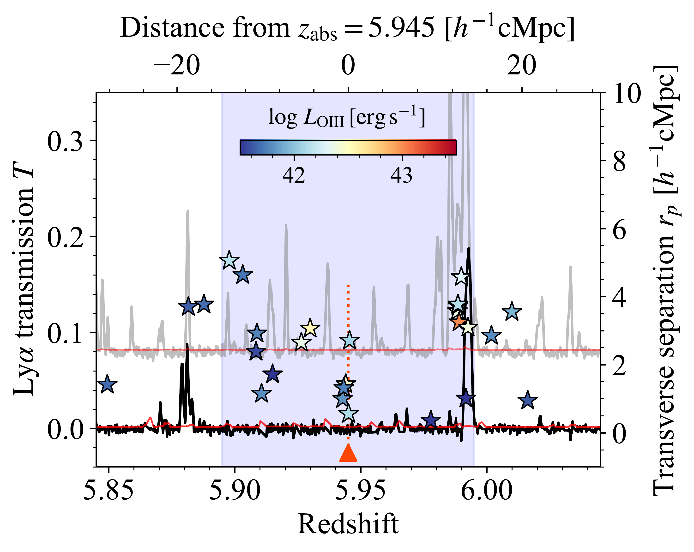
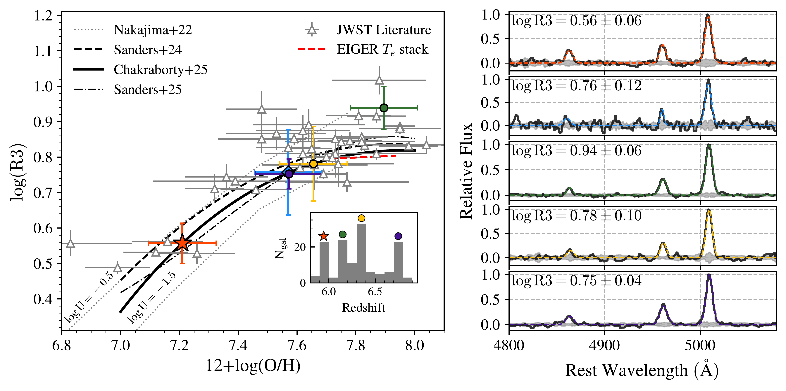

$\newcommand{\ensuremath}{}$
$\newcommand{\xspace}{}$
$\newcommand{\object}[1]{\texttt{#1}}$
$\newcommand{\farcs}{{.}''}$
$\newcommand{\farcm}{{.}'}$
$\newcommand{\arcsec}{''}$
$\newcommand{\arcmin}{'}$
$\newcommand{\ion}[2]{#1#2}$
$\newcommand{\textsc}[1]{\textrm{#1}}$
$\newcommand{\hl}[1]{\textrm{#1}}$
$\newcommand{\footnote}[1]{}$
$\newcommand{\tocite}[1]{\textbf{\color{green}{(to cite: #1)}}}$
$\newcommand{\kms}{\ensuremath{\rm km~s^{-1}}\xspace}$
$\newcommand{\lya}{\textrm{Ly}\ensuremath{\alpha}\xspace}$
$\newcommand{\secref}[1]{Section~\ref{#1}}$
$\newcommand{\figref}[1]{Figure~\ref{#1}}$
$\newcommand{\Eqref}[1]{Equation~(\ref{#1})}$
$\newcommand\farcs{\mbox{.\!^{\prime\prime}}}$
$\newcommand\farcm{\mbox{.\mkern-4mu^\prime}}$
$\newcommand{\arcsec}{\mbox{^{\prime\prime}}\xspace}$
$\newcommand{\arcmin}{\mbox{\!^{\prime}}\xspace}$
$\newcommand{\arcdeg}{\mbox{^{\circ}}\xspace}$
$\newcommand{\be}{\begin{equation}}$
$\newcommand{\ee}{\end{equation}}$
$\newcommand{\non}{\nonumber}$
$\newcommand{\ba}{\begin{align}}$
$\newcommand{\ea}{\end{align}}$
$\newcommand{\nt}{\notag}$
$\newcommand{\avg}[1]{\left<#1\right>}$
$\newcommand{\newcommandeq}{\vcentcolon=}$
$\newcommand{\eqnewcommand}{=\vcentcolon}$
$\newcommand{\Ra}{\ensuremath{\Rightarrow}\xspace}$
$\newcommand{\ra}{\ensuremath{\rightarrow}\xpace}$
$\newcommand{\lra}{\ensuremath{\Leftrightarrow}\xspace}$
$\newcommand{\stmean}[1]{\langle{#1}\rangle}$
$\newcommand{\logg}{\log_{10}}$
$\newcommand{\Msun}{\ensuremath{M_\odot}\xspace}$
$\newcommand{\Rsun}{\ensuremath{R_\odot}\xspace}$
$\newcommand{\Lsun}{\ensuremath{L_\odot}\xspace}$
$\newcommand{\thE}{\ensuremath{\theta_{\rm E}}\xspace}$
$\newcommand{\chisq}{\ensuremath{\chi^2}\xspace}$
$\newcommand{\zspec}{\ensuremath{z_{\rm spec}}\xspace}$
$\newcommand{\zphot}{\ensuremath{z_{\rm phot}}\xspace}$
$\newcommand{\Mstar}{\ensuremath{M_\ast}\xspace}$
$\newcommand{\Lstar}{\ensuremath{L_\ast}\xspace}$
$\newcommand{\Sstar}{\ensuremath{\Sigma_\ast}\xspace}$
$\newcommand{\oh}{\ensuremath{12+\log({\rm O/H})}\xspace}$
$\newcommand{\Av}{\ensuremath{A_{\rm V}}\xspace}$
$\newcommand{\Rv}{\ensuremath{R_{\rm V}}\xspace}$
$\newcommand{\Te}{\ensuremath{T_{\rm e}}\xspace}$
$\newcommand{\SFR}{\ensuremath{{\rm SFR}}\xspace}$
$\newcommand{\Mgas}{\ensuremath{M_{\rm gas}}\xspace}$
$\newcommand{\Sgas}{\ensuremath{\Sigma_{\rm gas}}\xspace}$
$\newcommand{\fgas}{\ensuremath{f_{\rm gas}}\xspace}$
$\newcommand{\Zgas}{\ensuremath{Z_{\rm gas}}\xspace}$
$\newcommand{\tage}{\ensuremath{t_{\rm age}}\xspace}$
$\newcommand{\Vrot}{\ensuremath{V_{\rm rot}}\xspace}$
$\newcommand{\reff}{\ensuremath{r_{\rm eff}}\xspace}$
$\newcommand{\Dn}{\ensuremath{{\rm D}_n(4000)}\xspace}$
$\newcommand{\HdA}{\ensuremath{{\rm H}\delta_A}\xspace}$
$\newcommand{\scrit}{\ensuremath{\sigma_{\rm crit}}\xspace}$
$\newcommand{\fesc}{\ensuremath{f_{\rm esc}}\xspace}$
$\newcommand{\xion}{\ensuremath{\xi_{\rm ion}}\xspace}$
$\newcommand{\tauIGM}{\ensuremath{\tau_{\rm IGM}}\xspace}$
$\newcommand{\Muv}{\ensuremath{M_{\rm UV}}\xspace}$
$\newcommand{\eV}{\ensuremath{\rm eV}\xspace}$
$\newcommand{\pc}{\ensuremath{\rm pc}\xspace}$
$\newcommand{\kpc}{\ensuremath{\rm kpc}\xspace}$
$\newcommand{\Mpc}{\ensuremath{\rm Mpc}\xspace}$
$\newcommand{\K}{\ensuremath{\rm K}\xspace}$
$\newcommand{\mK}{\ensuremath{\rm mK}\xspace}$
$\newcommand{\Hunit}{\ensuremath{\rm km~s^{-1}~Mpc^{-1}}\xspace}$
$\newcommand{\Funit}{\ensuremath{\rm erg~s^{-1}~cm^{-2}}\xspace}$
$\newcommand{\Flam}{\ensuremath{\rm erg~s^{-1}~cm^{-2}~Å^{-1}}\xspace}$
$\newcommand{\Fnu}{\ensuremath{\rm erg~s^{-1}~cm^{-2}~Hz^{-1}}\xspace}$
$\newcommand{\muJy}{\ensuremath{\mu\rm Jy}\xspace}$
$\newcommand{\SBunit}{\ensuremath{\rm erg~s^{-1}~cm^{-2}~arcsec^{-2}}\xspace}$
$\newcommand{\magarcs}{\ensuremath{\rm mag~arcsec^{-2}}\xspace}$
$\newcommand{\Msunyr}{\ensuremath{\Msun~\mathrm{yr}^{-1}}\xspace}$
$\newcommand{\yr}{\ensuremath{\rm yr}\xspace}$
$\newcommand{\Myr}{\ensuremath{\rm Myr}\xspace}$
$\newcommand{\Gyr}{\ensuremath{\rm Gyr}\xspace}$
$\newcommand\ionp[2]{#1\;{\scshape{#2}}}$
$\newcommand\ionf[2]{[#1\;{\scshape{#2}}]}$
$\newcommand\ions[2]{#1\;{\scshape{#2}}]}$
$\newcommand{\Ha}{\textrm{H}\ensuremath{\alpha}\xspace}$
$\newcommand{\Hb}{\textrm{H}\ensuremath{\beta}\xspace}$
$\newcommand{\Hg}{\textrm{H}\ensuremath{\gamma}\xspace}$
$\newcommand{\Hd}{\textrm{H}\ensuremath{\delta}\xspace}$
$\newcommand{\HII}{\textrm{H}\textsc{ii}\xspace}$
$\newcommand{\HI}{\textrm{H}\textsc{i}\xspace}$
$\newcommand{\Htwo}{\textrm{H}\ensuremath{_2}\xspace}$
$\newcommand{\He}{\textrm{He}\xspace}$
$\newcommand{\OI}{[\textrm{O}~\textsc{i}]\xspace}$
$\newcommand{\OII}{[\textrm{O}~\textsc{ii}]\xspace}$
$\newcommand{\OIII}{[\textrm{O}~\textsc{iii}]\xspace}$
$\newcommand{\CIII}{\textrm{C}~\textsc{iii}]\xspace}$
$\newcommand{\NII}{[\textrm{N}~\textsc{ii}]\xspace}$
$\newcommand{\SII}{[\textrm{S}~\textsc{ii}]\xspace}$
$\newcommand{\NeIII}{[\textrm{Ne}~\textsc{iii}]\xspace}$
$\newcommand{\HeII}{\textrm{He}~\textsc{ii}\xspace}$
$\newcommand{\CIV}{\textrm{C}~\textsc{iv}\xspace}$
$\newcommand{\SiIV}{\textrm{Si}~\textsc{iv}\xspace}$
$\newcommand{\SiII}{\textrm{Si}~\textsc{ii}\xspace}$
$\newcommand{\CII}{\textrm{C}~\textsc{ii}\xspace}$
$\newcommand{\popiii}{\textrm{Pop}~\textsc{iii}\xspace}$
$\newcommand{\popii}{\textrm{Pop}~\textsc{ii}\xspace}$
$\newcommand{\poptwoone}{\textrm{Pop}~\textsc{ii/i}\xspace}$
$\newcommand{\sersic}{Sérsic\xspace}$
$\newcommand{\clyi}{MACS1149.6+2223\xspace}$
$\newcommand{\cler}{Abell 2744\xspace}$
$\newcommand{\clsan}{Abell 370\xspace}$
$\newcommand{\clsi}{MACS0416.1-2403\xspace}$
$\newcommand{\clwu}{MACS0717.5+3745\xspace}$
$\newcommand{\clliu}{RXJ2248.7-4431\xspace}$
$\newcommand{\clqi}{RXJ1347.5-1145\xspace}$
$\newcommand{\clba}{MACS0744.9+3927\xspace}$
$\newcommand{\cljiu}{MACS2129.4-0741\xspace}$
$\newcommand{\clshi}{MACS1423.8+2404\xspace}$
$\newcommand{\pylf}{\textsc{pyLensFix}\xspace}$
$\newcommand{\lf}{\textsc{LensFix}\xspace}$
$\newcommand{\sw}{\textsc{SWunited}\xspace}$
$\newcommand{\sex}{\textsc{SExtractor}\xspace}$
$\newcommand{\emc}{\textsc{Emcee}\xspace}$
$\newcommand{\linmix}{\textsc{linmix}\xspace}$
$\newcommand{\adriz}{\textsc{AstroDrizzle}\xspace}$
$\newcommand{\dpac}{\textsc{DrizzlePac}\xspace}$
$\newcommand{\fast}{\textsc{FAST}\xspace}$
$\newcommand{\galfit}{\textsc{Galfit}\xspace}$
$\newcommand{\axe}{\textsc{aXe}\xspace}$
$\newcommand{\glafic}{\textsc{Glafic}\xspace}$
$\newcommand{\gasoline}{\textsc{Gasoline}\xspace}$
$\newcommand{\ramses}{\textsc{Ramses}\xspace}$
$\newcommand{\SJ}{\textsc{Sharon \& Johnson}\xspace}$
$\newcommand{\grzl}{\textsc{Grizli}\xspace}$
$\newcommand{\burst}{\textsc{Starburst99}\xspace}$
$\newcommand{\tphot}{\textsc{T-PHOT}\xspace}$
$\newcommand{\bagp}{\textsc{BAGPIPES}\xspace}$
$\newcommand{\phut}{\textsc{Photutils}\xspace}$
$\newcommand{\msa}{\textsc{msaexp}\xspace}$
$\newcommand{\ppxf}{\textsc{pPXF}\xspace}$
$\newcommand{\jwst}{\textit{JWST}\xspace}$
$\newcommand{\planck}{\textit{Planck}\xspace}$
$\newcommand{\hst}{\textit{HST}\xspace}$
$\newcommand{\hubble}{\textit{Hubble}\xspace}$
$\newcommand{\spitzer}{\textit{Spitzer}\xspace}$
$\newcommand{\herschel}{\textit{Herschel}\xspace}$
$\newcommand{\chandra}{\textit{Chandra}\xspace}$
$\newcommand{\glass}{\textit{GLASS}\xspace}$
$\newcommand{\clear}{\textit{CLEAR}\xspace}$
$\newcommand{\wisp}{\textit{WISP}\xspace}$
$\newcommand{\clash}{\textit{CLASH}\xspace}$
$\newcommand{\candels}{\textit{CANDELS}\xspace}$
$\newcommand{\uvc}{\textit{UVCANDELS}\xspace}$
$\newcommand{\hff}{\textit{HFF}\xspace}$
$\newcommand{\muse}{\textit{MUSE}\xspace}$
$\newcommand{\kmos}{\textit{KMOS}\xspace}$
$\newcommand{\keck}{\textit{Keck}\xspace}$
$\newcommand{\deimos}{\textit{DEIMOS}\xspace}$
$\newcommand{\mosfire}{\textit{MOSFIRE}\xspace}$
$\newcommand{\surfsup}{\textit{SURFSUP}\xspace}$
$\newcommand{\kd}{\textit{KMOS}^{3\rm D}\xspace}$
$\newcommand{\sdss}{\textit{SDSS}\xspace}$
$\newcommand{\vlt}{\textit{VLT}\xspace}$
$\newcommand{\osiris}{\textit{OSIRIS}\xspace}$
$\newcommand{\sinf}{\textit{SINFONI}\xspace}$
$\newcommand{\ngrst}{\textit{NGRST}\xspace}$
$\newcommand{\niriss}{\textit{NIRISS}\xspace}$
$\newcommand{\mmth}{\textit{MAMMOTH}\xspace}$
$\newcommand{\mg}{\textit{MAMMOTH-Grism}\xspace}$
$\newcommand\sfr{star-formation rate\xspace}$
$\newcommand\sfh{star-formation history\xspace}$
$\newcommand\sfms{star-formation main sequence\xspace}$
$\newcommand{\el}[1]{\ensuremath{\textrm{EL}_{#1}}}$
$\newcommand{\obs}{\textrm{o}}$
$\newcommand{\theo}{\textrm{t}}$
$\newcommand{\ext}{\textrm{ext}}$
$\newcommand\refe{\textrm{ref}}$
$\newcommand\pa{\textrm{PA}}$
$\newcommand{\xa}{\alpha}$
$\newcommand{\xb}{\beta}$
$\newcommand{\xk}{\kappa}$
$\newcommand{\xg}{\gamma}$
$\newcommand{\Or}{\ensuremath{\Omega_{\rm{r}}}\xspace}$
$\newcommand{\Om}{\ensuremath{\Omega_{\rm{m}}}\xspace}$
$\newcommand{\Ok}{\ensuremath{\Omega_{\rm{k}}}\xspace}$
$\newcommand{\Ol}{\ensuremath{\Omega_{\Lambda}}\xspace}$
$\newcommand{\Obh}{\ensuremath{\Omega_{\rm{b}}h^2}\xspace}$
$\newcommand{\Ob}{\ensuremath{\Omega_{\rm{b}}}\xspace}$
$\newcommand{\Onu}{\ensuremath{\Omega_\nu}\xspace}$
$\newcommand{\fnu}{\ensuremath{f_{\nu}}\xspace}$
$\newcommand{\Och}{\ensuremath{\Omega_{\rm{DM}}h^2}\xspace}$
$\newcommand{\Oc}{\ensuremath{\Omega_{\rm{DM}}}\xspace}$
$\newcommand{\ns}{\ensuremath{n_{\rm s}}\xspace}$
$\newcommand{\As}{\ensuremath{A_{\rm s}}\xspace}$
$\newcommand{\thA}{\ensuremath{\theta_{\rm A}}\xspace}$
$\newcommand{\neff}{\ensuremath{N_\textrm{eff}}\xspace}$
$\newcommand{\mnu}{\ensuremath{\sum{m_{\nu}}}\xspace}$
$\newcommand{\yhe}{\ensuremath{Y_p}\xspace}$
$\newcommand{\Map}[1]{\left<M^2_\textrm{ap}\right>( #1 )}$
$\newcommand{\map}{\ensuremath{\left<M^2_\textrm{ap}\right>}\xspace}$
$\newcommand{\chiH}{\ensuremath{\chi_\textrm{H}}\xspace}$
$\newcommand{\n}{\ensuremath{{\nu}\rm}\xspace}$
$\newcommand{\nue}{\ensuremath{{\nu}_{\rm e}}\xspace}$
$\newcommand{\num}{\ensuremath{{\nu}_{\rm \mu}}\xspace}$
$\newcommand{\nut}{\ensuremath{{\nu}_{\rm \tau}}\xspace}$
$\newcommand{\da}{\ensuremath{D_{\rm A}}\xspace}$
$\newcommand{\dl}{\ensuremath{D_{\rm L}}\xspace}$
$\newcommand{\taueq}{\ensuremath{\tau_{\rm eq}}\xspace}$
$\newcommand{\actaa}{Acta Astron.}$
$\newcommand{\araa}{Annu. Rev. Astron. Astrophys.}$
$\newcommand{\areps}{Annu. Rev. Earth Planet. Sci.}$
$\newcommand{\aar}{Astron. Astrophys. Rev.}$
$\newcommand{\ab}{Astrobiol.}$
$\newcommand{\aj}{AJ}$
$\newcommand{\ac}{Astron. Comput.}$
$\newcommand{\apart}{Astropart. Phys.}$
$\newcommand{\apj}{ApJ.}$
$\newcommand{\apjl}{ApJL}$
$\newcommand{\apjs}{ApJS}$
$\newcommand{\ao}{Appl. Opt.}$
$\newcommand{\apss}{Astrophys. Space Sci.}$
$\newcommand{\aap}{A\&A}$
$\newcommand{\aapr}{Astron. Astrophys. Rev.}$
$\newcommand{\aaps}{Astron. Astrophys. Suppl.}$
$\newcommand{\baas}{Bull. Am. Astron. Soc.}$
$\newcommand{\caa}{Chin. Astron. Astrophys.}$
$\newcommand{\cjaa}{Chin. J. Astron. Astrophys.}$
$\newcommand{\cqg}{Class. Quantum Gravity}$
$\newcommand{\epsl}{Earth Planet. Sci. Lett.}$
$\newcommand{\frass}{Front. Astron. Space Sci.}$
$\newcommand{\gal}{Galaxies}$
$\newcommand{\gca}{Geochim. Cosmochim. Acta}$
$\newcommand{\grl}{Geophys. Res. Lett.}$
$\newcommand{\icarus}{Icarus}$
$\newcommand{\jcap}{J. Cosmol. Astropart. Phys.}$
$\newcommand{\jgr}{J. Geophys. Res.}$
$\newcommand{\jgrp}{J. Geophys. Res.: Planets}$
$\newcommand{\jqsrt}{J. Quant. Spectrosc. Radiat. Transf.}$
$\newcommand{\lrca}{Living Rev. Comput. Astrophys.}$
$\newcommand{\lrr}{Living Rev. Relativ.}$
$\newcommand{\lrsp}{Living Rev. Sol. Phys.}$
$\newcommand{\memsai}{Mem. Soc. Astron. Italiana}$
$\newcommand{\mnras}{MNRAS}$
$\newcommand{\nat}{Nature}$
$\newcommand{\nastro}{Nat. Astron.}$
$\newcommand{\ncomms}{Nat. Commun.}$
$\newcommand{\nphys}{Nat. Phys.}$
$\newcommand{\na}{New Astron.}$
$\newcommand{\nar}{New Astron. Rev.}$
$\newcommand{\physrep}{Phys. Rep.}$
$\newcommand{\pra}{Phys. Rev. A}$
$\newcommand{\prb}{Phys. Rev. B}$
$\newcommand{\prc}{Phys. Rev. C}$
$\newcommand{\prd}{Phys. Rev. D}$
$\newcommand{\pre}{Phys. Rev. E}$
$\newcommand{\prl}{Phys. Rev. Lett.}$
$\newcommand{\psj}{Planet. Sci. J.}$
$\newcommand{\planss}{Planet. Space Sci.}$
$\newcommand{\pnas}{Proc. Natl Acad. Sci. USA}$
$\newcommand{\procspie}{Proc. SPIE}$
$\newcommand{\pasa}{Publ. Astron. Soc. Aust.}$
$\newcommand{\pasj}{Publ. Astron. Soc. Jpn}$
$\newcommand{\pasp}{Publ. Astron. Soc. Pac.}$
$\newcommand{\raa}{Res. Astron. Astrophys.}$
$\newcommand{\rmxaa}{Rev. Mexicana Astron. Astrofis.}$
$\newcommand{\sci}{Science}$
$\newcommand{\sciadv}{Sci. Adv.}$
$\newcommand{\solphys}{Sol. Phys.}$
$\newcommand{\sovast}{Soviet Astron.}$
$\newcommand{\ssr}{Space Sci. Rev.}$
$\newcommand{\uni}{Universe}$
$\newcommand{\narrow}{-1.3ex}$
$\newcommand{\Nline}{5\xspace}$
$\newcommand\red[1]{{\color{red}#1}}$
$\newcommand{\(}{\left(}$
$\newcommand{\)}{\right)}$
$\newcommand\thebibliography[1]{$
$  \OLDthebibliography{#1}$
$  \setlength{\parskip}{0pt}$
$  \setlength{\itemsep}{0pt plus 0.3ex}$
$}$
$\newcommand\thefootnote\footnotetext$
$\newcommand{\thefigure}{\arabic{figure}}$
$\newcommand{\fnum@figure}{Extended Data Fig. \thefigure}$
$\newcommand{\theHfigure}{ED\arabic{figure}}$
$\newcommand{\prt}{\partial}$
$\newcommand{\cP}{{\cal P}}$
$\newcommand\abs{#1}$
$\newcommand{\ne}{\ensuremath{n_{\rm e}}\xspace}$
$\newcommand{\micron}{\ensuremath{\mu\textrm{m}}\xspace}$
$\newcommand{\U}{\ensuremath{U_{360}}\xspace}$
$\newcommand{\B}{\ensuremath{B_{435}}\xspace}$
$\newcommand{\V}{\ensuremath{V_{606}}\xspace}$
$\newcommand{\I}{\ensuremath{I_{814}}\xspace}$
$\newcommand{\Y}{\ensuremath{Y_{105}}\xspace}$
$\newcommand{\J}{\ensuremath{J_{125}}\xspace}$
$\newcommand{\JH}{\ensuremath{JH_{140}}\xspace}$
$\newcommand{\H}{\ensuremath{H_{160}}\xspace}$
$\newcommand{\lt}{\textsc{Lenstool}\xspace}$
$\newcommand{\clash}{\textit{CLASH}\xspace}$
$\newcommand{\mosnewcommand}{\textit{MOSDEF}\xspace}$
$\newcommand{\etal}{et al.\xspace}$
$\newcommand{\ie}{i.e.\xspace}$
$\newcommand{\eg}{e.g.\xspace}$
$\newcommand{\etc}{etc.\xspace}$
$\newcommand{\aka}{a.k.a.\xspace}$
$\newcommand{\vsv}{vis-á-vis\xspace}$
$\newcommand{\det}{\textrm{det}}$
$\newcommand{\p}{{\rm prior}}$
$\newcommand{\fid}{{\rm fid}}$
$\newcommand{\lnk}{\kappa}$
$\newcommand{\lnkp}{\kappa'}$

# Possible chemical signatures of first-star enrichment in a very metal-poor galaxy overdensity near the end of reionization

<mark>Appeared on: 2026-07-01</mark> -  _Submitted to Nature Astronomy. Comments are welcome_

Z. Li, et al. -- incl., <mark>E. Bañados</mark>

**Abstract:** The first generation of stars, known as Population iii ( $\popiii$ ), formed from primordial gas consisting solely of hydrogen and helium and is believed to have emerged only a few hundred million years after the Big Bang.Detecting the chemical enrichment of metal-poor circumgalactic gas offers a promising way to trace the enrichment signature of $\popiii$ stars.Along the sightline to the quasar SDSS J0100+2802, a metal absorber at $z = 5.945$ , showing over-abundant carbon and silicon compared to solar, has been reported to be consistent with the enrichment pattern of $\popiii$ stars.With the James Webb Space Telescope, we report the discovery of an unusually metal-poor galaxy overdensity of 17 members (mean metallicity $\approx 3\%$ solar) near this metal absorber, which is $\sim 0.4$ dex more metal-poor than coeval galaxies in similarly overdense environments. This less chemically evolved system may have provided favorable conditions for preserving the absorption signatures of $\popiii$ enrichment.The cross-correlation of the metal absorber and the surrounding galaxies indicates a minimum dark matter halo of $\log(M_{\mathrm{h,min}}/M_{\odot})=10.68^{+0.93}_{-1.72}$ , consistent with late-time $\popiii$ formation at the outskirts of atomic hydrogen cooling halos.

**Figure 3. -** \small Ly$\alpha$(black line) and Ly$\beta$(gray line) forest transmission $T=\exp(-\tau_\alpha)$ with uncertainty (red line) around the $\popiii$ absorber $z_$\text${abs}=5.945$. The Ly$\beta$ transmission is shifted upwards. The red triangle and vertical dotted line mark the redshift of the $\popiii$ absorber. The locations of $\OI$II emitters relative to the absorber are marked by stars, color-coded by $\OI$II luminosity.  The top $x$-axis indicates the line-of-sight comoving distance from the absorber, and the right $y$-axis indicates the transverse distance of $\OI$II emitters from the absorber. The blue shaded region indicates the redshift interval used to calculate the $\OI$II clustering around the absorber. (*fig:transmission*)

**Figure 5. -** \small**Left panel**: False color image of J0100+2802 field from JWST NIRCam through three bands (F356W, F200W, F115W). The locations of the galaxies in the overdensity are marked with squares, color-coded by redshifts. The central yellow star marks the location of the quasar, along whose sightline the $\popiii$ absorber at $z=5.945$ is intervening. **Right panels**: One-dimensional grism spectra of each galaxy in the overdensity hosting the $\popiii$ absorber, with zoom-in cutouts shown on the left. The red lines indicate the best-fit Gaussian models to the observed spectra. (*fig:J100_fov*)

**Figure 8. -** \small** Left panel**: The empirical R3 calibrations and JWST observations. Literature JWST observations with $T_e$-metallicity measurements[Curti, et. al (2023)](https://ui.adsabs.harvard.edu/abs/2023MNRAS.518..425C), [Nakajima, et. al (2023)](https://ui.adsabs.harvard.edu/abs/2023ApJS..269...33N), [Trump, et. al (2023)](https://ui.adsabs.harvard.edu/abs/2023ApJ...945...35T), [Jones, et. al (2023)](https://ui.adsabs.harvard.edu/abs/2023ApJ...951L..17J), [Sanders, et. al (2024)](https://ui.adsabs.harvard.edu/abs/2024ApJ...962...24S), [Pollock, et. al (2025)](https://ui.adsabs.harvard.edu/abs/2025arXiv250615779P), [Cullen, et. al (2025)](https://ui.adsabs.harvard.edu/abs/2025MNRAS.540.2176C) are marked by gray triangles. The black solid line represents the fiducial empirical calibration adopted in this work (Ref. \citen{Chakraborty_25}), whereas the black dashed line represents the empirical calibration from ref. \citen{Sanders_23} for comparison. The black dotted curves present the photoionization model tracks with ionization parameters $\log\rm U=-0.5$ and $\log\rm U=-1.5$ from ref. \citen{Nakajima_22}. The red dashed line marks the $T_e$-metallicity measurements obtained by stacking the $\OI$II emitters from the full EIGER survey[Kotiwale, et. al (2025)](https://ui.adsabs.harvard.edu/abs/2025arXiv251019959K).
The red star and blue diamond indicate galaxy overdensities associated with $\popiii$ and $\popii$ absorbers, respectively. The purple, yellow, and green circles represent three additional major overdensities within the SDSS J0100+2802 field, which are not associated with the $\popiii$ absorber. The inset in the bottom-right corner displays the redshift distributions of these four overdensities, each denoted by markers with corresponding shapes and colors on top. ** Right panel**: Composite spectra of galaxies in each overdensity. The dashed lines represent Gaussian model fits, following the same color scheme as the markers on the left panel. The measured R3 ratios are denoted in the top-left corner of each row. (*fig:R3-Z*)

