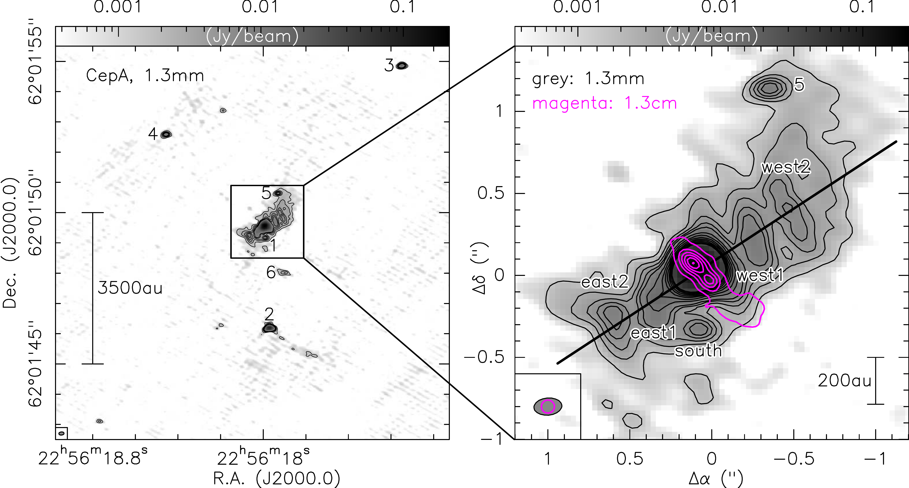
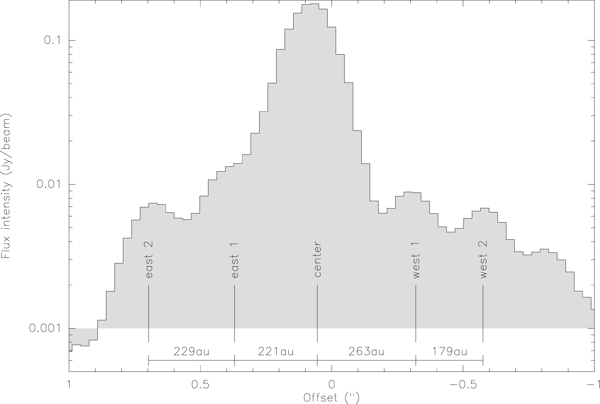
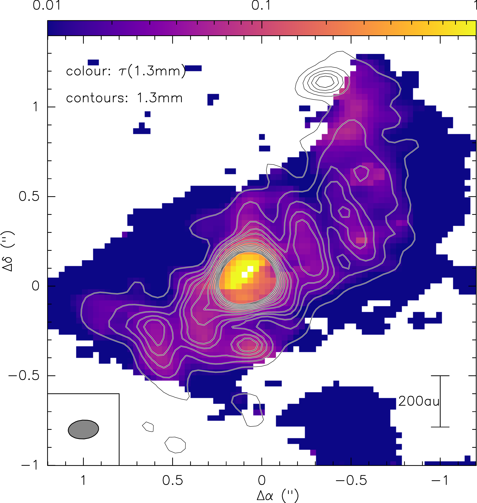

$\newcommand{\ensuremath}{}$
$\newcommand{\xspace}{}$
$\newcommand{\object}[1]{\texttt{#1}}$
$\newcommand{\farcs}{{.}''}$
$\newcommand{\farcm}{{.}'}$
$\newcommand{\arcsec}{''}$
$\newcommand{\arcmin}{'}$
$\newcommand{\ion}[2]{#1#2}$
$\newcommand{\textsc}[1]{\textrm{#1}}$
$\newcommand{\hl}[1]{\textrm{#1}}$
$\newcommand{\footnote}[1]{}$
$\newcommand\natexlab{#1}$

# The CepA disk-outflow system at $\leq 0.2"$ or $\leq 100$ au resolution: Northern Extended Millimeter Array (NOEMA) long baseline data

<mark>Appeared on: 2026-07-01</mark> -  _Accepted for A&A, 14 pages, 13 figures_

<mark>H. Beuther</mark>, et al. -- incl., <mark>C. Gieser</mark>, <mark>V. Aberham</mark>, <mark>T. Henning</mark>, <mark>H. Linz</mark>, <mark>D. Semenov</mark>

**Abstract:** Although there has been significant progress, the physical properties and potential fragmentation of accretion disks around high-mass protostars remain poorly constrained. We characterize at high angular resolution one of the most nearby ( $\sim$ 700 pc) high-mass accretion disk candidates CepA HW2. Using the new long baseline array configuration ( $\sim$ 1700 m) of the Northern Extended Millimeter Array (NOEMA), we study CepA HW2 with a resolution of $\leq$ 0.2 $"$ or $\leq$ 100 au at 1.3 mm in dust continuum and spectral line emission. The mm continuum emission resolves the central disk candidate into several sub-structures. Conducting a Toomre $Q$ stability analysis based on $CH_3$ CN and continuum data, and a comparison to 3D radiation hydrodynamic simulations shows that the data are consistent with an almost edge-on disk where the observed sub-structures may represent fragments within the disk. The CO and SiO spectral line data confirm a second bipolar outflow (in addition to the well-known jet) emanating from the central peak position. This indicates that this central peak should host at least a binary if not even a higher order multiple system. The usually assumed dense gas tracer $CH_3$ CN shows also contributions from the outflows which complicates further kinematic analysis of the disk. The high-resolution outflow-disk data of CepA reveal a multiply fragmented disk that drives several outflows. These observations enforce the picture of high-mass star formation where multiplicity and fragmentation can happen on the smallest spatial scales related to the inner accretion disks.

**Figure 6. -** Continuum data for CepA HW2. The left panel shows the large-scale overview of the 1.3 mm continuum data, and the right panel presents a zoom-in towards the central high-mass disk region. Gray-scale and contours are 1.3 mm continuum emission starting at $4\sigma$, continuing in $4\sigma$ steps to $20\sigma$, then continuing in $10\sigma$ steps to $100\sigma$. The magenta contours in the right panel outline the ionized jet measured at 1.3 cm emission by \citet{torrelles1996}. Contour levels start at $4\sigma\approx 0.49$ mJy beam$^{-1}$ and continue in $12\sigma$ steps. Synthesized beams and linear scale-bars are shown in both panels. The thick black line shows the orientation of the intensity and position-velocity cuts in Figs. \ref{intensitycut}\&\ref{pv}. Cores and discussed sub-structures are labeled in both panel. (*cont*)

**Figure 1. -** Intensity cut along the 1.3 mm continuum map as outlined in the right panel of Fig. \ref{cont}. The main continuum peaks and their separations are marked. (*intensitycut*)

**Figure 2. -** Optical depth $\tau_{\nu}$ map at 1.3 mm. The color scale shows the $\tau_{\nu}$ map and the contours outline the 1.3 mm continuum emission in $4\sigma$ steps. (*tau*)

