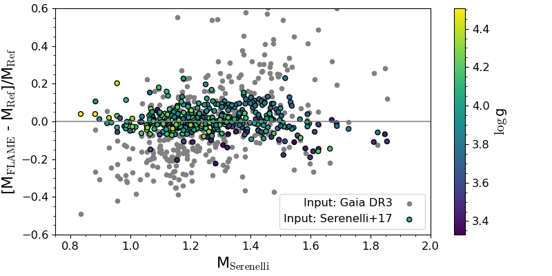
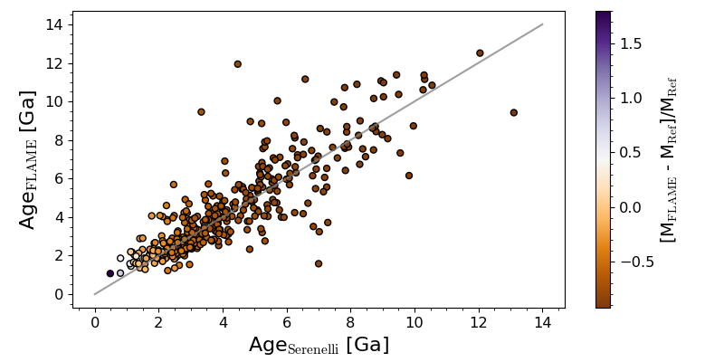
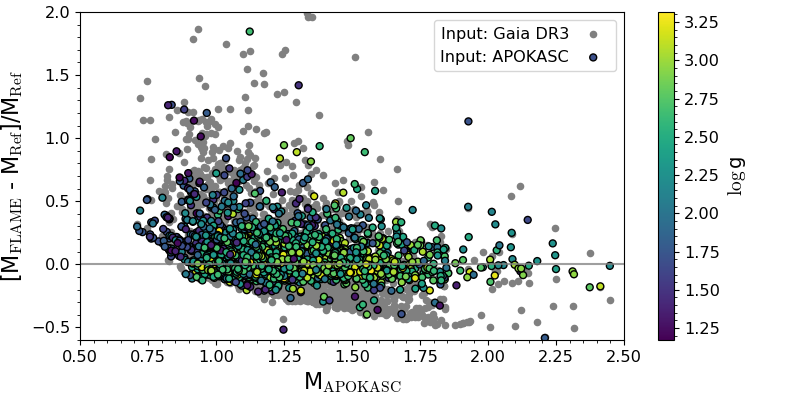
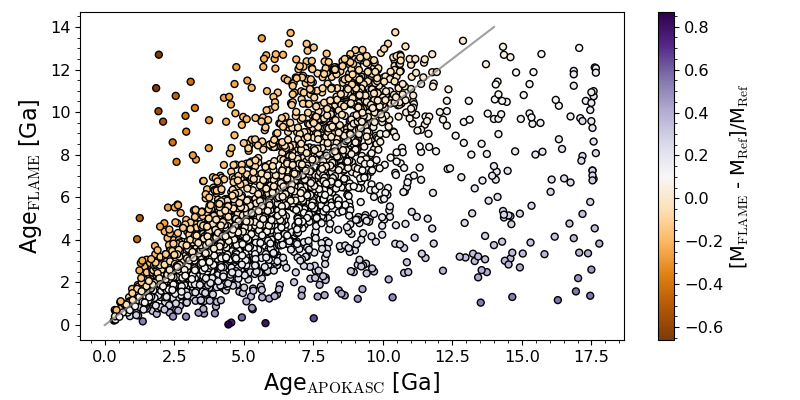
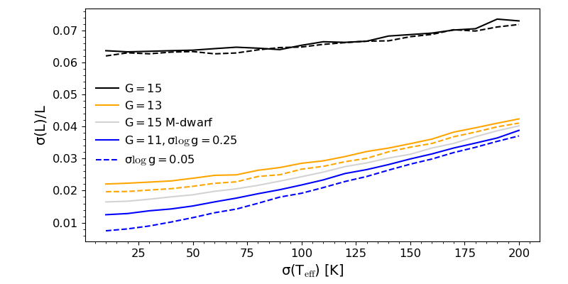
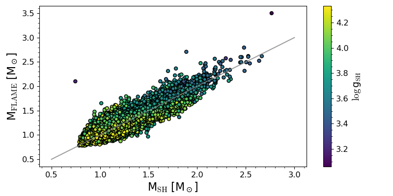
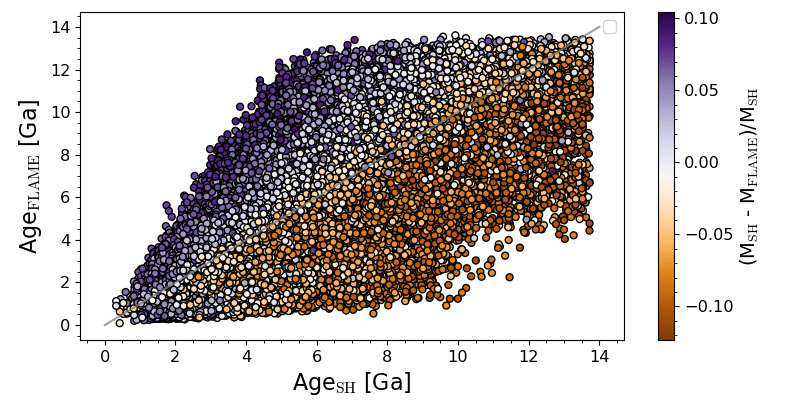

$\newcommand{\ensuremath}{}$
$\newcommand{\xspace}{}$
$\newcommand{\object}[1]{\texttt{#1}}$
$\newcommand{\farcs}{{.}''}$
$\newcommand{\farcm}{{.}'}$
$\newcommand{\arcsec}{''}$
$\newcommand{\arcmin}{'}$
$\newcommand{\ion}[2]{#1#2}$
$\newcommand{\textsc}[1]{\textrm{#1}}$
$\newcommand{\hl}[1]{\textrm{#1}}$
$\newcommand{\footnote}[1]{}$
$\newcommand{\spins}{{\sc SPInS}}$
$\newcommand{\flame}{{\sc Flame}}$
$\newcommand{\apsis}{{\sc Apsis}}$
$\newcommand{\basti}{{\sc BaSTI}}$
$\newcommand{\algoone}{{\sc Algo1}}$
$\newcommand{\algotwo}{{\sc Algo2}}$
$\newcommand{\gspphot}{{\sc GSP-Phot}}$
$\newcommand{\gspspec}{{\sc GSP-Spec}}$
$\newcommand{\teff}{\ensuremath{T_{\rm eff}}}$
$\newcommand{\msol}{M\ensuremath{_{\odot}}}$
$\newcommand{\lsol}{L\ensuremath{_{\odot}}}$
$\newcommand{\rsol}{R\ensuremath{_{\odot}}}$
$\newcommand{\rad}{\ensuremath{R}}$
$\newcommand{\lum}{\ensuremath{L}}$
$\newcommand{\mass}{\ensuremath{M}}$
$\newcommand{\age}{\ensuremath{\tau}}$
$\newcommand{\evol}{\ensuremath{\epsilon}}$
$\newcommand{\logg}{\ensuremath{\log g}}$
$\newcommand{\mh}{\ensuremath{\rm{[M/H]}}}$
$\newcommand{\feh}{\ensuremath{\rm{[Fe/H]}}}$
$\newcommand{\alphafe}{\ensuremath{\rm{[\alpha/Fe]}}}$
$\newcommand{\ag}{\ensuremath{A_G}}$
$\newcommand{\av}{\ensuremath{A_V}}$
$\newcommand{\mbolsol}{\ensuremath{M_{\rm bol,\odot}}}$
$\newcommand{\mbol}{\ensuremath{M_{\rm bol}}}$
$\newcommand{\rvgrav}{\ensuremath{V_{\rm GR}}}$

# Stellar masses and ages in Gaia Data Release 4 from the Final Luminosity Age Mass Estimator algorithm

<mark>Appeared on: 2026-07-02</mark> -  _to be accepted upon minor revision by A&A_

O. L. Creevey, et al. -- incl., <mark>M. Fouesneau</mark>, <mark>R. Andrae</mark>

**Abstract:** The masses and ages of stars are key quantities for understanding exoplanetary, stellar, and galactic evolution. In the context of Gaia, these parameters provide insights into the stellar populations, helping to trace the formation and history of the Galaxy. As part of the Gaia Data Processing and Analysis Consortium (DPAC), the Final Luminosity Age Mass Estimator (FLAME)  pipeline processes Gaia data to derive stellar parameters comprising luminosities, radii, masses and ages. This paper discusses the methods and data used in $\flame$ for Gaia Data releases and the expected performances of FLAME for the 4th Gaia Data Release. FLAME comprises two main components: the first one, which is analytical, is used to estimate luminosity, radius, and radial velocity correction due to gravitational redshift by exploiting the atmospheric, astrometric, and photometric parameters produced within Gaia.  The second is a model inference based on two main approaches: a classical minimization approach, and a Bayesian framework.  It aims to derive mass, age, and evolutionary stage.  The two step implementation offers flexibility in handling photometric properties that are prone to systematic errors. Tests with simulated data, the Sun, and well characterised samples of stars including some clusters show that the methods in $\flame$ perform as expected, producing results in statistical agreement with the literature.  Mass and age for giant stars are extremely sensitive to the input atmospheric parameters and good agreement with external data for these stars is only reached when we use the same input data.  This emphasizes the difficulty in validating masses and ages in any catalogue.   We provide new stellar fundamental parameters for some high velocity stars, stars with very low mass companions, and a selection of stars in the Plato Field of View.      We also discuss the expected uncertainties and show that typical mass uncertainties are in relatively good agreement with analytical predictions from a mass-luminosity relation.   Typical relative uncertainties on age for solar-like stars vary between 20 \% -- 40 \% , and for masses between 1.2 and 1.3 $\msol$ they are around 20 \% .  For giants, the relative uncertainties in age are typically 10 \% for lower masses, increasing to 15--20 \% for higher masses. We conclude that $\flame$ produces valid results in Gaia Data Releases.  In Gaia Data Release 4 approximately 500 million sources have results from the pipeline, thus providing large samples of stars with high precision and accuracy in their stellar parameters.  As the results depend on the quality of the input data, samples with a much decreased quality are also expected.  Users should consult the Gaia online documentation and flags for guidelines on the exploitation of the catalogue.

**Figure 10. -** {\sl Left panels:} Relative difference between $\flame$ mass and asteroseismic mass. The grey symbols show the results when we rerun $\flame$ using GDR3 atmospheric parameters for these sources, while the colour-coded symbols show the comparison when we use the  atmospheric parameters from the {reference} catalogue (colour) as input to $\flame$.
    {\sl Right panels:} Comparison of $\flame$ age and asteroseismic age when using the atmospheric parameters from the reference catalogue as input. (*fig:compare_massage_seismic*)

**Figure 6. -** Luminosity errors as a function of input $\teff$ uncertainty for different $G$. (*fig:properror*)

**Figure 11. -** Comparison of the masses and ages from $\flame$ using Gaia DR4 data as input and the results from the StarHorse catalogue.
    {\sl Left:} Comparison of masses after imposing some constraints on the input data (see text, 344 767 stars or 90\% of the original samples).  {\sl Right:} Comparison of ages after imposing the same constraints and restricting the stars to those with masses that agree to 10\%(269 834 or 72\% of the original sample).
  (*fig:starhorse*)

