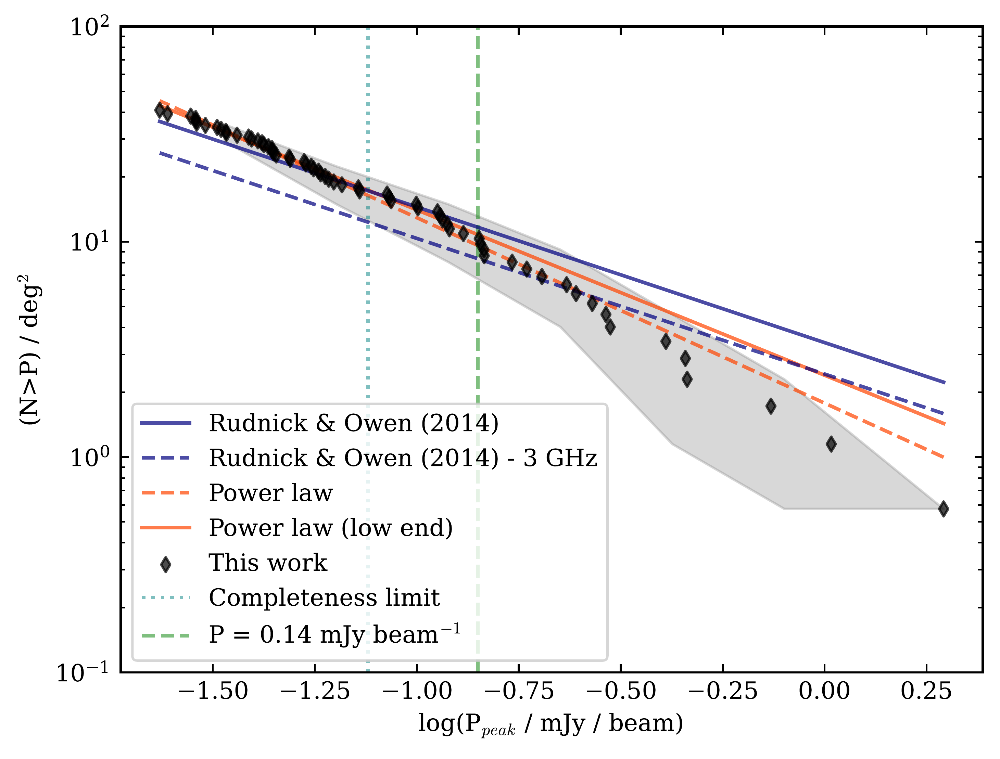
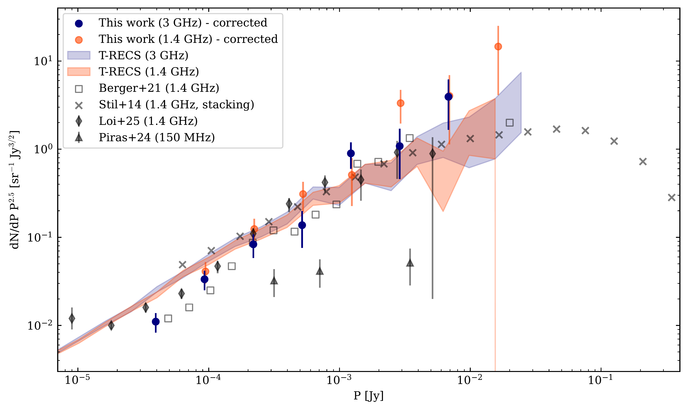
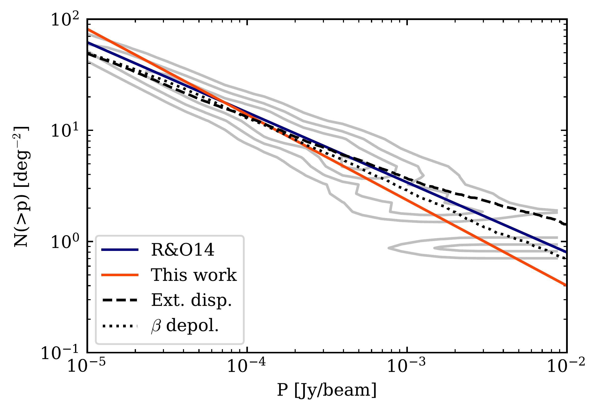

$\newcommand{\ensuremath}{}$
$\newcommand{\xspace}{}$
$\newcommand{\object}[1]{\texttt{#1}}$
$\newcommand{\farcs}{{.}''}$
$\newcommand{\farcm}{{.}'}$
$\newcommand{\arcsec}{''}$
$\newcommand{\arcmin}{'}$
$\newcommand{\ion}[2]{#1#2}$
$\newcommand{\textsc}[1]{\textrm{#1}}$
$\newcommand{\hl}[1]{\textrm{#1}}$
$\newcommand{\footnote}[1]{}$
$\newcommand{\jybeam}{\mathrm{Jy} \mathrm{beam}^{-1} }$
$\newcommand{\radmsq}{\mathrm{rad} \mathrm{m}^{-2} }$

# The VLA-COSMOS 3 GHz Large Project: \\Polarised source counts and catalogue

<mark>Appeared on: 2026-07-06</mark> -  _13 pages, 10 figures (main text). Accepted for publication in Astronomy and Astrophysics (A&A)_

S. Ranchod, et al. -- incl., <mark>E. Schinnerer</mark>

**Abstract:** The exploration of the faint polarised radio source population is essential for interpreting the nature and evolution of magnetic fields in galaxies. While recent studies have provided insight into source counts for the $\mu$ Jy polarised source population at  1.4 GHz, higher frequency surveys may be more sensitive to new populations that are depolarised at lower frequencies (i.e. due to internal or external depolarisation effects). We present the deepest polarised source counts at 3 GHz to date, at an angular resolution of $1.5"$ . With these relatively higher frequency observations, we aim to probe the faint polarised star-forming galaxy (SFG) population. Furthermore, through spectral modelling, we aim to provide further insight into the frequency evolution of polarised source counts. We processed the polarisation data of the VLA-COSMOS 3 GHz Large Project, one of the deepest high-resolution radio continuum surveys. We produced Stokes Q and U mosaicked channel maps. After selecting known sources in total intensity, we performed 3D rotation measure synthesis and searched for polarised emission using an empirically determined threshold. With a sensitivity of 2.6 $\mu$ $\jybeam$ in Faraday depth, we detect 65 polarised sources (51 deg $^{-2}$ ) above our threshold. We find that our cumulative and Euclidean-normalised source counts at 3 GHz are consistent with those in the literature at 1.4 GHz, which we attribute to the combined effect of spectral index and depolarisation in the detected sources.   We detect no SFGs in our sample and derive a 2 $\sigma$ upper limit on the density of polarised SFGs of $<2.0 \mathrm{deg}^{-2}$ . This implies that significantly deeper observations will be required to readily detect this population in the SKA-era.

**Figure 5. -** Cumulative source countsCumulative source counts based on the peak polarised intensity of detected sources (black). These counts are corrected for completeness. The uncertainties are indicated in grey and are estimated through bootstrap resampling. The solid blue line shows the counts from \citetalias{Rudnick2014} at 1.4 GHz and extrapolated to 3 GHz (dashed blue line). The orange line represents a power-law fit (Eq. \ref{ch4:eq:cum-counts}) to the full sample (solid line) and to only the low flux densities (dashed line). The limit above which we are 100\% complete is indicated by the dotted cyan line, and the perceived break at $P =  0.14 \mathrm{mJy beam}^{-1}$ is shown by the dashed green line. (*ch4:fig:cumulative-counts*)

**Figure 12. -** Euclidean-normalised differential source countsEuclidean-normalised differential source counts for the polarised source population in the VLA-COSMOS 3 GHz survey. The completeness-corrected counts are plotted as filled circles at 3 GHz (blue) and extrapolated to 1.4 GHz (orange). We plot the source counts from the following recent deep surveys (grey): Lockman Hole field \citep[][open squares]{Berger2021}, MeerKAT Fornax Survey \citep[][filled diamonds]{Loi2025}, ELAIS-N1 \citep[][triangles]{Piras2024}, and stacking of NVSS sources \citep[][crosses;]{Stil2014}. The polarised source counts computed from the T-RECS simulation  ([Bonaldi, Bonato and Galluzzi 2019]())  at 1.4 GHz (orange) and 3 GHz (blue) are also plotted as shaded regions. (*ch4:fig:euclidean-counts*)

**Figure 8. -** Modelled cumulative source countsModelled cumulative source counts, as in Fig. \ref{ch4:fig:cumulative-counts}. The solid blue and orange lines show the analytical expressions for the source counts from [ and Rudnick (2014)]() and this work (Eq. \ref{ch4:eq:my-cum-counts}), respectively. The model assuming the $\beta$ distribution is indicated as a dotted line and the external dispersion model as a dashed line. The normalised spread determined from bootstrap resampling is shown as grey contours. (*ch4:fig:cum-counts-model*)

