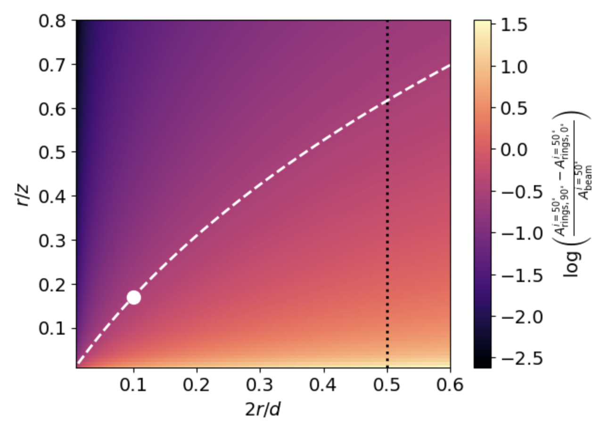
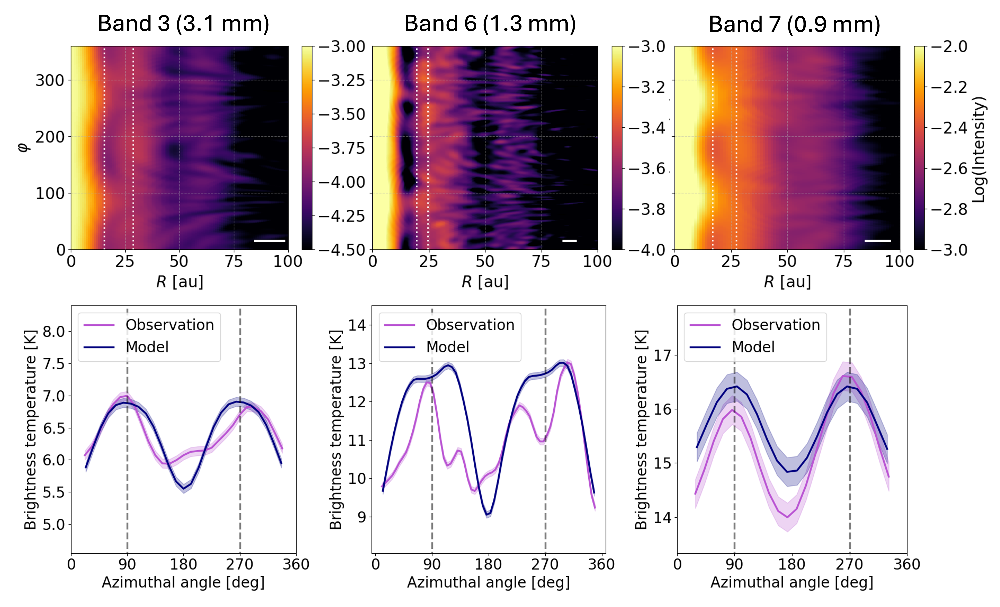
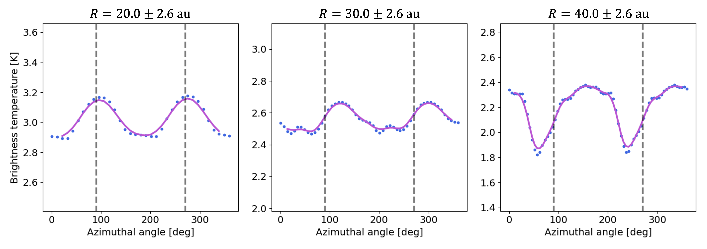

$\newcommand{\ensuremath}{}$
$\newcommand{\xspace}{}$
$\newcommand{\object}[1]{\texttt{#1}}$
$\newcommand{\farcs}{{.}''}$
$\newcommand{\farcm}{{.}'}$
$\newcommand{\arcsec}{''}$
$\newcommand{\arcmin}{'}$
$\newcommand{\ion}[2]{#1#2}$
$\newcommand{\textsc}[1]{\textrm{#1}}$
$\newcommand{\hl}[1]{\textrm{#1}}$
$\newcommand{\footnote}[1]{}$

# Azimuthal brightness modulation reveals hidden rings in CI Tau

<mark>Appeared on: 2026-07-07</mark> -  _6 pages, 6 figures, Accepted for publication in A&A_

C. E. Scardoni, et al. -- incl., <mark>F. Zagaria</mark>

**Abstract:** Protoplanetary disks often host substructures such as rings and gaps, which trace key processes in planet formation and dust evolution. However, narrow rings may remain unresolved due to limited observational resolution, hiding critical information about early planetesimal formation and the amount of dust present. ${We apply the azimuthal brightness modulation method, based on the modulation produced by multiple unresolved optically thick rings embedded in an optically thin background \citep{Scardoni+2024}, to multi-wavelength ALMA observations of CI Tau to identify unresolved rings and constrain their geometry and optical depth.}$ We analysed CI Tau archival ALMA continuum observations in bands 3, 6, and 7, extracting azimuthal brightness profiles along narrow annuli and comparing them with forward modeled synthetic observations of inclined disks containing unresolved rings. We detect the azimuthal signature at $\sim22$ au in all three bands, consistent with unresolved, optically thick rings embedded in a lower optical depth background. Multi wavelength modelling constrains the rings' geometry and optical depth, consistent with conditions expected for streaming instability and early planetesimal formation. Our results demonstrate the applicability of this azimuthal signature technique to real disks, reveal fine scale dust substructures in CI Tau, and illustrate a new method to study the early stages of planet formation below the nominal resolution limit.

**Figure 3. -** Difference in filling factor, $\Delta A_{0^\circ-90^\circ}$, as a function of the geometrical parameters $2r/d$ and $r/z$. The white dotted curve indicates the combinations of parameters that reproduce the $\Delta A_{0^\circ-90^\circ}$ inferred from the successful model, marked by the white dot. The black dotted line shows an upper limit on $2r/d$, imposed by the absence of optical-depth saturation in the observed azimuthal signature. (*Fig:geomparam*)

**Figure 5. -** {Upper row: 2D intensity maps for CI Tau at ALMA bands 3, 6, 7. The white bar in each panel shows the beam size. White dotted lines mark the profile radial averaging intervals: $22.0\pm 5.3$ (Band 3), $22.0\pm 2.6$ (Band 6), $22.0\pm 6.6$ (Band 7). Lower row: CI Tau azimuthal brightness temperature profiles in ALMA Band 3 (left), 6 (centre), 7 (right) shown in magenta, with the corresponding model profiles overplotted in blue. {The blue curves are illustrative examples from the model grid that qualitatively reproduce the observed signature (not obtained from a formal best-fit procedure).} Shaded areas show profile uncertainties. Grey dashed lines mark the minor axis.} (*Fig:AzimuthalProfiles*)

**Figure 6. -** Azimuthal brightness profiles of the warped disk at 20 au (left panel), 30 au (central panel), and 50 au (right panel). Each curve shows a double peaked shape, but the position of the peaks varies with radius due to the radial change in the warped disk orientation. (*Fig:Warpeddisk*)

