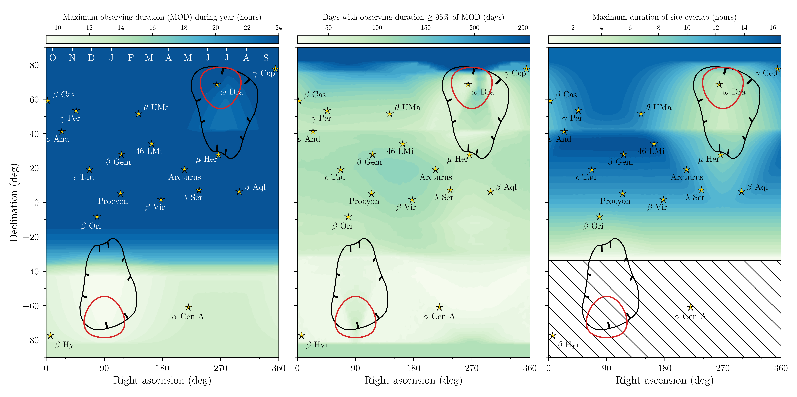
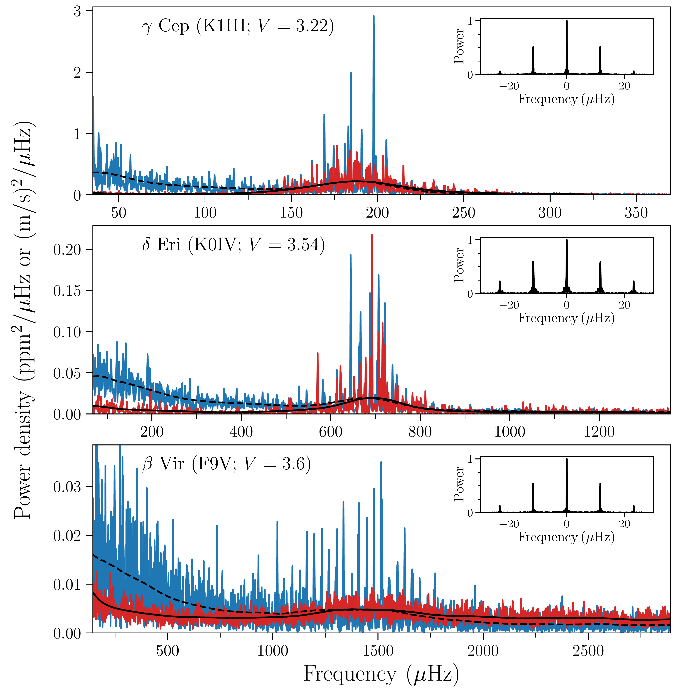
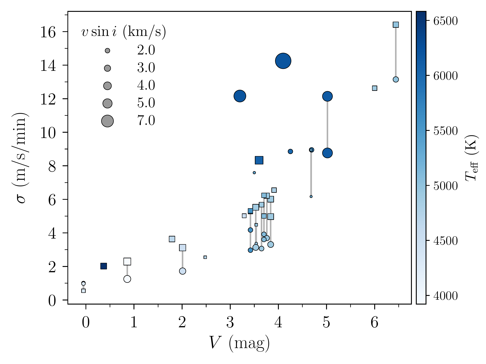

$\newcommand{\ensuremath}{}$
$\newcommand{\xspace}{}$
$\newcommand{\object}[1]{\texttt{#1}}$
$\newcommand{\farcs}{{.}''}$
$\newcommand{\farcm}{{.}'}$
$\newcommand{\arcsec}{''}$
$\newcommand{\arcmin}{'}$
$\newcommand{\ion}[2]{#1#2}$
$\newcommand{\textsc}[1]{\textrm{#1}}$
$\newcommand{\hl}[1]{\textrm{#1}}$
$\newcommand{\footnote}[1]{}$
$\newcommand{\rmxaa}{RevMexAA}$
$\newcommand{\orcidlink}[1]{\protect\href{https://orcid.org/#1}{\protect\includegraphics[width=8pt]{orcid.png}}}$
$\newcommand{\ie}{i.e.\@\xspace}$
$\newcommand{\eg}{e.g.\@\xspace}$
$\newcommand{\ia}{i.a.\@\xspace}$
$\newcommand{\fref}[1]{Fig.~\ref{#1}}$
$\newcommand{\Fref}[1]{Figure~\ref{#1}}$
$\newcommand{\tref}[1]{Table~\ref{#1}}$
$\newcommand{\sref}[1]{Sect.~\ref{#1}}$
$\newcommand{\Sref}[1]{Section~\ref{#1}}$
$\newcommand{\aref}[1]{Appendix~\ref{#1}}$
$\newcommand{\nbsp}{\nobreak~\nobreak}$
$\newcommand{\reply}[1]{{\textbf{#1}}}$
$\newcommand{\code}[1]{{\texttt{#1}}}$
$\newcommand{\comment}[1]{{\textbf{\textcolor{red}{(#1)}}}}$
$\newcommand{\CNnames}[1]{{\begin{CJK}{UTF8}{gbsn}(#1)\end{CJK}}}$
$\newcommand{\numax}{\ensuremath{\nu_{\rm max}}\xspace}$
$\newcommand{\dnu}{\ensuremath{\Delta\nu}\xspace}$
$\newcommand{\numaxsol}{\ensuremath{\nu_{\rm max, \odot}}\xspace}$
$\newcommand{\dnusol}{\ensuremath{\Delta\nu, \odot}\xspace}$
$\newcommand{\muhz}{\ensuremath{\mu\rm Hz}\xspace}$
$\newcommand{\zsol}{\ensuremath{\rm Z_{\odot}}\xspace}$
$\newcommand{\msol}{\ensuremath{\rm M_{\odot}}\xspace}$
$\newcommand{\rsol}{\ensuremath{\rm R_{\odot}}\xspace}$
$\newcommand{\kp}{\emph{Kepler}\xspace}$
$\newcommand{\gaia}{\emph{Gaia}\xspace}$
$\newcommand{\mur}{\ensuremath{\mu_{\rm R.A.}}\xspace}$
$\newcommand{\mud}{\ensuremath{\mu_{\rm Decl}}\xspace}$
$\newcommand{\Kp}{\ensuremath{\rm Kp}\xspace}$
$\newcommand{\teff}{\ensuremath{T_{\rm eff}}\xspace}$
$\newcommand{\teffsol}{\ensuremath{T_{\rm eff, \odot}}\xspace}$
$\newcommand{\lsun}{\ensuremath{\rm L_{\rm \odot}}\xspace}$
$\newcommand{\logg}{\ensuremath{\log g}\xspace}$
$\newcommand{\feh}{\ensuremath{\rm[Fe/H]}\xspace}$
$\newcommand{\vsini}{\ensuremath{v\sin i}\xspace}$
$\newcommand{\muh}{\ensuremath{\rm \mu Hz}\xspace}$
$\newcommand{\kms}{\ensuremath{\rm km  \xspace s^{-1}}\xspace}$
$\newcommand{\comnt}[1]{{\textcolor{purple}{#1}}}$
$\newcommand{\ssimon}[1]{{\textcolor{cyan}{#1}}}$
$\newcommand{\jrud}[1]{{\textcolor{violet}{#1}}}$
$\newcommand\footnoteref[1]{\protected@xnewcommand\@thefnmark{\ref{#1}}\@footnotemark}$
$\newcommand\makeLineNumber\usepackage$
$\newcommand{\arraystretch}{1.}$
$\newcommand{\eqref}[1]{Eq.~\ref{#1}}$
$\newcommand{\arraystretch}{1.1}$
$\newcommand{\arraystretch}{0.8}$
$\newcommand{\arraystretch}{0.8}$
$\newcommand\maketag@@@{#1}$

# The Stellar Observations Network Group (SONG): A Legacy Archive of Stellar Time-Domain Spectroscopy

<mark>Appeared on: 2026-07-07</mark> -  _18 pages, 16 figures, submitted to A&A. Links to full online versions of Tables C.1 and C.2 will be updated once these have been uploaded to CDS_

M. N. Lund, et al. -- incl., <mark>H. Korhonen</mark>

**Abstract:** The Stellar Observations Network Group (SONG) network has operated for more than a decade, providing long-baseline, high-cadence spectroscopic observations of bright stars and the Sun. The observations, from 2014 through 2025, constitute a substantial archive of high-resolution spectra and precise radial velocities suitable for a broad range of time-domain stellar astrophysics. We present an overview of the current status, instrumentation, and scientific capabilities of the SONG network, and describe the scope and accessibility of the SONG Data Archive (SODA). We further illustrate the breadth of science enabled by SONG observations, including asteroseismology, stellar variability studies, binary-star characterisation, and exoplanet research. We summarise the operational status and observing strategies of the SONG facilities, describe the available data products and archive infrastructure, and outline procedures for accessing archival observations and proposing new observations within the SONG community framework. The SODA archive currently contains more than 580, 000 spectra of 3091 stars obtained with SONG using either iodine-cell or Thorium–Argon wavelength calibration. The archive spans more than a decade of observations and includes extensive high-cadence time-series data for bright targets across a wide range of stellar types and variability classes. Access to the archive is available to members of the SONG community, which remains open to new participants who agree to follow the community policies. The SONG archive has developed into a major long-baseline resource for stellar spectroscopy and radial-velocity time-series analysis. Continued expansion of the archive, together with coordinated observations obtained contemporaneously with TESS and future PLATO observations, is expected to enable new studies of stellar oscillations, variability, and exoplanet host stars through combined radial-velocity and photometric analyses.

**Figure 11. -** SONG multisite observing coverage. Left: Maximum possible daily observing duration (in hours; see colour scale) across the year, as a function of RA and DEC, for stars observed with the full four-site (OT, Lenghu, MtK, APO) SONG network. The ticks at the top of the panel indicate the time (in months by their first letter; starting with October (`O') ) during the year when a star with a given RA is highest in the sky at the middle of the night. Middle: The number of days during a year where a star with a given RA and DEC is observable for a duration $\geq95\%$ of the maximum daily observing duration (left panel). Right: Maximum possible daily overlap (in hours) between sites across the year, as a function of stellar RA and DEC. The lower hashed region (at DEC $\lesssim-35^{\circ}$) indicates the region accessible only to the MtK site. In all panels, several specific stars are indicated, along with the outline of the PLATO LOP fields (LOPN1 and LOPS2) in black and the TESS continuous viewing zones in blue. (*fig:coverage*)

**Figure 4. -** Examples of power density spectra (PDS) for stars with detectable asteroseismic excess from SONG RV observations (top: $\gamma$ Cep; middle: $\delta$ Eri; bottom: $\beta$ Vir). Spectra in red are based on available SONG-OT observations, while the corresponding spectrum based on TESS 20-sec cadence photometry is shown in blue. To highlight the different impacts of low-frequency granulation noise, the TESS spectra have been normalised to match the power density level from SONG near $\numax$, based on the heavily smoothed (using an epanechnikov filter with a width of $4$\dnu$$) spectra given by the full (dashed) black lines for SONG (TESS). The inserts show for each star the spectral window from the SONG observations. (*fig:ps_ex*)

**Figure 1. -** Relation between RV noise level (in m/s per minute) and stellar $V$-band magnitude for a sample of stars with time-series data from SONG OT. To rescale the measured per-exposure noise levels to per-minute values, we assume a scaling of noise level as $t_{\rm exp}^{-1/2}$. Circular markers indicate measurements taken with the current QHY detector, while square markers indicate measurements taken with the ANDOR detector. Stars with noise values from both detectors are connected with a line. The marker colour indicates $\teff$, while the size indicates $\vsini$(see the legends). (*fig:noise_scale*)

