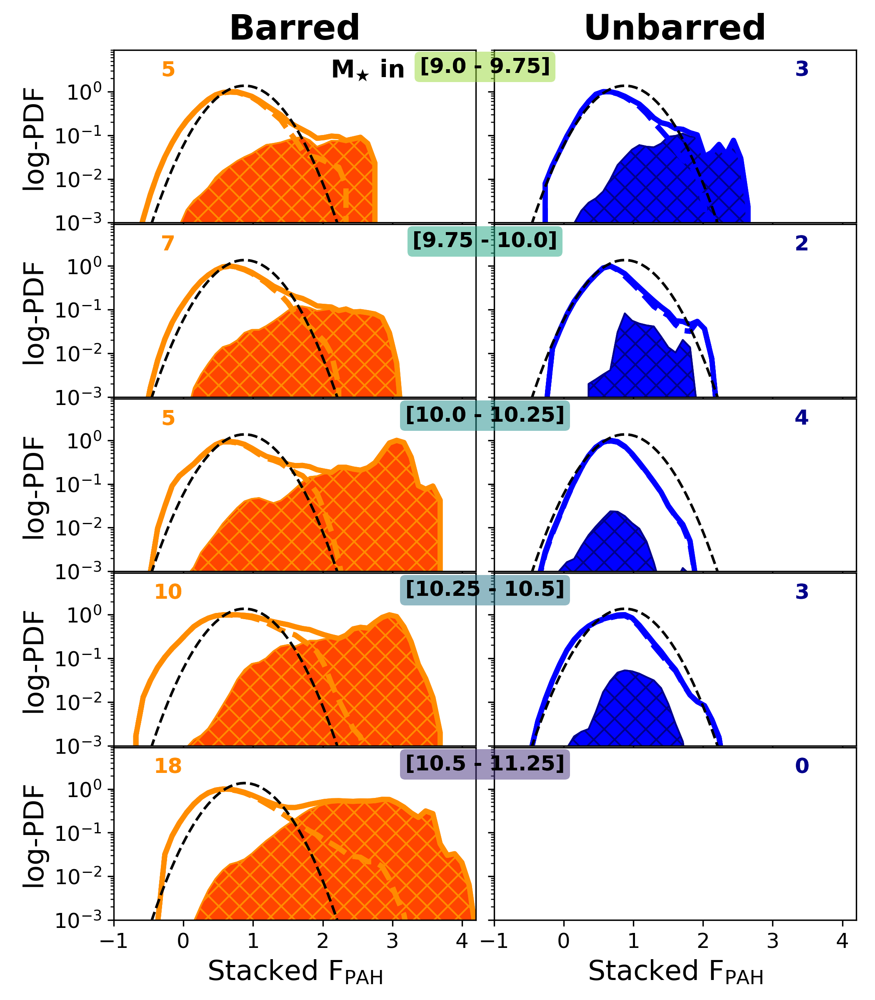
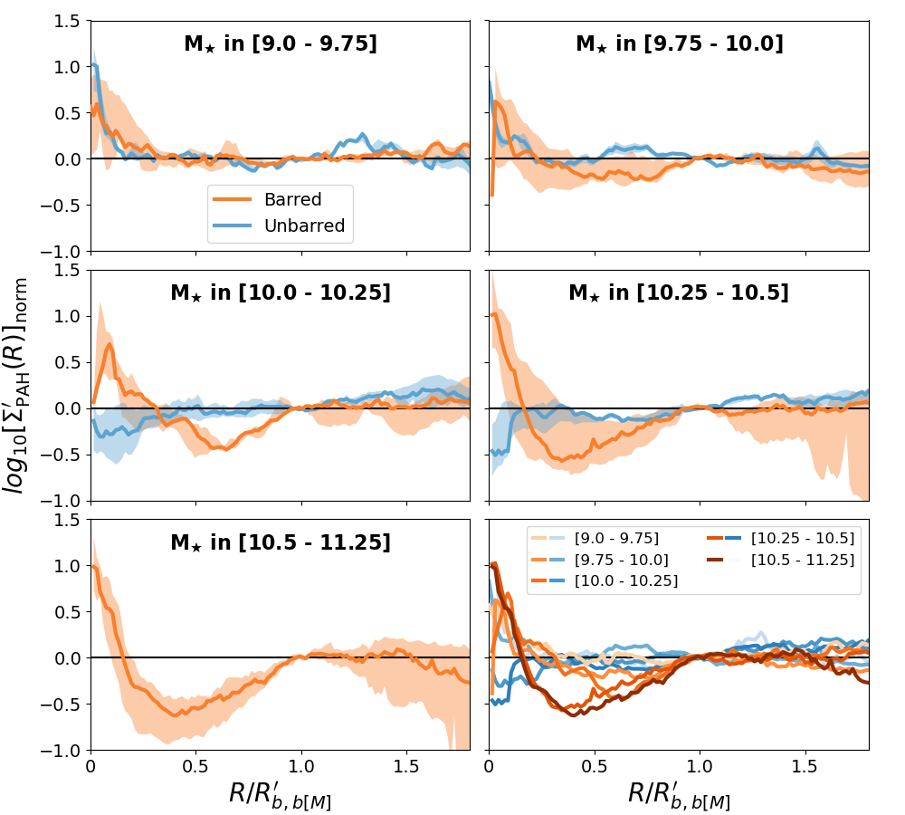

$\newcommand{\ensuremath}{}$
$\newcommand{\xspace}{}$
$\newcommand{\object}[1]{\texttt{#1}}$
$\newcommand{\farcs}{{.}''}$
$\newcommand{\farcm}{{.}'}$
$\newcommand{\arcsec}{''}$
$\newcommand{\arcmin}{'}$
$\newcommand{\ion}[2]{#1#2}$
$\newcommand{\textsc}[1]{\textrm{#1}}$
$\newcommand{\hl}[1]{\textrm{#1}}$
$\newcommand{\footnote}[1]{}$
$\newcommand{\MUSEp}{{\tt MUSE DRS}}$
$\newcommand{\DRP}{{\tt DRP}}$
$\newcommand{\DAP}{{\tt DAP}}$
$\newcommand{\pPXF}{{\tt pPXF}}$
$\newcommand{\vorbin}{{\tt vorbin}}$
$\newcommand{\MAPS}{{\tt MAPS}}$
$\newcommand{\pymusepipe}{{\tt pymusepipe}}$
$\newcommand{\mpdaf}{{\tt mpdaf}}$
$\newcommand{\pypher}{{\tt pypher}}$
$\newcommand{\astropy}{{\tt astropy}}$
$\newcommand{\python}{{\tt Python}}$
$\newcommand{\reproject}{{\tt reproject}}$
$\newcommand{\numpy}{{\tt numpy}}$
$\newcommand{\matplotlib}{{\tt matplotlib}}$
$\newcommand{\scipy}{{\tt scipy}}$
$\newcommand{\esorex}{{\tt EsoRex}}$
$\newcommand{\gist}{{\tt gist}}$
$\newcommand{\oiii}{[O \textsc{iii}]}$
$\newcommand{\nii}{[N \textsc{ii}]}$
$\newcommand{\sii}{[S \textsc{ii}]}$
$\newcommand{\oi}{[O \textsc{i}]}$
$\newcommand{\niion}{[N \textsc{i}]}$
$\newcommand{\hei}{[He \textsc{i}]}$
$\newcommand{\siii}{[S \textsc{iii}]}$
$\newcommand{\oii}{[O \textsc{ii}]}$
$\newcommand{\hii}{H \textsc{ii}}$
$\newcommand{\ha}{H\alpha}$
$\newcommand{\hb}{H\beta}$
$\newcommand{\Mgb}{Mg\textit{b}}$
$\newcommand{\NaI}{Na \textsc{I}}$
$\newcommand{\kms}{\mathrm{km s}^{-1}}$
$\newcommand{\re}{R_\mathrm{e}}$
$\newcommand{\Msun}{\mathrm{M}_{\sun}}$
$\newcommand{\Lsun}{\mathrm{L}_{\sun}}$
$\newcommand{\TBD}[1]{\begin{color}[rgb]{0.6,0,0.6}#1\end{color}}$

# A steep mass transition for bar-driven ISM structuring revealed by PHANGS-JWST

<mark>Appeared on: 2026-07-07</mark> -  _17 pages, including the appendices, 10 Figures. Accepted for publication in the A&A Main Journal_

E. Emsellem, et al. -- incl., <mark>E. Schinnerer</mark>, <mark>J. G. Lobos</mark>, <mark>J. Neumann</mark>

**Abstract:** Galactic bars are thought to play a critical role in the secular evolution of their hosts by, e.g., reorganising the interstellar medium (ISM). We use a sample of 57 star-forming disc galaxies observed with JWST at 3 and 7.7 $\mu$ m to probe how the spatial distribution of Polycyclic Aromatic Hydrocarbons (PAH) emission as a structural marker of the cold ISM might depend on galaxy stellar mass and the presence of a bar. We find evidence for a "watershed" at a stellar mass of $10^{10}$  $\Msun$ , marking a fundamental transition in the bar-driven distribution of PAH emission. This confirms trends previously predicted by numerical simulations and observed via ionised gas or UV light. While lower-mass galaxies exhibit a disordered and clumpy distribution of PAH emission regardless of bar presence, higher-mass barred hosts display well-structured dynamical features traced by PAH emission with significant gas reservoirs (e.g., discs and rings) within the central 15 \% of the bar radius ($R_b$ ). Furthermore, we observe a systematic depletion of PAH emission within the [ 0.2–0.8 ] $R_b$ range in barred systems with stellar masses above $10^{10}$  $\Msun$ . Such central discs, rings, and associated radial dips ("bar deserts") appear to be a mass-dependent phenomenon: ubiquitous in massive galaxies but mostly absent in their lower-mass counterparts. In contrast to the structured features in massive hosts, the disorganised ISM in lower-mass galaxies masks the commonly observed bar-driven signatures. This suggests that tracer selection and dust obscuration may significantly bias observed bar fractions. Our study underlines the existence of two regimes of secular evolution, with different impacts and observability of bar-driven processes: it reaffirms the role of bars as primary drivers of rapid secular evolution in galaxies above $10^{10}$ $\Msun$ while the impact of bars is significantly reduced or delayed below this threshold. It further underscores the need to critically account for these processes when modelling galaxy evolution in cosmological simulations.

**Figure 3. -** Stacked and shifted PAH emission density PDFs using the F770W$_{\rm ss}$ JWST band in bins of mass, going from the least massive (top) to the most massive (bottom) targets, with the stellar mass bin indicated in the middle of the two panels of each row. The left (right) panels correspond to the barred (unbarred) subsample. The value at the top left (right) of each panel is the number of targets stacked for the barred (unbarred) systems. The thick coloured lines correspond to the PDF for all pixels within $R_{b}^{\prime}$ for barred galaxies, and within $R_{b[M]}^{\prime}$ for unbarred galaxies. The filled hatched (orange or blue) areas are PDFs restricted to a radius of 15\% of the respective reference radii. A fixed log-normal function peaking at an abscissa of 1 (with which individual profiles have been aligned) is plotted as a black dashed line in each panel for reference. (*fig:PDF*)

**Figure 2. -** Radial PAH emission (F770W$_{\rm ss}$ band) profiles of barred (orange lines) and unbarred (blue lines) galaxies: each line corresponds to the median of all barred galaxies within a stellar mass bin (as indicated by the legend in each panel). In the bottom right panel, all lines are shown together to illustrate the trend. Each of the other five panels shows a single stellar mass bin for both the barred and unbarred samples. In those panels, the transparent-filled regions correspond to the first and third quartiles (25 and 75\% percentiles) around the median. All individual galaxy profiles have been divided by an exponential profile before the averaging using radial scale length fitted on the F300M band, and then normalised by the value at $R = R_b^{\prime}$: for unbarred galaxies, $R_{b[M]}^{\prime}$ as a proxy \citep[see text, and][]{Erwin2019}. Note the absence of unbarred galaxies in the most massive stellar mass bin. (*fig:radial_bars*)

**Figure 5. -** Same as Fig. $\re$f{fig:thumbnails_770s} but for the F770W$_{\rm ss}$(starlight subtracted 7.7 $\mu$m) JWST band. (*fig:thumbnails_770s*)

