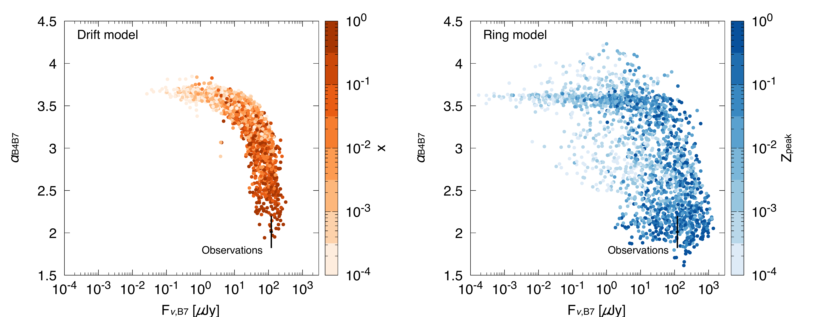
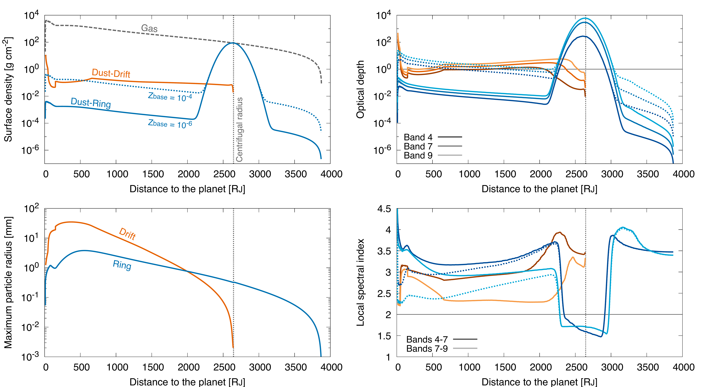
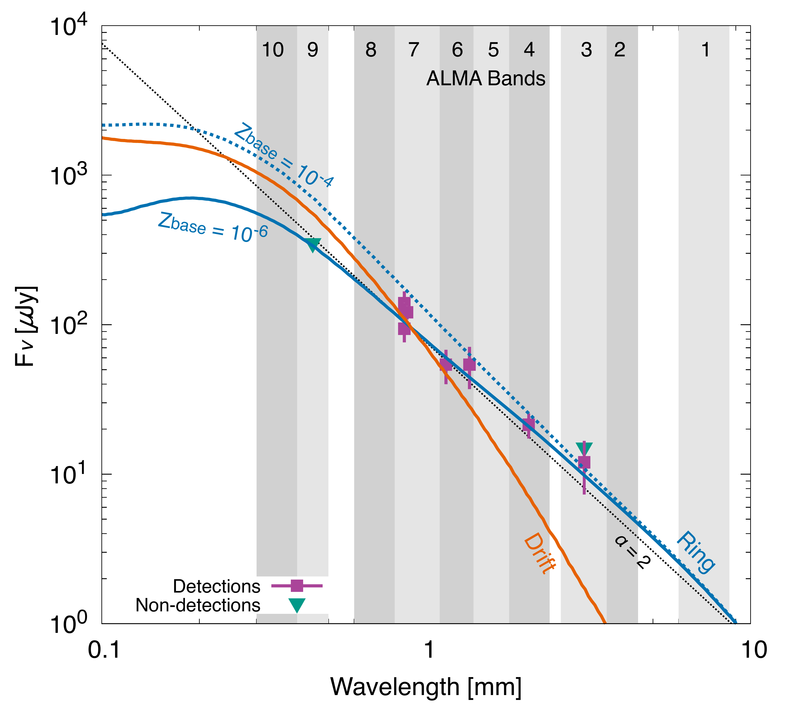

$\newcommand{\ensuremath}{}$
$\newcommand{\xspace}{}$
$\newcommand{\object}[1]{\texttt{#1}}$
$\newcommand{\farcs}{{.}''}$
$\newcommand{\farcm}{{.}'}$
$\newcommand{\arcsec}{''}$
$\newcommand{\arcmin}{'}$
$\newcommand{\ion}[2]{#1#2}$
$\newcommand{\textsc}[1]{\textrm{#1}}$
$\newcommand{\hl}[1]{\textrm{#1}}$
$\newcommand{\footnote}[1]{}$
$\newcommand{\vdag}{(v)^\dagger}$
$\newcommand\aastex{AAS\TeX}$
$\newcommand\latex{La\TeX}$

# Interpreting ALMA Multi-wavelength Continuum Observations of PDS 70 c:\\An Optically Thick Dust Ring in the Circumplanetary Disk

<mark>Appeared on: 2026-07-07</mark> -  _11 pages, 5 figures, 2 tables, accepted for publication in The Astrophysical Journal Letters_

Y. Shibaike, et al. -- incl., <mark>K. Doi</mark>

**Abstract:** Giant planets form small gas disks, called circumplanetary disks (CPDs), during gas accretion. The CPD of PDS 70 c has been detected by ALMA in (sub)millimeter continuum emission, which is interpreted as thermal emission from dust in the CPD. The resulting spectral index suggests that the disk is optically thick over a wide range of wavelengths. However, this is inconsistent with previous CPD dust models, which predict that the disk is optically thin because of radial dust drift. Here, we present a new interpretation of the multi-wavelength observations: the CPD hosts an optically thick dust ring, whose existence has been discussed in the context of satellite formation. We demonstrate that a dust-ring model that incorporates gas accretion, dust evolution, and dust thermal emission, is consistent with the observations under reasonable conditions, whereas a conventional ring-less model requires more stringent conditions. We also show that the dust ring inferred from the observations potentially satisfies the conditions for exomoon formation via streaming instability and subsequent gravitational instability.

**Figure 4. -** Comparisons of the predictions by the Drift model (left panel) and Ring model (right panel) with ALMA observations of PDS 70 c. The parameter ranges of the models are shown in the "Broad-parameter cases" column in Table \ref{tab:parameters}. The large cross represents the disk-integrated flux density in ALMA Band 7 ($F_{\nu,{\rm B7}}=121\pm13 \mu{\rm Jy}$) and the disk-integrated spectral index of Bands 4 and 7 ($\alpha_{\rm B4,B7}=2.01\pm0.19$) observed by [Dom\'\inguez-Jamett, et. al (2025)](https://ui.adsabs.harvard.edu/abs/2025A&A...702A..18D). The colors in the left and right panels represent the dust-to-gas mass ratio in the gas flow, $x$, and the dust-to-gas surface density ratio at the peak, $Z_{\rm peak}$, respectively.
 (*fig:comparisons*)

**Figure 3. -** Radial distribution of the dust properties in the CPD of PDS 70 c in the Drift and Ring models for the fiducial case. For the Ring model, the solid and dotted curves indicate $Z_{\rm base}=10^{-6}$ and $10^{-4}$, respectively. The different shades of each color represent the ALMA bands in the right two panels. The dashed curve in the left upper panel is the gas surface density of the CPD, used in both Drift and Ring models. The vertical dotted lines indicate the centrifugal radius.
 (*fig:models*)

**Figure 2. -** Flux density of the continuum emission from PDS 70 c obtained from multi-wavelength ALMA observations, together with model predictions for the dust thermal emission from the CPD in the Drift and Ring models. The squares and inverted triangles indicate detections and non-detections listed in Table \ref{tab:observations}. For the Ring model, the solid and dotted curves indicate $Z_{\rm base}=10^{-6}$ and $10^{-4}$, respectively.  The dotted line represents $\alpha=2$. The shaded bands represent the wavelength ranges of ALMA bands.
 (*fig:multiwavelength*)

