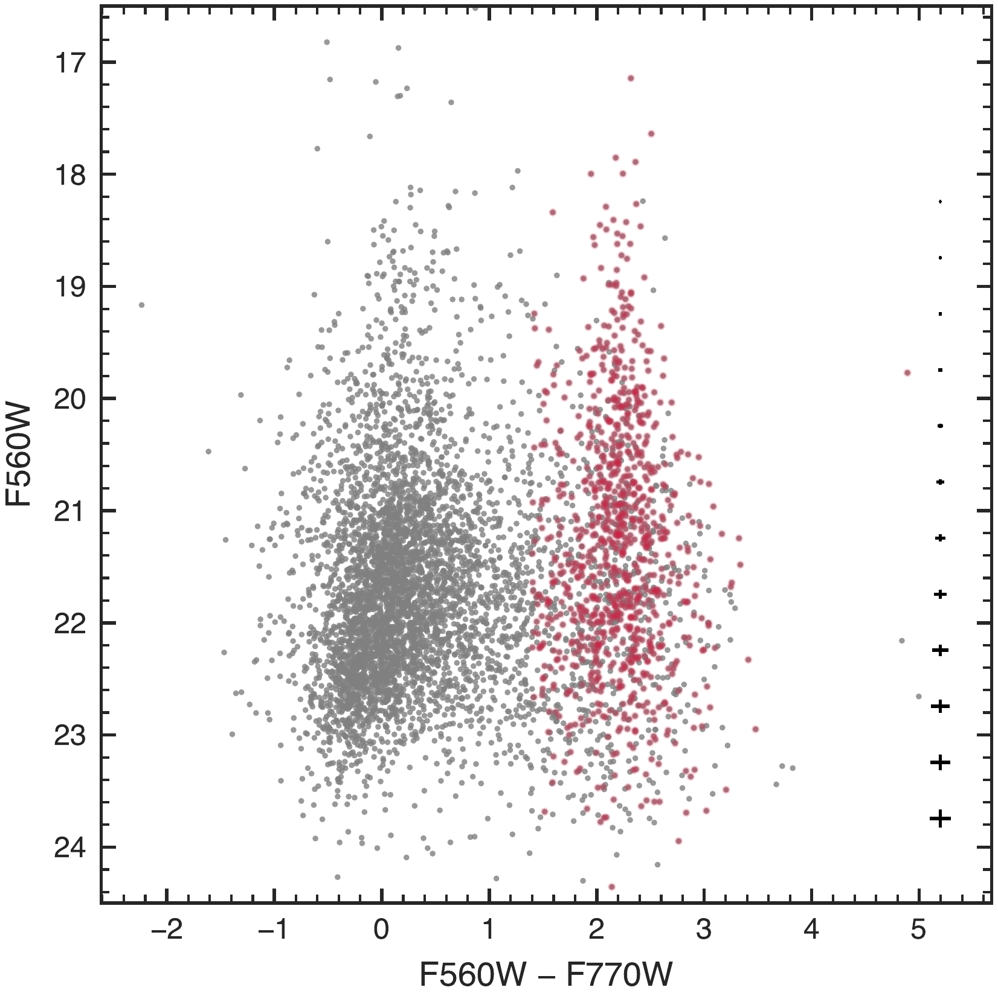
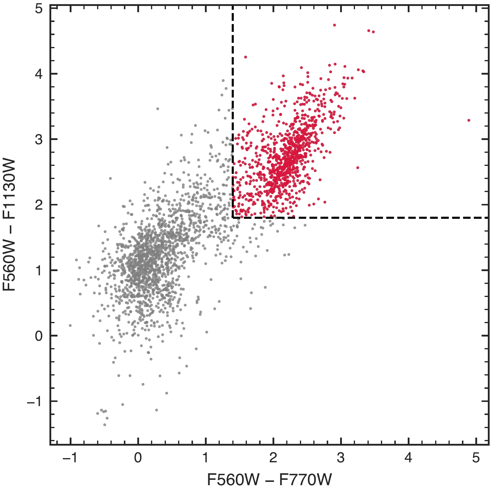

$\newcommand{\ensuremath}{}$
$\newcommand{\xspace}{}$
$\newcommand{\object}[1]{\texttt{#1}}$
$\newcommand{\farcs}{{.}''}$
$\newcommand{\farcm}{{.}'}$
$\newcommand{\arcsec}{''}$
$\newcommand{\arcmin}{'}$
$\newcommand{\ion}[2]{#1#2}$
$\newcommand{\textsc}[1]{\textrm{#1}}$
$\newcommand{\hl}[1]{\textrm{#1}}$
$\newcommand{\footnote}[1]{}$
$\newcommand{\mum}{\ifmmode{\rm \mu m}\else{\mum}\fi}$
$\newcommand{\Msun}{\ensuremath{{\rm M}_{\odot}}}$
$\newcommand{\kms}{km~s\ensuremath{^{-1}}}$
$\newcommand{\Teff}{\ensuremath{T_{\mathrm{eff}}}}$
$\newcommand{\Msuny}{\ensuremath{{\rm M}_{\odot}   {\rm yr}^{-1}}}$
$\newcommand{\chisq}{\ifmmode{\chi^{2} }\else{\chi^2}\fi}$
$\newcommand{\rchisq}{\ifmmode{\chi^{2} }\else{\chi^2_\nu}\fi}$
$\newcommand{\solar}{_{\sun}}$
$\newcommand{\mbol}{M_{\mathrm{bol}}}$
$\newcommand{\starbug}{\textsc{starbugii}}$
$\newcommand{\jwst}{\textit{JWST} }$
$\newcommand{\iras}{{\em IRAS}}$
$\newcommand{\spitzer}{{\em Spitzer }}$
$\newcommand{\miri}{\texttt{MIRI}}$
$\newcommand{\kband}{K_{s}}$
$\newcommand{\jhk}{\emph{JHK}_{s}}$
$\newcommand{\jmink}{J-K_{s}}$
$\newcommand{\Hi}{\mbox{\rm H{\small I}} }$
$\newcommand{\Hii}{\mbox{\rm H{\small II}} }$
$\newcommand{\Htwo}{H_{2}}$
$\newcommand{\slice}{_\mathrm{slice}}$
$\newcommand{\mone}{^{-1}}$
$\newcommand{\mtwo}{^{-2}}$
$\newcommand{\isoa}{iso-\alpha}$
$\newcommand{\isol}{iso-\lambda}$
$\newcommand{\mum}{\ifmmode{\rm \mu m}\else{\mum}\fi}$
$\newcommand{\Msun}{\ensuremath{{\rm M}_{\odot}}}$
$\newcommand{\kms}{km~s\ensuremath{^{-1}}}$
$\newcommand{\Teff}{\ensuremath{T_{\mathrm{eff}}}}$
$\newcommand{\Msuny}{\ensuremath{{\rm M}_{\odot}   {\rm yr}^{-1}}}$
$\newcommand{\chisq}{\ifmmode{\chi^{2} }\else{\chi^2}\fi}$
$\newcommand{\rchisq}{\ifmmode{\chi^{2} }\else{\chi^2_\nu}\fi}$
$\newcommand{\solar}{_{\sun}}$
$\newcommand{\mbol}{M_{\mathrm{bol}}}$
$\newcommand{\starbug}{\textsc{starbugii}}$
$\newcommand{\jwst}{\textit{JWST} }$
$\newcommand{\iras}{{\em IRAS}}$
$\newcommand{\spitzer}{{\em Spitzer }}$
$\newcommand{\miri}{\texttt{MIRI}}$
$\newcommand{\kband}{K_{s}}$
$\newcommand{\jhk}{\emph{JHK}_{s}}$
$\newcommand{\jmink}{J-K_{s}}$
$\newcommand{\Hi}{\mbox{\rm H{\small I}} }$
$\newcommand{\Hii}{\mbox{\rm H{\small II}} }$
$\newcommand{\Htwo}{H_{2}}$
$\newcommand{\slice}{_\mathrm{slice}}$
$\newcommand{\mone}{^{-1}}$
$\newcommand{\mtwo}{^{-2}}$
$\newcommand{\isoa}{iso-\alpha}$
$\newcommand{\isol}{iso-\lambda}$

# MICONIC: The spatial relationship between star formation and the AGN in Centaurus A revealed by JWST/MIRI

<mark>Appeared on: 2026-07-07</mark> -  _14 pages, 11 figures, submitted to MNRAS_

O. C. Jones, et al. -- incl., <mark>T. Henning</mark>

**Abstract:** Centaurus A (Cen A), the nearest active radio galaxy, hosts a warped dust disc formed in a gas-rich merger. We present $*JWST*$ /MIRI imaging in three filters, F560W, F770W, and F1130W, of this central disc over a $\sim4\times2$ kpc region to characterise its resolved mid-infrared stellar populations.The images reveal a system of extended dusty structures, previously identified with _Spitzer_ as an "oval dusty shell", now resolved into multiple loop-like features that are brightest in F1130W and closely associated with the warped disc.Colour–magnitude and colour–colour diagnostics reveal a distinct population of 928 red point sources with strong infrared excess, accounting for $\sim$ 36 per cent of sources with high-quality photometry in all three bands, spatially confined to the disc. These sources exhibit rising mid-infrared spectral slopes indicative of emission from warm dust. Their colours and spatial distribution are consistent with a population dominated by embedded young stellar objects, tracing recent ( $\sim10^{5}$ – $10^{6}$ yr) star formation within the disc.The strong geometric alignment of these sources with the disc, together with the lack of correlation with the radio jet, suggests that star formation in the central regions of Cen A is primarily regulated by merger-accreted gas, with no strong evidence for AGN jet--ISM interactions.

**Figure 4. -** F560W versus F560W--F770W colour--magnitude diagram for Cen A point sources. Grey points show all 2,558 sources; red points indicate the 928 objects with an infrared excess. Representative uncertainties as a function of magnitude are indicated on the right. (*fig:miri_57_cmd*)

**Figure 10. -** F560W versus F560W--F770W colour--magnitude diagram for Cen A point sources. Grey points show all 2,558 sources; red points indicate the 928 objects with an infrared excess. Representative uncertainties as a function of magnitude are indicated on the right. (*fig:miri_57_cmd*)

**Figure 5. -** Colour--colour diagram of $F560W-F770W$ versus $F560W-F1130W$ for the Cen A point-source sample. The dashed lines mark the adopted colour cuts used to select the red dust-enshrouded population. Symbols are colour-coded as in Fig. \ref{fig:miri_57_cmd} (*fig:miri_ccd*)

