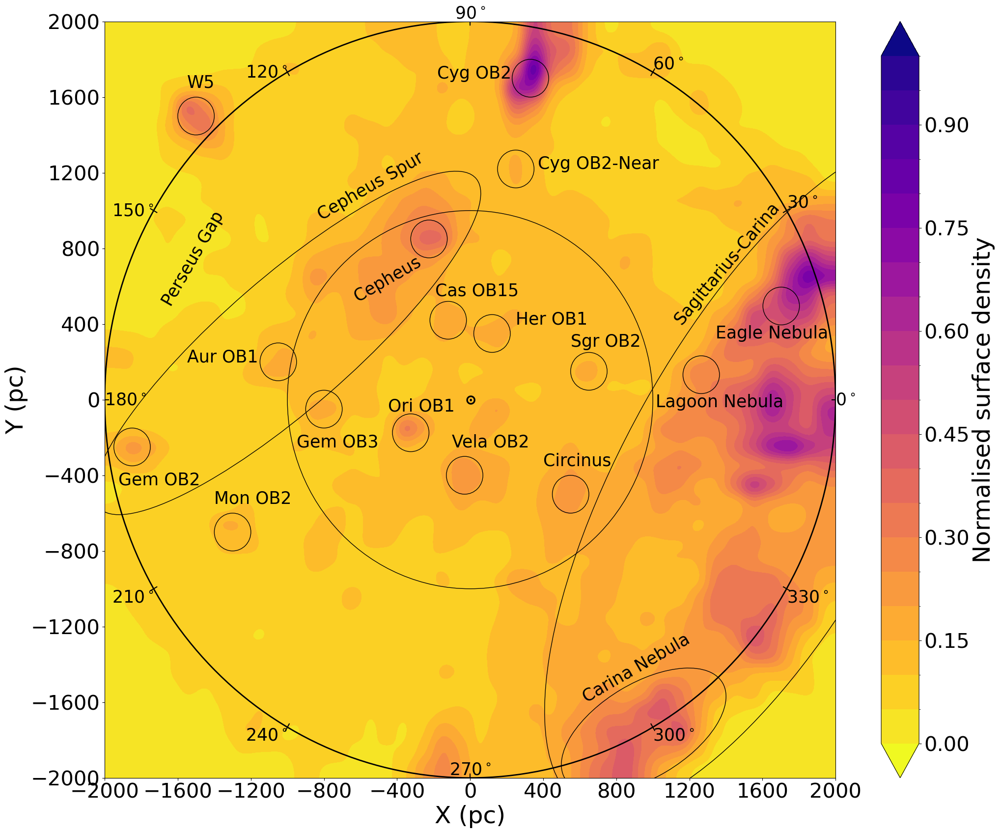
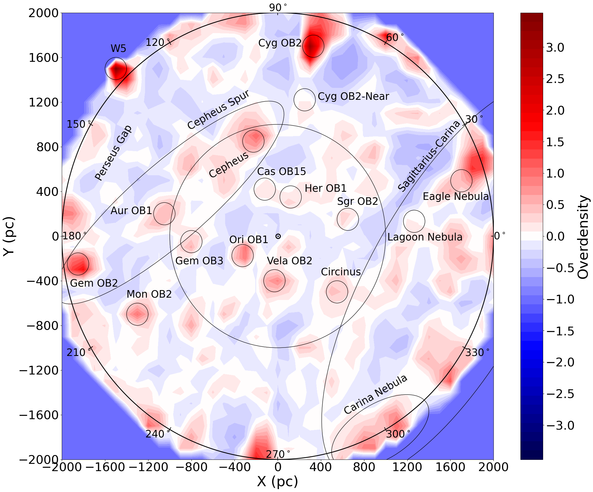
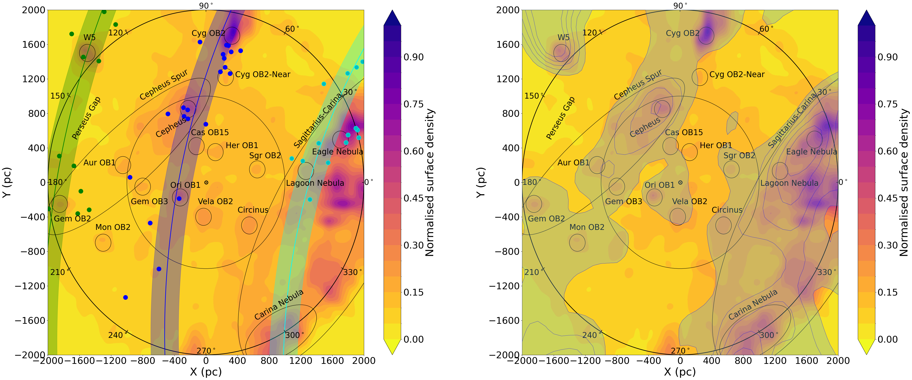
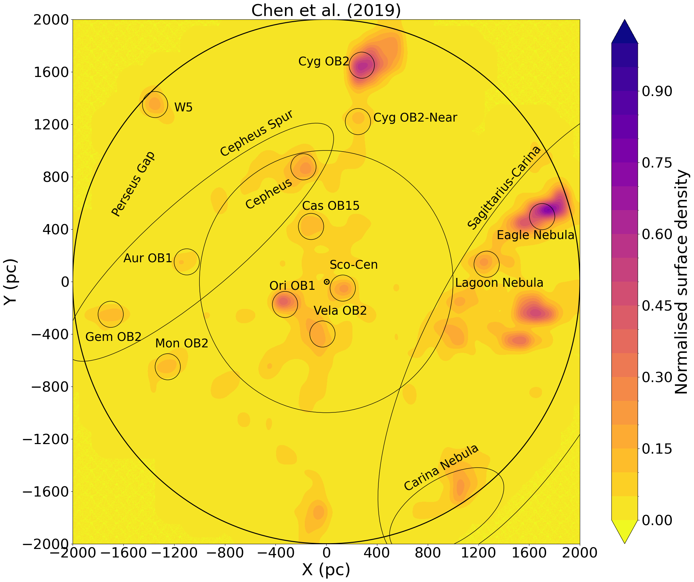
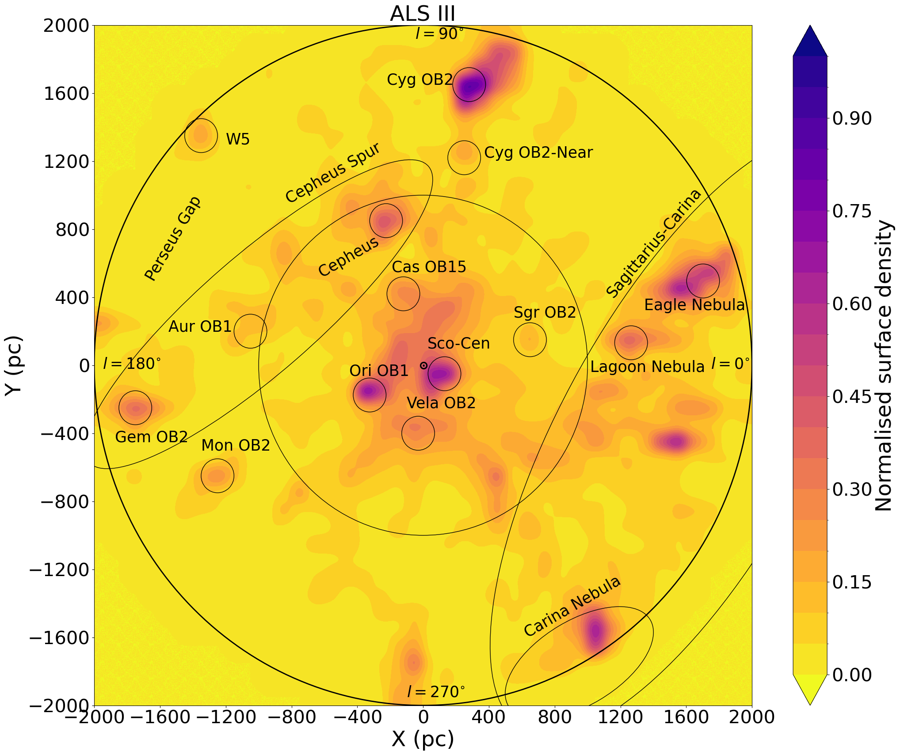
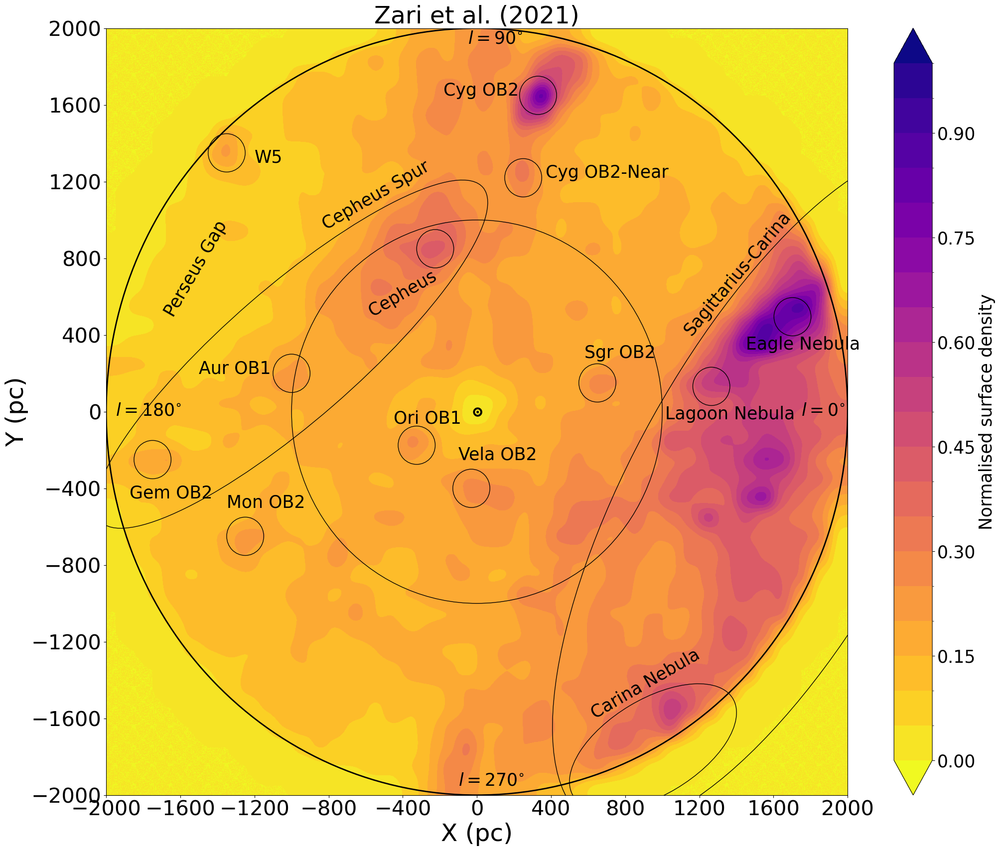
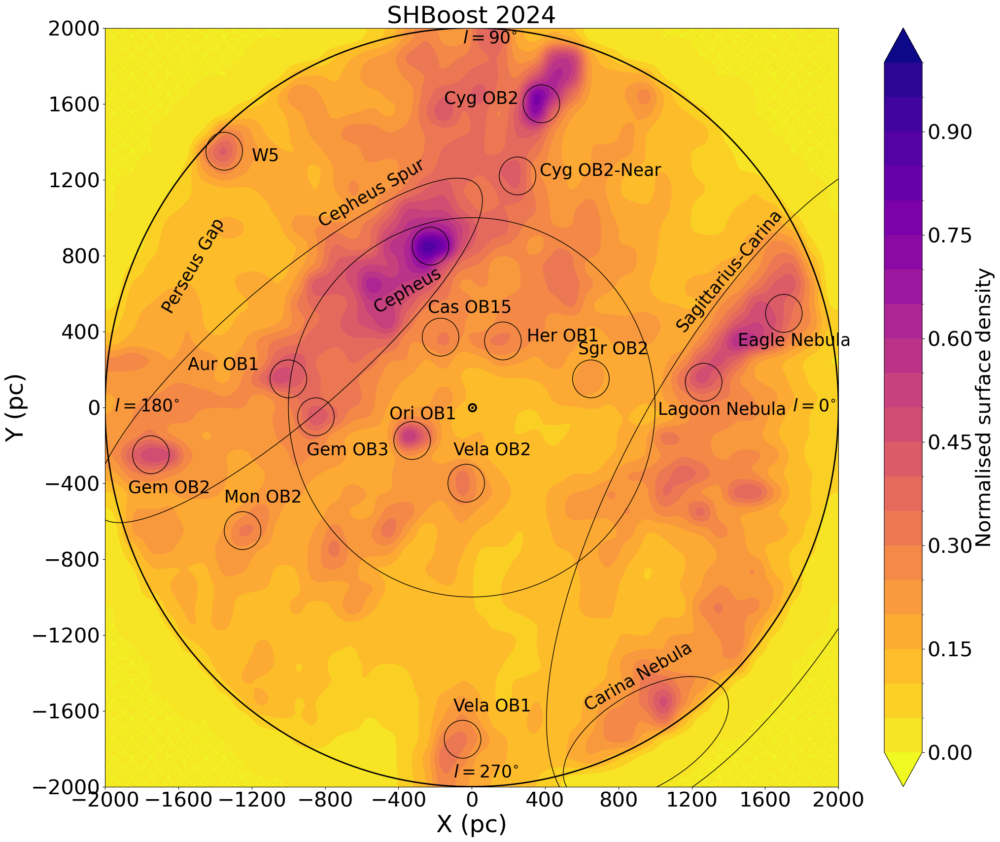
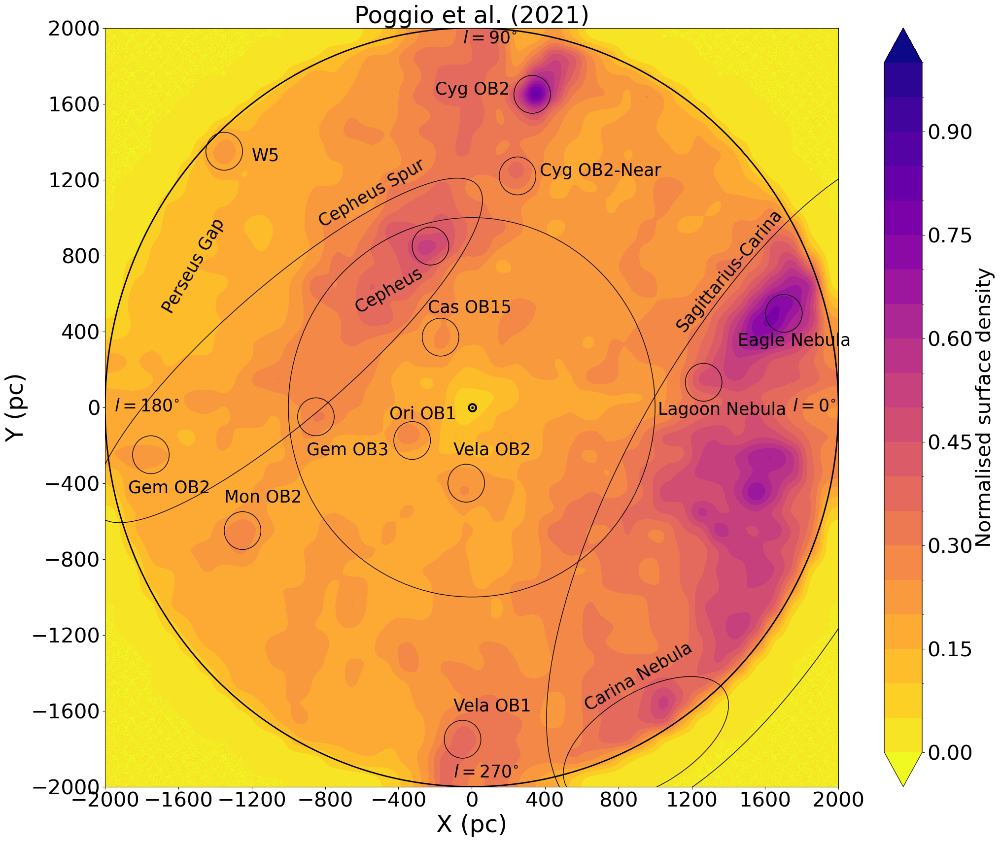
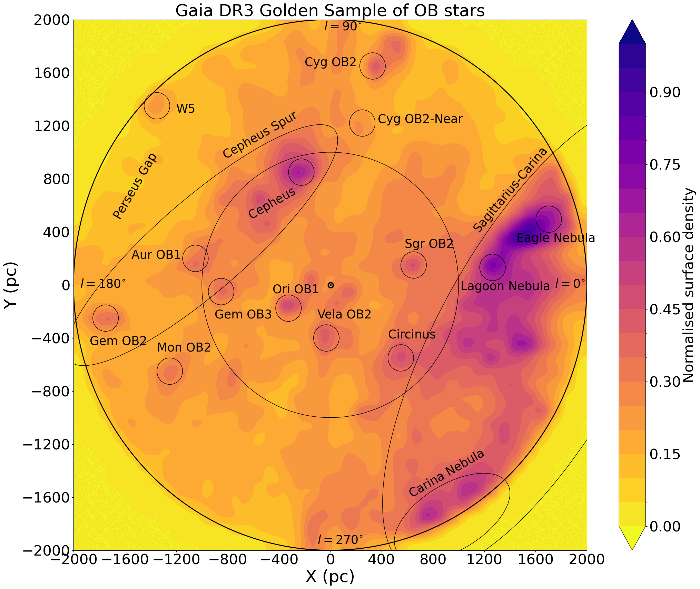

$\newcommand{\ensuremath}{}$
$\newcommand{\xspace}{}$
$\newcommand{\object}[1]{\texttt{#1}}$
$\newcommand{\farcs}{{.}''}$
$\newcommand{\farcm}{{.}'}$
$\newcommand{\arcsec}{''}$
$\newcommand{\arcmin}{'}$
$\newcommand{\ion}[2]{#1#2}$
$\newcommand{\textsc}[1]{\textrm{#1}}$
$\newcommand{\hl}[1]{\textrm{#1}}$
$\newcommand{\footnote}[1]{}$
$\newcommand{\kiril}[1]{\textcolor{magenta}{\textbf{KM: #1}}}$
$\newcommand{\arraystretch}{1.5}$
$\newcommand{\arraystretch}{1.3}$
$\newcommand{\arraystretch}{1.3}$
$\newcommand{\arraystretch}{1.3}$
$\newcommand{\thebibliography}{\DeclareRobustCommand{\VAN}[3]{##3}\VANthebibliography}$

# Unveiling the Milky Way with a Gaia DR3 census of OB-type stars within 2 kpc. I. Tracing local Galactic structure, massive star-forming regions and core-collapse supernova progenitors

<mark>Appeared on: 2026-07-09</mark> -  _24 pages, 17 figures, submitted to MNRAS. Comments welcome!_

A. L. Quintana, et al. -- incl., <mark>K. Maltsev</mark>

**Abstract:** O- and B-type stars are young and hot, thereby serving as vital tracers of the star formation and spiral arm structure of the Milky Way. At the dusk of the _Gaia_ DR3 era, a high-confidence and accurate catalogue appears timely. Here we have characterized a population of 105,971 OB-type stars (T $_{\rm eff} >$ 10,000 K; hereafter OB stars) within 2 kpc from the Sun, using an astro-photometric Bayesian inference tool. Our resulting map unveils a complex view of the young stellar populations across the thin disk, with prominent large-scale features such as the Cepheus Spur, the Giant Oval Cavity, and a segment of the Sagittarius-Carina spiral arm all visible. Their inhomogeneous spatial distribution implies that massive star formation has taken place clustered across a few highly concentrated regions. We find a correlation between the overdensities of OB stars and young open clusters ( $<$ 20 Myr), although OB stars can be better detected in high-extinction regions. We identify over 4200 OB stars as core-collapse supernova (ccSN) or direct-collapse black hole (BH) progenitor candidates, and therefore targets of interest for spectroscopic follow-up. Furthermore, we find no OB-type star ccSN progenitor to explode within the next 1 Myr within 100 pc, at which such an event could be harmful to Earth's biosphere. Finally, we identify more BH progenitors to collapse within the next 1 Myr than ccSN to explode, despite the former's much scarcer number - which could be indicative of a recent massive star formation burst in the local Milky Way.

**Figure 7. -** Left panel: normalised surface density of the 147,639 OB stars across the X-Y plane (X is positive towards the direction of Galactic Centre and Y towards the direction of Galactic rotation). The small annotations correspond to OB associations and/or massive star-forming regions, whilst the larger ones correspond to broader features, as described in Section \ref{population}. The inner circle encompasses a radius of $\sqrt{X^2+Y^2} =$ 1 kpc (i.e. the limit of the catalogue from \citetalias{Quintana2025}) whereas the outer circle represents our newer coverage with a radius of $\sqrt{X^2+Y^2} =$ 2 kpc containing the 105,971 OB stars of our census. Right panel; same as the left panel but displaying the overdensities of OB stars instead (as defined in Appendix \ref{technique_overdensities}), adopting a local density bandwidth of 0.1 kpc and mean density bandwith of 0.5 kpc. For both panels, we have also included ticks of Galactic longitude every 30 degrees. (*OBmap*)

**Figure 9. -** Left panel: Same as the left panel from Fig. \ref{OBmap} but with the fits of the Galactic spiral arms from [Reid, et. al (2019)](https://ui.adsabs.harvard.edu/abs/2019ApJ...885..131R), showing (from left to right) the Perseus, Orion-Cygnus and Sagittarius-Carina arms, assuming a thickness of 300 pc. Similarly to [Zari, et. al (2021)](https://ui.adsabs.harvard.edu/abs/2021A&A...650A.112Z), we have also colour-coded with dots the positions of the masers used for the fit, by inverting their parallax inferred from the VLBI measurements in [Reid, et. al (2019)](https://ui.adsabs.harvard.edu/abs/2019ApJ...885..131R) and propagating their 2D position into Epoch 2016 as in _Gaia_ DR3 using their proper motions. Right panel: same as the left panel from Fig. \ref{OBmap} but including the contours traced by the _Gaia_ OB stars from [Gaia Collaboration, et. al (2023)](https://ui.adsabs.harvard.edu/abs/2023A&A...674A..37G). (*OBmap_SpiralArms*)

**Figure 16. -** Same as Fig. \ref{OBmap} but for the selected external catalogues of OB(A) stars listed in Table \ref{CompCatalogues}. (*OBmap_others*)

