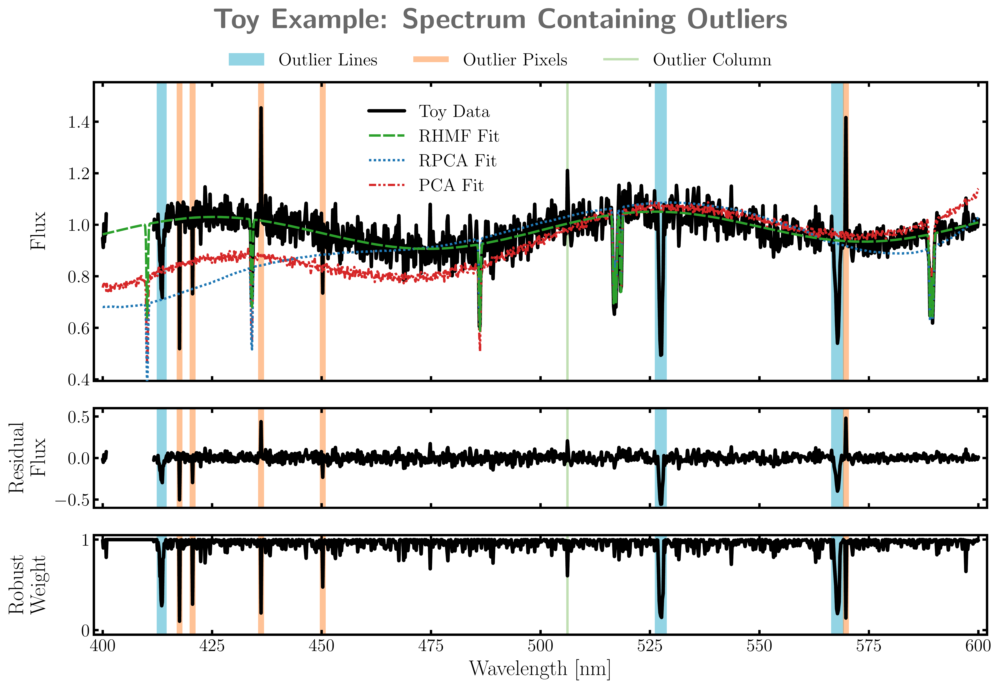
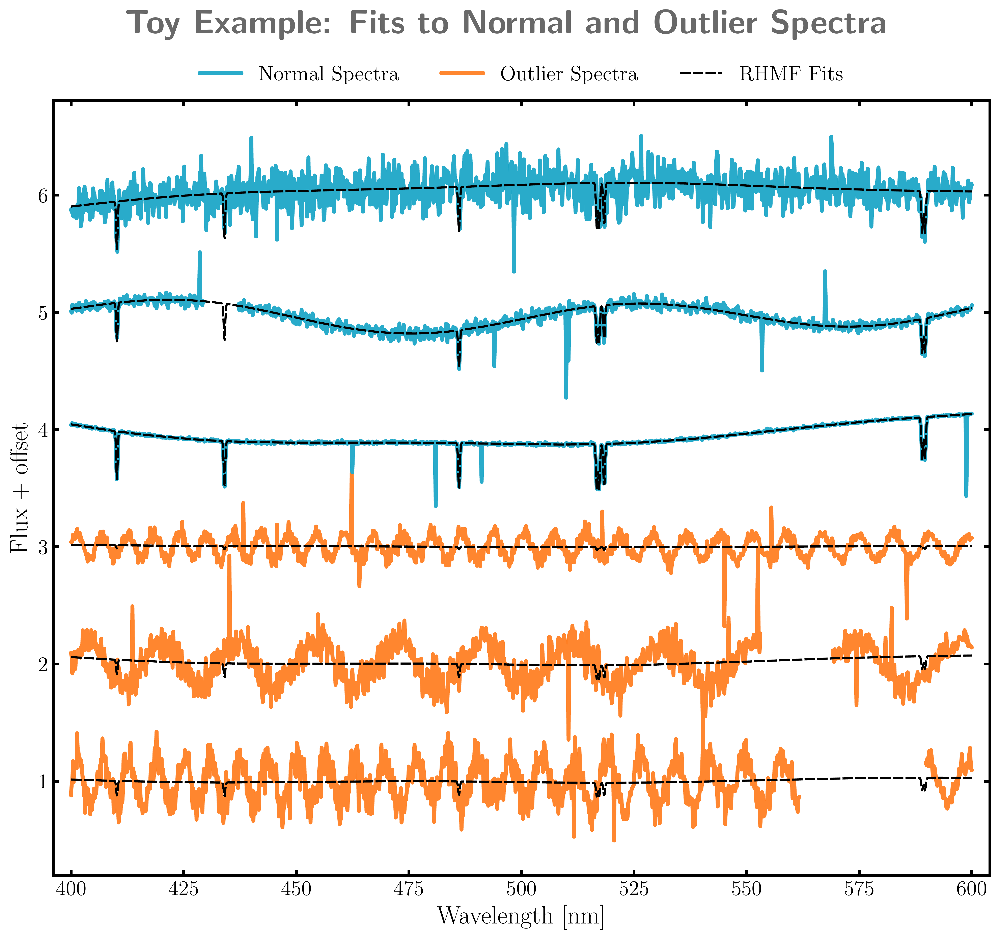
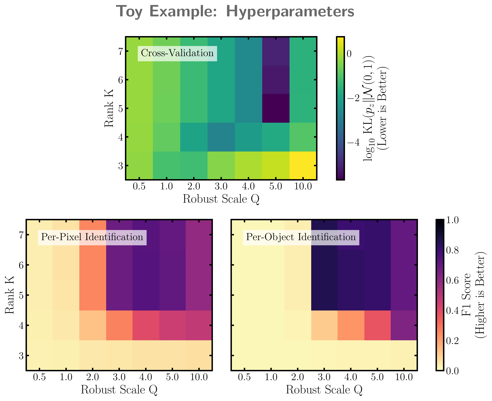

$\newcommand{\ensuremath}{}$
$\newcommand{\xspace}{}$
$\newcommand{\object}[1]{\texttt{#1}}$
$\newcommand{\farcs}{{.}''}$
$\newcommand{\farcm}{{.}'}$
$\newcommand{\arcsec}{''}$
$\newcommand{\arcmin}{'}$
$\newcommand{\ion}[2]{#1#2}$
$\newcommand{\textsc}[1]{\textrm{#1}}$
$\newcommand{\hl}[1]{\textrm{#1}}$
$\newcommand{\footnote}[1]{}$
$\newcommand{\add}[1]{{\color{blue}#1}}$
$\newcommand{\del}[1]{{\color{red}\sout{#1}}}$
$\newcommand{\maddm}[1]{{\color{blue}#1}}$
$\newcommand{\mdelm}[1]{{\color{red}#1}}$
$\newcommand{\tom}[1]{\textcolor{teal}{\textbf{TH says:} #1}}$
$\newcommand{\hogg}[1]{\textcolor{red}{\textbf{DWH says:} #1}}$
$\newcommand{\hoggtodo}[1]{\textcolor{magenta}{\textbf{HOGG TODO:} #1}}$
$\newcommand{\arc}[1]{\textcolor{Emerald}{\textbf{ARC says:} #1}}$
$\newcommand{\placeholder}[1]{\textcolor{blue}{[#1]}}$
$\newcommand\frontmatter@abstractheading{$
$ \begingroup$
$  \centering$
$\ifmodern\else\hskip-0.05\textwidth \fi \abstractname$
$  \vskip 1mm$
$  \par$
$ \endgroup$
$}$

# Robust Heteroskedastic Matrix Factorization: \   A Generalization of PCA that Flags Outliers and Handles Missing Data

<mark>Appeared on: 2026-07-10</mark> -  _27 pages, 9 figures. Submitted to ApJ_

T. Hilder, D. W. Hogg, A. R. Casey, <mark>H.-W. Rix</mark>

**Abstract:** $\noindent$ $\hsize$ = \textwidth $\leftskip$ =0.05 \textwidth $\rightskip$ = $\leftskip$ We present Robust Heteroskedastic Matrix Factorization (RHMF), a generalization of Principal Component Analysis (PCA) that is robust to outliers, handles per-feature uncertainties and missing data, and automatically flags per-feature and per-object anomalies.  RHMF is useful both in recovering a low-dimensional embedding unspoiled by bad data or anomalies, and in identifying those anomalies.  It utilises an iterative reweighting algorithm that implicitly maximizes a Student-t likelihood.  This admits an equivalent probabilistic interpretation as fitting a hierarchical model with per-data-point latent variances.  We deliver a fast \texttt{JAX} implementation, \texttt{Robusta-HMF} , and practical guidance for users. We demonstrate the ability of the model to identify and mitigate outliers of different classes.  Identification accuracy is contingent on the choice of hyperparameters, but we show that these can be set reliably by cross-validation.  We also apply RHMF to RVS spectra from Gaia DR3 to find main-sequence stars that are strange relative to their neighbors in color-magnitude space.  We highlight specific examples, including a known binary hosting a Be star, and M-dwarfs with subtle emission in the Ca II triplet lines, indicative of accretion or magnetic activity, which would not be obvious to identify by eye.

**Figure 1. -** Randomly selected noisy toy spectrum containing outlier absorptions lines, random outlier bad pixels, a pixel bad across many spectra, and a missing data segment. Top panel shows the data compared with the best-fit PCA (red, dashed-dotted), RPCA (blue, dotted) and RHMF (green, dashed) models. Middle panel shows the RHMF model-subtracted residuals, demonstrating that the model has ignored the outlier pixels and lines, making them easy to identify by eye. Bottom panel shows the inferred robust weights, showing that the outlier pixels and lines have been down-weighted by the model, also useful for identification. The PCA, RPCA, and RHMF models are all fit with $K=5$ basis vectors, and the RHMF model is fit with $Q=5$. (*fig:toy_residuals*)

**Figure 2. -** Noisy toy spectra randomly selected from across the training and test sets, with the best-fit RHMF model predictions (black, dashed) overlaid. The top 3 are "normal" spectra (blue), while the bottom 3 are outlier spectra (orange). In the normal spectra, the model picks up on the common structure and ignores pixel-level outliers, while in the outlier spectra the model does not attempt to fit the high-frequency sinusoidal structure at all, which is the intent. The shown model has $K=5$ and $Q=5$. (*fig:toy_spectra*)

**Figure 4. -** Top: Cross-validation scores (KL divergence from $\mathcal{N}(0,1)$, Eq. \eqref{eq:score}) for the grid of $Q$ and $K$ values. The score is minimized at $K=5$ and $Q=5$, which is the model shown in the other plots. Bottom left: F1 score for outlier identification on a per-object-per-pixel basis, based on a threshold of $0.5$ on the robust weights $w_{ij}^{\rm robust}$. Bottom right: F1 score for outlier identification on a per-object basis, based on a threshold of $0.9$ on the object-level weights $w_i^{\rm object}$. The F1 scores are calculated with respect to the known true outlier labels, and they demonstrate that both the best identification is obtained near the best validation score, and that picking $K$ too large does not dramatically degrade the outlier identification (*fig:cv*)

