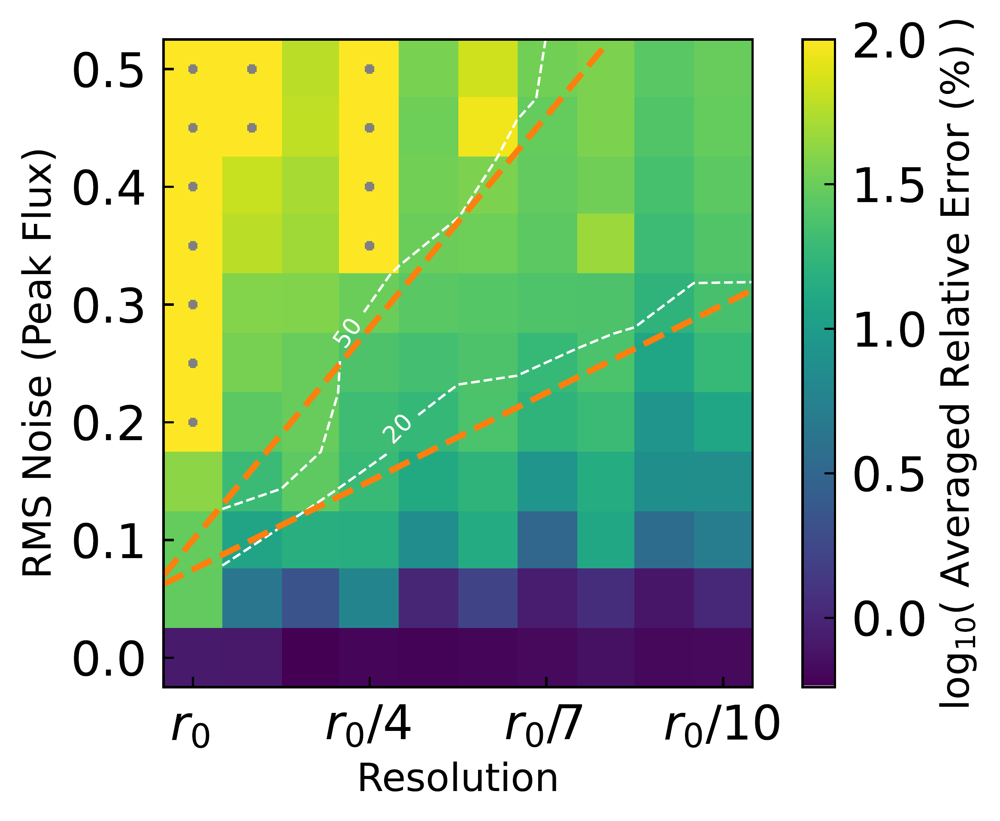
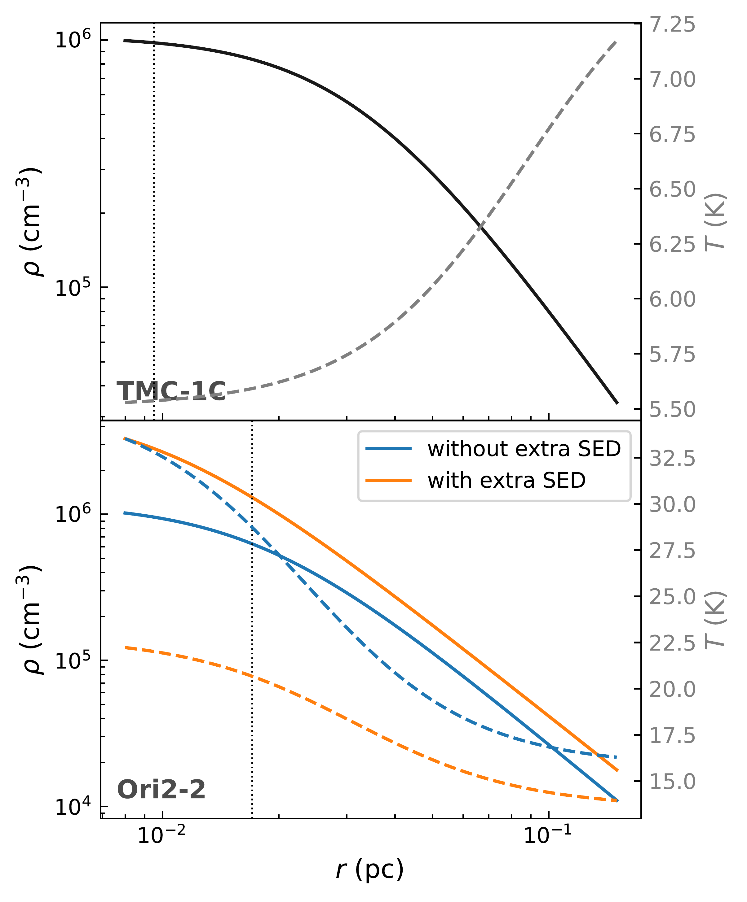
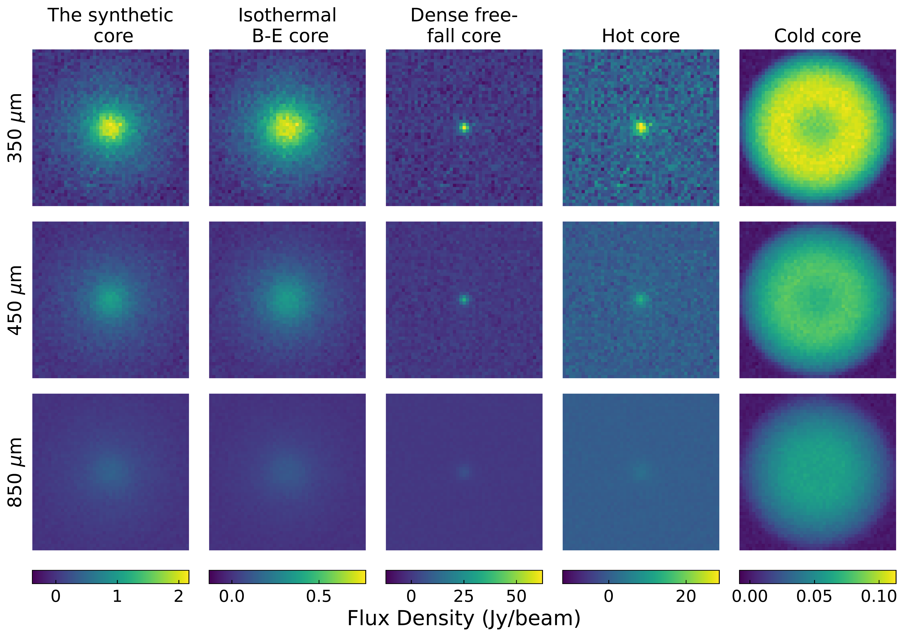

$\newcommand{\ensuremath}{}$
$\newcommand{\xspace}{}$
$\newcommand{\object}[1]{\texttt{#1}}$
$\newcommand{\farcs}{{.}''}$
$\newcommand{\farcm}{{.}'}$
$\newcommand{\arcsec}{''}$
$\newcommand{\arcmin}{'}$
$\newcommand{\ion}[2]{#1#2}$
$\newcommand{\textsc}[1]{\textrm{#1}}$
$\newcommand{\hl}[1]{\textrm{#1}}$
$\newcommand{\footnote}[1]{}$
$\newcommand{\vdag}{(v)^\dagger}$
$\newcommand\aastex{AAS\TeX}$
$\newcommand\latex{La\TeX}$
$\newcommand{\thebibliography}{\DeclareRobustCommand{\VAN}[3]{##3}\VANthebibliography}$

#   CARPP: Parametric Radiative-Transfer Fitting of Molecular Cores from Dust Continuum Data

<mark>Appeared on: 2026-07-10</mark> -  _13 pages, 9 figures. Accepted for publication in Monthly Notices of the Royal Astronomical Society (MNRAS)_

Y. Xing, et al. -- incl., <mark>S. Jiao</mark>

**Abstract:** The density profiles of dense molecular cores are important indicators of their physical and evolutionary states. Multi-wavelength dust continuum data offers excellent constraints on the density profile of cores. Here we introduce CARPP (Core Analysis via Radiative Transfer and Profile Parameters), a publicly available fitting package that generates optimized core density and temperature profiles based on parameterized radiative transfer calculations. CARPP assumes spherical symmetry and adopts physically motivated parametric forms for the density and temperature profiles, and uses dust continuum data for fitting. Tests on synthetic data show that CARPP achieves high accuracy, namely averaged relative errors of CARPP's seven parameters being $<20\%$ , when the data quality satisfies $\frac{\rm RMS    noise}{[\rm peak    flux]} < 0.025\times \frac{[r_0]}{\rm resolution} +0.05$ , where $r_0$ is the core's characteristic radius. We select the low-mass core TMC-1C and the high-mass core Ori2-2 to demonstrate CARPP's performance on real data. It classifies TMC-1C as a Bonnor-Ebert sphere in near-hydrostatic equilibrium, while Ori2-2 exhibits a power-law-dominated profile indicative of a collapsing envelope. This capability establishes CARPP as a powerful and versatile tool to classify the dynamical states of individual cores. It offers an optimal balance between physical fidelity and computational efficiency, serving as a practical, standardized alternative to both over-simplified SED analyses and complex, time-intensive 3D radiative-transfer modeling.

**Figure 2. -** 
  The averaged relative error of the seven parameters under different noise and resolution levels. The `+' (`-') marker indicates that the error is higher (lower) than the value indicated by the colorbar. The contours for 20\% and 50\% average relative error are shown in white, and the orange dashed lines represent the approximate visual estimates to these contours given by Equations \ref{equ:noise_resolu_20} and \ref{equ:noise_resolu_50}, respectively. Below each orange line, the averaged relative error of the seven fitted parameters remains smaller than the corresponding threshold (20\% or 50\%). (*fig:reso_sigma_err*)

**Figure 6. -** The fitted density and temperature profiles of TMC-1C and Ori2-2. The density profiles are in solid lines and the temperature profiles are in dashed lines. The vertical lines mark the best resolutions of the input data, which are 14$"$ and 8.5$"$, respectively. (*fig:nffig*)

**Figure 8. -** The dust continuum maps of the synthetic core in Section \ref{sec:CARPP_workflow} and the four other cores in Section \ref{sec:4syn}. The cores all have a diameter of 49 pixels, corresponding to 0.4 pc at $d=414$ pc.  (*fig:calamid_fig*)

