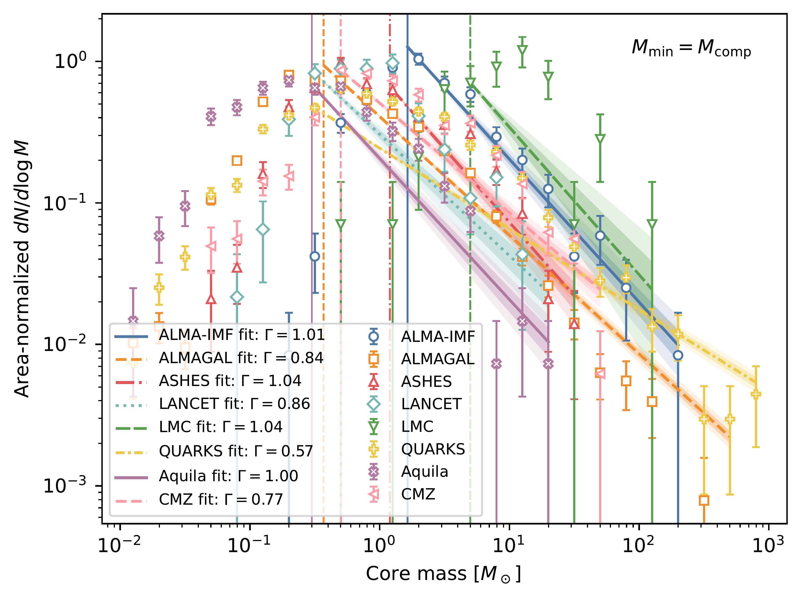
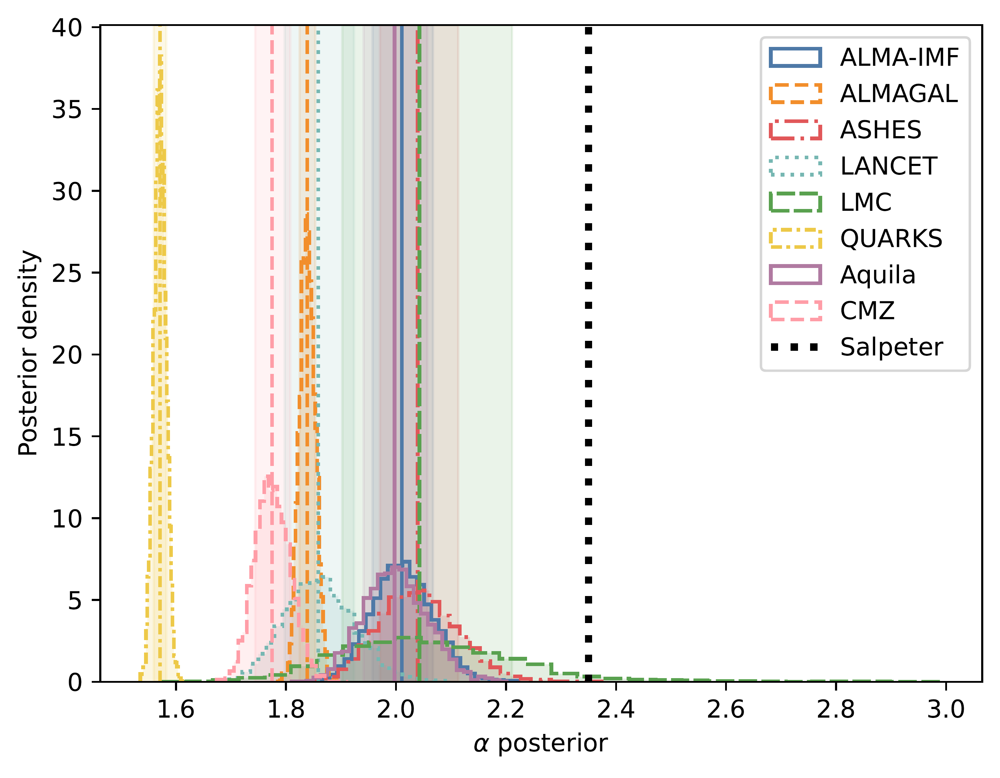
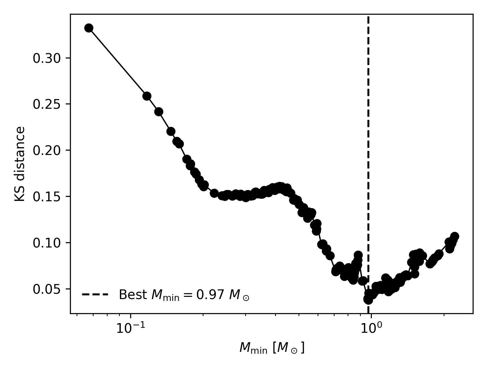
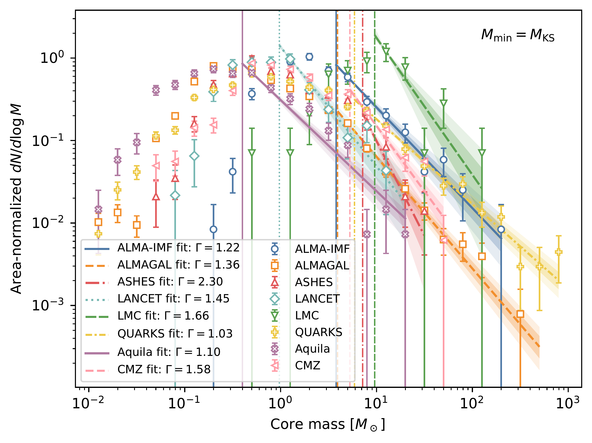
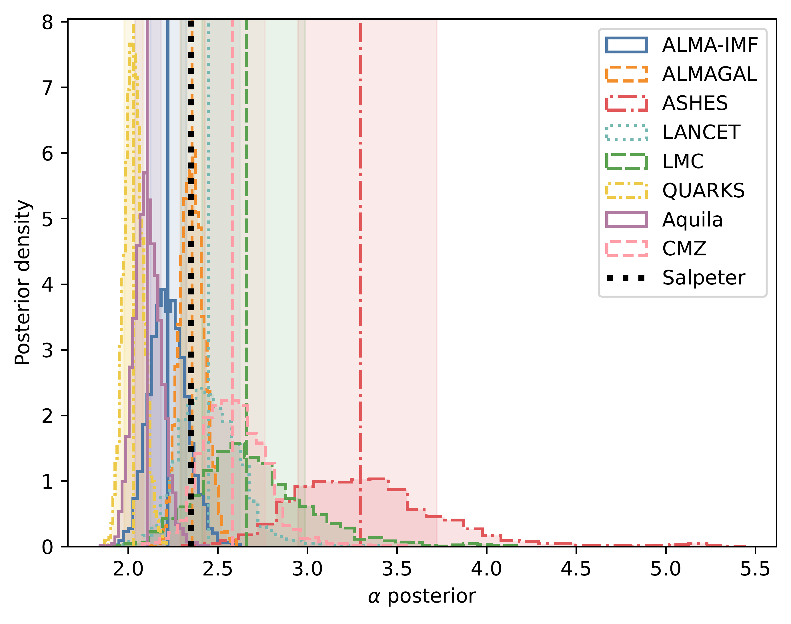

$\newcommand{\ensuremath}{}$
$\newcommand{\xspace}{}$
$\newcommand{\object}[1]{\texttt{#1}}$
$\newcommand{\farcs}{{.}''}$
$\newcommand{\farcm}{{.}'}$
$\newcommand{\arcsec}{''}$
$\newcommand{\arcmin}{'}$
$\newcommand{\ion}[2]{#1#2}$
$\newcommand{\textsc}[1]{\textrm{#1}}$
$\newcommand{\hl}[1]{\textrm{#1}}$
$\newcommand{\footnote}[1]{}$
$\newcommand\arcsec{\mbox{^{\prime\prime}}}$
$\newcommand\arcmin{\mbox{^\prime}}$
$\newcommand{◦ee}{\mbox{^\circ}}$
$\newcommand\arcdeg{\mbox{^\circ}}$
$\newcommand{\micron}{\mbox{\mum}}$
$\newcommand\farcs{\mbox{.\!\!^{\prime\prime}}}$
$\newcommand\farcm{\mbox{.\!\!^{\prime}}}$
$\newcommand\farcd{\mbox{.\!\!^{\circ}}}$
$\newcommand{\ion}[2]{\mbox{#1 {\sc #2}}}$
$\newcommand{\gpcc}{\mbox{g~cm^{-2}}}$
$\newcommand{\massrate}{\mbox{M_{\odot} \mathrm{yr}^{-1}}}$
$\newcommand{\kms}{\mbox{km s^{-1}}}$
$\newcommand{ç}{\mbox{cm^{-3}}}$
$\newcommand{\lsun}{\mbox{L_\odot}}$
$\newcommand{\msun}{\mbox{M_\odot}}$
$\newcommand{\jybeam}{\mbox{Jy beam^{-1}}}$
$\newcommand{\mjybeam}{\mbox{mJy beam^{-1}}}$
$\newcommand{\ujybeam}{\mbox{\muJy beam^{-1}}}$
$\newcommand{\actaa}{Acta Astron.}$
$\newcommand{\araa}{Annu. Rev. Astron. Astrophys.}$
$\newcommand{\areps}{Annu. Rev. Earth Planet. Sci.}$
$\newcommand{\aar}{Astron. Astrophys. Rev.}$
$\newcommand{\ab}{Astrobiol.}$
$\newcommand{\aj}{Astron. J.}$
$\newcommand{\ac}{Astron. Comput.}$
$\newcommand{\apart}{Astropart. Phys.}$
$\newcommand{\apj}{Astrophys. J.}$
$\newcommand{\apjl}{Astrophys. J. Lett.}$
$\newcommand{\apjs}{Astrophys. J. Suppl. Ser.}$
$\newcommand{\ao}{Appl. Opt.}$
$\newcommand{\apss}{Astrophys. Space Sci.}$
$\newcommand{\aap}{Astron. Astrophys.}$
$\newcommand{\aapr}{Astron. Astrophys. Rev.}$
$\newcommand{\aaps}{Astron. Astrophys. Suppl.}$
$\newcommand{\baas}{Bull. Am. Astron. Soc.}$
$\newcommand{\caa}{Chin. Astron. Astrophys.}$
$\newcommand{\cjaa}{Chin. J. Astron. Astrophys.}$
$\newcommand{\cqg}{Class. Quantum Gravity}$
$\newcommand{\epsl}{Earth Planet. Sci. Lett.}$
$\newcommand{\frass}{Front. Astron. Space Sci.}$
$\newcommand{\gal}{Galaxies}$
$\newcommand{\gca}{Geochim. Cosmochim. Acta}$
$\newcommand{\grl}{Geophys. Res. Lett.}$
$\newcommand{\icarus}{Icarus}$
$\newcommand{\jatis}{J. Astron. Telesc. Instrum. Syst.}$
$\newcommand{\jcap}{J. Cosmol. Astropart. Phys.}$
$\newcommand{\jgr}{J. Geophys. Res.}$
$\newcommand{\jgrp}{J. Geophys. Res.: Planets}$
$\newcommand{\jqsrt}{J. Quant. Spectrosc. Radiat. Transf.}$
$\newcommand{\lrca}{Living Rev. Comput. Astrophys.}$
$\newcommand{\lrr}{Living Rev. Relativ.}$
$\newcommand{\lrsp}{Living Rev. Sol. Phys.}$
$\newcommand{\memsai}{Mem. Soc. Astron. Italiana}$
$\newcommand{\mnras}{Mon. Not. R. Astron. Soc.}$
$\newcommand{\nat}{Nature}$
$\newcommand{\nastro}{Nat. Astron.}$
$\newcommand{\ncomms}{Nat. Commun.}$
$\newcommand{\nphys}{Nat. Phys.}$
$\newcommand{\na}{New Astron.}$
$\newcommand{\nar}{New Astron. Rev.}$
$\newcommand{\physrep}{Phys. Rep.}$
$\newcommand{\pra}{Phys. Rev. A}$
$\newcommand{\prb}{Phys. Rev. B}$
$\newcommand{\prc}{Phys. Rev. C}$
$\newcommand{\prd}{Phys. Rev. D}$
$\newcommand{\pre}{Phys. Rev. E}$
$\newcommand{\prl}{Phys. Rev. Lett.}$
$\newcommand{\psj}{Planet. Sci. J.}$
$\newcommand{\planss}{Planet. Space Sci.}$
$\newcommand{\pnas}{Proc. Natl Acad. Sci. USA}$
$\newcommand{\procspie}{Proc. SPIE}$
$\newcommand{\pasa}{Publ. Astron. Soc. Aust.}$
$\newcommand{\pasj}{Publ. Astron. Soc. Jpn}$
$\newcommand{\pasp}{Publ. Astron. Soc. Pac.}$
$\newcommand{\raa}{Res. Astron. Astrophys.}$
$\newcommand{\rmxaa}{Rev. Mexicana Astron. Astrofis.}$
$\newcommand{\sci}{Science}$
$\newcommand{\sciadv}{Sci. Adv.}$
$\newcommand{\solphys}{Sol. Phys.}$
$\newcommand{\sovast}{Soviet Astron.}$
$\newcommand{\ssr}{Space Sci. Rev.}$
$\newcommand{\uni}{Universe}$

# $\Large$ How Should We Understand Core Mass Function?: $\large$ A Memo of the CMF2IMF Conference at ESO Garching

<mark>Appeared on: 2026-07-14</mark> -  _In the spirit of the CMF2IMF conference at ESO Garching, the self-organized memo is to review CMF efforts, discussions, and future perspectives. The CMF4All code for wider community usage can be found at this https URL_

<mark>F. Xu</mark>, et al.

**Abstract:** The origin of the stellar initial mass function (IMF) remains one of the central questions in astronomy. Nearly three decades ago, the resemblance between the core mass function (CMF) and the IMF inspired the community that stellar mass spectrum might be imprinted early in molecular-cloud cores and then mapped to the IMF through a simple efficiency factor. It has become gradually clear, however, that this apparent mapping involves multiple non-linear physical processes. Motivated by the spirit of the CMF2IMF conference at ESO Garching, this memo first reviews the historical quest to understand the origin of the IMF, and then sets the stage for building a shared understanding of current CMF measurements. We therefore compile several observational core catalogues at various environments and evolutionary stages into a common framework, implemented in the public Python package \texttt{CMF4All} . We show that the inferred high-mass CMF slope depends strongly on the adopted minimum fitting mass. Significantly steep slope is observed in the early-stage sample, indicating potentially evolving mass function in highest-mass slope. We conclude by outlining future directions to spare more efforts for both observers, numerical simulation and theoretical sides.

**Figure 2. -** **Completeness-based CMF fits and posterior distributions of the fitted slopes.**
Top: Differential CMFs for the surveys included in this comparison. For each survey, the high-mass tail is fitted with a single power law above the adopted completeness mass, $M_{\min}=M_{\rm comp}$. The slopes shown for the CMF fits are expressed in the logarithmic convention, $dN/d\log M \propto M^{-\Gamma}$.
Bottom: Posterior distributions of the corresponding linear power-law slope, $\alpha=\Gamma+1$, shown as colour-matched histograms. Each posterior is generated from 10,000 Monte-Carlo realizations, and the shaded region marks the median value with the 16th--84th percentile interval. The black dashed vertical line indicates the Salpeter slope, $\alpha=2.35$. This figure illustrates the survey-to-survey variation obtained when the minimum fitting mass is tied to each survey's completeness limit.
 (*fig:cmf_mcomp_fit*)

**Figure 3. -** **Selection of the minimum fitting mass using the KS distance.** Here shows an example of the LANCET survey core sample. The KS distance is shown as a function of the candidate minimum fitting mass, $M_{\min}$, for the LANCET core catalogue. For each trial $M_{\min}$, a single power law is fitted to the unbinned core masses above that threshold, and $D_{\rm KS}$ is computed between the empirical cumulative distribution of the fitted tail and the best-fitting power-law model. The minimum of the curve defines the KS-selected minimum fitting mass, $M_{\rm KS}$, used in the uniform fitting procedure.
 (*fig:ks-show*)

**Figure 4. -** **KS-based CMF fits and posterior distributions of the fitted slopes.**
Top: Differential CMFs for the surveys included in this comparison. For each survey, the high-mass tail is fitted with a single power law above the KS-selected minimum fitting mass, $M_{\min}=M_{\rm KS}$. The slopes shown for the CMF fits are expressed in the logarithmic convention, $dN/d\log M \propto M^{-\Gamma}$.
Bottom: Posterior distributions of the corresponding linear power-law slope, $\alpha=\Gamma+1$, shown as colour-matched histograms. Each posterior is generated from 10,000 Monte-Carlo realizations, and the shaded region marks the median value with the 16th--84th percentile interval. The black dashed vertical line indicates the Salpeter slope, $\alpha=2.35$. This figure illustrates the survey-to-survey variation obtained when the minimum fitting mass is tied to each survey's $M_{\rm KS}$.
 (*fig:cmf_mks_fit*)

