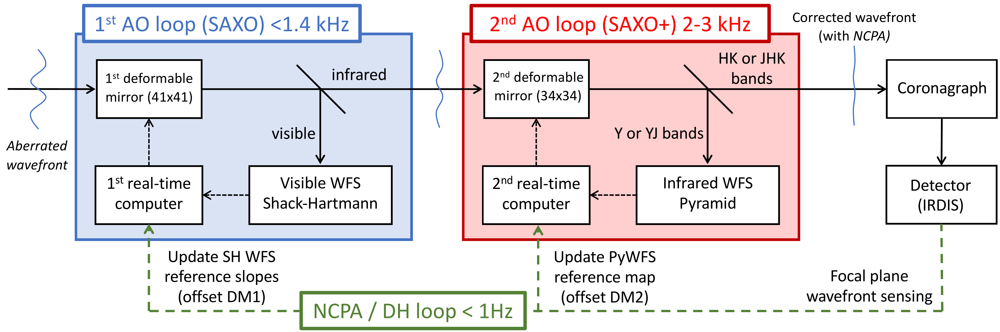
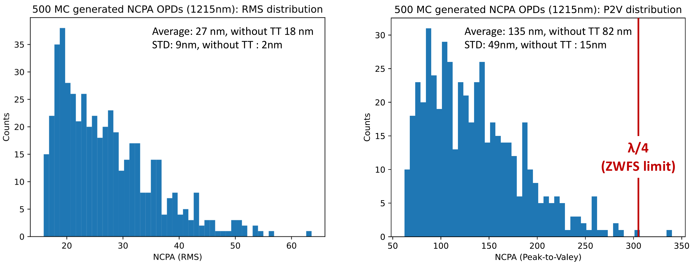
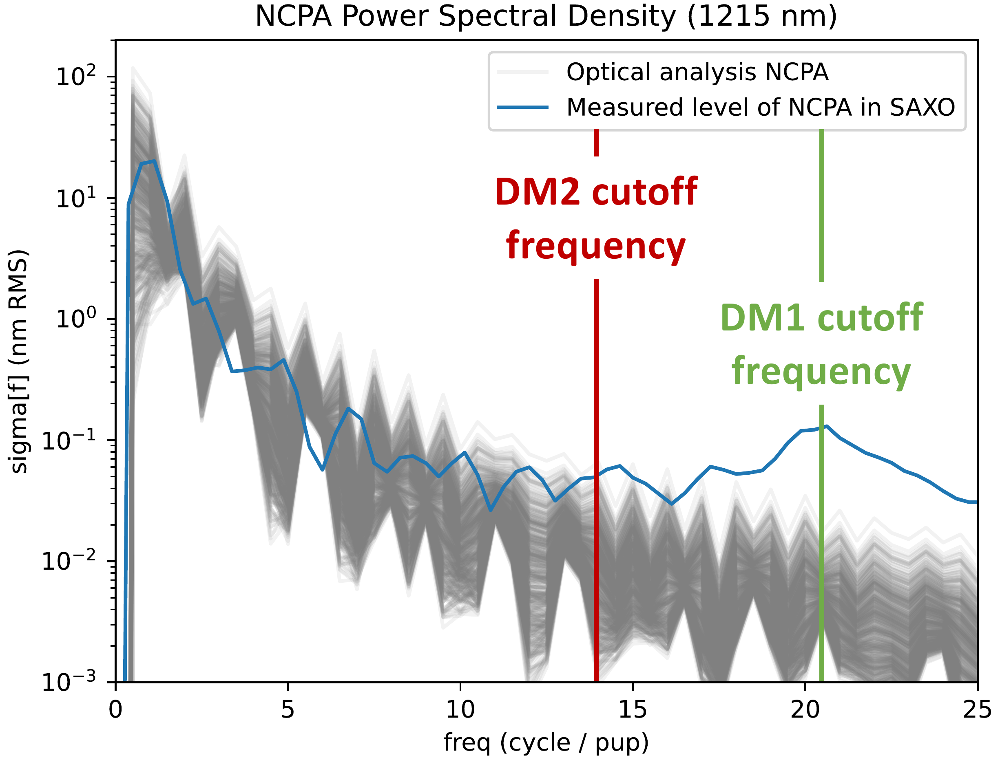

$\newcommand{\ensuremath}{}$
$\newcommand{\xspace}{}$
$\newcommand{\object}[1]{\texttt{#1}}$
$\newcommand{\farcs}{{.}''}$
$\newcommand{\farcm}{{.}'}$
$\newcommand{\arcsec}{''}$
$\newcommand{\arcmin}{'}$
$\newcommand{\ion}[2]{#1#2}$
$\newcommand{\textsc}[1]{\textrm{#1}}$
$\newcommand{\hl}[1]{\textrm{#1}}$
$\newcommand{\footnote}[1]{}$
$\newcommand{\jma}[1]{\textcolor{cyan!20!green}{[#1] \textbf{(JMa)}}}$
$\newcommand{\baselinestretch}{1.0}$

# SAXO+, the second-stage adaptive optics for SPHERE: NCPA compensation and dark-hole loop with a pyramid wavefront sensor

<mark>Appeared on: 2026-07-14</mark> -  _9 pages, 4 figures, proceedings of SPIE Astronomical Telescopes + Instrumentation 2026, 14150-105_

J. Mazoyer, et al. -- incl., <mark>G. Chauvin</mark>

**Abstract:** The SAXO \texttt{+} upgrade of the VLT/SPHERE adaptive optics system introduces a second-stage near-infrared pyramid wavefront sensor to improve high-contrast imaging, making accurate calibration of non-common path aberrations (NCPAs) essential to fully exploit its performance. This work refines the expected level of NCPAs in SAXO \texttt{+} and presents the calibration procedures developed for static NCPA compensation and focal-plane dark-hole control. Monte Carlo simulations based on an updated Zemax optical model were used to estimate the NCPA error budget. These simulations are in good agreement with previous measurements on SPHERE and with the assumptions adopted in earlier performance studies. We also propose a calibration strategy that offloads most static aberration correction to the first-stage deformable mirror while preserving the second-stage mirror stroke for high-speed adaptive optics correction. These results validate the expected SAXO \texttt{+} optical quality and establish the calibration framework required for efficient NCPA compensation and focal-plane wavefront control during future on-sky operations.

**Figure 1. -** **SAXO\texttt{+** outline}. In blue: current SAXO system. In red: second loop of SAXO\texttt{+}. In green: NCPA correction (adapted from Goulas et al. 2026[Goulas, et. al (2026)](https://www.aanda.org/articles/aa/abs/2026/04/aa56168-25/aa56168-25.html)). (*fig:saxo_3loops*)

**Figure 2. -** Distribution of NCPA level in RMS (left) and peak-2-valley (right) randomly generated with SAXO\texttt{+} optical model. (*fig:NCPA_RMS_P2V*)

**Figure 3. -**  Power spectral density of generated NCPA OPD maps (in grey) compared to current level measured in SAXO (in blue). (*fig:ncpa_PSD_compar_Zelda*)

