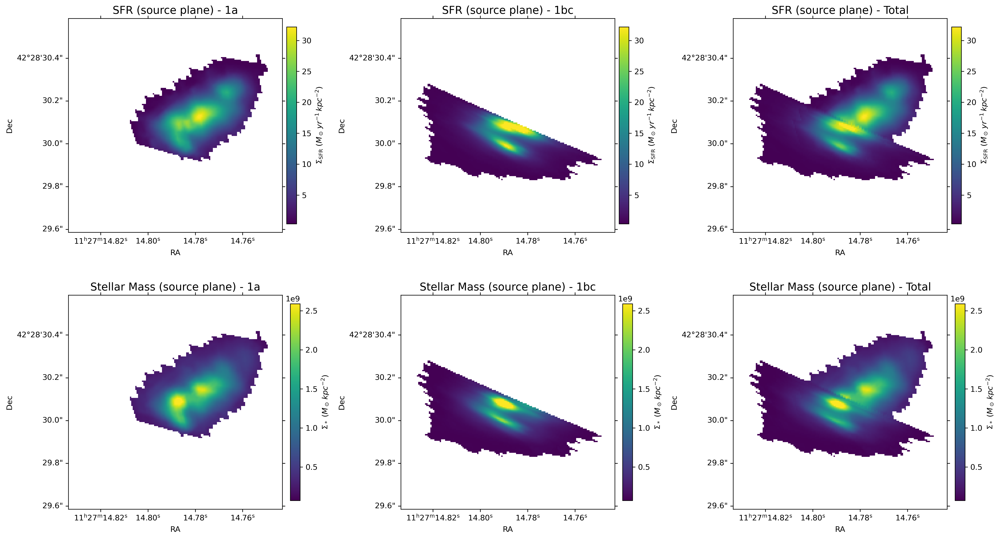

$\newcommand{\ensuremath}{}$
$\newcommand{\xspace}{}$
$\newcommand{\object}[1]{\texttt{#1}}$
$\newcommand{\farcs}{{.}''}$
$\newcommand{\farcm}{{.}'}$
$\newcommand{\arcsec}{''}$
$\newcommand{\arcmin}{'}$
$\newcommand{\ion}[2]{#1#2}$
$\newcommand{\textsc}[1]{\textrm{#1}}$
$\newcommand{\hl}[1]{\textrm{#1}}$
$\newcommand{\footnote}[1]{}$
$\newcommand{\vdag}{(v)^\dagger}$
$\newcommand\aastex{AAS\TeX}$
$\newcommand\latex{La\TeX}$

# Gravitationally Lensed View of DSFG-1 in PLCK G165.7+67.0: Strong Dust Emission and Spatially Resolved Stellar Population Analysis with JWST and SMA

<mark>Appeared on: 2026-07-14</mark> -  _16 pages, 9 figures, 3 tables, accepted by ApJ_

Z. Yan, et al. -- incl., <mark>F. Xu</mark>

**Abstract:** We present a detailed stellar population analysis of the strongly lensed dusty star-forming galaxy (DSFG) PLCK G165.7+67.0 DSFG-1 at $z = 2.236$ , combining JWST NIRCam imaging with new Submillimeter Array (SMA) observations.This source is multiply imaged into two lensed components: image 1a, with a moderate magnification factor of $\mu \sim 5$ , and image 1bc, with an extreme magnification factor of $\mu \sim 40$ .The new SMA observations detect significant dust continuum emission at 225 GHz and 273 GHz, with combined flux densities of $S_{\rm cont}=(1.19\pm0.38)$ mJy in image 1a and $S_{\rm cont}=(10.02\pm0.85)$ mJy in image 1bc, indicating active star formation at sub-kpc scale.Based on the integrated SED modeling, DSFG-1 exhibits a lensing amplification-corrected stellar mass of $M_{\star} = (1.2 \pm 0.4) \times 10^{10} M_{\odot}$ ,and a star-formation rate (SFR) of $(103 \pm 14) M_{\odot} \mathrm{yr^{-1}}$ ,similar to previous $H\alpha$ -based results, placing it four times above the star-forming main sequence at this redshift.Its location on the size–mass plane and its morphological properties suggest that the system occupies a transitional phase between star-forming late-type galaxies and compact early-type systems. Together with its elevated star-formation activity, this is consistent with a rapidly evolving galaxy observed during Cosmic Noon.We further investigate the spatially resolved stellar population properties, and found significant spatial variations in stellar age and dust attenuation.These results point to a non-uniform star-formation history and highlight the complex interplay between dust geometry, stellar growth, and gravitational lensing, consistent with a merger scenario.

**Figure 4. -** 
    JWST NIRCam RGB images (F115W, F277W, and F444W) overlaid with SMA continuum contours for the lensed components of G165-DSFG-1 and the corresponding SED fitting results.
    Panels **_a)**_ and **_b)**_ show the JWST RGB images of the northern Arc 1a and the southern Arc 1bc in the image plane, respectively, with SMA continuum contours overlaid.
    The inset in panel **_b)**_ shows the corresponding JWST F115W grayscale image of Arc 1bc. The red circle marks a likely foreground object projected onto Arc 1b, which is not associated with the lensed source.
    The Arc 3c of DSFG-3 is also visible in **_b)**_ and is labeled accordingly.
    Panels **_d)**_ and **_e)**_ present the best-fit SEDs of arcs 1a and 1bc derived in the source plane.
    Panel **_c)**_ shows the reconstructed source-plane JWST RGB image with SMA continuum contours for the combined DSFG-1 system, while panel **_f)**_ presents the global SED fitting result of DSFG-1.
    In panels **_a)**_ and **_b)**_, SMA contours are shown at $-4\sigma$(dashed) and $4\sigma$, $7\sigma$, $10\sigma$(solid), where $\sigma = 7.892$ MJy sr$^{-1}$. In panel **_c)**_, SMA contours are shown at $-2\sigma$(dashed) and $4\sigma$, $6\sigma$, $8\sigma$(solid), with the same noise level $\sigma = 7.892$ MJy sr$^{-1}$.
    The source-plane beam, indicated in the lower left corner of panel **_c)**_, is derived by projecting the image-plane SMA beams of arcs 1a and 1bc through the gravitational lensing model and averaging the resulting source-plane beams.
     (*fig:SMA*)

**Figure 6. -** Spatially resolved image-plane properties of Arc 1bc. The panels are the same as in Figure \ref{fig:image_plane_1a}, but for Arc 1bc. The grey circle indicates the position of a foreground source, which was excluded from the analysis. (*fig:image_plane_1bc*)

**Figure 8. -** Resolved source-plane surface density maps of G165 DSFG-1 derived from the spatially resolved SED fitting. The top row shows the star formation rate surface density ($\Sigma_{\rm SFR}$), while the bottom row presents the stellar mass surface density ($\Sigma_{\rm M_*}$). From left to right, the panels show the independent source-plane reconstructions derived from image 1a, image 1bc, and the combined reconstruction using both lensed images.
    The stellar mass reconstructions consistently recover a bimodal morphology with two dominant mass concentrations separated by $\sim1.3$ kpc. In contrast, the SFR reconstructions exhibit more complex and reconstruction-dependent substructures, likely reflecting the combined effects of differential magnification, lensing geometry, and limited spatial resolution. The highly magnified 1bc reconstruction provides stronger constraints on the extended morphology of the system. See Section 4.3 for further discussion. (*fig:source_prop*)

