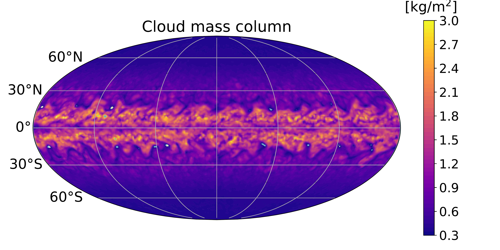
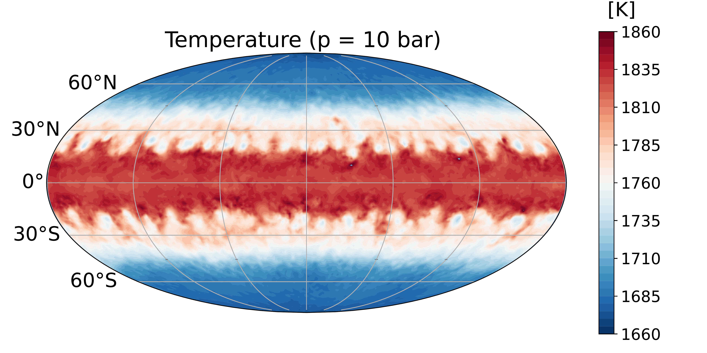
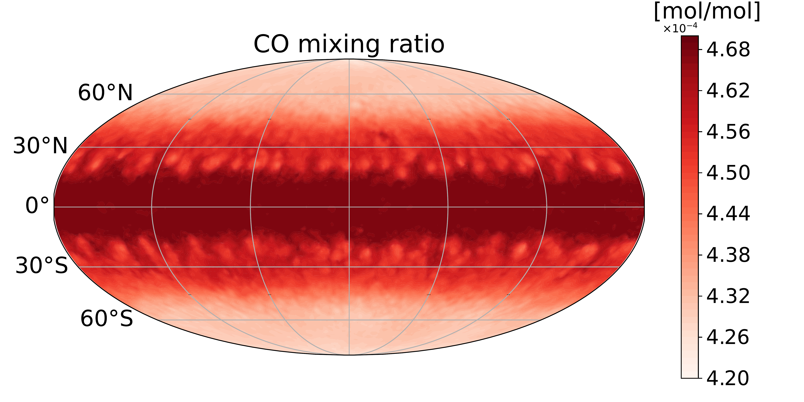
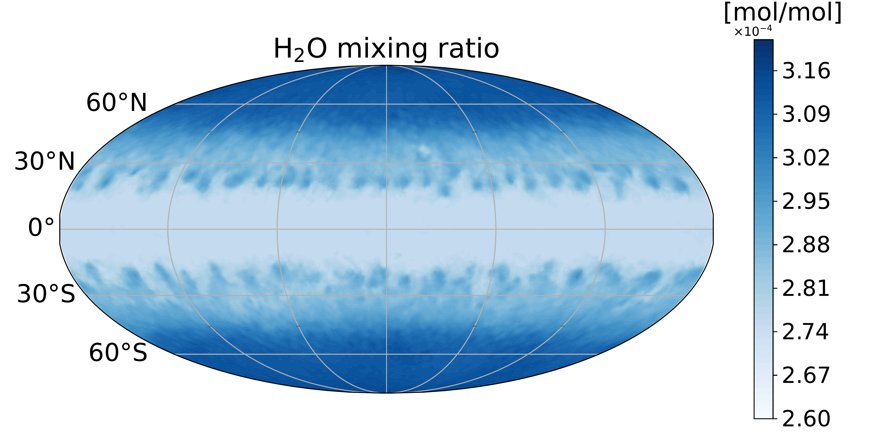
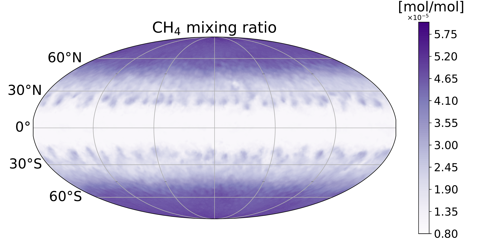
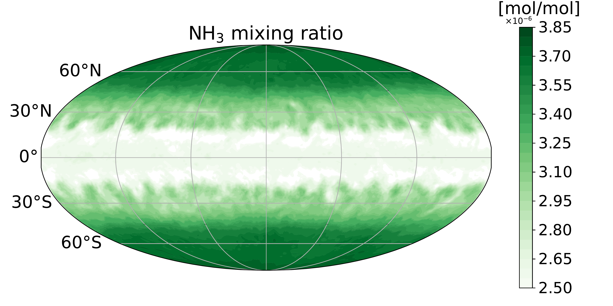
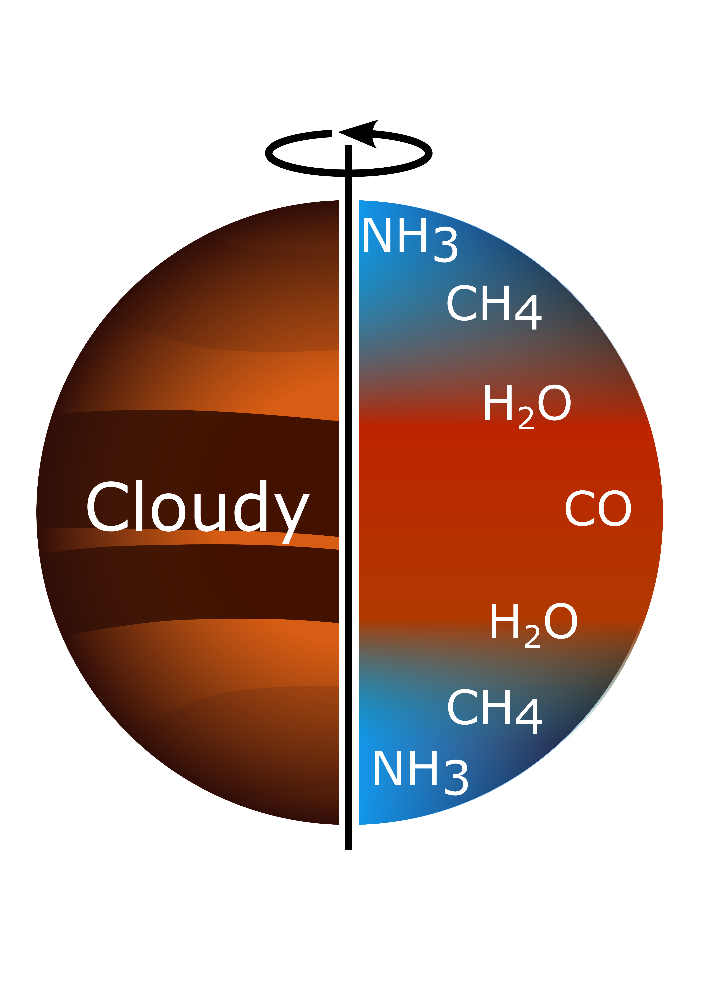
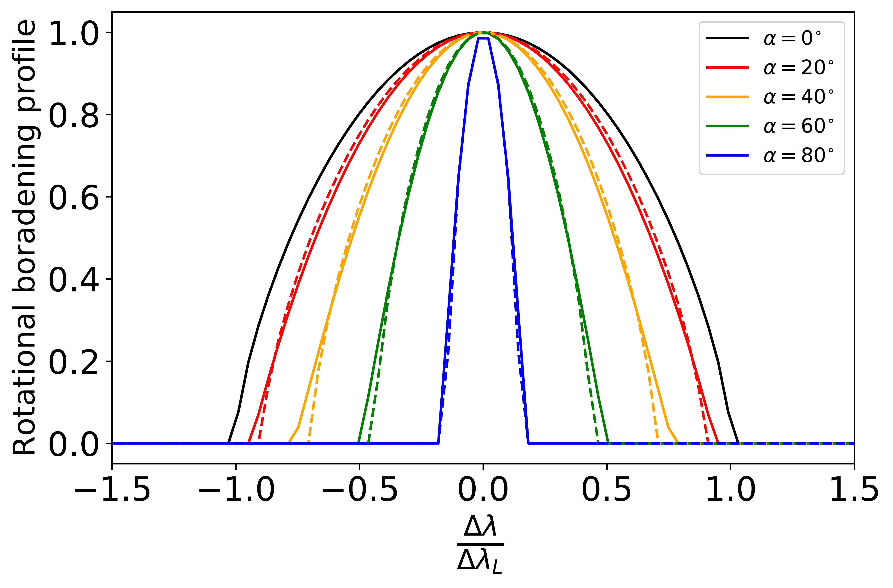
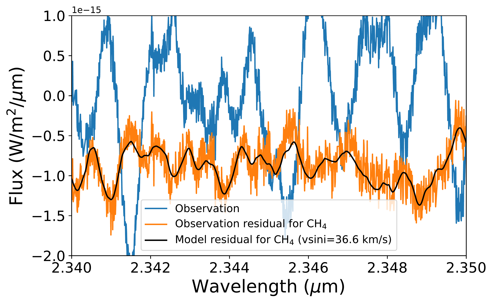

$\newcommand{\ensuremath}{}$
$\newcommand{\xspace}{}$
$\newcommand{\object}[1]{\texttt{#1}}$
$\newcommand{\farcs}{{.}''}$
$\newcommand{\farcm}{{.}'}$
$\newcommand{\arcsec}{''}$
$\newcommand{\arcmin}{'}$
$\newcommand{\ion}[2]{#1#2}$
$\newcommand{\textsc}[1]{\textrm{#1}}$
$\newcommand{\hl}[1]{\textrm{#1}}$
$\newcommand{\footnote}[1]{}$

# Latitudinal chemical and cloud variations in the atmosphere of a brown dwarf

<mark>Appeared on: 2026-07-14</mark> -  _32 pages, 13 figures. Under review at Nature Astronomy. Revised version after two rounds of review_

B. Charnay, et al. -- incl., <mark>M. Ravet</mark>, <mark>G. Chauvin</mark>

**Abstract:** Brown dwarfs are massive analogues of extrasolar giant planets. Compared to exoplanets whose observations are generally limited by the presence of their bright host star, brown dwarfs are ideal targets for studying substellar atmospheric physics, chemistry and dynamics.Previous observations and simulations of their atmospheres suggest preferential cloud formation around the equator, associated with an equator-pole thermal gradient. Here we show that this atmospheric structure should induce latitudinal chemical variations detectable by the Doppler effect. We introduce a new method - Differential Molecular Rotational Broadening - which consists in comparing the apparent rotational broadening of individual molecules from high-resolution spectra. Application of this approach to VLT-CRIRES observations for different molecules (CO, $H_2$ O, $CH_4$ and $NH_3$ ) in the atmosphere of the brown dwarf DENIS J0255-4700 confirms the existence of latitudinal chemical variations. Our data suggest a depletion of $CH_4$ and $NH_3$ at low latitudes, consistent with an equatorial cloud belt. Our method could be applied to multiple brown dwarfs and exoplanets to map their atmospheres and to study various atmospheric processes.

**Figure 1. -** Maps of cloud mass column (top left), temperature at 10 bars (top right), CO mixing ratio (middle left), $H_2$O mixing ratio (middle right), $CH_4$ mixing ratio (bottom left) and $NH_3$ mixing ratio (bottom right) for a brown dwarf at the L-T transition. The cloud and temperature maps are outputs from a 3D simulation of a brown dwarf (T$_{\mathrm{eff}}$ = 1000 K, rotation period = 5 hours, gravity = 10$^5$ cm/s$^2$, solar metallicity and solar C/O) including silicate clouds (particle radii of 20 $\mu$m) [Teinturier, et. al (2026)](https://www.nature.com/articles/s41550-025-02709-1). The mixing ratio maps were computed from the 3D thermal structure with chemical vertical quenching, using parametrizations of chemical timescales [Zahnle and Marley (2014)](https://doi.org/10.1088/0004-637X/797/1/41) and an eddy diffusion coefficient K$_{\mathrm{zz}}$ = 10$^8$ cm$^2$/s. (*fig1*)

**Figure 2. -** (A) Illustration of the latitudinal variations of clouds, temperature (warm equatorial regions in red and cold polar regions in blue) and chemical composition. (B) Function of rotational broadening (solid line) assuming a depleted equatorial band between latitudes $\pm \alpha$. $\Delta \lambda$ is the offset in wavelength compared to the line center at $\lambda_L$ and $\Delta \lambda_L = \lambda_L v\mathrm{sin}i/c$ is the maximal Doppler shift for an equatorial velocity $v$ and an inclination $i$. The dashed line is a fit corresponding to the convolution function of rotational broadening for a homogeneous disk [ and Gray (2005)](https://www.cambridge.org/core/product/identifier/9781316036570/type/book) with $\Delta \lambda_L$ multiplied by $\sqrt{(1-\mathrm{sin}(\alpha)^{3/2})}$(see Methods).
     (*fig2*)

**Figure 3. -** Spectrum of DENIS J0255-4700 in the sixth spectral order of the CRIRES dataset after data reduction (blue line). The comparison between the observation residual (orange line) and the model residual (green line, with the rotational broadening corresponding to the best fit: $v\mathrm{sin}i=38.2$ km/s) for $CH_4$ is also indicated. (*fig3*)

