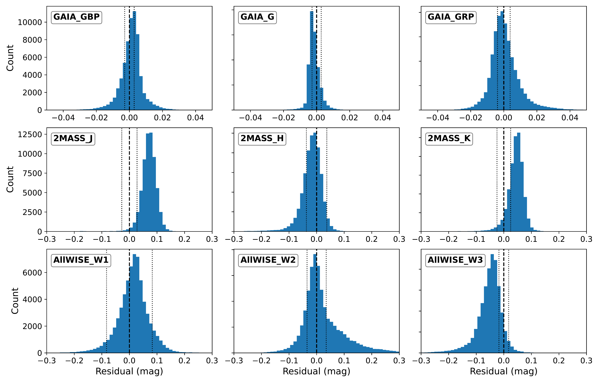
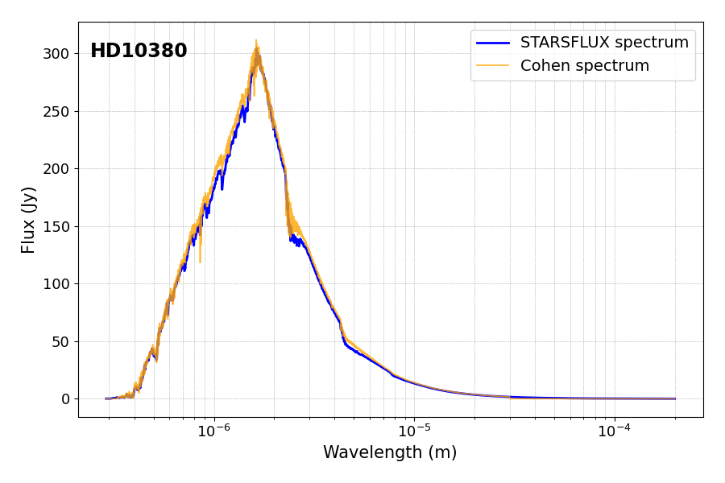
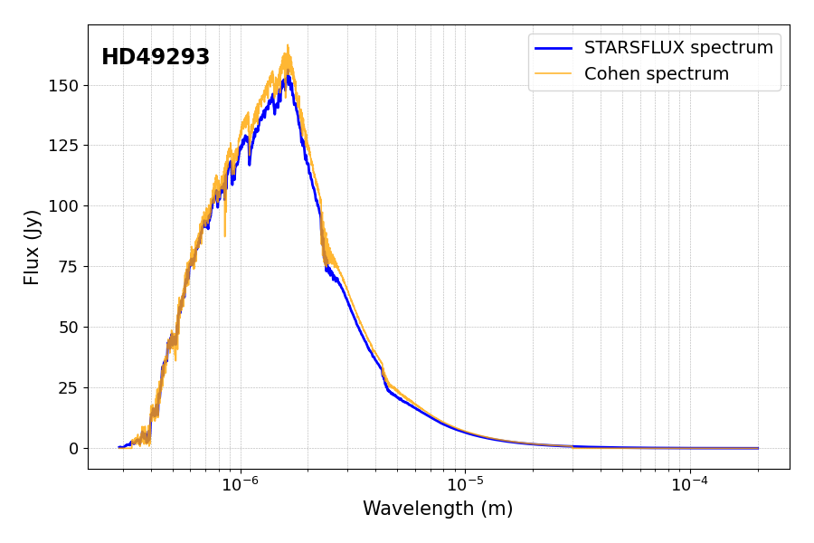
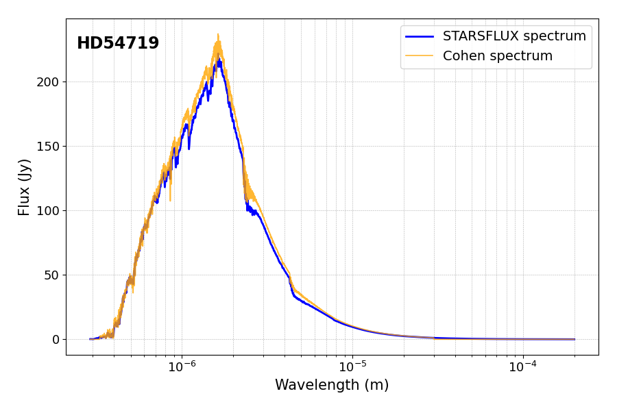
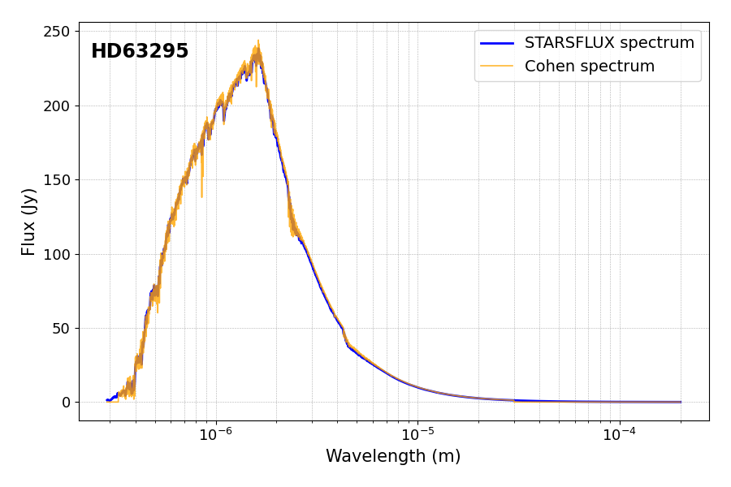
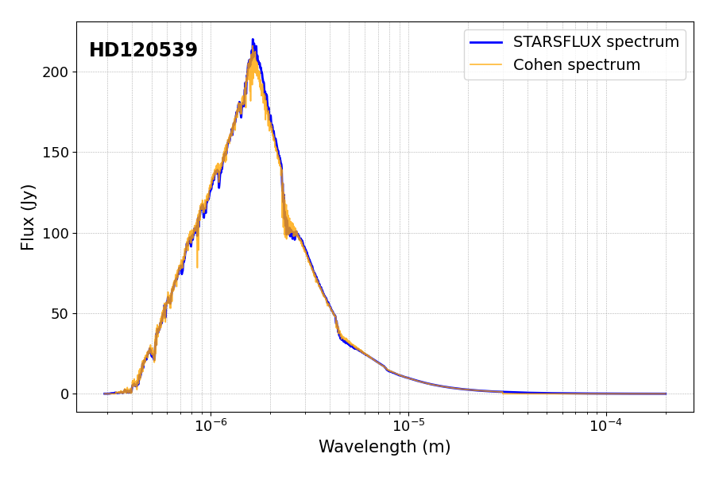
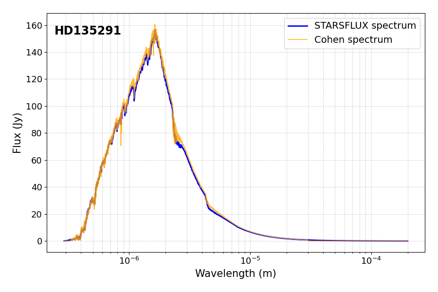
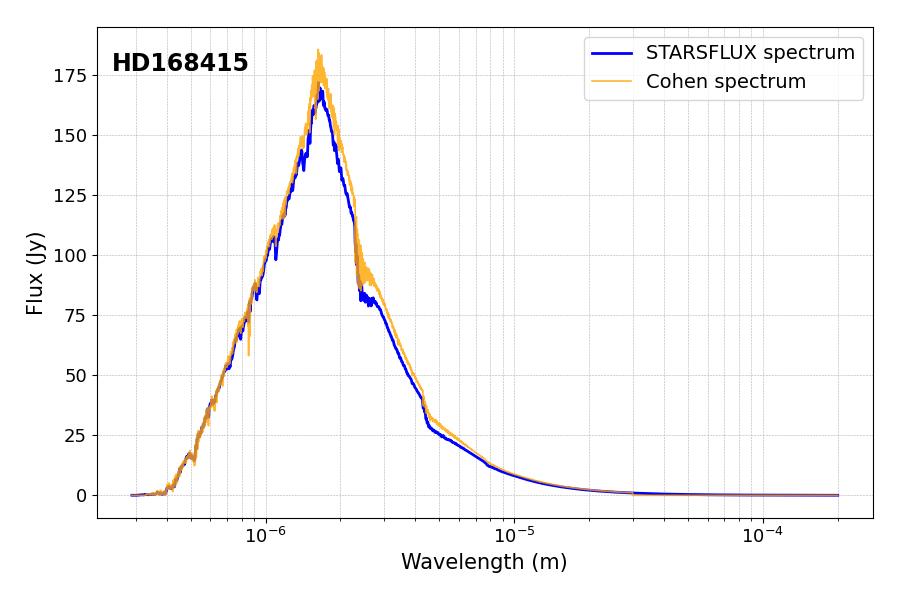
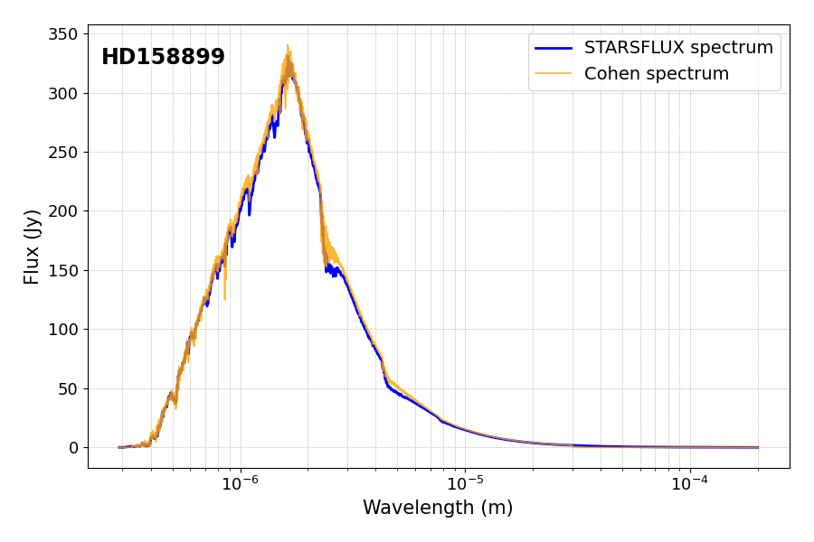
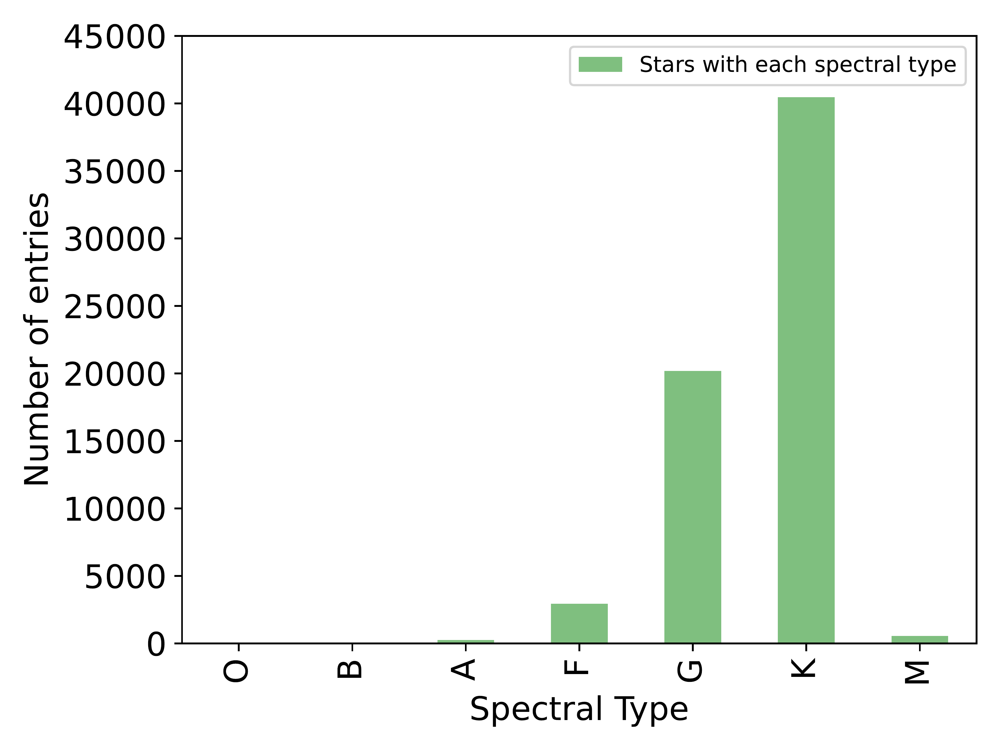

$\newcommand{\ensuremath}{}$
$\newcommand{\xspace}{}$
$\newcommand{\object}[1]{\texttt{#1}}$
$\newcommand{\farcs}{{.}''}$
$\newcommand{\farcm}{{.}'}$
$\newcommand{\arcsec}{''}$
$\newcommand{\arcmin}{'}$
$\newcommand{\ion}[2]{#1#2}$
$\newcommand{\textsc}[1]{\textrm{#1}}$
$\newcommand{\hl}[1]{\textrm{#1}}$
$\newcommand{\footnote}[1]{}$
$\newcommand{\thefootnote}{\fnsymbol{footnote}}$
$\newcommand{\arraystretch}{1.0}$

# STARSFLUX: an all-sky catalogue of absolute spectro-photometric calibrators from 0.3 to 30 $\mu m$

<mark>Appeared on: 2026-07-14</mark> -  _Submitted to Monthly Notices of the Royal Astronomical Society_

V. G. Rosas, et al. -- incl., <mark>R. v. Boekel</mark>

**Abstract:** Obtaining accurate fluxes of faint sources from the ground in near- and mid-infrared wavelengths is challenging because of the rapidly changing atmospheric absorption. A common limitation is the lack of a nearby spectro-photometric calibrator. We present the _STellar Absolute Reference Spectroscopic Flux Library_ ( STARSFLUX ), an all-sky catalogue of calibrator spectra spanning 0.3--30 $\mu$ m and comprising $64{,}484$ stars; the target list is based on the Mid-infrared stellar Diameters and Fluxes compilation Catalogue (MDFC). STARSFLUX combines _Gaia_ DR3 stellar parameters with multi-band photometry from space- and ground-based surveys and synthetic NewEra PHOENIX atmosphere models. We fit each observed stellar SED with an interpolated model spectrum, an estimated diameter and estimated extinction to produce a flux-calibrated spectrum. The photometric diameter can be used for accurate calibration of interferometric observations.We validate the catalogue in three ways. First, STARSFLUX angular radii agree closely with independent _Gaia_ DR3 radii, with median $|\Delta R|/R_{\rm Gaia,DR3}\simeq 4.8\%$ .Second, The integrated L-band (2.8--4.2 $\mu$ m) fluxes for 12 stars in common with the Cohen infrared standard agree with the Cohen values with a mean absolute percentage difference of $4.7\%\pm2.6\%$ . \textcolor{black}{Finally we compare the STARSFLUX near-UV/visible/near-IR spectra with the Gaia DR3 BP/RP spectra. The absolute spectrophotometric fluxes agree to approximately 3\%.} The spectra in FITS format are available at $\url{https://home.strw.leidenuniv.nl/ gamez/}$ and will be submitted to VizieR.

**Figure 14. -** Histograms of the residuals for all fitted bands. The vertical dashed line marks 0. n is the total number of stars, $\mu$ and $\sigma$ give the mean and standard deviation of the residuals, respectively. The vertical dotted lines mark 1-$\sigma$ away from 0 of the errors for the observed magnitudes.  (*fig:all_hist_mags_resid*)

**Figure 16. -** Comparison plots of the spectra from STARSFLUX and the remaining Cohen stars.  (*Appfig:all_comp_plots*)

**Figure 4. -** Distribution of the Spectral Types for most of the stars included in STARSFLUX. A few stars with spectral classes: N, R, S, C and D are left out. (*fig:spt*)

