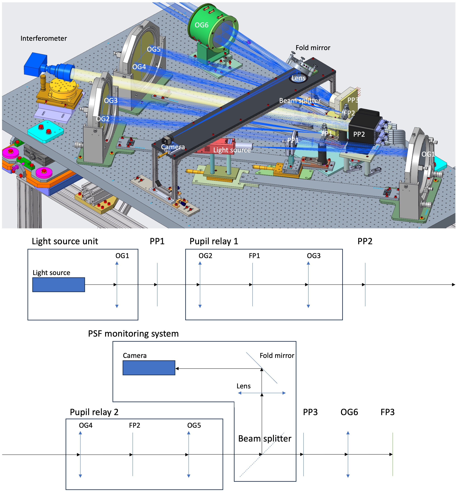
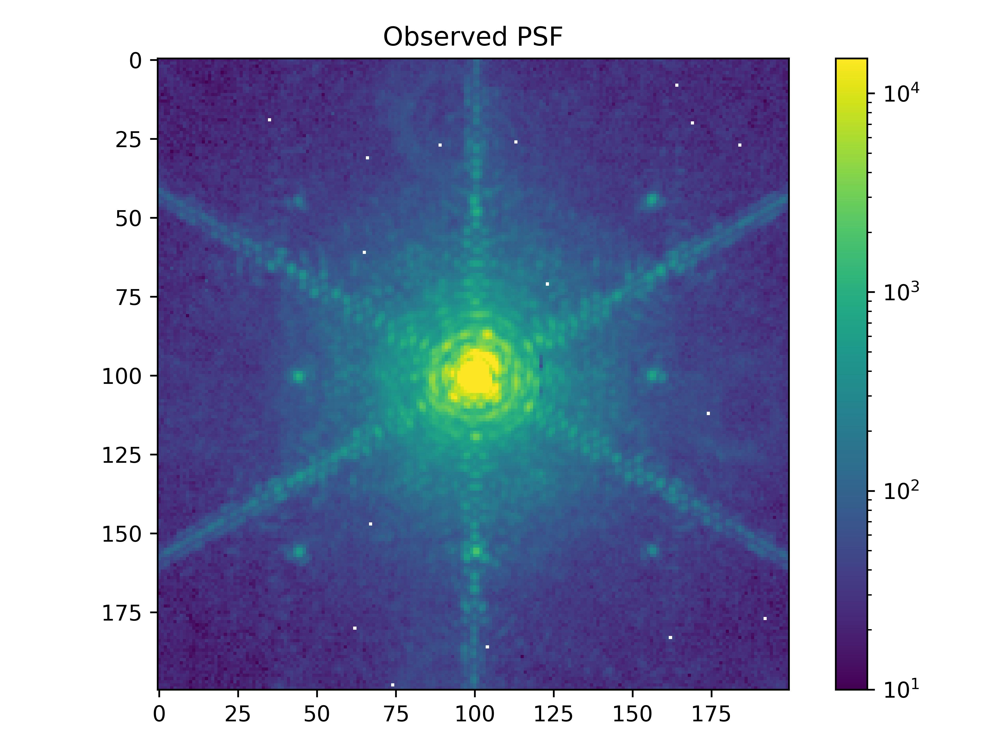
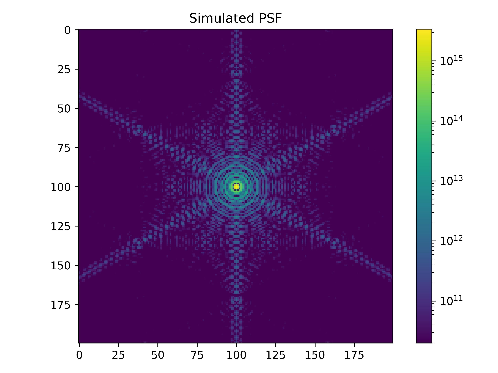
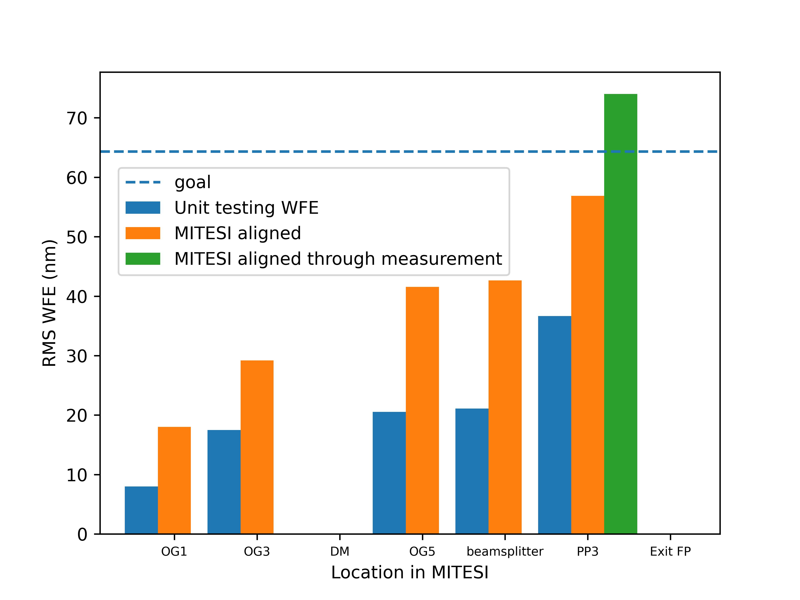

$\newcommand{\ensuremath}{}$
$\newcommand{\xspace}{}$
$\newcommand{\object}[1]{\texttt{#1}}$
$\newcommand{\farcs}{{.}''}$
$\newcommand{\farcm}{{.}'}$
$\newcommand{\arcsec}{''}$
$\newcommand{\arcmin}{'}$
$\newcommand{\ion}[2]{#1#2}$
$\newcommand{\textsc}[1]{\textrm{#1}}$
$\newcommand{\hl}[1]{\textrm{#1}}$
$\newcommand{\footnote}[1]{}$
$\newcommand{\baselinestretch}{1.0}$

# Assembly, integration, and verification of MITESI: an optical testbed for simulating the ELT in the laboratory

<mark>Appeared on: 2026-07-20</mark> -  _SPIE Astronomical Telescopes + Instrumentation 2026. Paper 14149-299_

D. J. Ahrer, et al. -- incl., <mark>T. Bertram</mark>, <mark>P. Bizenberger</mark>, <mark>A. Huber</mark>, <mark>R. Pourcelot</mark>, <mark>S. Scheithauer</mark>, <mark>H. Steuer</mark>

**Abstract:** MITESI is an optical testbed which simulates key characteristics of the ELT, ultimately producing an artificial natural guide star. It was designed primarily to enable testing of the METIS instrument's SCAO system in closed loop. In this contribution, we discuss the assembly, integration and verification process of the testbed, taking the project from design to assembled hardware.

**Figure 2. -** Top: a 3D CAD view of the \gls*{mitesi} bench in its configuration for subsystem testing at MPIA. The cover, among other items, have been hidden for clarity. Bottom: a sketch of the main optical path of \gls*{mitesi} from the light source unit to the lens unit \gls*{og}6 which forms the interface focal plane (not shown). (*fig:MITESI-layout*)

**Figure 8. -** Left: The \gls*{psf} at the exit focal plane (\gls*{fp}3) of \gls*{mitesi} on a log scale. Shown here is the median of 5 frames that has been corrected by a dark frame. Note that in this \gls*{psf} the core is saturated. Right: A \gls*{psf} simulated at $\lambda$ = \SI{1.646}{\micro\metre} and sampled on \SI{15}{\micro\metre} pixels to match that of the observed data. (*fig:MITESI-PSF*)

**Figure 7. -** A comparison of the cumulative \gls*{wfe} measured through \gls*{mitesi} and the running total of the \gls*{rms}\gls*{wfe} adding the measurements of the individual optics taken during unit testing. The "\gls*{mitesi} aligned" bar represents the measurements made by making measurements in both the forwards and backwards directions as explained in the text. "\gls*{mitesi} aligned through measurement" is the single measurement made from in front of \gls*{og}6 going backwards through the system to a reference ball placed at the focus of \gls*{og}1. (*fig:MITESI-WFE*)

