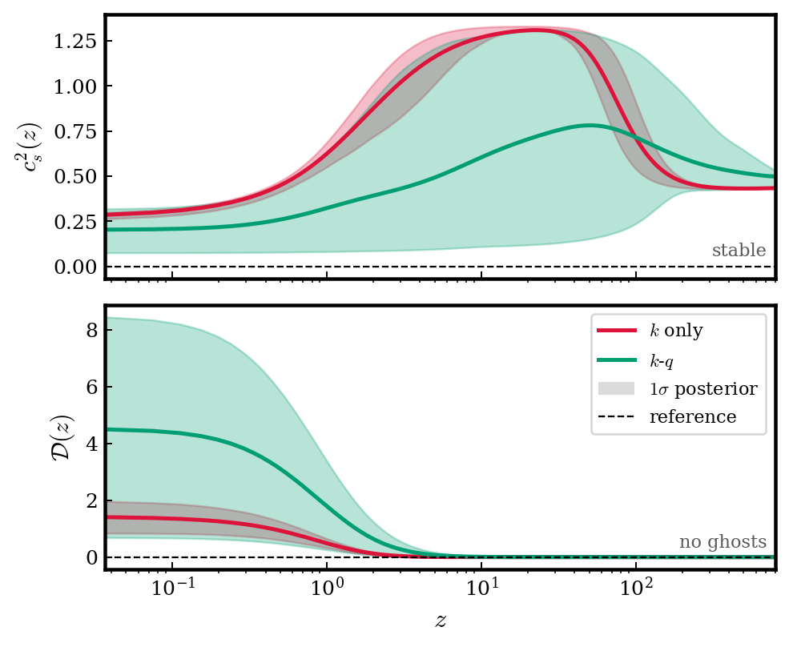
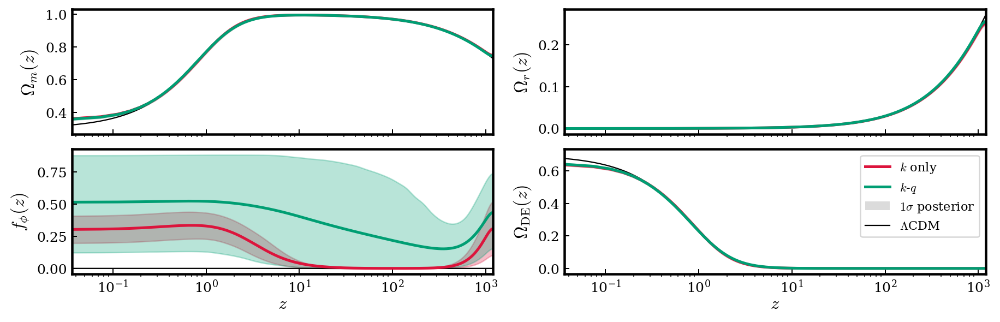
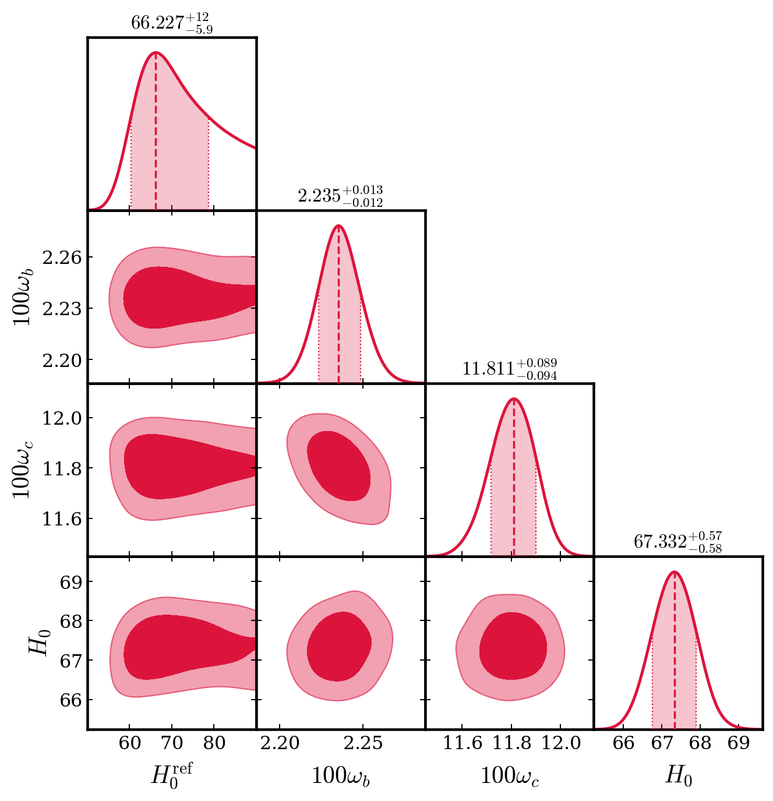
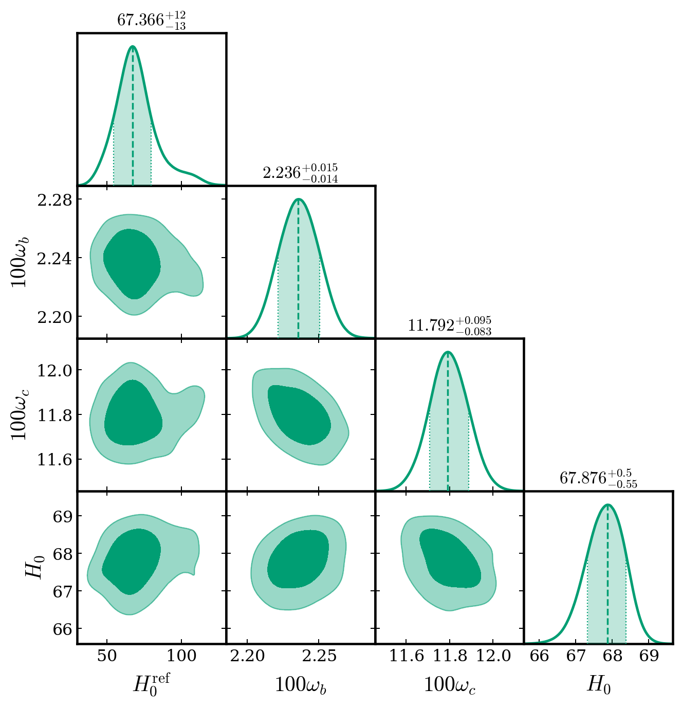

$\newcommand{\ensuremath}{}$
$\newcommand{\xspace}{}$
$\newcommand{\object}[1]{\texttt{#1}}$
$\newcommand{\farcs}{{.}''}$
$\newcommand{\farcm}{{.}'}$
$\newcommand{\arcsec}{''}$
$\newcommand{\arcmin}{'}$
$\newcommand{\ion}[2]{#1#2}$
$\newcommand{\textsc}[1]{\textrm{#1}}$
$\newcommand{\hl}[1]{\textrm{#1}}$
$\newcommand{\footnote}[1]{}$
$\newcommand{\linkedfootnotemark}[1]{$
$  \stepcounter{footnote}$
$  \protected@xnewcommand\@thefnmark{\thefootnote}$
$  \expandafter\xnewcommand\csname linkedfn@number@#1\endcsname{$
$    \number\value{footnote}$
$  }$
$  \leavevmode$
$  \ifhmode$
$    \enewcommand\@x@sf{\the\spacefactor}\nobreak$
$  \fi$
$  \hyperlink{linkedfn:#1}{\@makefnmark}$
$  \ifhmode\spacefactor\@x@sf\fi$
$  \relax$
$}$
$\newcommand{\linkedfootnotetext}[2]{$
$  \footnotetext[\csname linkedfn@number@#1\endcsname]{$
$    \hypertarget{linkedfn:#1} $
$    #2$
$  }$
$}$
$\newcommand{\tb}[1]{\textcolor{teal}{[\textbf{TB}: #1]}}$
$\newcommand{\ssl}[1]{\textcolor{orange}{[\textbf{SS}: #1]}}$
$\newcommand{\jh}[1]{\textcolor{violet}{[\textbf{JH}: #1]}}$
$\newcommand{\kn}[1]{\textcolor{olive}{[\textbf{KN}: #1]}}$
$\newcommand{\edit}[1]{\textcolor{blue}{#1}}$
$\newcommand{\good}[1]{\textcolor{forestgreen}{#1}}$
$\newcommand{\caution}[1]{\textcolor{darkorange}{#1}}$
$\newcommand{\bad}[1]{\textcolor{darkred}{#1}}$
$\newcommand{\cmark}{\good{\ensuremath{\checkmark}}}$
$\newcommand{\xmark}{\bad{\ensuremath{\times}}}$
$\newcommand{\pmark}{\ensuremath{\sim}}$
$\newcommand{\arraystretch}{1.08}$
$\newcommand{\arraystretch}{1.}$
$\newcommand\@makecaption{#1#2}$

# Rolling Galileons: Evolving Braiding Strength for Viable Dark Energy

<mark>Appeared on: 2026-07-21</mark> -  _19 pages, 7 figures_

J. Hallam, <mark>K. Naidoo</mark>, S. Sirera, T. Baker

**Abstract:** Motivated by growing observational indications that dark energy may be dynamical, we introduce Rolling Galileon gravity: a minimal shift-symmetry-breaking extension of the cubic Galileon in which the coupling coefficients are allowed to vary, giving rise to an evolving braiding strength. The full theory space, shown to be closed under field redefinitions, is characterised by two functions. We derive analytical conditions to satisfy three phenomenological requirements: i) a phantom-crossing equation of state at late times, ii) a positive integrated Sachs-Wolfe signature, and iii) absence of pathologies in the screened scalar force in cosmic voids. We show that these conditions are collectively satisfied by an increasing braiding strength relative to the kinetic sector. A Bayesian analysis of minimal Rolling Galileon models finds that they can satisfy the viability requirements i)-iii) whilst providing an acceptable fit to expansion-history data.

**Figure 1. -** Perturbative stability check of the scalar field on an FLRW background in the fitted histories. Both models remain free of ghosts and gradient instabilities, satisfying $c_s^2>0$\eqref{eq:cs2} and $\mathcal D>0$\eqref{eq:ghostly} throughout.
     (*fig:stability*)

**Figure 3. -** Posterior background evolution for the $k$-only (red) and $k$-$q$(green) Rolling Galileon models.
    The $\Lambda$CDM reference (black) is nearly indistinguishable from the Rolling Galileon density fractions, with only a small separation visible at the lowest redshift as the rolling scalar modifies the late-time expansion.
    The density parameters $\Omega_m(z)$, $\Omega_r(z)$, and $\Omega_{\rm DE}(z)$ are therefore tightly constrained, with the residual model freedom confined primarily to the internal composition of the dark energy sector, quantified by the fractional scalar contribution $f_\phi(z)$.
     (*fig:background*)

**Figure 5. -** 
    Marginalised model-independent posterior constraints for the two minimal RG models fitted to the joint CMB+BAO+SN data set with the positive-ISW condition imposed. The left panel shows the $k$-only model \eqref{eq:k-only_model}, whilst the right panel shows the full minimal $k$-$q$ model \eqref{eq:minimal_theory}.
    $k$-only model.$k$-$q$ model. (*fig:corner_other*)

