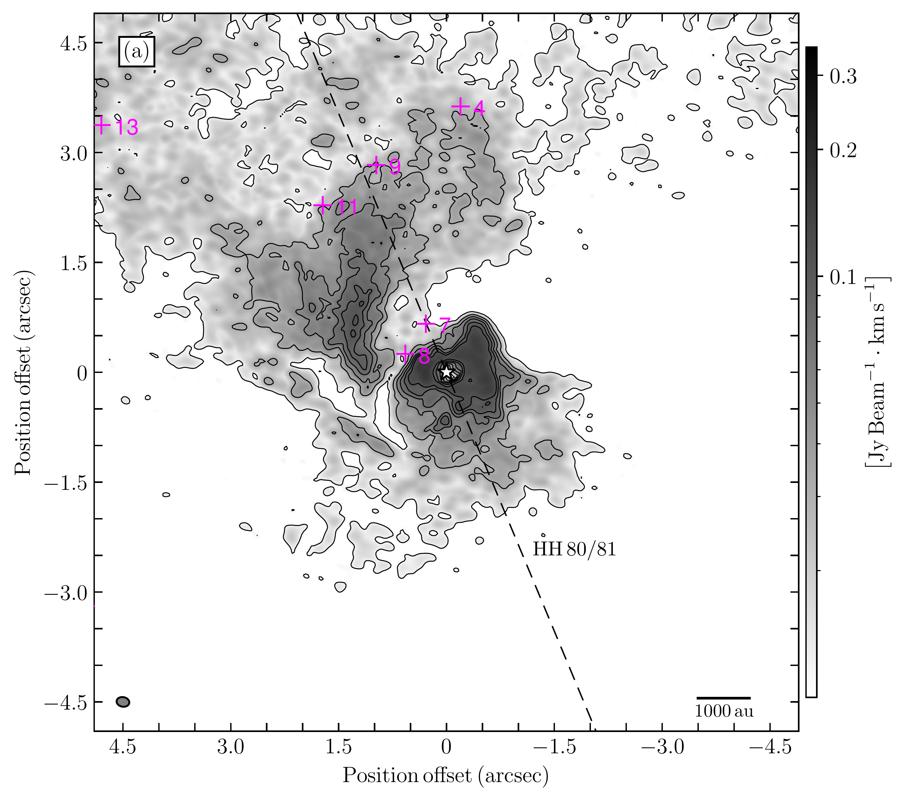
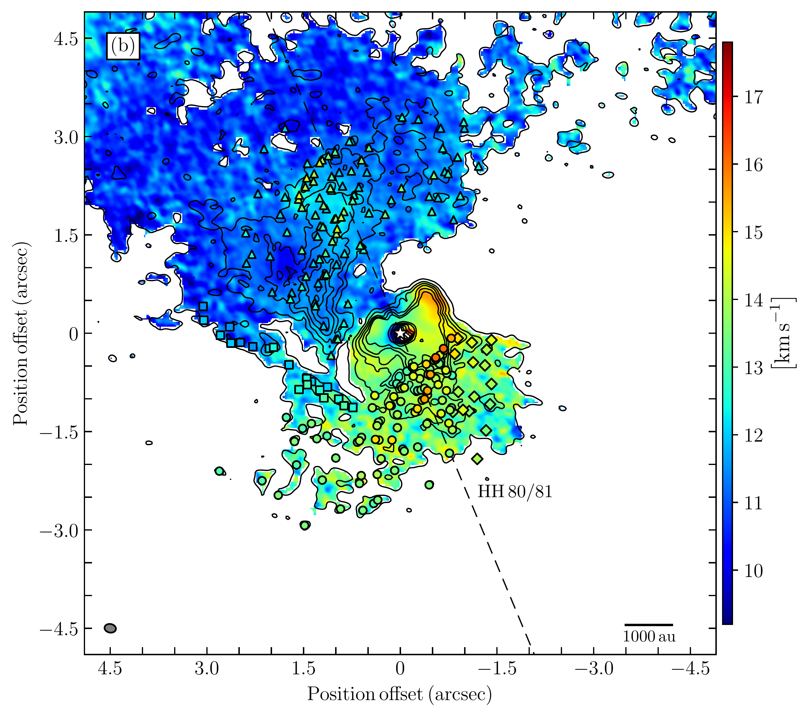
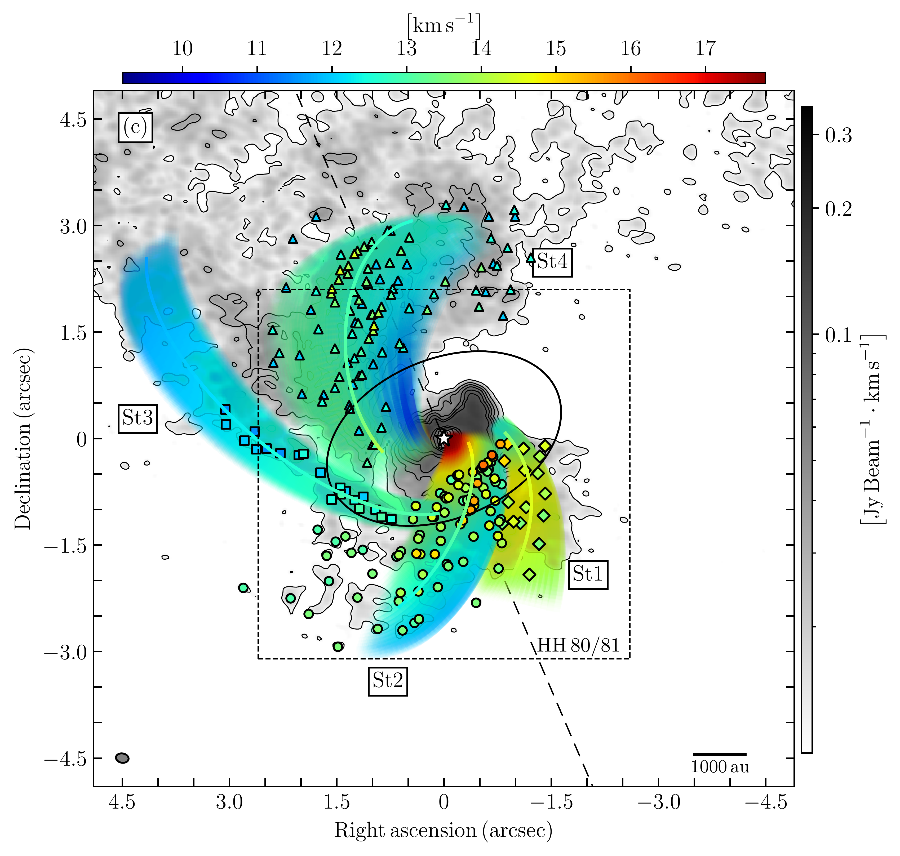
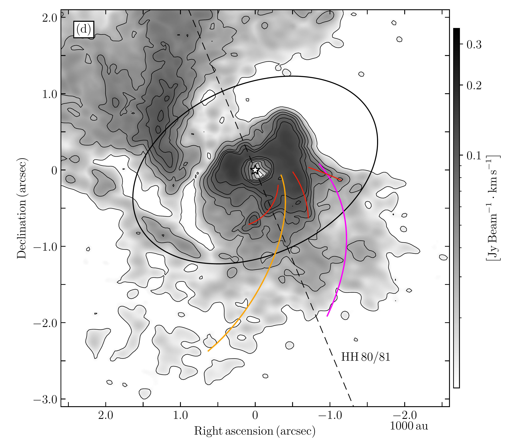
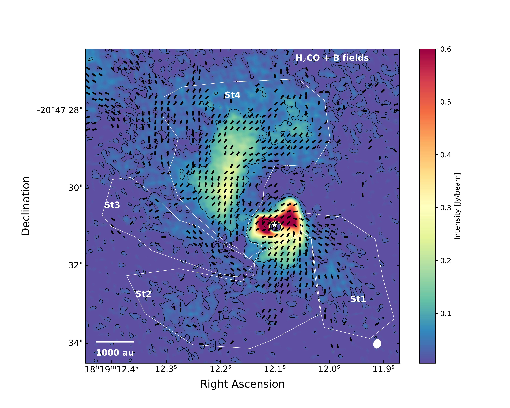
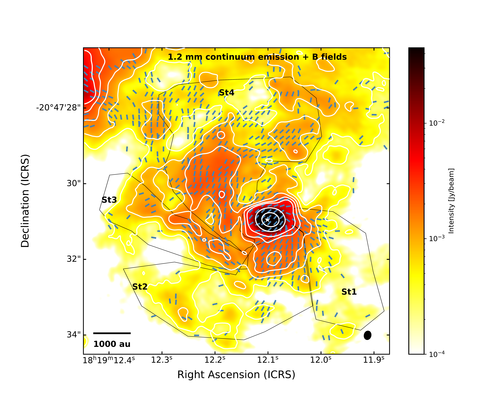

$\newcommand{\ensuremath}{}$
$\newcommand{\xspace}{}$
$\newcommand{\object}[1]{\texttt{#1}}$
$\newcommand{\farcs}{{.}''}$
$\newcommand{\farcm}{{.}'}$
$\newcommand{\arcsec}{''}$
$\newcommand{\arcmin}{'}$
$\newcommand{\ion}[2]{#1#2}$
$\newcommand{\textsc}[1]{\textrm{#1}}$
$\newcommand{\hl}[1]{\textrm{#1}}$
$\newcommand{\footnote}[1]{}$
$\newcommand{\vdag}{(v)^\dagger}$
$\newcommand\aastex{AAS\TeX}$
$\newcommand\latex{La\TeX}$
$\newcommand{\kms}{~km~s^{-1}\xspace}$
$\newcommand{\au}{~\mathrm{au}\xspace}$
$\newcommand{\yr}{\mathrm{yr^{-1}}\xspace}$
$\newcommand{\msun}{~\mathrm{M_{\sun}}\xspace}$
$\newcommand{\mstar}{~\mathrm{M_*}\xspace}$
$\newcommand{\rsun}{~\mathrm{R_\odot}\xspace}$
$\newcommand{\rstar}{~\mathrm{R_{*}}\xspace}$
$\newcommand{\lsun}{~L_{\sun}\xspace}$
$\newcommand{\mjy}{~mJy~beam^{-1}\xspace}$
$\newcommand{\mujy}{~\muJy~beam^{-1}\xspace}$
$\newcommand{\mearth}{~M_{\earth}\xspace}$
$\newcommand{\malfven}{\mathrm{\mathcal{M_A}}\xspace}$
$\newcommand{\dechms}[4]{#1^{\rm h}#2^{\rm m}#3\mbox{^{\rm s}\mskip-7.6mu. }#4}$
$\newcommand{\decdms}[4]{-#1^{\circ}#2'#3\mbox{"\mskip-7.6mu. }#4}$
$\newcommand{\mfl}[1]{#1}$
$\newcommand{\com}[1]{#1}$

# Magnetic fields in Massive Star-Forming Regions (MagMaR).: VIII. Magnetic field overrun by gravity in GGD 27's accretion streamers

<mark>Appeared on: 2026-07-21</mark> -  _13 pages, 6 figures, 3 tables. Accepted by A&A_

M. Fernández-López, et al. -- incl., <mark>H. Beuther</mark>

**Abstract:** $\com{Accretion streamers connected to protostellar disks and/or envelopes are thought to transport material across several thousand of au. Whether the motions of the gas comprising these streamers are dominated by gravity, large scale external turbulence or the action of magnetic fields is still under scrutiny.}$ $\mfl{The aim of this work is to understand}$ the role of the magnetic fields in the star-formation processes, in particular the role that magnetic forces have in potentially leading flows of gas and the accretion onto the envelopes and disks orbiting protostars. First, we try to identify the large-scale accretion streamers toward the $\com{high-mass Young Stellar Object}$ GGD 27--MM1 and fit their trajectories using the so-called Mendoza's model, a modification of the classical model of pure gravitational infalling motion of fluid particles in a potential well. Second, we estimate the strength of the magnetic field associated with the streamers. Then, we determine if the streamers are dominated by magnetic or centrifugal forces. Inspecting the Atacama Large Millimeter/submillimeter Array (ALMA) $H_2$ CO cube we were able to identify four accretion streamers spreading up to $\sim$ 7,000 au and fit their trajectories in the position-position-velocity space. The polarized continuum emission reveals a good alignment of the magnetic field and the trajectory of the streamers. Using the Davis-Chandrasekhar-Fermi method, we derive estimates for the magnetic field strength, find that the streamers are sub-alfvénic, and discuss (after estimating energy terms for turbulence, ordered motions, magnetic forces and gravity) a possible qualitative scenario in which, the gravitational well of the GGD 27--MM1 protostar dominates streamer gas motions over turbulence and magnetic forces at distances of $\sim 3,000$ au.

**Figure 1. -** $\com${GGD 27-MM1 molecular line emission of $H_2$CO. (a) ALMA moment 8 or peak intensity map. (b) ALMA first moment or intensity-weighted velocity map (color scale) overlaid with moment 8 contours. (c) ALMA moment 8 map overlaid with color-shaded areas representing the line-of-sight velocities of four streamers following a funnel-like structure of material infalling toward the central protostar. The solid central line indicates the best-fit model, whose parameters are listed in Table \ref{tab:mendozaparameters}. $\mfl${(d) Zoom-in of the moment 8 map shown in panel (a).} Magenta crosses in panel (a) represents the position of the continuum sources reported by \citet{Busquet2019}. In panels (b) and (c), the diamonds, circles, squares, and triangles mark the positions of the condensations identified in the velocity cube (see text), with the color indicating their line-of-sight velocity. $\mfl${The dashed square in panel (c) marks the zoomed-in area of panel (d). Red lines in panel (d) mark three dense ridges showing possible streamer connections, whereas the pink and orange lines show the spine of the streamers St1 and St2, respectively.} The contour levels start at 3$\sigma$ and increase in steps of 5$\sigma$ up to 28$\sigma$, where $\sigma= 4.11$ $\mjy$ $\kms$. The dashed black line indicates the direction of the protostellar jet HH 80/81. The synthesized beam is shown in the bottom-left corner.} (*fig:mom8streamers*)

**Figure 4. -** **Top:** $H_2$CO integrated intensity moment 0 image (color scale and contours) overlaid with polarization black half-vectors rotated by 90$◦$, and hence displaying the magnetic field orientations, toward the GGD 27 region, focused on MM1 (position marked with a white star). Four regions --defined using the velocity cube emission-- with possible large-scale accretion streamers are marked with black polygons. The contour levels are displayed at 2, 8, 80, and 200 times $\sigma$, the rms noise level of $11$\mjy measured in a nearby region devoid of bright emission. The synthesized beam is in the bottom right corner. **Bottom:** 1.2 mm continuum emission (color scale and contours) overlaid with polarization blue half-vectors rotated by 90$◦$. The contour levels start at 3, 7, 13, 21, 31, 190, and 1190 times $\sigma$, the rms noise level of $0.12$\mjy $\kms$ in the image. Symbols as in the upper panel. (*fig:Bfields*)

**Figure 2. -** Best-fit models for the four accretion streamers. (a) Three-dimensional diagram in the reference frame of the central protostar. (b) Projections of the four streamers in the $xy$ plane. (c) Projections of the four streamers in the $xz$ plane. (d) Three-dimensional diagram in the reference frame of the observer, where the $z-$axis represents the line of sight. (e) Projections of the four streamers in the right ascension-line of sight plane. (f) Projections of the four streamers in the declination-line of sight plane. The gray disk corresponding to the Ulrich's radius (see the text). (*fig:projections*)

