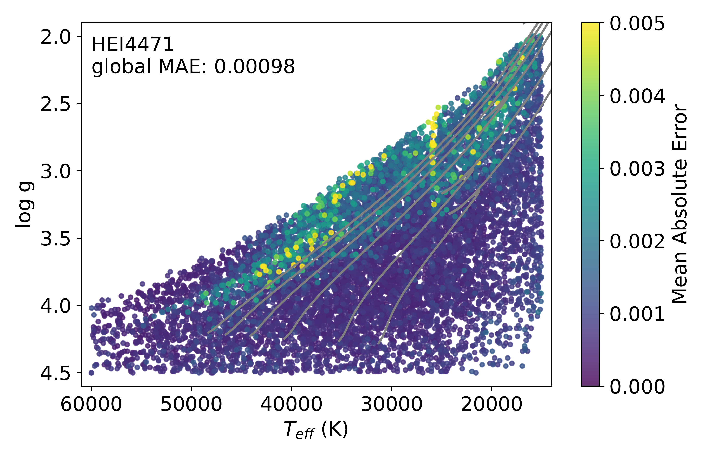
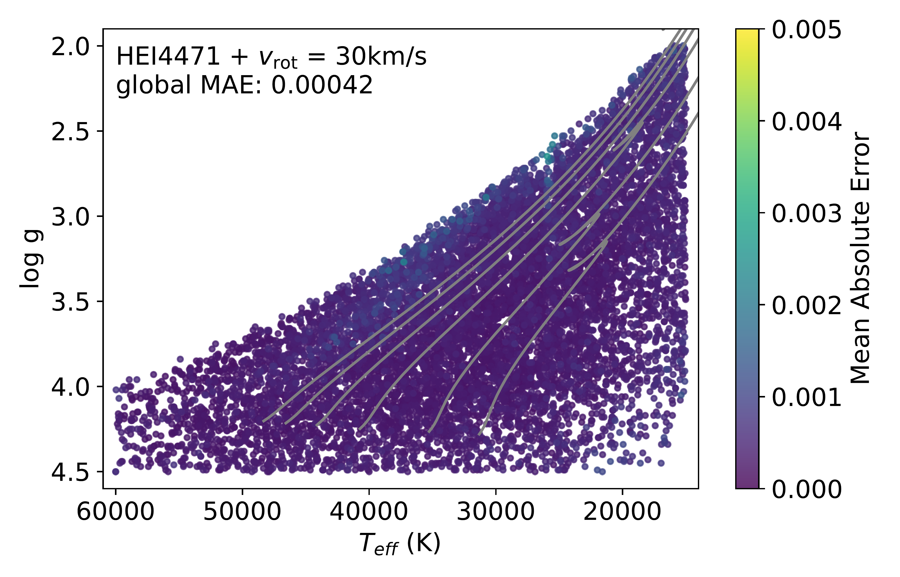
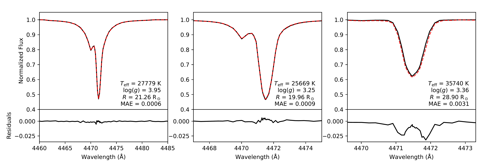
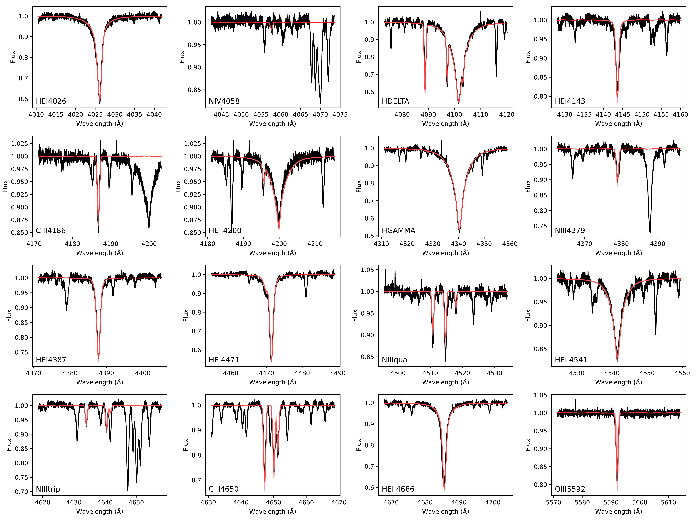

$\newcommand{\ensuremath}{}$
$\newcommand{\xspace}{}$
$\newcommand{\object}[1]{\texttt{#1}}$
$\newcommand{\farcs}{{.}''}$
$\newcommand{\farcm}{{.}'}$
$\newcommand{\arcsec}{''}$
$\newcommand{\arcmin}{'}$
$\newcommand{\ion}[2]{#1#2}$
$\newcommand{\textsc}[1]{\textrm{#1}}$
$\newcommand{\hl}[1]{\textrm{#1}}$
$\newcommand{\footnote}[1]{}$
$\newcommand{\MA}[1]{{\textbf{#1}}}$
$\newcommand{\arraystretch}{1.5}$
$\newcommand{\kms}{km s^{-1}}$
$\newcommand{\cmss}{cm s^{-2}}$
$\newcommand{\lsol}{L_{\odot}}$
$\newcommand{\msun}{M_{\odot}}$
$\newcommand{\msol}{M_{\odot}}$
$\newcommand{\msolyr}{M_{\odot} yr^{-1}}$
$\newcommand{\rsol}{R_{\odot}}$
$\newcommand{\rsun}{R_{\odot}}$
$\newcommand{\Rsun}{R_{\odot}}$
$\newcommand{\s}{\sigma}$
$\newcommand{\w}{\omega}$
$\newcommand{\vsini}{v \sin i}$
$\newcommand{\sigrms}{\sigma_\mathrm{rms}}$
$\newcommand{\Msol}{M_\odot}$
$\newcommand{\Msun}{M_\odot}$
$\newcommand{\Lsol}{L_\odot}$
$\newcommand{\Lsun}{L_\odot}$
$\newcommand{\s}{\sigma}$
$\newcommand{\feros}{{\sc feros}}$
$\newcommand{\lco}{{\sc lco}}$
$\newcommand{\uves}{{\sc uves}}$
$\newcommand{\iacob}{{\sc iacob}}$
$\newcommand{\teff}{T_\mathrm{eff}}$
$\newcommand{\logg}{\log g}$
$\newcommand{\heabun}{Y_\mathrm{He}}$
$\newcommand{\cabun}{\epsilon_\mathrm{C}}$
$\newcommand{\nabun}{\epsilon_\mathrm{N}}$
$\newcommand{\oabun}{\epsilon_\mathrm{O}}$
$\newcommand{\siabun}{\epsilon_\mathrm{Si}}$
$\newcommand{\vmac}{v_\mathrm{macro}}$
$\newcommand{\lam}{\lambda}$
$\newcommand{\ll}{\lambda\lambda}$
$\newcommand{\palp}{Pa \alpha}$
$\newcommand{\palph}{Pa \alpha}$
$\newcommand{\palpha}{Pa \alpha}$
$\newcommand{\pbet}{Pa \beta}$
$\newcommand{\pbeta}{Pa \beta}$
$\newcommand{\pdelt}{Pa \delta}$
$\newcommand{\pgam}{Pa \gamma}$
$\newcommand{\peps}{Pa \epsilon}$
$\newcommand{\halp}{H \alpha}$
$\newcommand{\halph}{H \alpha}$
$\newcommand{\halpha}{H \alpha}$
$\newcommand{\hbet}{H \beta}$
$\newcommand{\hdelt}{H \delta}$
$\newcommand{\hgam}{H \gamma}$
$\newcommand{\ha}{H {\sc i}}$
$\newcommand{\hb}{H {\sc ii}}$
$\newcommand{\hea}{He {\sc i}}$
$\newcommand{\heb}{He {\sc ii}}$
$\newcommand{\fea}{Fe {\sc i}}$
$\newcommand{ç}{C {\sc iii}}$
$\newcommand{\cd}{C {\sc iv}}$
$\newcommand{\ce}{C {\sc v}}$
$\newcommand{\nc}{N {\sc iii}}$
$\newcommand{\nd}{N {\sc iv}}$
$\newcommand{\ne}{N {\sc v}}$
$\newcommand{\mgb}{Mg {\sc ii}}$
$\newcommand{\ob}{O {\sc ii}}$
$\newcommand{\oc}{O {\sc iii}}$
$\newcommand{\od}{O {\sc iv}}$
$\newcommand{\sic}{Si {\sc iii}}$
$\newcommand{\sid}{Si {\sc iv}}$
$\newcommand{\fw}{\textsc{fastwind}}$
$\newcommand{\cmfgen}{\textsc{cmfgen}}$
$\newcommand{\powr}{\textsc{PoWR}}$
$\newcommand{\phoebe}{\textsc{phoebe}}$
$\newcommand{\spamms}{\textsc{spamms}}$
$\newcommand{\specfann}{\textsc{SpecFANN}}$
$\newcommand{\pyGA}{\textsc{pyGA}}$
$\newcommand{\emcee}{\textsc{emcee}}$
$\newcommand{\mesa}{\textsc{mesa}}$
$\newcommand{\scipy}{\textsc{scipy}}$
$\newcommand{\ultranest}{\textsc{ultranest}}$

# $\specfann$: Spectral Fitting via Artificial Neural Networks: I. A deep learning based $\fw$ emulator and fitting suite

<mark>Appeared on: 2026-07-21</mark> -  _Accepted for publication in A&A; 12 pages (+2 appendix pages), 9 figures (+2 appendix figures)_

M. Abdul-Masih, et al. -- incl., <mark>J. Müller-Horn</mark>

**Abstract:** The importance of massive stars cannot be overstated: they are powerful probes of the early universe, they play a vital role in the chemical and mechanical evolution of their host environments and their end products allow us to study the most extreme physics in the universe. Obtaining accurate stellar and surface parameters for large samples of massive stars is vital to our understanding of how they evolve, and how their births, lives and deaths affect their surroundings. With the large volume of data expected from the next generation of spectroscopic surveys, it is likely that the computational cost of our current analysis methods (especially the calculation of model stellar atmospheres and synthetic spectra) will prove to be the most important bottleneck impeding our progress. In order to overcome these limitations and dramatically decrease computing times, we aim to develop a robust emulator for the $\fw$ radiative transfer and spectral synthesis code. Additionally, we aim to explore alternative fitting methods that have not been feasible up to this point due to computational costs. We calculate a large set ( $\sim$ 50 000 models in total) of $\fw$ synthetic spectra of OB-type stars, varying temperature, surface gravity helium mass fractions and CNOSi abundances, and we train a collection of neural networks to emulate these models with separate networks for each line.  We also develop the open-source python package $\specfann$ , which provides users with a suite of fitting methods that can be used with these or other user-generated neural networks. The majority of the trained neural networks reach average accuracies of better than $\sim$ 0.01-0.1 \% for photospheric lines and better than $\sim$ 0.1-1 \% for wind lines. We find that $\specfann$ is able to obtain robust and accurate stellar parameters that are consistent with the literature for a sample of 52 early-type stars.  Using $\specfann$ we find that we can achieve the same fit in $\sim1/360 000$ of the time when compared to alternative techniques that rely on `on-the-fly' $\fw$ computations. We have demonstrated that neural networks offer a viable path forward to address the computational limitations of our current atmosphere analysis and stellar parameter determination methods for hot stars.

**Figure 7. -** Top left: result of the validation of the test set for the HeI $\lam$4471 line.  Each point represents one model, and the symbol color shows the mean absolute error, with worse fitting models plotted on top.  Non-rotating evolutionary tracks from [Brott, et. al (2011)](https://ui.adsabs.harvard.edu/abs/2011A&A...530A.115B) are over-plotted in grey, with the mass of each track being the same as in Fig. \ref{fig: param_space}(60, 50, 40, 30, 20, and 15 $\msun$ from left to right).  The global mean absolute error (MAE) is indicated in the top left corner. Top right: same as in the top left plot, but after convolving with a 30 $\kms$ rotational kernel. Bottom: selection of model comparisons between the predictions of the neural network (red dashed lines) with the $\fw$ line profiles (black solid lines) demonstrating a better-than-average fit (left), an average fit (middle), and a worse-than-average fit (right). The parameter combinations of these lines and the mean absolute error are indicated in the bottom right of each plot, and the bottom axes shows the residuals. (*fig: HeI4471_validation*)

**Figure 10. -** Corner plot showing the posterior distribution and contours of the MCMC fit in black with the Nested Sampling contours overplotted in red for 10 Lac.  The top panel in each column shows the distribution for the parameter indicated above the plot, and the off-diagonal panels show the parameter correlations.   (*fig: MCMC_NS_corner*)

**Figure 8. -** Results of the GA fit for 10 Lac.  The top panels show each of the 16 fitted lines with the observed spectrum plotted in black and the synthetic spectrum of the best-fitting model plotted in red.  The shaded red regions represent all models that fall within the 1$\s$ confidence interval.  The bottom panels show the fitness as a function of each of the free parameters in our parameter set.  The color of each point represents which generation the model belongs to with darker blue colors representing older generations and lighter yellow colors representing more recent generations. The 1$\s$ confidence interval is represented with the red shaded region.  The best-fit solution and 1$\s$ confidence interval for the respective parameter is indicated above each panel. (*fig: GA_fit*)

