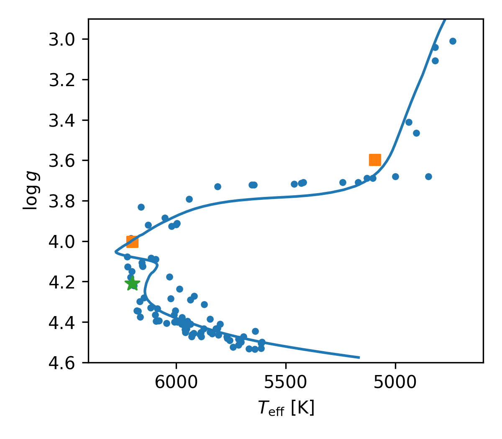
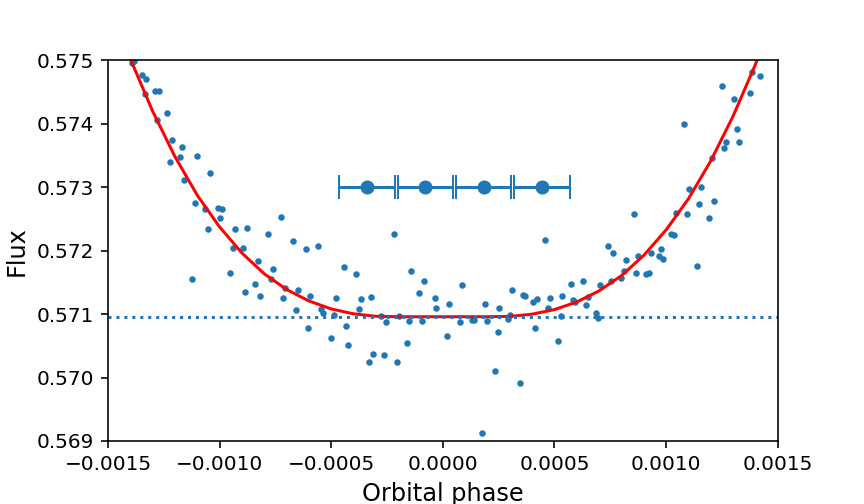
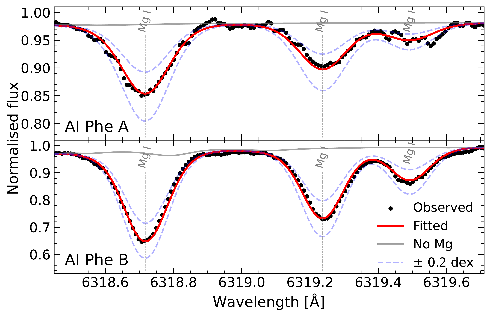

$\newcommand{\ensuremath}{}$
$\newcommand{\xspace}{}$
$\newcommand{\object}[1]{\texttt{#1}}$
$\newcommand{\farcs}{{.}''}$
$\newcommand{\farcm}{{.}'}$
$\newcommand{\arcsec}{''}$
$\newcommand{\arcmin}{'}$
$\newcommand{\ion}[2]{#1#2}$
$\newcommand{\textsc}[1]{\textrm{#1}}$
$\newcommand{\hl}[1]{\textrm{#1}}$
$\newcommand{\footnote}[1]{}$
$\newcommand{\teff}{T_{\rm eff}}$
$\newcommand{\logg}{\log g}$
$\newcommand{\vmic}{\xi_{\rm t}}$
$\newcommand{\vmac}{V_{\rm mac}}$
$\newcommand{\EW}{W_{\lambda}}$
$\newcommand{\mA}{{\rm mÅ}}$
$\newcommand{\thebibliography}{\DeclareRobustCommand{\VAN}[3]{##3}\VANthebibliography}$

# Evidence for elemental diffusion in the eclipsing binary star AI Phoenicis$\thanks{Based on observations made with ESO Telescopes at the La Silla Paranal Observatory under programme ID 0106.D-0165(A), and data obtained from the ESO Science Archive Facility with DOIs: https://doi.org/10.18727/archive/33. }$

<mark>Appeared on: 2026-07-21</mark> -  _Accepted for publication in MNRAS. 9 pages, 5 figures_

P. F. L. Maxted, et al. -- incl., <mark>N. Storm</mark>, <mark>M. Bergemann</mark>

**Abstract:** AI Phe is an eclipsing binary star with an orbital period of 24.6 days for which the surface gravity and effective temperature are known from direct measurements to very high precision and accuracy.We have obtained high-quality spectroscopy of the K0 IV star during the total eclipse of the F7 V companion, and also obtained spectra with a very high signal-to-noise ratio for this star and its F7 V companion using the spectral disentangling technique.We have used these spectra to measure the abundances of iron and magnesium for both stars.We compare the values of [ Fe/H ] and [ Mg/H ] for the  F7 V star and the K0 IV star to stars in M67, an open cluster of similar age and metallicity to AI Phe.We find that our [ Fe/H ] and [ Mg/H ] measurements clearly show the signature of elemental diffusion in the F7 V star.This suggests that AI Phe can be used to test models of single stars that include diffusion and mixing of elements.

**Figure 3. -** AI Phe in the Kiel diagram (squares) compared to stars in the open cluster M67 (dots). "Isochrone A" from \protect{\citet{2024MNRAS.532.2860R}} with an age of 3.95 Gyr is shown for context. The star symbol mark the position of WOCS 11028 A. (*fig:M67_Kiel_AI_Phe*)

**Figure 1. -** TESS photometry of AI Phe At orbital phases close to mid-primary eclipse. The flux scale is relative to the mean flux of the binary system out of eclipse. The solid line shows are best-fit model light curve computed with {\sc jktebop}. The 4 spectra observed with UVES where obtained at the orbital phases indicated by points with horizontal error bars. (*fig:PrimaryMinimum*)

**Figure 2. -** Fits of Mg I lines in each of the AI Phe components using the \texttt{TSFitPy} code. This region of the spectrum is affected by some strong telluric absorption features that produce some additional noise in the disentangled spectra. (*fig:mg_tsfitpy_fit*)

