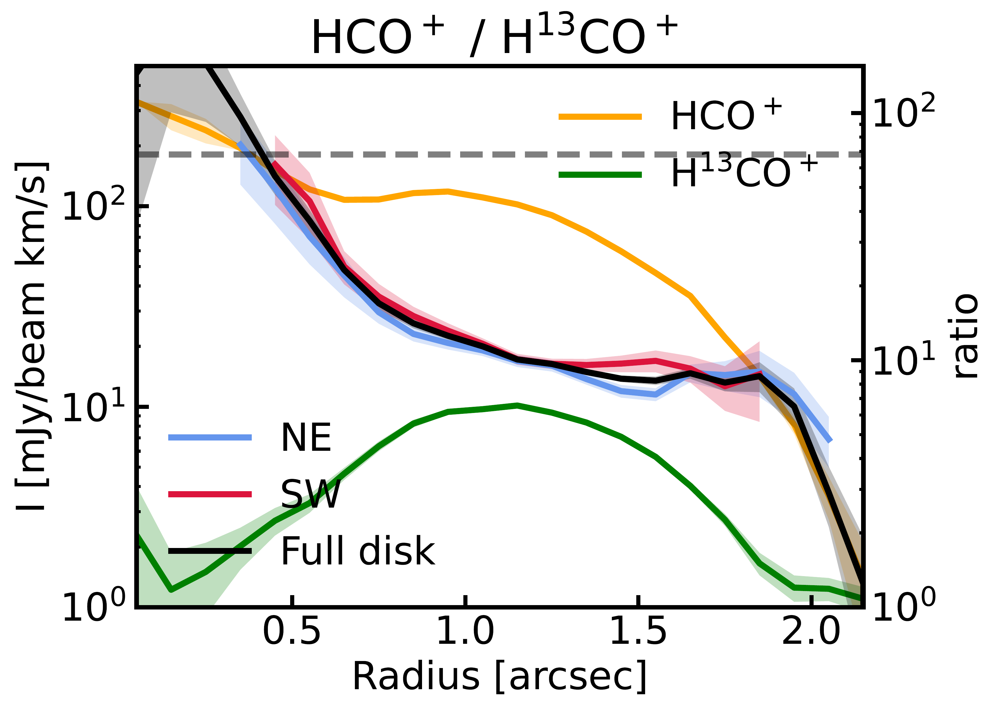
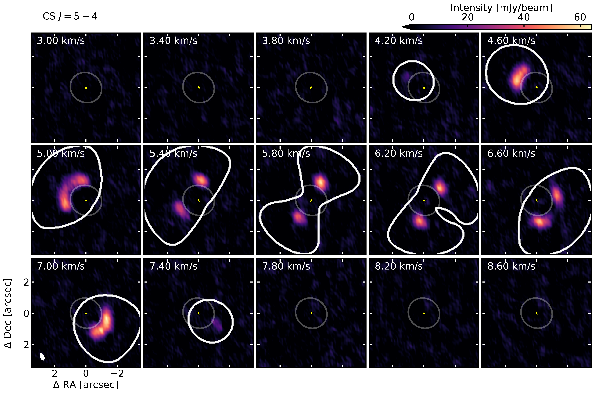
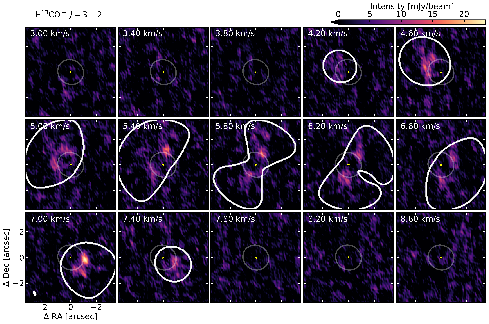

$\newcommand{\ensuremath}{}$
$\newcommand{\xspace}{}$
$\newcommand{\object}[1]{\texttt{#1}}$
$\newcommand{\farcs}{{.}''}$
$\newcommand{\farcm}{{.}'}$
$\newcommand{\arcsec}{''}$
$\newcommand{\arcmin}{'}$
$\newcommand{\ion}[2]{#1#2}$
$\newcommand{\textsc}[1]{\textrm{#1}}$
$\newcommand{\hl}[1]{\textrm{#1}}$
$\newcommand{\footnote}[1]{}$
$\newcommand{\fg}[1]{Fig.~\ref{fig:#1}}$
$\newcommand{\Fg}[1]{Figure~\ref{fig:#1}}$
$\newcommand{\fgs}[2]{Figs. \ref{fig:#1} and \ref{fig:#2}}$
$\newcommand{\Fgs}[2]{Figures \ref{fig:#1} and \ref{fig:#2}}$
$\newcommand{\eq}[1]{Eq.~(\ref{eq:#1})\xspace}$
$\newcommand{\Eq}[1]{Equation~(\ref{eq:#1})\xspace}$
$\newcommand{\eqs}[2]{Eqs. (\ref{eq:#1}) and (\ref{eq:#2})}$
$\newcommand{\Eqs}[2]{Equations \ref{eq:#1} and \ref{eq:#2}}$
$\newcommand{\tb}[1]{Table~\ref{tab:#1}\xspace}$
$\newcommand{\Tb}[1]{Table~\ref{tab:#1}\xspace}$
$\newcommand{\se}[1]{Sect.~\ref{sec:#1}\xspace}$
$\newcommand{\Se}[1]{Section~\ref{sec:#1}\xspace}$
$\newcommand{\ses}[2]{Sects. \ref{sec:#1} and \ref{sec:#2}}$
$\newcommand{\sef}[1]{\ref{sec:#1}\xspace}$
$\newcommand{\App}[1]{Appendix~\ref{app:#1}\xspace}$

# Azimuthal molecular variations in the AB Aur planet-forming disk

<mark>Appeared on: 2026-07-22</mark> -  _17 pages, 15 figures, 2 tables in the main text, 4 appendices, Accepted for publication in A&A_

<mark>H. Jiang</mark>, et al. -- incl., <mark>D. Semenov</mark>, <mark>M. Benisty</mark>, <mark>T. Henning</mark>

**Abstract:** Late infall episodes, where material from the surrounding environment accretes onto Class II protoplanetary disks, are emerging as a potentially important but poorly quantified driver of disk evolution. Observed as filamentary streamers in molecular lines and scattered light, such late-stage accretion can perturb disk structures through localized shocks, density enhancements, and warps, yet its chemical consequences remain poorly constrained. We present NOEMA 1.2 mm line-survey observations of the AB Aurigae system, a structured, young Class II Herbig disk that shows evidence for both ongoing infall and planet formation. We detect strong azimuthal chemical diversity: SO emission is enhanced in the northern disk near the inferred streamer--disk interaction region, while $C_2$ H emission peaks on the opposite southern side; in contrast, CS forms a nearly axisymmetric ring. HCN and HCO $^+$ instead peak near the dust continuum overdensity at the main mm-sized dust ring. Using multi-transition rotational-diagram analyses of SO and CS, we quantify the azimuthal contrast in column density and excitation. The SO-bright sector exhibits higher rotational temperatures and SO column densities, whereas CS remains nearly axisymmetric with substantially lower rotational temperatures, suggesting that the two species probe different disk layers and/or chemical components. For $C_2$ H, potential temperature variations contribute to, but cannot fully explain the observed asymmetries. The HCO $^+$ /H $^{13}$ CO $^+$ line ratio further indicates that HCO $^+$ is optically thick across the molecular ring, while the elevated ratio inside the cavity suggests an enhanced gas-phase $^{12}$ C/ $^{13}$ C, consistent with isotope-selective photodissociation. Comparison with gas-grain chemical models favors gas-phase C/O ratios near or above unity, with higher effective C/O in the $C_2$ H-bright sector. We discuss two plausible, non-exclusive origins for the observed chemical asymmetries: (i) infall-induced heating and desorption of O-bearing ices that enhance SO and lower the local gas-phase C/O near the streamer's impact site, and (ii) planet-driven substructures and localized heating or enhanced UV irradiation that can promote hydrocarbon-rich chemistry on the opposite side. These results highlight that environmental accretion and planet formation can jointly imprint azimuthal variations in disk chemistry, with potential consequences for the compositions of forming planets.

**Figure 9. -** Integrated intensity radial profiles of HCO$^+$/H$^{13}$CO$^+$ and their corresponding ratio. Black lines show azimuthally averaged values. Blue and red lines are the profiles along blue- and red-shift sides of the disk, which show no difference within the error range, despite the azimuthal asymmetries. The horizontal dashed line in the upper panel indicates the local ISM $^{12}$C/$^{13}$C abundance ratio. The HCO$^+$/H$^{13}$CO$^+$ line ratio decreases from values close to the canonical isotopic ratio in the inner disk to only $\sim10$--15 within the ring. (*fig:HCO_ratio*)

**Figure 17. -**  Channel maps of CS $J=5-4$. (*fig:CS_J_N_5-4_chan*)

**Figure 24. -**  Channel maps of H$^{13}$CO$^+$$J=3-2$. (*fig:H13CO+_J_3-2_chan*)

