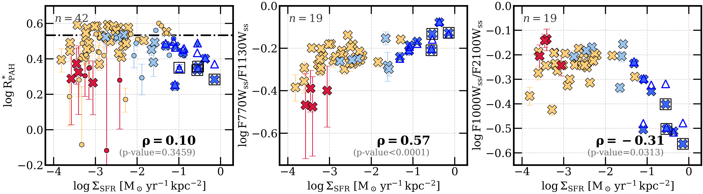
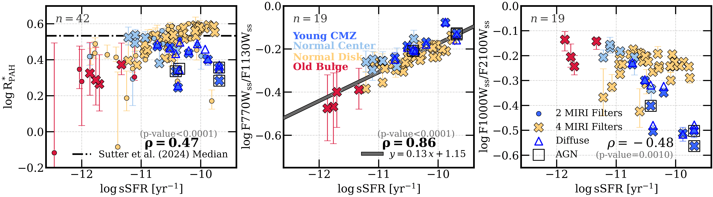
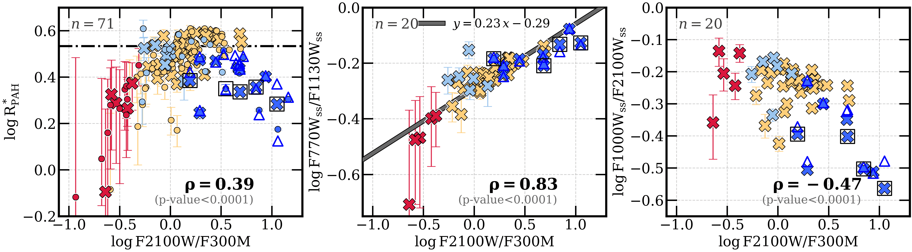
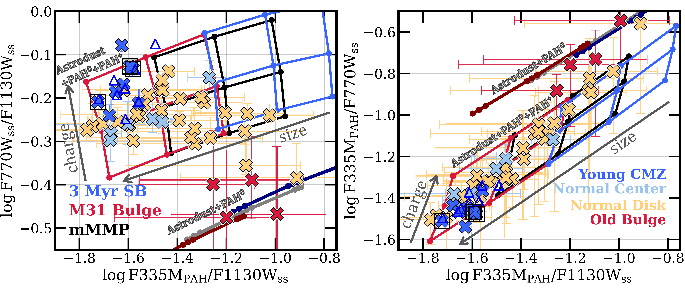
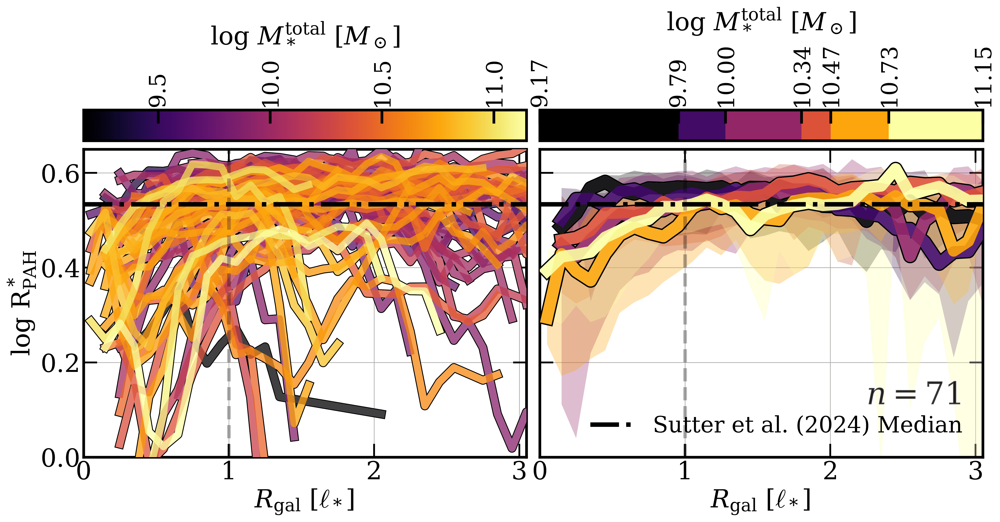

$\newcommand{\ensuremath}{}$
$\newcommand{\xspace}{}$
$\newcommand{\object}[1]{\texttt{#1}}$
$\newcommand{\farcs}{{.}''}$
$\newcommand{\farcm}{{.}'}$
$\newcommand{\arcsec}{''}$
$\newcommand{\arcmin}{'}$
$\newcommand{\ion}[2]{#1#2}$
$\newcommand{\textsc}[1]{\textrm{#1}}$
$\newcommand{\hl}[1]{\textrm{#1}}$
$\newcommand{\footnote}[1]{}$
$\newcommand{\vdag}{(v)^\dagger}$
$\newcommand\aastex{AAS\TeX}$
$\newcommand\latex{La\TeX}$
$\newcommand\edittR[1]{{\color{Black}#1}}$
$\newcommand\editt[1]{{\color{Black}#1}}$
$\newcommand\edit[1]{{\color{Black}#1}}$
$\newcommand\response[1]{{\color{Black}#1}}$
$\newcommand\ToDo[1]{{\color{Black}#1}}$

# Mid-Infrared Colors Vary with Galactic Environment: \ Contrasting Star-Forming Disks, Young Centers, and Quiescent Star-Formation Deserts

<mark>Appeared on: 2026-07-23</mark> -  _24 pages, 16 figures, 3 tables; accepted for publication in ApJ_

Debosmita~Pathak, et al. -- incl., <mark>E. Schinnerer</mark>, <mark>J. Neumann</mark>

**Abstract:** We present $50{-}100 $ pc-resolution JWST/MIRI and NIRCam measurements of mid-infrared (mid-IR) color variations in the diffuse interstellar medium (ISM) of 71 nearby star-forming galaxies from the PHANGS-JWST survey. Mid-IR emission traces the dust column density, intensity ( $U$ ) and hardness of the interstellar radiation field, and the physical state (charge, size) and abundance of polycyclic aromatic hydrocarbons (PAHs). Mid-IR colors that trace PAH band-ratios remain fairly constant in the diffuse ISM of star-forming disks. However, they show stark variations in extreme environments: highly star-forming central molecular zones (CMZs) and star-formation deserts/quiescent bulges. In CMZs, PAH-to-continuum ( $3.3/21$ , $7.7/21$ , and $11.3/21 \mu$ m) and the $10/21 \mu$ m continuum colors are $0.2{-}0.4$ dex lower than in normal disks. We attribute this to higher $U$ based on the far-IR dust colors and the high $21 \mu{\rm m}/\Sigma_{\rm Mol}$ , which we suggest to be a good tracer of $U$ outside star-forming regions. Meanwhile, star-formation deserts show low $7.7 \mu$ m PAH emission, resulting in low $7.7/21 \mu$ m and $7.7/11.3 \mu$ m, while all other mid-IR colors remain typical. This suggests the presence of more neutral PAHs in star-formation deserts, where low $7.7 \mu$ m likely reflects ISM conditions similar to early-type and elliptical galaxies. All environments form part of a continuous trend in $7.7/11.3 \mu$ m vs. specific star-formation rate.

**Figure 11. -** $\log R_{\rm PAH}^*$, $\log \rm F770W_{ss}/F1130W_{ss}$, and $\log \rm F1000W_{ss} / F2100W_{\rm ss}$ as a function of $\log \rm \Sigma_{SFR}   (M_\odot   yr^{-1}   kpc^{-2};   top)$ and $\log \rm sSFR = \log \Sigma_{SFR}/\Sigma_{*}   (yr^{-1};   middle)$ from MUSE, and $\log \rm F2100W / F300M$(bottom row), split by local environment---old stellar bulges (red), young CMZs (bright blue), normal centers (pale blue), and disks (yellow). The markers indicate medians within each environment, with corresponding Spearman rank correlation coefficients ($\rho$) printed. We indicate the 20 galaxies with coverage in all four MIRI filters as X's, and the rest with only two MIRI filters as circles.
For galaxy centers, we include medians within the full environment (X's or circles) and selecting for only diffuse emission (blue triangles), and mark centers with known AGN \citep[open squares;][]{2010VERON-CETTY}. The median diffuse $R_{\rm PAH}^*$ from \citet[][]{2024SUTTER} is included for comparison (black dot-dashed line).
 (*fig:sSFR-RPAH-band-ratios*)

**Figure 16. -** Mid-IR and near-IR PAH color-color variation by environment.
$\rm F770W_{ss} / F1130W_{ss}$ and $\rm F335M_{PAH} / F770W_{ss}$(small, neutral PAH-to-small, ionized PAH) ratios vs $\rm F335M_{PAH} / F1130W_{ss}$(small, neutral PAH-to-larger, neutral PAH) ratios. \edit{D21 dust model grids at $\log U=1$ included for comparison, with direction of variation due to changing PAH charge and size indicated.} No significant variation in dust grids is seen due to varying $\log U$. \edit{The darker lines show the limiting case of 100\% neutral PAHs (PAH$^0$) at $\log U = 1$ for the three radiation hardness models.} (*fig:dust-grids-F335M*)

**Figure 10. -** Radial profiles of $\log R_{\rm PAH}^*$ for individual galaxies colored by total $M_*$(left), and then median profiles for groups of galaxies sorted into percentile bins of $M_*$(right). All galactocentric distances for the radial profiles are shown in units of the exponential scale length $\ell_*$. For each binned profile, the median profile within a bin (solid line) and $16^{\rm th}{-}84^{\rm th}$ percentile range (shaded area) are included. Diffuse ISM median for 19/71 of our targets from \citet[][]{2024SUTTER} shown as horizontal black dot-dashed lines.
 (*fig:binned-radial-profiles-of-ratio*)

