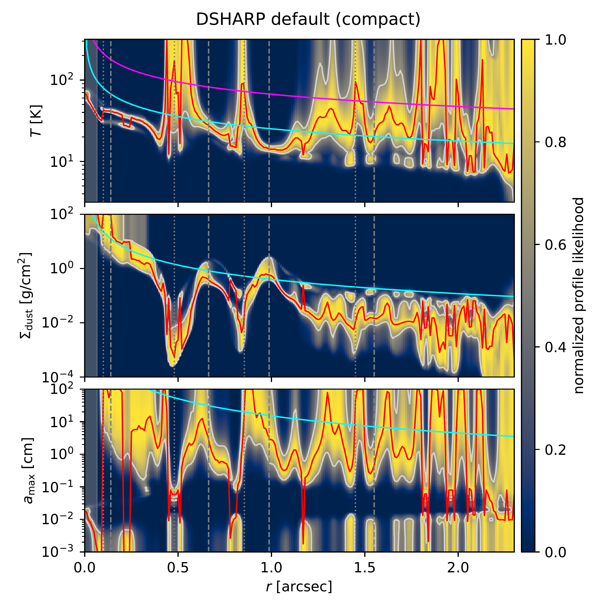
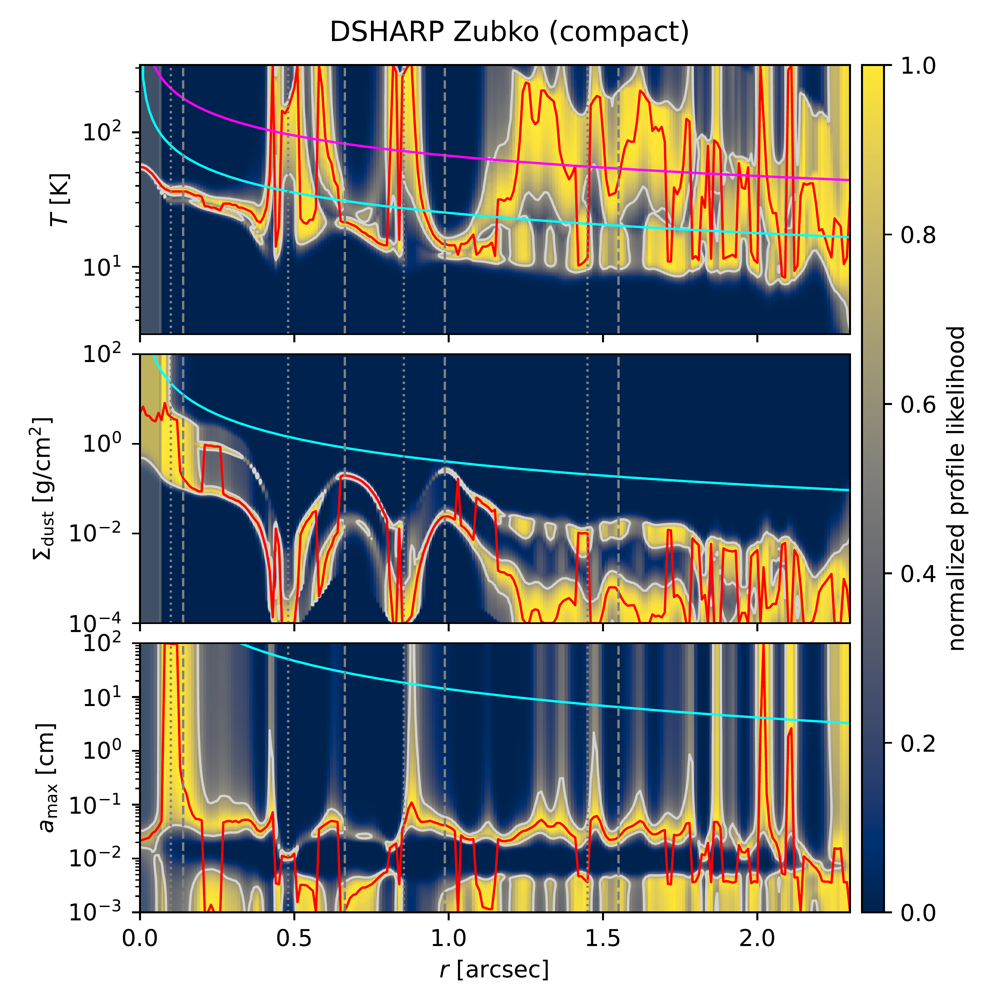
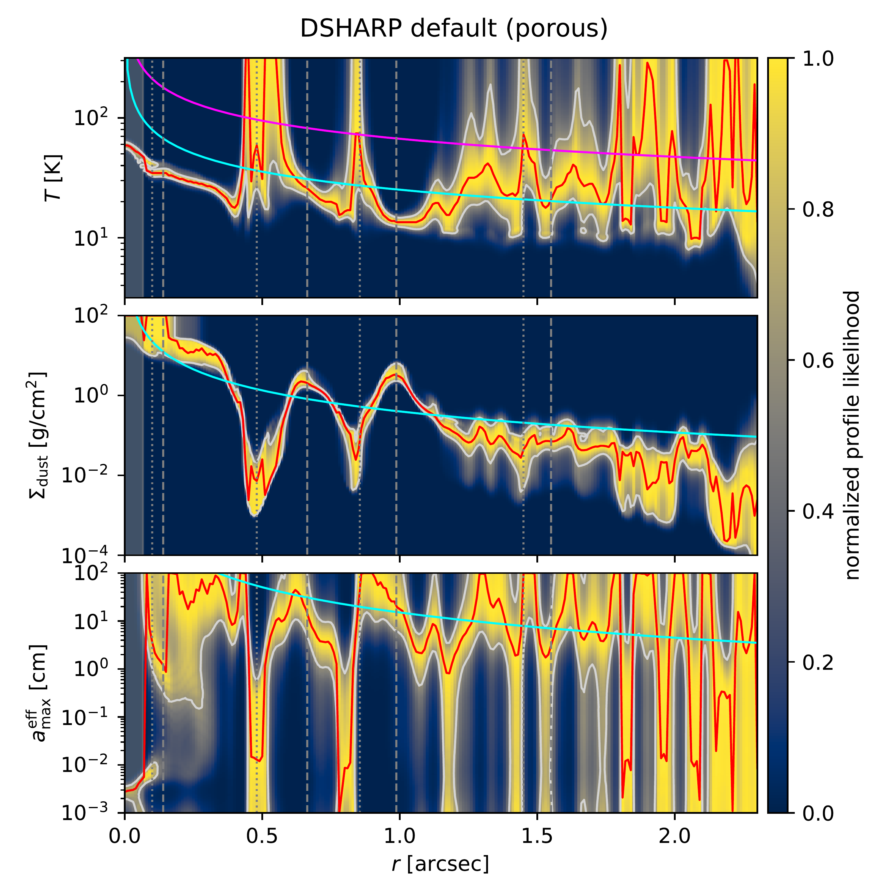
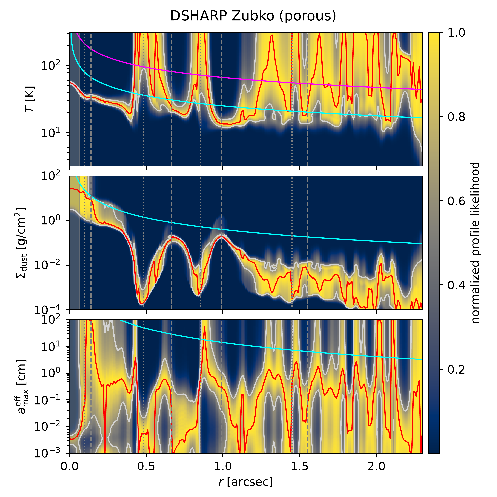
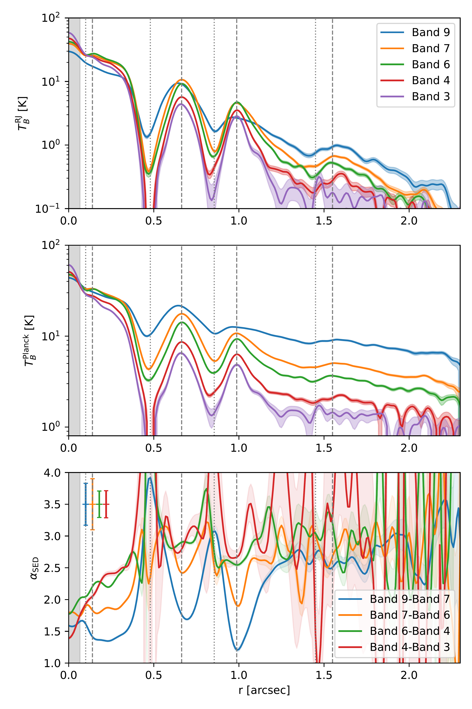
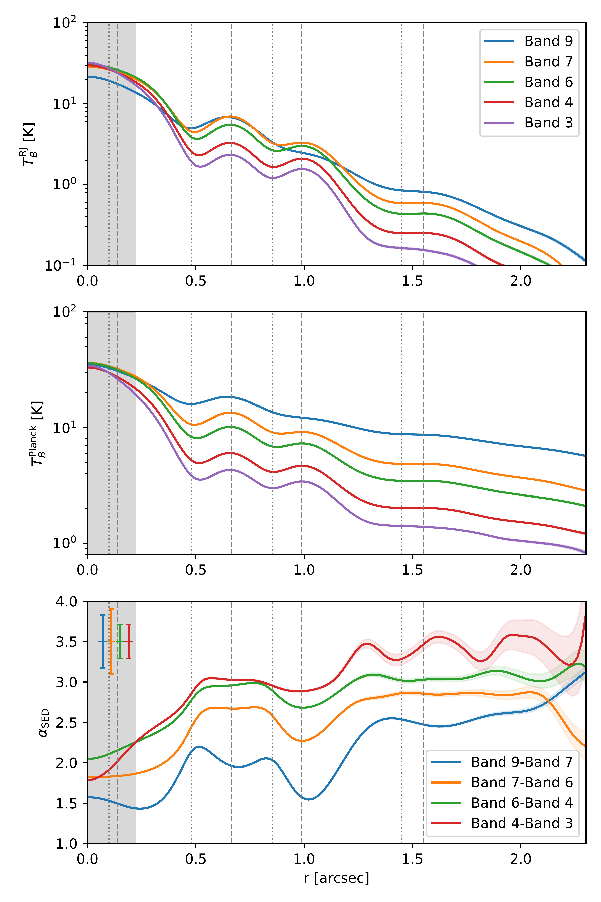

$\newcommand{\ensuremath}{}$
$\newcommand{\xspace}{}$
$\newcommand{\object}[1]{\texttt{#1}}$
$\newcommand{\farcs}{{.}''}$
$\newcommand{\farcm}{{.}'}$
$\newcommand{\arcsec}{''}$
$\newcommand{\arcmin}{'}$
$\newcommand{\ion}[2]{#1#2}$
$\newcommand{\textsc}[1]{\textrm{#1}}$
$\newcommand{\hl}[1]{\textrm{#1}}$
$\newcommand{\footnote}[1]{}$
$\newcommand{\orcid}[1]{\unskip\protect\href{https://orcid.org/#1}{\protect\includegraphics[width=8pt,clip]{logo_orcid.png}}}$
$\newcommand{\arraystretch}{0}$
$\newcommand{\arraystretch}{0}$
$\newcommand{\arraystretch}{1.2}$
$\newcommand{\arraystretch}{0}$
$\newcommand{\arraystretch}{0}$
$\newcommand{\arraystretch}{0}$
$\newcommand{\arraystretch}{0}$
$\newcommand{\arraystretch}{0}$
$\newcommand{\arraystretch}{0}$

# Dust characterization of the HD 163296 disk with high-resolution multi-wavelength ALMA observations

<mark>Appeared on: 2026-07-27</mark> -  _first revision submitted to A&A_

<mark>K. Doi</mark>, et al. -- incl., <mark>M. Benisty</mark>, <mark>H. Jiang</mark>, <mark>F. Zagaria</mark>

**Abstract:** Planets form through the growth and accumulation of dust grains in protoplanetary disks.Observational characterization of dust properties such as dust size, surface density, and temperature is key to understanding the planet formation process. We characterize the dust properties of the protoplanetary disk around HD 163296 by performing spectral energy distribution (SED) fitting of multi-wavelength high-resolution observations. We present new high-resolution ALMA Band 9 (0.45 mm) observations, which are sensitive to the temperature.We performed SED fitting at a common resolution of $0\farcs066$ using these new Band 9 observations along with archival ALMA Band 3, 4, 6, and 7 observations. We also compared the fitted results with VLA observations.We explored multiple dust models with different optical constants and porosities. The Band 9 image shows the central disk, two rings at $0\farcs67$ and $1\farcs00$ , and outer extended emission previously seen at other wavelengths.At higher frequencies, the rings appear wider, the gaps appear shallower, and the extended emission appears brighter, which can be explained by optical-depth effects and/or size segregation.We characterized the dust properties, including temperature, surface density, and dust size, for each dust model.However, the inferred dust properties are dependent on the dust model, and the ALMA data alone do not allow us to determine which dust model is preferred.We identified the DSHARP Zubko (porous) model as the preferred model based on comparison with the VLA profiles and its consistency with other physical and observational constraints.The estimated temperature in the outer ring is lower than predicted by a passively irradiated disk model, suggesting shadowing by the inner ring.Although the estimated surface density and dust size are dependent on the dust model, the preferred model indicates that the central disk, both major rings, and the extended disk each contains more than a few Earth masses of dust.

**Figure 12. -** 
The normalized profile likelihoods from the SED fitting for each dust model.
In each panel, the top, middle, and bottom subplots show the likelihood profiles for temperature $T$, dust surface density $\Sigma_{\mathrm{dust}}$, and maximum dust size $a_{\mathrm{max}}$, respectively.
The red lines indicate the maximum likelihood estimates (MLEs), and the gray lines indicate the ranges derived from $\Delta\chi^2 < 1$.
In the $T$ subplots, the pink and cyan curves show the temperature profiles at the disk surface ($\varphi=1$) and midplane ($\varphi=0.02$), respectively, from a passive disk model  ([Huang, Andrews and Dullemond 2018]()) .
In the $\Sigma_{\mathrm{dust}}$ subplots, the cyan curve shows the upper limit of the dust surface density corresponding to a Toomre $Q=1$ disk with a dust-to-gas ratio of 0.01.
In the $a_{\mathrm{max}}$ subplots, the cyan curve shows the particle size for $\mathrm{St}=1$ for the same $Q=1$ disk.
For the porous-grain panels (bottom row), the maximum dust size is reported as an effective size, $a_{\mathrm{eff}} = a \times (1 - p)$, where $p$ is the porosity, for comparison with the results for compact grains.
The vertical gray dashed and dotted lines indicate the ring and gap radii, respectively, reported by [Huang, Andrews and Dullemond (2018)]().
   (*fig:dust_characterization*)

**Figure 1. -** 
Radial profiles and spectral index along the major axis on the northwest side, averaged over a range of $\phi \pm 22.5^\circ$.
The top panel shows the radial profiles in brightness temperature using the Rayleigh-Jeans approximation, while the middle panel shows those in brightness temperature computed using the Planck function.
The bottom panel shows the spectral index.
The shaded areas in the top and middle panels indicate the $\pm 1\sigma$ range of the rms noise, and those in the bottom panel indicate the $\pm 1\sigma$ uncertainties propagated from the rms noise of the intensities.
The bar at the top left of the bottom panel indicates the $\pm 1\sigma$ uncertainty of the spectral index due to the ALMA flux calibration uncertainties.
The vertical gray dashed and dotted lines indicate the ring and gap radii, respectively, reported by [Huang, Andrews and Dullemond (2018)]().
     (*fig:radial_obs*)

**Figure 7. -** 
Azimuthally averaged radial profiles averaged over the full azimuthal angle and spectral index, as shown in Fig. \ref{fig:radial_obs}, but for the low-resolution images.
     (*fig:radial_obs_low*)

