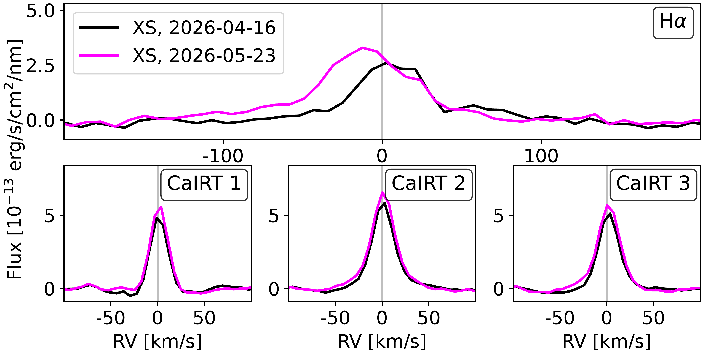
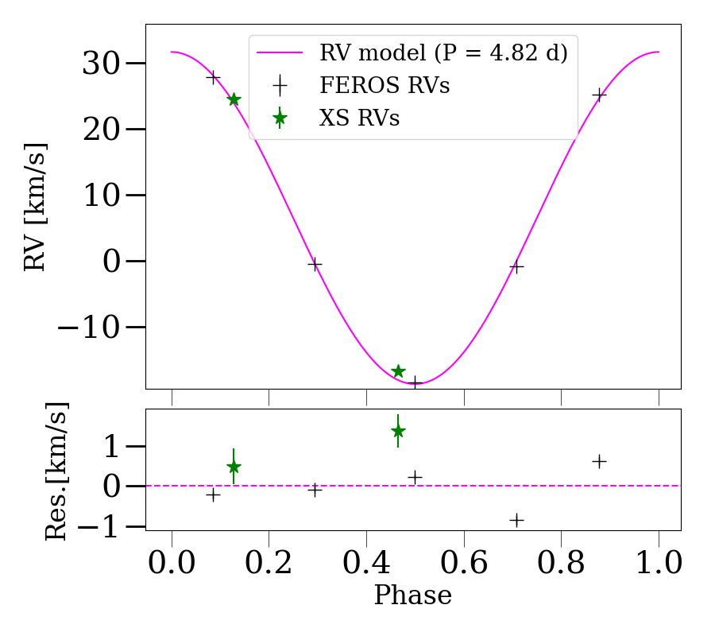
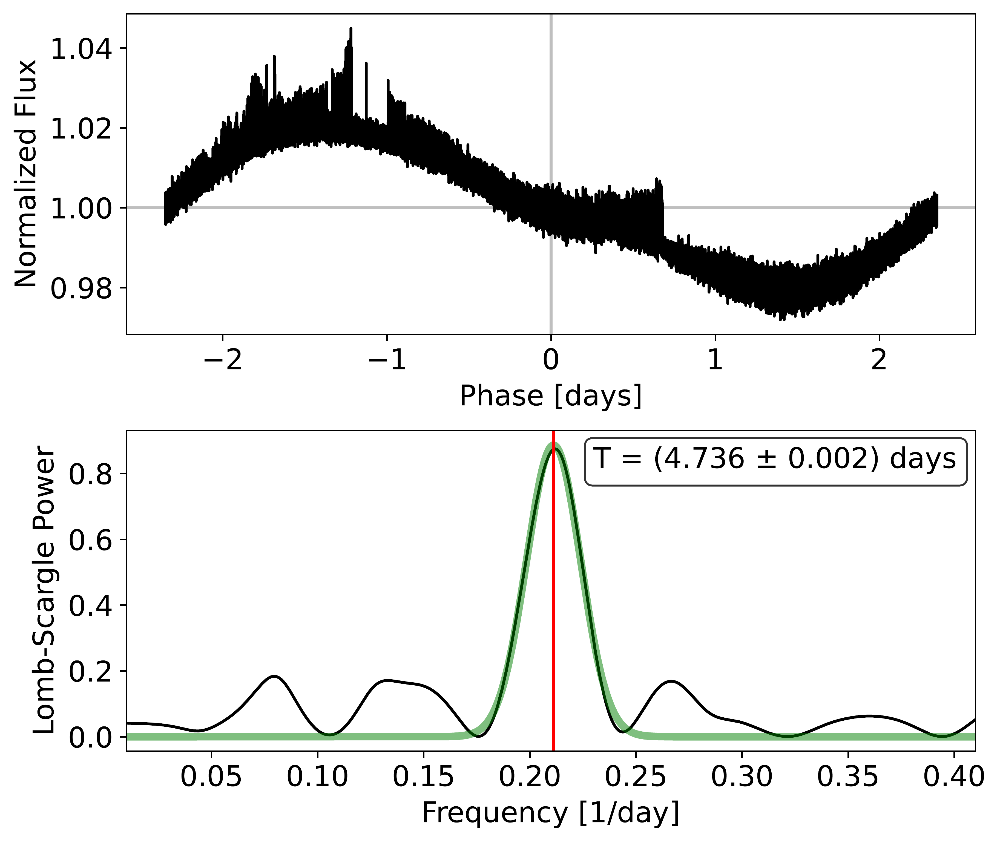

$\newcommand{\ensuremath}{}$
$\newcommand{\xspace}{}$
$\newcommand{\object}[1]{\texttt{#1}}$
$\newcommand{\farcs}{{.}''}$
$\newcommand{\farcm}{{.}'}$
$\newcommand{\arcsec}{''}$
$\newcommand{\arcmin}{'}$
$\newcommand{\ion}[2]{#1#2}$
$\newcommand{\textsc}[1]{\textrm{#1}}$
$\newcommand{\hl}[1]{\textrm{#1}}$
$\newcommand{\footnote}[1]{}$
$\newcommand\mb[1]{{\color{magenta}#1}}$
$\newcommand\cfm[1]{{\color{orange}#1}}$
$\newcommand{\Hala}[1]{{\color{blue}#1}}$
$\newcommand{\arraystretch}{1.3}$

# A closer look at the WISPIT 2 host star$\thanks{Based on observations collected at the European Southern Observatory under ESO programme 116.2ASZ.}$: Evidence for a spectroscopic binary

<mark>Appeared on: 2026-07-27</mark> -  _Submitted to A&A_

C. J. Bürgy, et al. -- incl., <mark>M. Benisty</mark>

**Abstract:** While hundreds of protoplanetary discs have been studied in great detail, the detection of protoplanets still embedded in their native discs remains rare. WISPIT 2 is only the second laboratory allowing for direct study of planet formation while in progress. The recently discovered system hosts two giant protoplanets in a multi-ringed disc. Here, we aim at characterising the WISPIT 2 host star spectroscopically to determine its stellar properties, accretion rate, and inner disc diagnostics, providing a more complete picture of the system. We present optical and near-infrared spectroscopic observations obtained with the ESO VLT/X-Shooter and 2.2 m/FEROS instruments. We model the stellar spectrum to determine the spectral type and effective temperature, analyse the emission lines to estimate the accretion rate, and search for evidence of a close stellar companion using radial velocity measurements. Our observations reveal that WISPIT 2 is a spectroscopic binary. The binary has a period of ( $4.8\pm 0.1$ ) days, which corresponds to a semi-major axis of $0.072$ au or $15.54 R_\odot$ , assuming co-planarity with the disc and a circular orbit. The binary system consists of a $\sim$ 0.97 $M_{\odot}$ primary of spectral type K3 ( $T_{\rm eff} \sim 4700$ K), and a $\sim 0.33M_\odot$ secondary (mass ratio $\sim$ 0.34). We detect weak H $\alpha$ emission, implying an accretion rate of $\sim 2 \times 10^{-11} M_{\odot} \mathrm{yr}^{-1}$ . However, this value is below the chromospheric level, suggesting little to no ongoing accretion onto the young stars. This discovery makes the WISPIT 2 disc the first circumbinary system with directly imaged protoplanets, establishing this system as a unique benchmark for studying planet formation and disc evolution around binary stars.

**Figure 1. -** Zoom-in on the H$\alpha$ and Calcium Infrared Triplet lines.  (*fig:ZoomLines*)

**Figure 2. -** Orbital solution for WISPIT 2 fitted to the RV data (top) with residuals (bottom) as a function of orbital phase.  (*fig:RVCurve*)

**Figure 3. -** TESS light curve folded at the period of $P \sim 4.74$ days (top), and periodogram (bottom), with fitted Gaussian (green). (*fig:TESS*)

