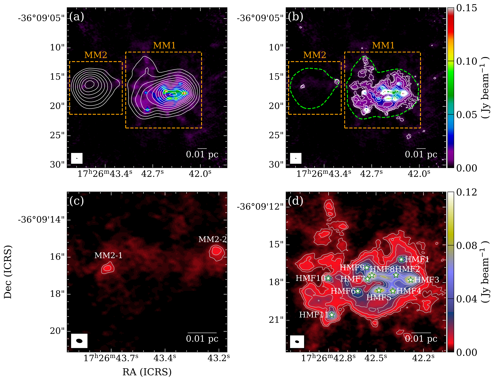
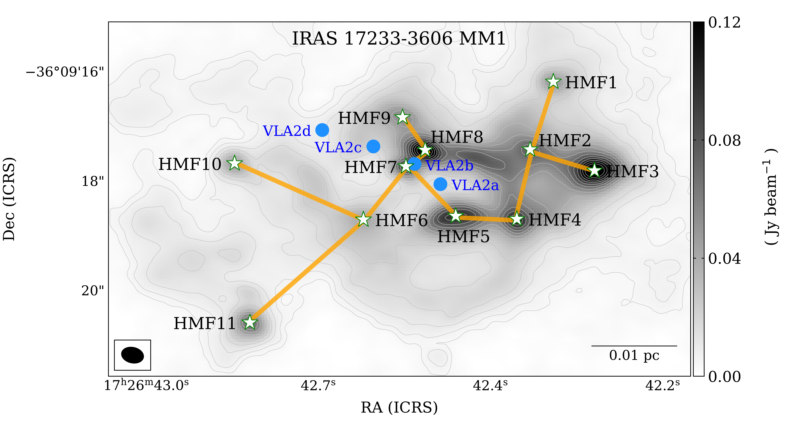
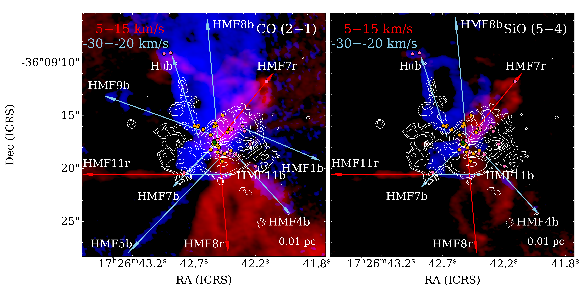

$\newcommand{\ensuremath}{}$
$\newcommand{\xspace}{}$
$\newcommand{\object}[1]{\texttt{#1}}$
$\newcommand{\farcs}{{.}''}$
$\newcommand{\farcm}{{.}'}$
$\newcommand{\arcsec}{''}$
$\newcommand{\arcmin}{'}$
$\newcommand{\ion}[2]{#1#2}$
$\newcommand{\textsc}[1]{\textrm{#1}}$
$\newcommand{\hl}[1]{\textrm{#1}}$
$\newcommand{\footnote}[1]{}$
$\newcommand{\vdag}{(v)^\dagger}$
$\newcommand\aastex{AAS\TeX}$
$\newcommand\latex{La\TeX}$
$\newcommand\tred{\textcolor{red}}$

# The ALMA-QUARKS Survey: Properties of Hot Molecular Fragments in the Massive Protocluster IRAS 17233–3606

<mark>Appeared on: 2026-07-28</mark> -  _16 pages, 8 figures_

L. Chen, et al. -- incl., <mark>F. Xu</mark>

**Abstract:** To investigate the physical mechanisms of fragmentation within the hot molecular core of the massive protocluster IRAS 17233-3606 (G351.78-0.54), we carried out a detailed analysis of continuum and lines, using the ALMA Band 3 data from the ATOMS survey and Band 6 data from the QUARKS survey. The low-resolution 3 mm data reveal a massive hot core MM1 with a mass of $\sim$ 81.3 M $_\odot$ , and a prominent ultracompact (UC) H ${\sc ii}$ region MM2, while the high-resolution data resolve MM1 into 11 hot molecular fragments (HMFs). These HMFs exhibit hot (T $_{\rm rot}$ = 100–310 K) $CH_3$ CN and $CH_3$ OH emission and high column densities (N $\rm_{H_2}$ $>$ 10 $^{23}$ cm $^{-2}$ ), indicating their potential to form massive stars.Based on outflows, masers, H ${\sc ii}$ regions, and f [ $CH_3$ CN/$CH_3$ OH ] abundance ratios, the evolutionary sequences of the 11 HMFs are categorized as phases I to IV.The mean minimum-spanning tree (MST) separation ( $\sim1.8\times 10^3$ au) of the HMFs is nearly half of the thermal Jeans length ( $\sim3.3\times 10^3$ au). Together with the $Q$ parameter $Q = 0.77$ and virial parameter $\alpha_{\rm vir}=0.84$ of MM1, these results suggest an evolutionary scenario in which fragmentation is initially driven by thermal instability, followed by global gravitational contraction and growth through active accretion.Meanwhile, feedback from the B2-type zero-age main-sequence (ZAMS) star and the UC H ${\sc ii}$ region significantly influence the morphology and chemical properties of MM1 and MM2.This heterogeneity highlights the role of diverse physical processes taking place in high-mass protoclusters.

**Figure 2. -** 
ALMA Band 3 and 6 continuum emission of IRAS 17233-3606.
Panel (a) shows the Band 6 continuum emission with Band 3 continuum emission overplotted as white contours of $\rm D = 4\times N^{p} + 8$, where $N=12$ is the number of contours used and $\rm p = \log(V_{\rm max}/(4\times \rm rms))/\log(N-1)$ is the power index, with rms = $1 \rm mJy beam^{-1}$. The orange dashed squares labeled MM1 (right) and MM2 (left) identify a hot core region and an UC H{\sc ii} region extracted in Band 3 from \cite{2022MNRAS.511.3463Q}, respectively.
Panel (b) shows the white contours of Band 6 continuum emission overplotted on the same color map as panel (a). The white contour levels follow the same rule in panel (a) but use an rms of $0.5 \rm mJy beam^{-1}$. The dashed green contour outlines the $7.8 \rm mJy beam^{-1}$ detection level of Band 3 continuum emission.
Panel (c) shows a zoom toward the UC H{\sc ii} region MM2, with contours at 4.0 and 6.0 $\rm mJy beam^{-1}$, the same as in panel (b).
Panel (d) shows a zoom toward the hot core region MM1, with contours the same as in panel (b). The white stars mark the HMFs identified in the Band 6 observations.
The synthesized beams are shown in the bottom left corners and the scale bar are shown in the bottom right corners for each panel. (*zoomin*)

**Figure 4. -** Spatial distribution of HMFs in IRAS 17233-3606 MM1. The background displays the ALMA 1.3 mm continuum emission in grayscale. Gray contours are overlaid, following the same power-law progression as Figure \ref{zoomin}. The white stars mark the locations of the HMFs identified by ALMA 1.3 mm observation, while the blue dots indicate the positions of the HC H{\sc ii} regions identified by VLA 1.3 cm observation. The orange solid line denotes the minimum path connecting these HMFs, given by the MST algorithm. The synthesized beam is shown in the bottom left corner and the scale bar of 0.01 pc is in the bottom right corner. (*MST*)

**Figure 5. -** Color map of the CO (2–1) and SiO (5–4) toward IRAS 17233-3606 MM1 region, with integrated intensities over 5 to 15 km s$^{-1}$ shown in red and over $-$30 to $-$20 km s$^{-1}$ shown in blue. White contours indicate the 1.3 mm continuum emission. Red and blue arrows denote the red- and blue-shifted molecular outflows, respectively. Class II $CH_3$OH, OH, and $H_2$O masers are marked by green, orange, and pink dots, respectively.  (*3color*)

