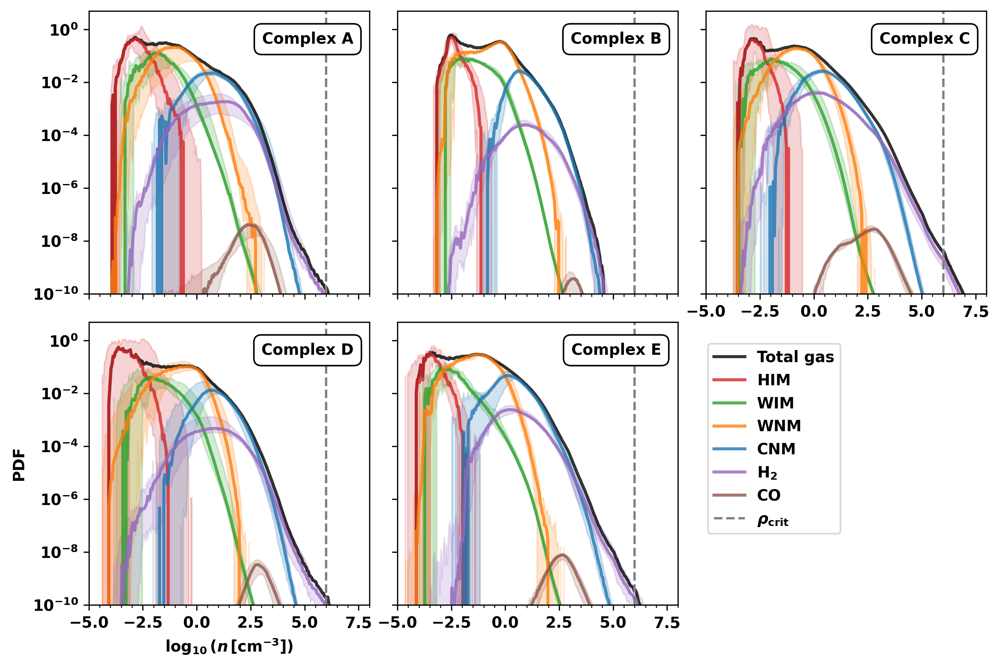
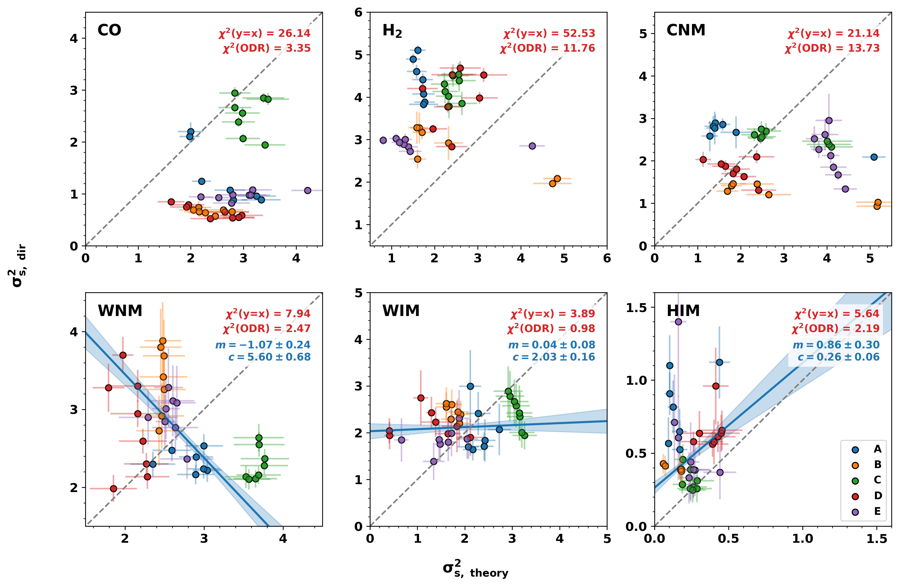
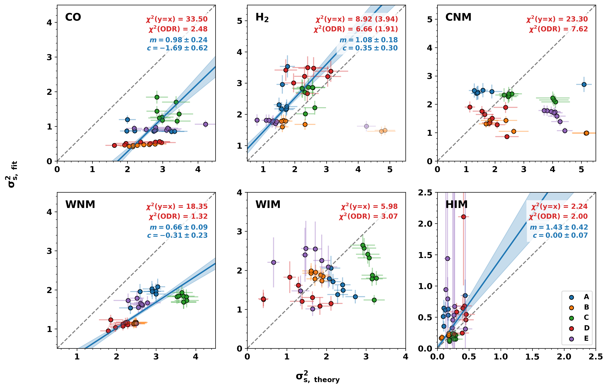

$\newcommand{\ensuremath}{}$
$\newcommand{\xspace}{}$
$\newcommand{\object}[1]{\texttt{#1}}$
$\newcommand{\farcs}{{.}''}$
$\newcommand{\farcm}{{.}'}$
$\newcommand{\arcsec}{''}$
$\newcommand{\arcmin}{'}$
$\newcommand{\ion}[2]{#1#2}$
$\newcommand{\textsc}[1]{\textrm{#1}}$
$\newcommand{\hl}[1]{\textrm{#1}}$
$\newcommand{\footnote}[1]{}$

# The $\sigma_s^2-\mathcal{M}$ relation in the multi-phase ISM: Exploring the density PDF with the Cloud Factory simulations

<mark>Appeared on: 2026-07-29</mark> -  _Submitted to A&A, feedback welcome_

<mark>M. Nonhebel</mark>, R. J. Smith, R. S. Klessen

**Abstract:** The density probability distribution (PDF) of molecular clouds is a crucial component of analytical theories of star formation. In idealised simulations of isothermal turbulence, the width of the density PDF, $\sigma_s^2$ , is dependent on the sonic Mach number of the medium, $\mathcal{M}$ . The $\sigma_s^2-\mathcal{M}$ relation is widely used to connect cloud-scale turbulence to the density PDF, and further to star formation activity, yet its validity within individual phases of the multi-phase interstellar medium (ISM) remains untested. In this study, we evaluate whether the $\sigma_s^2-\mathcal{M}$ relation is applicable to individual phases of the ISM. We study the density PDFs of molecular cloud complexes in the Cloud Factory simulations; a suite of detailed zoom-in simulations that self-consistently generate a turbulent, multi-phase ISM. We test whether the $\sigma_s^2-\mathcal{M}$ relation holds in the hot ionised medium (HIM), warm ionised medium (WIM), warm neutral medium (WNM), cold neutral medium (CNM), the molecular phase, and the highly-shielded molecular phase traced by CO. We find the applicability of the classical $\sigma_s^2-\mathcal{M}$ relation to vary between phases and depend strongly on how $\sigma_s^2$ and $\mathcal{M}$ are measured. The relation fails to capture the widths of the WNM and CNM density distributions, with possible contributing factors including non-isothermality and large-scale coherent motions. In contrast, we find the $\sigma_s^2-\mathcal{M}$ relation to tentatively hold for the log-normal portion of the $H_2$ distribution. The width of the CO density PDF is systematically overpredicted by the classical relation, resulting from the selective nature of CO as a molecular gas tracer.

**Figure 9. -** Density PDFs of the molecular cloud complexes from the Cloud Factory simulations. The solid lines delineate the time-averaged density PDFs, while the corresponding shaded areas illustrate the temporal variation in the PDFs over the studied time periods (see Table \ref{tab:snapshots}). In black is the total density PDF, weighted by cell volume. Red, green, orange, blue, purple and brown correspond to the density PDFs of the HIM, WIM, WNM, CNM, $H_2$, and CO respectively, weighted by the product of the cell volume and the fractional abundance of the relevant species, and normalised by the total volume (see Table \ref{tab:phases} for the definition of each phase). The critical density for sink creation, $\rho_\text{crit}=10^6$ cm$^{-3}$, is shown with a dashed grey line. (*fig:density_pdfs*)

**Figure 13. -** The width of the density PDF measured directly, $\sigma^2_{s,\mathrm{dir}}$(see Sec. \ref{sec:width}), versus the theoretically-expected width, $\sigma^2_{s,\mathrm{theory}}$, predicted by the isothermal $\sigma_s^2$–$\mathcal{M}$ relation, for each phase. The coloured markers indicate the values found for each molecular cloud complex at all evolutionary snapshots considered.
    The grey dashed line marks $y=x$, corresponding to perfect agreement between $\sigma^2_{s,\mathrm{dir}}$ and $\sigma^2_{s,\mathrm{theory}}$. $\chi^2_{y=x}$, listed for each phase, quantifies the deviation of the data points from this line. Also reported is $\chi^2_{\mathrm{ODR}}$, quantifying the goodness of an orthogonal distance regression (ODR) linear fit between $\sigma^2_{s,\mathrm{dir}}$ and $\sigma^2_{s,\mathrm{theory}}$  Where $\chi^2_{\mathrm{ODR}} \leq 3$, the ODR fit is shown in blue, with the surrounding shaded region indicating the $1\sigma$ confidence interval. The corresponding slope ($m$) and intercept ($c$) of the ODR fit are also reported. (*fig:theory_v_dir*)

**Figure 14. -** The width of the density PDF measured via log-normal fitting $\sigma^2_{s,\mathrm{fit}}$(see Sec. \ref{sec:width}), versus the theoretically-expected width, $\sigma^2_{s,\mathrm{theory}}$, predicted by the isothermal $\sigma_s^2$–$\mathcal{M}$ relation, for each phase. The coloured markers indicate the values found for each molecular cloud complex at all evolutionary snapshots considered.
    The grey dashed line marks $y=x$, corresponding to perfect agreement between $\sigma^2_{s,\mathrm{fit}}$ and $\sigma^2_{s,\mathrm{theory}}$. $\chi^2_{y=x}$, listed for each phase, quantifies the deviation of the data points from this line. Also reported is $\chi^2_{\mathrm{ODR}}$, quantifying the goodness of an orthogonal distance regression (ODR) linear fit between $\sigma^2_{s,\mathrm{fit}}$ and $\sigma^2_{s,\mathrm{theory}}$  Where $\chi^2_{\mathrm{ODR}} \leq 3$, the ODR fit is shown in blue, with the surrounding shaded region indicating the $1\sigma$ confidence interval. The corresponding slope ($m$) and intercept ($c$) of the ODR fit are also reported. (*fig:theory_v_fit*)

