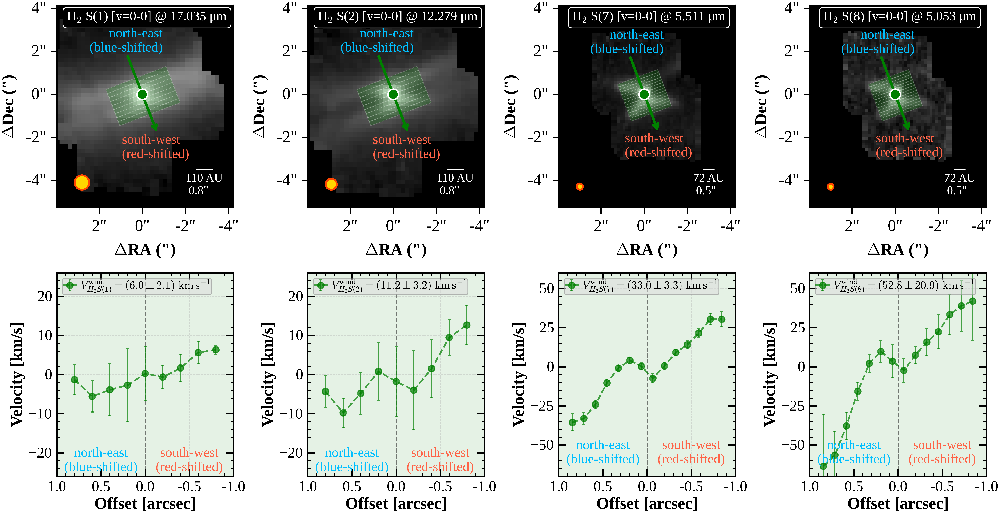
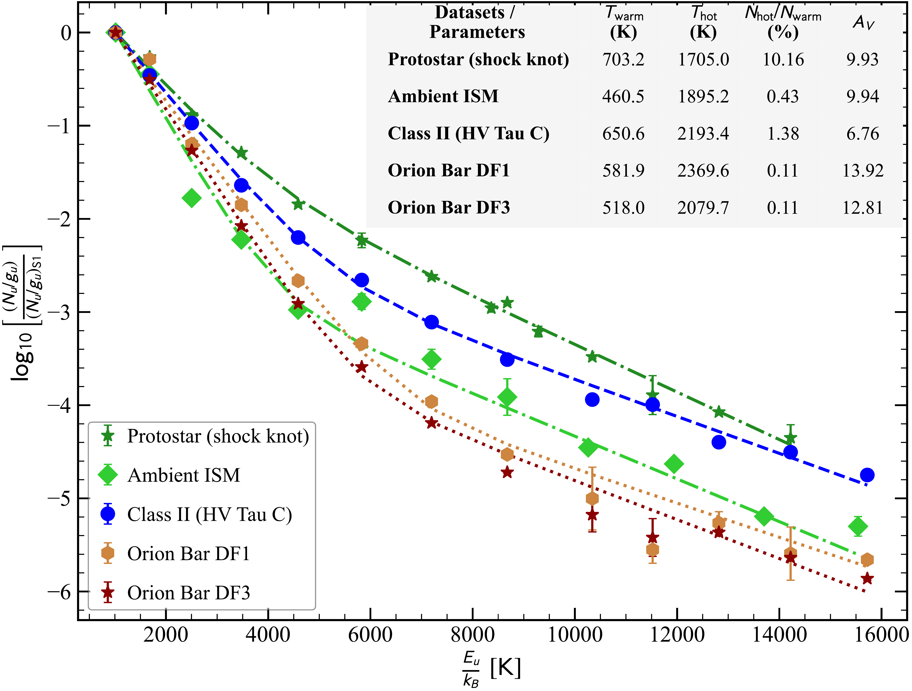

$\newcommand{\ensuremath}{}$
$\newcommand{\xspace}{}$
$\newcommand{\object}[1]{\texttt{#1}}$
$\newcommand{\farcs}{{.}''}$
$\newcommand{\farcm}{{.}'}$
$\newcommand{\arcsec}{''}$
$\newcommand{\arcmin}{'}$
$\newcommand{\ion}[2]{#1#2}$
$\newcommand{\textsc}[1]{\textrm{#1}}$
$\newcommand{\hl}[1]{\textrm{#1}}$
$\newcommand{\footnote}[1]{}$
$\newcommand{\orcid}[1]{\href{https://orcid.org/#1}{\includegraphics[width=8pt]{logo_orcid}}}$

# JWST/MIRI Detection of Molecular $H_2$ Winds from an Edge-on Class II Source HV Tau C

<mark>Appeared on: 2026-07-29</mark> -  _Accepted in the Astronomy and Astrophysics Journal. Main text: 25 pages with 13 figures_

V. C. Pathak, et al. -- incl., <mark>T. Henning</mark>, <mark>K. Schwarz</mark>, <mark>A. Somigliana</mark>, <mark>G. Perotti</mark>

**Abstract:** The evolution of protoplanetary disks is regulated by the interplay between accretion onto the central star and mass loss through jets and winds. While atomic and ionized outflows are commonly observed, direct detections of molecular winds in evolved Class II disks remain rare, limiting our understanding of their role in disk evolution and dispersal. We aim to characterize the spatial, thermal, kinematic, and dynamical properties of molecular hydrogen ($H_2$ ) emission associated with the nearly edge-on Class II disk HV Tau C, and to assess the dynamical impact of its molecular wind. We also simultaneously constrain the accretion properties using H i recombination lines detected in the same mid-infrared (mid-IR) spectrum, enabling us to investigate the accretion--ejection connection in this system. We analyze mid-IR _JWST_ /MIRI-MRS data from the MINDS Cycle 1 GTO program, extracting spatially resolved pure-rotational $H_2$ emission. Rotational diagrams are used to determine excitation temperatures and column densities, while position--velocity diagrams provide the kinematics of the extended emission. Combining excitation and kinematic information, we estimate the wind mass-loss rate, momentum rate, and mechanical luminosity. Accretion luminosities and mass-accretion rates are derived from H i lines, accounting for uncertainties in visual extinction due to the edge-on geometry. We detect spatially extended pure-rotational $H_2$ emission from HV Tau C, revealing a wide-angled, biconical molecular wind extending well beyond the near-infrared scattered-light disk, the ALMA 887 $\mu$ m dust continuum, and the compact $^{12}$ CO ( $J$ =3--2) gas disk. The $H_2$ rotational diagram requires at least two temperature components: a warm component at $\sim$ 600 K and a hot component at $\sim$ 2000 K, similar to those found in much younger protostars. The kinematics indicate outward motions of a few tens of km s $^{-1}$ and dynamical timescales of tens to hundreds of years. The inferred mass-loss rate is about $10^{-8} M_\odot \mathrm{yr^{-1}}$ , while accretion rates lie between $10^{-10}$ and $10^{-8} M_\odot \mathrm{yr^{-1}}$ . The measured accretion rate may be underestimated due to geometrical effects, and the true accretion rate could be higher than that inferred from the MIR H i lines. These results suggest that wide-angled molecular $H_2$ winds may persist into the Class II phase, with inferred outflow rates that are comparable to those observed in some protostellar systems. Such outflows may play a significant role in angular momentum removal, disk evolution, and disk dispersal even in relatively evolved systems.

**Figure 7. -** Continuum-subtracted line-intensity maps of all pure-rotational $H_2$ lines S(1)--S(8) in the ground vibrational state ($v=0$--$0$), showing wide-angled $H_2$ emission. The star marks the JWST/MIRI 14.0 $\mu$m continuum photocenter. The dashed rectangular region that encloses the $H_2$ S(8) transition marks the area from which the spectra were extracted to derive the line fluxes used in the rotational diagram analysis. (*fig:hv_tau_c_H2_v00_extended_linemaps*)

**Figure 12. -** PV diagrams for four $H_2$ transitions in the ground vibrational state ($v = 0$--0): S(1) and S(2), which trace the warm component, and S(7) and S(8), which trace the hot component. The upper panels show the PV paths (green rectangles with white PV slices) overlaid on the integrated-intensity maps of each transition, centered on the 14 $\mu$m JWST continuum position. The lower panels display the inclination- and systemic-velocity-corrected velocities as a function of positional offset from the source center. Note that the velocity (y-axis) scales differ between panels. (*fig:PV_diagrams_along_H2_outflow_axis_for_S1_S2_S7_S8_lines*)

**Figure 2. -** Comparison of normalized two-component rotational diagrams for $H_2$ transitions in HV Tau C with those from different environments: (i) shock knot in the Class 0 protostar HOPS 370, (ii) ambient molecular gas surrounding the protostar IRAS 16253, and (iii) two PDR regions DF1 and DF3, in the Orion Bar (data taken from \citealt{H2OrionPDR2024A&A...687A..86V}). The normalized diagrams facilitate comparison of excitation conditions across different environments. (*fig:Comparison_of_Rotational_diagrams_for_different_dataset*)

